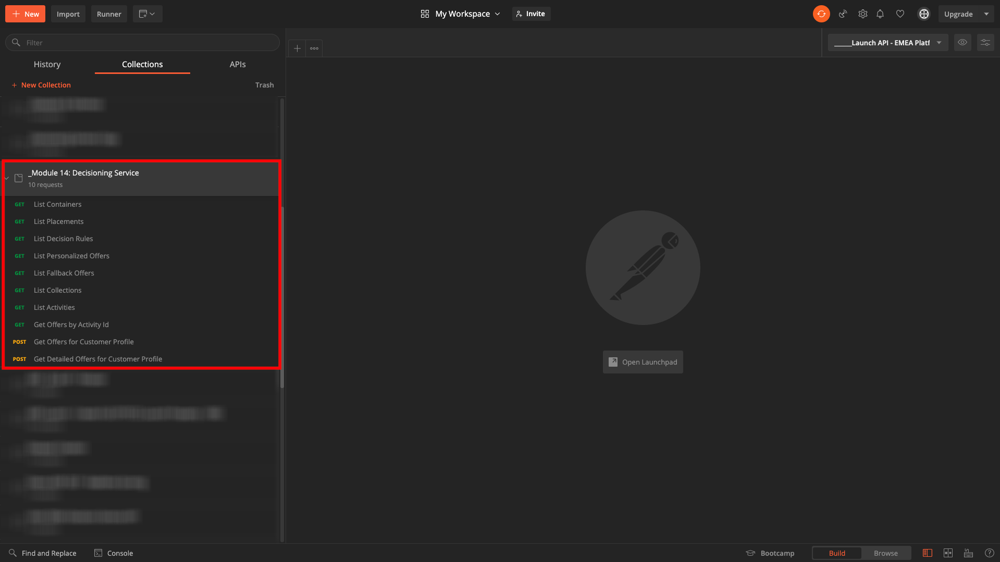

# 9.6 Pruebe su decisión utilizando la API

## 9.6.1 Trabajar con la API de Offer decisioning mediante Postman

Descargar [esta colección de Postman para Offer decisioning](./../../assets/postman/postman_offer-decisioning.zip) en su escritorio y descomprima el archivo. Entonces tendrá esto:

Ahora tiene este archivo en el escritorio:

- [!UICONTROL _Módulo 14 - Servicio de decisiones.postman_collection.json]

En [Ejercicio 3.3.3: autenticación de Postman en Adobe I/O](./../../modules/module3/ex3.md) ha instalado Postman. Tendrá que volver a usar Postman para este ejercicio.

Abra Postman. Haga clic en **[!UICONTROL Importar]**.

Haga clic en **[!UICONTROL Cargar archivos]**.

Seleccione el archivo **[!UICONTROL _Módulo 14 - Servicio de decisiones.postman_collection.json]** y haga clic en **[!UICONTROL Apertura]**.

A continuación, tendrá esta colección disponible en Postman.

Ahora tiene todo lo que necesita en Postman para empezar a interactuar con Adobe Experience Platform a través de las API.

### 9.6.1.1 Contenedores de lista

Haga clic en para abrir la solicitud **[!UICONTROL GET: Contenedores de lista]**.

En **[!UICONTROL Parámetros]**, verá esto:

- propiedad: `_instance.parentName==aepenablementfy22`

En ese parámetro, **[!UICONTROL apenablementfy22]** es el nombre del simulador para pruebas que se utiliza en Adobe Experience Platform. El entorno limitado que debe usar es `--aepSandboxId--`. Reemplazar el texto **[!UICONTROL apenablementfy22]** por `--aepSandboxId--`.

Después de reemplazar el nombre del entorno limitado, haga clic en **[!UICONTROL Enviar]**.

Esta es la respuesta, que muestra el contenedor de oferta para el simulador para pruebas especificado. Copie el **[!UICONTROL container instanceId]** como se indica a continuación y anójelo en un archivo de texto en su ordenador. Tendrá que usar esto **[!UICONTROL container instanceId]** para el siguiente ejercicio!

### 9.6.1.2 Enumerar ubicaciones

Haga clic en para abrir la solicitud **[!UICONTROL GET: Enumerar ubicaciones]**. Haga clic en **[!UICONTROL Enviar]**.

Ahora está viendo todas las ubicaciones disponibles en su contenedor de ofertas. Las ubicaciones que está viendo se definieron en la interfaz de usuario de Adobe Experience Platform, tal y como puede ver en [Ejercicio 9.1.3](./ex1.md).

### 9.6.1.3 Lista Reglas de decisión

Haga clic en para abrir la solicitud **[!UICONTROL GET - Enumerar reglas de decisión]**. Haga clic en **[!UICONTROL Enviar]**.

En la respuesta, verá las reglas de decisión que definió en la interfaz de usuario de Adobe Experience Platform, como puede ver en [Ejercicio 9.1.4](./ex1.md).

### 9.6.1.4 Enumerar ofertas personalizadas

Haga clic en para abrir la solicitud **[!UICONTROL GET: Enumerar ofertas personalizadas]**. Haga clic en **[!UICONTROL Enviar]**.

En la respuesta, verá las ofertas personalizadas que definió en la interfaz de usuario de Adobe Experience Platform en [Ejercicio 9.2.1](./ex2.md).

### 9.6.1.5 Lista de ofertas de reserva

Haga clic en para abrir la solicitud **[!UICONTROL GET: Lista de ofertas de reserva]**. Haga clic en **[!UICONTROL Enviar]**.

En la respuesta, verá la oferta de reserva que definió en la interfaz de usuario de Adobe Experience Platform en [Ejercicio 9.2.2](./ex2.md).

### 9.6.1.6 Enumerar colecciones

Haga clic en para abrir la solicitud **[!UICONTROL GET: Enumerar colecciones]**.

En la respuesta, verá la colección que definió en la interfaz de usuario de Adobe Experience Platform en [Ejercicio 9.2.3](./ex2.md).

### 9.6.1.7 Obtener ofertas detalladas para el perfil del cliente

Haga clic en para abrir la solicitud **[!UICONTROL POST: obtener ofertas detalladas para el perfil del cliente]**. Esta solicitud es similar a la anterior, pero devuelve detalles como direcciones URL de imágenes, texto, etc.

Para esta solicitud, de forma similar al ejercicio anterior que tiene requisitos similares, debe proporcionar los valores para **[!UICONTROL xdm:placementId]** y **[!UICONTROL xdm:activityId]** para recuperar los detalles de oferta específicos de un cliente.

El campo **[!UICONTROL xdm:activityId]** debe rellenarse. Puede recuperarlo en la interfaz de usuario de Adobe Experience Platform, como se indica a continuación.

El campo **[!UICONTROL xdm:placementId]** debe rellenarse. Puede recuperarlo en la interfaz de usuario de Adobe Experience Platform, como se indica a continuación. En el ejemplo siguiente, puede ver el placementId de la ubicación **[!UICONTROL Web - Imagen]**.

Vaya a **[!UICONTROL Cuerpo]** e introduzca la dirección de correo electrónico del cliente para el que desea solicitar una oferta. Haga clic en **[!UICONTROL Enviar]**.

Por último, verá el resultado de qué tipo de oferta personalizada y qué activos deben mostrarse a este cliente.

Ya ha completado este ejercicio.

Paso siguiente: [Resumen y beneficios](./summary.md)

[Volver al módulo 9](./offer-decisioning.md)

[Volver a todos los módulos](./../../overview.md)
