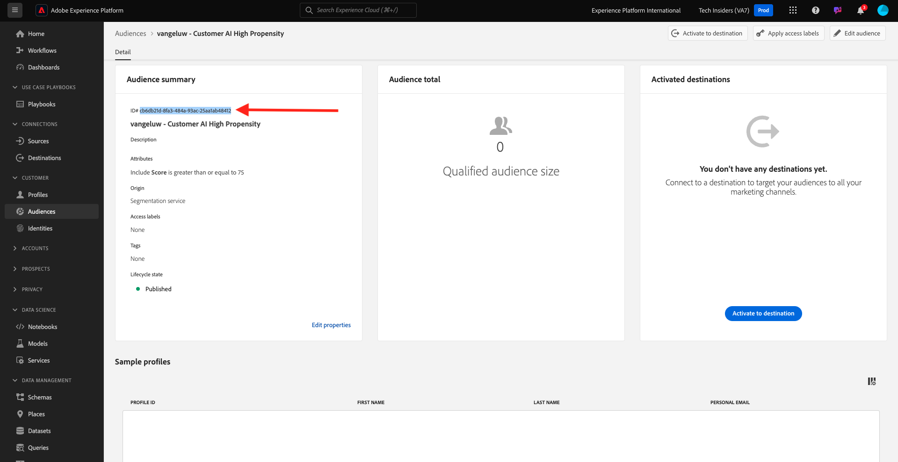
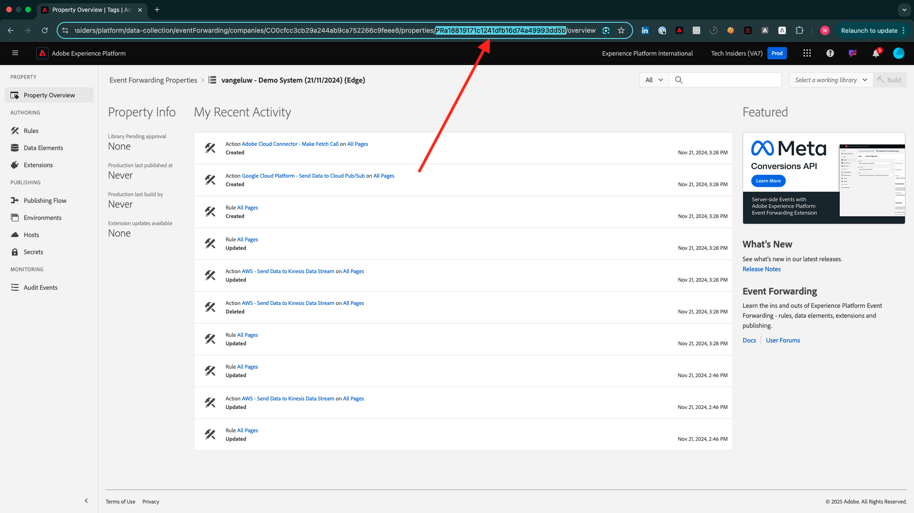
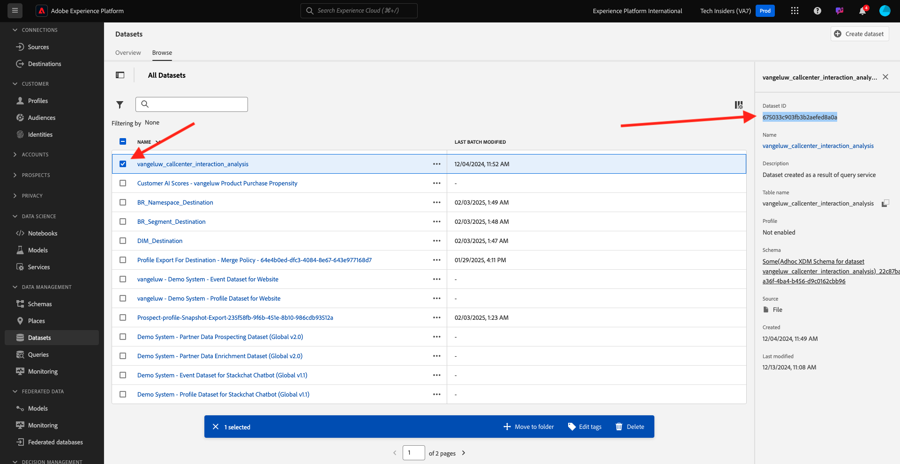

# ¿Cómo se mide la finalización?

Vaya a [https://certification.adobe.com](https://certification.adobe.com) y luego al curso **XXX**.

Para completar un módulo, se espera que proporcione una prueba de finalización.

A continuación se muestran las pruebas de finalización previstas para cada módulo.

## Primeros pasos

La revisión de finalización esperada para el módulo **Introducción** es el identificador del proyecto Sistema de demostración para la web que creó.

El identificador del proyecto del sistema de demostración para el formato web tiene el siguiente aspecto: `--demoProfileLdap-- - OCUC`.

## 1.1 Recopilación de datos de Adobe Experience Platform y extensión del SDK web

La revisión de finalización esperada para el módulo **Recopilación de datos y SDK web** es el nombre de la propiedad de recopilación de datos para la web.

El nombre de la propiedad de recopilación de datos para el formato web tiene el siguiente aspecto: `--demoProfileLdap-- - Demo System (05/02/2022) (enablement) 1644046719474`.

## 1.2 Ingesta de datos

La prueba de finalización esperada para el módulo **Ingesta de datos** es el ID del conjunto de datos para los 2 conjuntos de datos que ha creado.

El formato del Id. del conjunto de datos es el siguiente: **5f069724723ef41916a8b5d2**.

`--demoProfileLdap-- - Demo System - Event Dataset for Website`

`--demoProfileLdap-- - Demo System - Profile Dataset for Website`

## 1.3 Composición de audiencia federada

La revisión de finalización esperada para el módulo **Federated Audience Composition** es...

## 2.1 Perfil del cliente en tiempo real

La revisión de finalización esperada para el módulo **Perfil del cliente en tiempo real** es el **ID de segmento** del segmento que creó a través de la interfaz de usuario, `--demoProfileLdap-- - Male customers with interest in Montana Wind Jacket`.

El formato del Id. de segmento es el siguiente: **8cb7034d-d4ae-4d26-a61f-a76559c12457**.

## 2.2 Servicios inteligentes

La prueba de finalización esperada para el módulo **Servicios inteligentes** es el ID del **Servicio de inteligencia artificial aplicada al cliente con tendencia a la compra de productos**.

El formato tiene el siguiente aspecto: **12729** y puede recuperarlo desde la dirección URL cuando haya abierto el servicio.

## 2.3 Real-Time CDP: ¡Cree una audiencia y tome medidas!

La revisión de finalización esperada para el módulo **Real-Time CDP** es el identificador de su **actividad de Adobe Target**.

El formato es el siguiente: **111804**.

## 2.4 Real-Time CDP: Audience Activation de Microsoft Azure Event Hub

La revisión de finalización esperada para el módulo **RTCDP: EventHub** es el ID de su destino de **Microsoft Azure Event Hub** en Adobe Experience Platform.

Puede encontrar la **ID de destino del centro de eventos de Microsoft Azure**, que se parece a esta **fa3f7ce5-86fd-4096-bf7c-e586fdc096ba**, aquí:

## Conexiones Real-Time CDP 2.5: Reenvío de eventos

La prueba de finalización esperada para el módulo **Conexiones RTCDP** es su **ID de propiedad de reenvío de eventos**.

Aquí puede encontrar la **ID de propiedad de reenvío de eventos**, que se parece a esta **PR40f44184c888472e9c19d8d602aab0de**:

## 2.6 Transmitir datos de Apache Kafka a Real-Time CDP

La prueba de finalización esperada para el módulo **Apache Kafka** es el ID de su conector de origen `--demoProfileLdap-- - Kafka`.

El identificador tiene el siguiente aspecto **f843d50a-ee30-4ca8-a766-0e4f3d29a2f7**, y lo puede encontrar aquí:

## 3.1 Adobe Journey Optimizer: Orchestration

La revisión de finalización esperada para el módulo **AJO: Orchestration** es el eventID para su `--demoProfileLdap--AccountCreationEvent`.

El formato tiene el siguiente aspecto: **227402c540eb8f8855c6b2333adf6d54d7153d9d7d56fa475a6866081c574736**.

## 3.2 Adobe Journey Optimizer: Fuentes de datos externas y acciones personalizadas

La revisión de finalización esperada para el módulo **AJO: Acciones personalizadas** es el eventID para el evento `--demoProfileLdap--GeofenceEntry`.

El formato tiene el siguiente aspecto: **fa42ab7982ba55f039eacec24c1e32e5c51b310c67f0fa559ab49b89b63f4934**.

## 3.3 Adobe Journey Optimizer: Offer decisioning

La revisión de finalización esperada para el módulo **AJO: Ofertas** es el ID de la **Decisión de oferta** que creó.

Puede encontrar la **ID de decisión de oferta**, que se parece a esta **xcore:offer-activity:1122fcc4603ea499**, aquí:

## 3.4 Adobe Journey Optimizer: Recorridos basados en eventos

La revisión de finalización esperada para el módulo **AJO: Events** es el eventID para su `--demoProfileLdap--StoreEntryEvent`.

El formato tiene el siguiente aspecto: **e3a8f0bdc0b609667cd96a72a6b1e5aafa0ddaf6ccf121c574e6a2030860a633**.

## Customer Journey Analytics de 4.1: crear un tablero con Analysis Workspace

La revisión de finalización esperada para el módulo **CJA** es el ID de su proyecto `--demoProfileLdap-- - Omnichannel Analysis`.

El formato tiene el siguiente aspecto: **6217344f6249ac70c726db60**, puede encontrarlo en la dirección URL cuando haya abierto el proyecto.

## Customer Journey Analytics de 4.2: Ingesta y análisis de datos de Google Analytics en Adobe Experience Platform con el conector de Source de BigQuery

La prueba de finalización esperada para el módulo **CJA: BigQuery** es el ID de tu conexión de **BigQuery**.

Puede encontrar la **ID de conexión de BigQuery**, que se parece a esta **85a2394d-8b94-410c-a239-4d8b94b10c38**, aquí:

## 5.1 Servicio de consultas

La revisión de finalización esperada para el módulo **Servicio de consulta** es el ID del conjunto de datos para su `--demoProfileLdap--_callcenter_interaction_analysis` - conjunto de datos que obtiene después de completar el módulo.

El formato tiene el siguiente aspecto: **62076f68f14a9d194995d4e2**.

[Volver a todos los módulos](./overview.md)
