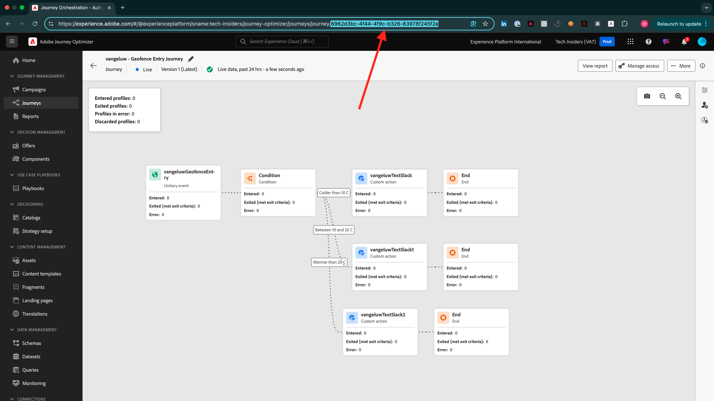

# ¿Cómo se mide la finalización?

Vaya a [https://certification.adobe.com](https://certification.adobe.com) y luego al curso **XXX**.

Para completar un módulo, se espera que proporcione una prueba de finalización.

A continuación se muestran las pruebas de finalización previstas para cada módulo.

## Primeros pasos

La revisión de finalización esperada para el módulo **Introducción** es el identificador del proyecto Sistema de demostración para la web que creó.

El identificador del proyecto del sistema de demostración para el formato web tiene el siguiente aspecto: `--demoProfileLdap-- - QIMU`.

## 1.1 Recopilación de datos de Adobe Experience Platform y la extensión de Web SDK

La revisión de finalización esperada para el módulo **Recopilación de datos y SDK web** es el **ID de entorno** de la propiedad de recopilación de datos para la web.

El identificador de entorno de la propiedad de recopilación de datos para el formato web tiene el siguiente aspecto: `EN5211f7792b4442f8a45deb68f8902d3a`.

## 1.2 Ingesta de datos

La revisión de finalización esperada para el módulo **Ingesta de datos** es el ID de flujo de datos para la conexión Source de la zona de aterrizaje de datos.

El identificador del flujo de datos tiene el siguiente aspecto: **374c2c6d-f39a-4b0b-b568-40c41e6c4e8e**.

## 1.3 Composición de audiencia federada

La revisión de finalización esperada para el módulo **Federated Audience Composition** es el identificador del modelo de datos federado que creó.

El identificador del modelo de datos federado tiene el siguiente aspecto: **DMO5110** y se puede tomar de la dirección URL como se indica en la siguiente imagen.

## 2.1 Perfil del cliente en tiempo real

La revisión de finalización esperada para el módulo **Perfil del cliente en tiempo real** es la **ID de audiencia** de la audiencia que creó a través de la interfaz de usuario, `--demoProfileLdap-- - Male customers with interest in iPhone 15 Pro`.

La ID de audiencia tiene el siguiente aspecto: **81a9acbe-12e6-424b-b658-abba3a435c83**.

## 2.2 Servicios inteligentes

La revisión de finalización esperada para el módulo **Servicios inteligentes** es la **ID de audiencia** de la audiencia que creó a través de la interfaz de usuario, `--demoProfileLdap-- - Customer AI High Propensity`.

La ID de audiencia tiene el siguiente aspecto: **cb6db21d-8fa3-484a-93ac-25aa1ab48412**.

## 2.3 Real-Time CDP: ¡Cree una audiencia y tome medidas!

Se esperaba la revisión de finalización del módulo **Real-Time CDP: ¡Cree una audiencia y tome medidas!** es el ID de su **destino de webhook de SDK de destinos**.

El identificador del destino del webhook tiene el siguiente aspecto: **b5b4b959-3166-40e2-8279-8223d00c3987** y se puede tomar de la dirección URL como se indica en la siguiente imagen.

## 2.4 Real-Time CDP: Audience Activation de Microsoft Azure Event Hub

La revisión de finalización esperada para el módulo **Real-Time CDP: Audience Activation del centro de eventos de Microsoft Azure** es la ID de su destino de **Microsoft Azure Event Hub** en Adobe Experience Platform.

Puede encontrar la **ID de destino del centro de eventos de Microsoft Azure**, que se parece a esta **43cf85bc-3d01-49fd-80c9-a2913db45e3c**, en la dirección URL como se indica a continuación:

## Conexiones Real-Time CDP 2.5: Reenvío de eventos

La revisión de finalización esperada para el módulo **Conexiones de Real-Time CDP: Reenvío de eventos** es su **ID de propiedad de reenvío de eventos**.

Puede encontrar la **ID de propiedad de reenvío de eventos**, que se parece a esta **PRa18819171c1241dfb16d74a49993dd5b**, en la dirección URL como se indica en la siguiente imagen:

## 2.6 Transmitir datos de Apache Kafka a Real-Time CDP

La revisión de finalización esperada para el módulo **Transmitir datos de Apache Kafka a Real-Time CDP** es el ID de su conector de origen `--demoProfileLdap-- - Kafka`.

El identificador tiene el siguiente aspecto **f843d50a-ee30-4ca8-a766-0e4f3d29a2f7**, y lo puede encontrar aquí:

## 3.1 Adobe Journey Optimizer: Orchestration

La revisión de finalización esperada para el módulo **Adobe Journey Optimizer: Orchestration** es el ID si el recorrido que creó.

El identificador del recorrido tiene este aspecto, **594fa01f-1a3b-450c-ba09-b7e3ff377c0f**, y se puede tomar de la dirección URL como se indica en la imagen siguiente.

## 3.2 Adobe Journey Optimizer: Fuentes de datos externas y acciones personalizadas

La revisión de finalización esperada para el módulo **Adobe Journey Optimizer: fuentes de datos externas y acciones personalizadas** es el identificador del recorrido que creó.

El identificador del recorrido tiene el siguiente aspecto: **6962d3bc-4f44-4f9c-b326-83978f245f2a**, y se puede tomar de la dirección URL como se indica en la imagen siguiente.

## 3.3 Adobe Journey Optimizer: Offer decisioning

La revisión de finalización esperada para el módulo **Adobe Journey Optimizer: Offer Decisioning** es el identificador de la **Decisión** que creó.

Puede encontrar el **Id. de decisión**, que se parece a este **dps:offer-activity:1a08ba4b529b2fb2**, aquí:

## 3.4 Adobe Journey Optimizer: Recorridos basados en eventos

La revisión de finalización esperada para el módulo **Adobe Journey Optimizer: Recorridos basados en eventos** es el identificador del recorrido que creó.

El identificador del recorrido tiene el siguiente aspecto: **5f5efc7e-49f7-44c1-85df-b23482b38d32**, y se puede tomar de la dirección URL como se indica en la imagen siguiente.

## Customer Journey Analytics de 4.1: crear un tablero con Analysis Workspace

Se esperaba la revisión de finalización del módulo **Customer Journey Analytics: cree un tablero con Analysis Workspace** es el identificador del proyecto `--demoProfileLdap-- - Omnichannel Analysis`.

El formato tiene el siguiente aspecto: **677bcb247064db3c7de2a0e4**, puede encontrarlo en la dirección URL cuando haya abierto el proyecto.

## Customer Journey Analytics de 4.2: Ingesta y análisis de datos de Google Analytics en Adobe Experience Platform con el conector de Source de BigQuery

La revisión de finalización esperada para el módulo **Customer Journey Analytics: Ingesta y análisis de datos de Google Analytics en Adobe Experience Platform con el conector de Source de BigQuery** es el ID de su conexión de origen de **BigQuery**.

Puedes encontrar la **ID de conexión de BigQuery**, que se parece a esta **b63a810c-a8cc-4c6b-a57e-dcb7e3368cf8**, aquí:

## 5.1 Servicio de consultas

La revisión de finalización esperada para el módulo **Servicio de consulta** es el ID del conjunto de datos para su `--demoProfileLdap--_callcenter_interaction_analysis` - conjunto de datos que obtiene después de completar el módulo.

El identificador tiene el siguiente aspecto: **675033c903fb3b2aefed8a0a**.

{width="50px" align="left"}

>[!NOTE]
>
>Si tiene preguntas, desea compartir comentarios generales o tiene sugerencias sobre contenido futuro, póngase en contacto directamente con Tech Insiders, enviando un correo electrónico a **techinsiders@adobe.com**.

[Volver a todos los módulos](./overview.md)