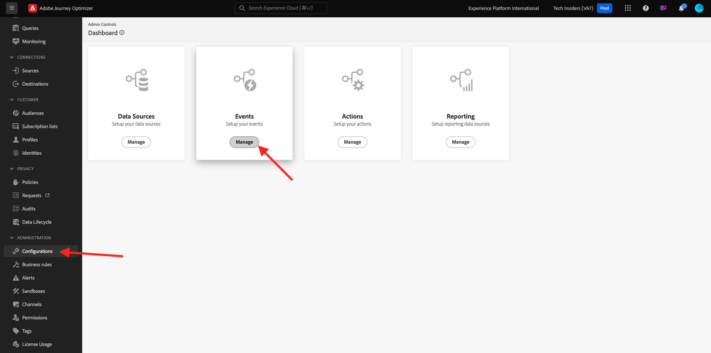

# 3.1.1 Creación de un evento

Inicie sesión en Adobe Journey Optimizer en [Adobe Experience Cloud](https://experience.adobe.com). Haga clic en **Journey Optimizer**.

Se le redirigirá a la vista **Inicio** en Journey Optimizer. Primero, asegúrese de que está usando la zona protegida correcta. La zona protegida que se va a usar se llama `--aepSandboxName--`.

En el menú de la izquierda, desplácese hacia abajo y haga clic en **Configuraciones**. A continuación, haga clic en el botón **Administrar** en **Eventos**.

A continuación, verá una descripción general de todos los eventos disponibles. Haz clic en **Crear evento** para empezar a crear tu propio evento.

A continuación, aparece una nueva ventana de evento vacía.

En primer lugar, asigne un nombre al evento como este: `--aepUserLdap--AccountCreationEvent`.
Establezca la descripción en `Account Creation Event`, asegúrese de que **Type** está establecido en **Unitary** y, para la selección de **Event ID Type**, seleccione **System Generated**.

A continuación se muestra la selección Esquema. Use el esquema `Demo System - Event Schema for Website (Global v1.1) v.1`.

Después de seleccionar el esquema, verá una serie de campos seleccionados en la sección **Carga útil**. Ahora debería pasar el ratón sobre la sección **Carga útil** y verá 3 iconos emergentes. Haz clic en el icono **Editar**.

Verá una ventana emergente de **Campos**, en la cual tendrá que seleccionar algunos de los campos que necesitamos para personalizar el correo electrónico.  Elegiremos otros atributos de perfil más adelante, utilizando los datos que ya están en Adobe Experience Platform.

En el objeto `--aepTenantId--.demoEnvironment`, asegúrese de seleccionar los campos **brandLogo** y **brandName**.

En el objeto `--aepTenantId--.identification.core`, asegúrese de seleccionar el campo **correo electrónico**. Haga clic en **Aceptar** para guardar los cambios.

Entonces debería ver esto. Establezca **Namespace** en **ECID (ECID)**. Haga clic en **Guardar**.

El evento se ha configurado y guardado.

Vuelva a hacer clic en el evento para abrir la pantalla **Editar evento**. Pase el ratón sobre el campo **Carga útil** de nuevo para ver los 3 iconos. Haz clic en el icono **Ver carga**.

Ahora verá un ejemplo de la carga útil esperada.

Su evento tiene un identificador de evento de orquestación único, que puede encontrar desplazándose hacia abajo en esa carga hasta que vea `_experience.campaign.orchestration.eventID`.

El ID de evento es lo que debe enviarse a Adobe Experience Platform para almacenar en déclencheur el recorrido que creará a continuación. Recuerde este ID de evento, ya que lo necesitará en uno de los próximos ejercicios.
`"eventID": "5ae9b8d3f68eb555502b0c07d03ef71780600c4bd0373a4065c692ae0bfbd34d"`

Haga clic en **Ok**.

Haga clic en **Cancelar**.

Ya ha terminado este ejercicio.

Paso siguiente: [3.1.2 Crear fragmentos para usarlos en el mensaje](./ex2.md)

[Volver al módulo 3.1](./journey-orchestration-create-account.md)

[Volver a todos los módulos](../../../overview.md)
