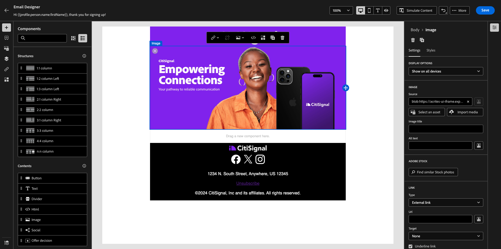
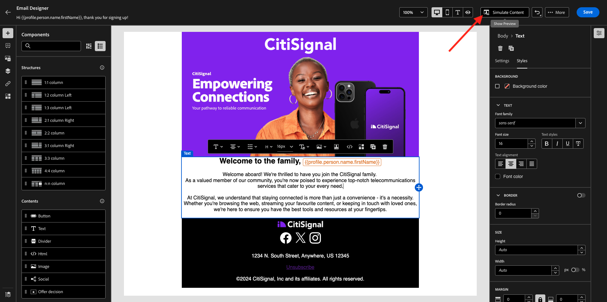
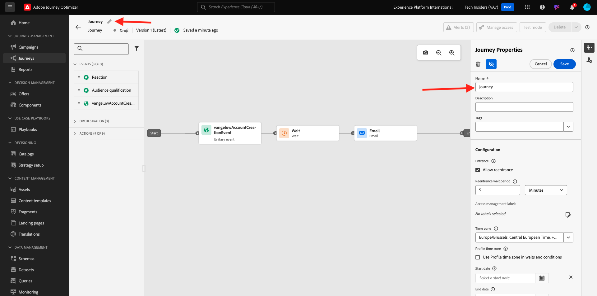

# 3.1.2 Crear el recorrido y el mensaje de correo electrónico

En este ejercicio, configurará el recorrido y el mensaje que debe activarse cuando alguien cree una cuenta en el sitio web de demostración.

Inicie sesión en Adobe Journey Optimizer en [Adobe Experience Cloud](https://experience.adobe.com). Haga clic en **Journey Optimizer**.

Se le redirigirá a la vista **Inicio** en Journey Optimizer. Primero, asegúrese de que está usando la zona protegida correcta. La zona protegida que se va a usar se llama `--aepSandboxName--`. Para cambiar de una zona protegida a otra, haga clic en **PRODUCTION Prod (VA7)** y seleccione la zona protegida en la lista. En este ejemplo, la zona protegida se denomina **Habilitación de AEP para el año fiscal 22**. Estará en la vista **Inicio** de su zona protegida `--aepSandboxName--`.

## 3.1.2.1 Creación de un recorrido

En el menú de la izquierda, haga clic en **Recorridos**. A continuación, haga clic en **Crear Recorrido** para crear un nuevo recorrido.

A continuación, verá una pantalla de recorrido vacía.

En el ejercicio anterior creó un nuevo **evento**. Le puso este nombre `ldapAccountCreationEvent` y reemplazó `ldap` por su LDAP. Este fue el resultado de la creación del Evento:

Ahora debe tomar este evento como inicio de este Recorrido. Para ello, vaya al lado izquierdo de la pantalla y busque el evento en la lista de eventos.

Seleccione el evento, arrástrelo y suéltelo en el lienzo de Recorrido. El Recorrido ahora tiene este aspecto:

Como segundo paso en el recorrido, debe agregar un breve paso **Wait**. Vaya al lado izquierdo de la pantalla a la sección **Orchestration** para encontrarlo. Utilizará atributos de perfil y debe asegurarse de que se rellenan en el Perfil del cliente en tiempo real.

Su recorrido ahora tiene este aspecto. En el lado derecho de la pantalla debe configurar el tiempo de espera. Configúrelo en 1 minuto. Esto le dará tiempo suficiente para que los atributos de perfil estén disponibles después de que se active el evento.

Haga clic en **Aceptar** para guardar los cambios.

Como tercer paso del recorrido, debes agregar una acción **Correo electrónico**. Vaya al lado izquierdo de la pantalla a **Actions**, seleccione la acción **Email** y arrástrela y suéltela en el segundo nodo del recorrido. Ahora puede ver esto.

Defina **Category** en **Marketing** y seleccione una superficie de correo electrónico que le permita enviar correo electrónico. En este caso, la superficie de correo electrónico que se va a seleccionar es **Correo electrónico**. Asegúrese de que las casillas de verificación de **Clics en el correo electrónico** y **aperturas del correo electrónico** estén habilitadas.

El siguiente paso es crear el mensaje. Para ello, haga clic en **Editar contenido**.

## 3.1.2.2 Crear el mensaje

Para crear tu mensaje, haz clic en **Editar contenido**.

Ahora puede ver esto.

Haga clic en el campo de texto **Línea de asunto**.

Empiece a escribir **Hola** en el área de texto

La línea de asunto aún no ha finalizado. A continuación, debe traer el token de personalización para el campo **Nombre** que se almacena en `profile.person.name.firstName`. En el menú de la izquierda, desplácese hacia abajo para encontrar el elemento **Person** y haga clic en la flecha para ir un nivel más profundo.

Ahora encuentra el elemento **Nombre completo** y haz clic en la flecha para ir un nivel más profundo.

Finalmente, busque el campo **Nombre** y haga clic en el signo **+** que está al lado. A continuación, verá aparecer el token de personalización en el campo de texto.

A continuación, agregue el texto **, ¡gracias por registrarse!**. Haga clic en **Guardar**.

Entonces volverás a estar aquí. Haga clic en **Enviar correo electrónico a Designer** para crear el contenido del correo electrónico.

En la siguiente pantalla, se le solicitarán tres métodos diferentes para proporcionar el contenido del correo electrónico:

- **Diseñe desde cero**: Comience con un lienzo en blanco y utilice el editor de WYSIWYG para arrastrar y soltar los componentes de estructura y contenido y así crear visualmente el contenido del correo electrónico.
- **Codifique su propia**: cree su propia plantilla de correo electrónico codificándola con el HTML
- **HTML de importación**: importe una plantilla de HTML existente que podrá editar.

Haga clic en **Diseñar desde cero**.

En el menú de la izquierda, encontrará los componentes de estructura que puede utilizar para definir la estructura del correo electrónico (filas y columnas).

Arrastre y suelte una columna **1:2 Left** del menú en el lienzo. Este será el marcador de posición de la imagen del logotipo.

Arrastre y suelte una columna **1:1** debajo del componente anterior. Este será el bloque de banner.

Arrastre y suelte una columna **1:2 Left** debajo del componente anterior. Este será el contenido real con una imagen en el lado izquierdo y texto en el lado derecho.

A continuación, arrastre y suelte una columna **1:1** debajo del componente anterior. Este será el pie de página del correo electrónico. El lienzo debería tener un aspecto similar al siguiente:

A continuación, vamos a utilizar los componentes de contenido para añadir contenido dentro de estos bloques. Haga clic en el elemento de menú **Componentes de contenido**

Arrastre y suelte un componente **Image** en la primera celda de la primera fila. Haga clic en **Examinar**.

Entonces verá esto... Vaya a la carpeta **enablement-assets** y seleccione el archivo **luma-logo.png**. Haga clic en **Seleccionar**.

Ahora estás de vuelta aquí:

Vaya a **Componentes de contenido** y arrastre y suelte un componente **Imagen** en la primera celda de la primera fila. Haga clic en **Examinar**.

En la ventana emergente **Assets**, ve a la carpeta **enablement-assets**. En esta carpeta encontrará todos los recursos preparados y cargados previamente por el equipo creativo. Seleccione **module23-thank-you-new.png** y haga clic en **Seleccionar**.

A continuación, tendrá esto:

Seleccione la imagen y, en el menú de la derecha, desplácese hacia abajo hasta que vea el componente deslizador de anchura **Size**. Utilice el regulador para cambiar la anchura a f.i. **60 %**.

A continuación, vaya a **Componentes de contenido** y arrastre y suelte un componente **Texto** en el componente de estructura en la cuarta fila.

Seleccione el texto predeterminado **Escriba el texto aquí.** como lo haría con cualquier editor de texto. Escriba **Estimado** en su lugar. Observe la barra de herramientas de texto que se muestra cuando está en modo de texto.

En la barra de herramientas, haga clic en el icono **Agregar personalización**.

A continuación, debe traer el token de personalización **First name** que se almacena en `profile.person.name.firstName`. En el menú, busque el elemento **Person**, explore en profundidad el elemento **Nombre completo** y, a continuación, haga clic en el icono **+** para agregar el campo Nombre al editor de expresiones.

Haga clic en **Guardar**.

Ahora notará cómo se ha agregado el campo de personalización al texto.

En el mismo campo de texto, presione **Entrar** dos veces para agregar dos líneas y escriba **Gracias por crear su cuenta con Luma!**.

La última comprobación que debes realizar para asegurarte de que el correo electrónico esté listo es previsualizarlo, haz clic en el botón **Simular contenido**.

Comience por identificar qué perfil desea utilizar para la vista previa. Seleccione el área de nombres **email** haciendo clic en el icono situado junto al campo **Introducir área de nombres de identidad**.

En la lista de áreas de nombres de identidad, seleccione el área de nombres **Email**.

En el campo **Valor de identidad**, escriba la dirección de correo electrónico de un perfil de demostración anterior que ya esté almacenado en el Perfil del cliente en tiempo real. Por ejemplo **woutervangeluwe+06022022-01@gmail.com** y haga clic en el botón **Buscar perfil de prueba**

Una vez que el perfil aparezca en la tabla, haga clic en la ficha **Vista previa** para obtener acceso a la pantalla de vista previa.

Cuando la vista previa esté lista, compruebe que la personalización es correcta en la línea de asunto, el texto del cuerpo y el vínculo de baja se resaltan como un hipervínculo.

Haga clic en **Cerrar** para cerrar la vista previa.

Haz clic en **Guardar** para guardar el mensaje.

Vuelva al panel de mensajes haciendo clic en la **flecha** junto al texto de la línea de asunto en la esquina superior izquierda.

Ha completado la creación del correo electrónico de registro. Haga clic en la flecha de la esquina superior izquierda para volver al recorrido.

Haga clic en **Ok**.

## 3.1.2.3 Publish su recorrido

Aún necesita darle un Nombre a su recorrido. Para ello, haga clic en el icono **Propiedades** en la parte superior derecha de la pantalla.

A continuación, puede introducir el nombre del recorrido aquí. Use `--aepUserLdap-- - Account Creation Journey`. Haga clic en **Aceptar** para guardar los cambios.

Ahora puede publicar su recorrido haciendo clic en **Publish**.

Vuelva a hacer clic en **Publish**.

A continuación, verá una barra de confirmación verde que indica que el recorrido se ha publicado.

Ya ha terminado este ejercicio.

Paso siguiente: [3.1.3 Actualice la propiedad de recopilación de datos y pruebe su recorrido](./ex3.md)

[Volver al módulo 3.1](./journey-orchestration-create-account.md)

[Volver a todos los módulos](../../../overview.md)
