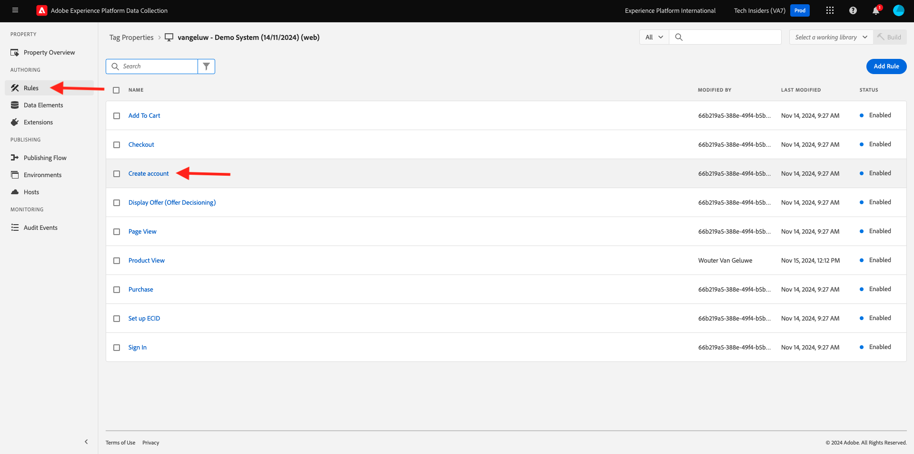
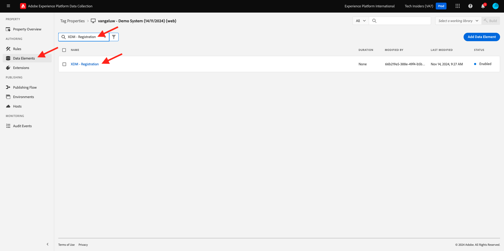
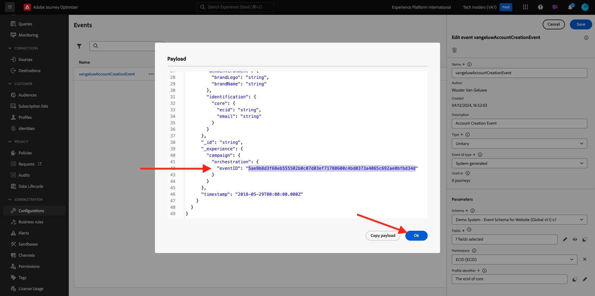
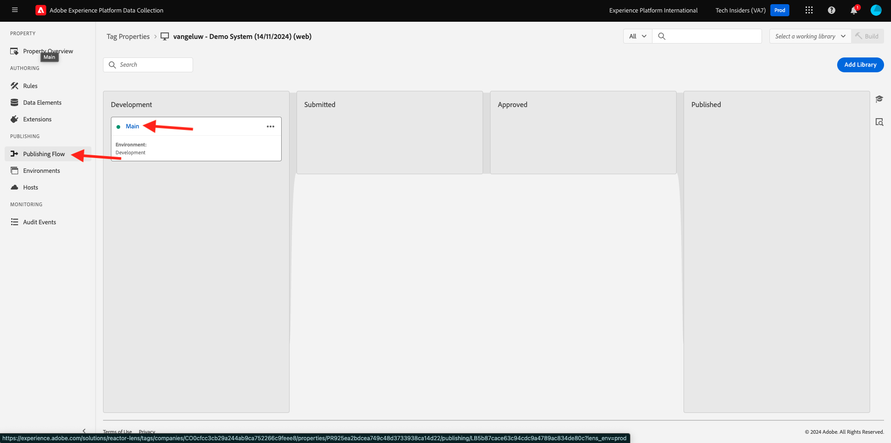

# 3.1.3 Actualizar la propiedad de recopilación de datos y probar el recorrido

## 3.1.3.1 Actualizar la propiedad de recopilación de datos

Vaya a [Recopilación de datos de Adobe Experience Platform](https://experience.adobe.com/launch/) y seleccione **Etiquetas**.

En **Introducción**, Demo System creó dos propiedades de cliente para usted: una para el sitio web y otra para la aplicación móvil. Encuéntralos buscando `--aepUserLdap--` en el cuadro **[!UICONTROL Buscar]**. Haga clic para abrir la propiedad **Web**.

Entonces verá esto...

En el menú de la izquierda, ve a **Reglas** y busca la regla **Crear cuenta**. Haga clic en la regla **Crear cuenta** para abrirla.

A continuación, verá los detalles de esta regla. Haga clic para abrir la acción **Enviar &quot;Evento de registro&quot; con el evento de experiencia**.

Verá que, cuando se active esta acción, se utilizará un elemento de datos específico para definir la estructura de datos XDM. Debe actualizar ese elemento de datos y definir el **ID de evento** del evento que configuró en el [Ejercicio 3.1.1](./ex1.md).

Ahora necesita actualizar el elemento de datos **XDM - Evento de registro**. Para ello, vaya a **Elementos de datos**. Busque **XDM - Registro** y haga clic para abrir ese elemento de datos.

A continuación, verá esto:

Vaya al campo `_experience.campaign.orchestration.eventID`. Elimine el valor actual y pegue su eventID allí.

Como recordatorio, el ID de evento se puede encontrar en Adobe Journey Optimizer en **Configuraciones > Eventos** y encontrará el ID de evento en la carga útil de ejemplo del evento, que tiene este aspecto: `"eventID": "5ae9b8d3f68eb555502b0c07d03ef71780600c4bd0373a4065c692ae0bfbd34d"`.

Después de pegar el ID de evento, la pantalla debería tener este aspecto. A continuación, haga clic en **Guardar** o **Guardar en biblioteca**.

Finalmente, debe publicar los cambios. Vaya a **Flujo de publicación** en el menú de la izquierda y haga clic para abrir su biblioteca **Principal**.

Haga clic en **Agregar todos los recursos modificados** y, a continuación, haga clic en **Guardar y generar en desarrollo**.

La biblioteca se actualizará y, después de uno o dos minutos, podrá probar la configuración.

## 3.1.3.2 Prueba del Recorrido

Vaya a [https://dsn.adobe.com](https://dsn.adobe.com). Después de iniciar sesión con su Adobe ID, verá esto. Haga clic en los 3 puntos **...** del proyecto del sitio web y, a continuación, haga clic en **Ejecutar** para abrirlo.

A continuación, verá cómo se abre el sitio web de demostración. Seleccione la URL y cópiela en el portapapeles.

Abra una nueva ventana del explorador de incógnito.

Pegue la dirección URL del sitio web de demostración, que copió en el paso anterior. Luego se le pedirá que inicie sesión con su Adobe ID.

Seleccione el tipo de cuenta y complete el proceso de inicio de sesión.

Luego verá el sitio web cargado en una ventana de incógnito del explorador. Para cada ejercicio, deberá utilizar una ventana nueva del explorador de incógnito para cargar la URL del sitio web de demostración.

Haga clic en el Adobe del logotipo situado en la esquina superior izquierda de la pantalla para abrir el Visor de perfiles.

Eche un vistazo al panel Visor de perfiles y al Perfil del cliente en tiempo real con el **ID de Experience Cloud** como identificador principal de este cliente actualmente desconocido. Haga clic en **Iniciar sesión**.

Haga clic en **CREAR UNA CUENTA**.

Complete sus detalles y haga clic en **Registrarse** después de lo cual se le redirigirá a la página anterior.

Abra el panel Visualizador de perfiles y vaya a Perfil del cliente en tiempo real. En el panel Visor de perfiles, debería ver todos los datos personales que se muestran, como los identificadores de correo electrónico y teléfono que acaba de agregar.

1 minuto después de crear la cuenta, Adobe Journey Optimizer le enviará un correo electrónico para crearla.

También verá la entrada de recorrido y el progreso a través del recorrido en el panel del recorrido en Journey Optimizer.

Paso siguiente: [Resumen y beneficios](./summary.md)

[Volver al módulo 3.1](./journey-orchestration-create-account.md)

[Volver a todos los módulos](../../../overview.md)
