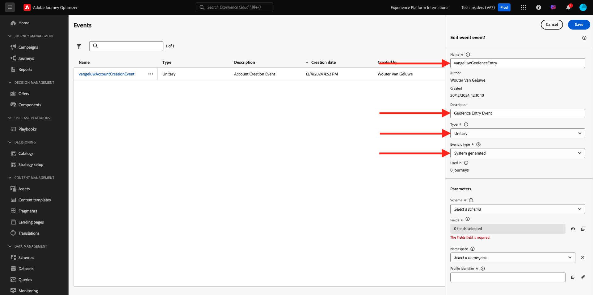
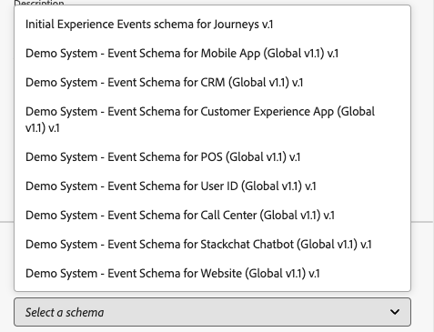

# 3.2.1 Definición de un evento

Inicie sesión en Adobe Journey Optimizer en [Adobe Experience Cloud](https://experience.adobe.com). Haga clic en **Journey Optimizer**.

Se le redirigirá a la vista **Inicio** en Journey Optimizer. Primero, asegúrese de que está usando la zona protegida correcta. La zona protegida que se va a usar se llama `--aepSandboxName--`. Para cambiar de una zona protegida a otra, haga clic en **PRODUCTION Prod (VA7)** y seleccione la zona protegida en la lista. En este ejemplo, la zona protegida se denomina **Habilitación de AEP para el año fiscal 22**. Estará en la vista **Inicio** de su zona protegida `--aepSandboxName--`.

En el menú de la izquierda, desplácese hacia abajo y haga clic en **Configuraciones**. A continuación, haga clic en el botón **Administrar** en **Eventos**.

A continuación, verá una descripción general de todos los eventos disponibles. Haz clic en **Crear evento** para empezar a crear tu propio evento.

A continuación, aparece una nueva ventana de evento vacía.

Como nombre del evento, use `--aepUserLdap--GeofenceEntry`. En este ejemplo, el Nombre del evento es `vangeluwGeofenceEntry`.

Definir descripción en: `Geofence Entry Event`.

A continuación, asegúrese de que **Type** está establecido en **Unitary** y, para la selección de **Event ID Type**, seleccione **System Generated**

A continuación, debe seleccionar un esquema. Todos los esquemas que se muestran aquí son Esquemas de Adobe Experience Platform.

Observará que no se muestran todos los esquemas. Hay muchos más esquemas disponibles en Adobe Experience Platform.
Para aparecer en esta lista, un esquema debe tener un grupo de campos muy específico vinculado a él. El grupo de campos necesario para aparecer aquí se llama `Orchestration eventID`.

Vamos a echar un vistazo rápido a cómo se definen estos esquemas en Adobe Experience Platform.

En el menú de la izquierda, vaya a **Esquemas** y ábralo en una nueva pestaña del explorador. En **Esquemas**, vaya a **Examinar** para ver la lista de esquemas disponibles.
Abra el esquema `Demo System - Event Schema for Website (Global v1.1)`.

Después de abrir el esquema, verá que el grupo de campos `Orchestration eventID` forma parte del esquema.
Este grupo de campos solo tiene dos campos, `_experience.campaign.orchestration.eventID` y `originJourneyID`.

Una vez que este grupo de campos y este campo eventID específico formen parte de un esquema, ese esquema estará disponible para su uso en Adobe Journey Optimizer.

Vuelva a la configuración del evento en Adobe Journey Optimizer.

En este caso de uso, desea escuchar un evento de geoperímetro para saber si un cliente se encuentra en una ubicación específica, por lo que ahora debe seleccionar el esquema `Demo System - Event Schema for Website (Global v1.1)` como esquema para el evento.

Adobe Journey Optimizer seleccionará automáticamente algunos campos obligatorios, pero puede editar los campos que están disponibles para Adobe Journey Optimizer.

Haga clic en el icono **lápiz** para editar los campos.

A continuación, verá una ventana emergente con una jerarquía de esquema que le permite seleccionar campos.

Los campos como ECID y el ID de evento de orquestación son obligatorios y, como tales, preseleccionados.

Sin embargo, un experto en marketing necesita tener acceso flexible a todos los puntos de datos que proporcionan contexto a un Recorrido. Por lo tanto, asegúrese de seleccionar los siguientes campos como mínimo (que se encuentran dentro del nodo Contexto de ubicación ):

- Ciudad

Una vez hecho esto, haz clic en **Aceptar**.

Adobe Journey Optimizer también necesita un identificador para identificar al cliente. Dado que Adobe Journey Optimizer está vinculado a Adobe Experience Platform, el identificador principal de un esquema se toma automáticamente como identificador del Recorrido.
El identificador principal también tendrá en cuenta automáticamente el gráfico de identidad completo de Adobe Experience Platform y vinculará todo el comportamiento en todas las identidades, dispositivos y canales disponibles al mismo perfil, de modo que Adobe Journey Optimizer sea contextual, relevante y coherente.

Haz clic en **Guardar** para guardar el evento personalizado.

El evento formará parte de la lista de eventos disponibles.

Finalmente, debe recuperar `Orchestration eventID` para el evento personalizado.

Vuelva a abrir el evento haciendo clic en él en la lista de eventos.
En tu evento, haz clic en el icono **Ver carga útil** junto a **Campos**.

Al hacer clic en el icono **Ver carga útil**, se abre una carga útil XDM de ejemplo para este evento.

Desplácese hacia abajo en **Carga útil** hasta que vea la línea `eventID`.

Escriba `eventID`, ya que lo necesitará en el último para probar la configuración.

En este ejemplo, `eventID` es `fa42ab7982ba55f039eacec24c1e32e5c51b310c67f0fa559ab49b89b63f4934`.

Ahora ha definido el evento que almacenará en déclencheur el recorrido que estamos creando. Una vez activado el recorrido, los campos de geovalla como Ciudad y cualquier otro que haya elegido (como País, Latitud y Longitud) estarán disponibles para el recorrido.

Como se analiza en la descripción del caso de uso, luego debemos proporcionar promociones contextuales que dependan del clima. Para obtener información meteorológica, necesitaremos definir una fuente de datos externa que nos proporcione la información meteorológica para esa ubicación. Utilizarás el servicio **OpenWeather** para proporcionarnos esa información, como parte de 2.

Paso siguiente: [3.2.2 Definición de un origen de datos externo](./ex2.md)

[Volver al módulo 3.2](journey-orchestration-external-weather-api-sms.md)

[Volver a todos los módulos](../../../overview.md)
