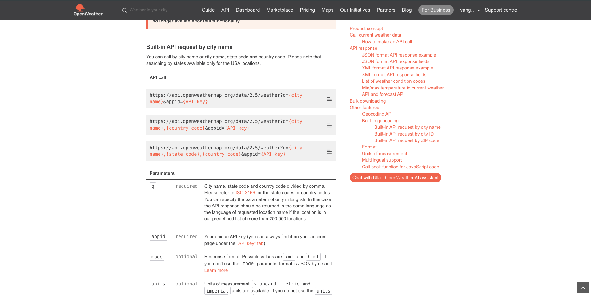

# 3.2.2 Definición de una fuente de datos externa

En este ejercicio, creará una fuente de datos externa personalizada utilizando Adobe Journey Optimizer.

Inicie sesión en Adobe Journey Optimizer en [Adobe Experience Cloud](https://experience.adobe.com). Haga clic en **Journey Optimizer**.


Se le redirigirá a la vista **Inicio** en Journey Optimizer. Primero, asegúrese de que está usando la zona protegida correcta. La zona protegida que se va a usar se llama `--aepSandboxName--`. Para cambiar de una zona protegida a otra, haga clic en **PRODUCTION Prod (VA7)** y seleccione la zona protegida en la lista. En este ejemplo, la zona protegida se denomina **Habilitación de AEP para el año fiscal 22**. Estará en la vista **Inicio** de su zona protegida `--aepSandboxName--`.


En el menú de la izquierda, desplácese hacia abajo y haga clic en **Configuraciones**. A continuación, haga clic en el botón **Administrar** en **Fuentes de datos**.


Verá la lista **Fuentes de datos**.
Haga clic en **Crear Source de datos** para empezar a agregar la fuente de datos.


Verá una fuente de datos emergente vacía.


Antes de comenzar a configurar esto, necesitas una cuenta con el servicio **Abrir mapa del tiempo**. Siga estos pasos para crear su cuenta de y obtener su clave de API.

Vaya a [https://openweathermap.org/](https://openweathermap.org/). En la página de inicio, haz clic en **Iniciar sesión**.


Haga clic en **Crear una cuenta**.


Complete los detalles.


Haga clic en **Crear cuenta**.


A continuación, se le redirigirá a la página de su cuenta.


En el menú, haga clic en **Claves de API** para recuperar su clave de API, que deberá configurar su origen de datos externo personalizado.


Una **clave API** tiene el siguiente aspecto: `b2c4c36b6bb59c3458d6686b05311dc3`.

Puedes encontrar la **Documentación de la API** para el **Tiempo actual** [aquí](https://openweathermap.org/current).

En nuestro caso de uso, implementaremos la conexión con Open Weather Map en función de la ciudad en la que se encuentra el cliente.



Vuelva a **Adobe Journey Optimizer**, a la ventana emergente **Source de datos externos** vacía.


Como nombre para el origen de datos, use `--aepUserLdap--WeatherApi`. En este ejemplo, el nombre del origen de datos es `vangeluwWeatherApi `.

Definir descripción en: `Access to the Open Weather Map`.

La dirección URL de la API de Open Weather Map es: **http://api.openweathermap.org/data/2.5/weather?units=metric**


A continuación, debe seleccionar la Autenticación que desea utilizar.

Utilice estas variables:

| Campo | Valor |
|:-----------------------:| :-----------------------|
| Tipo | **Clave de API** |
| Nombre | **APPID** |
| Valor | **su clave API** |
| Ubicación | **Parámetro de consulta** |


Finalmente, debe definir un **FieldGroup**, que es básicamente la solicitud que enviará a la API meteorológica. En nuestro caso, queremos usar el nombre de la Ciudad para solicitar el Tiempo Actual para esa Ciudad.


Según la documentación de la API meteorológica, necesitamos enviar un parámetro `q=City`.


Para que coincida con la solicitud de API esperada, configure el grupo de campos de la siguiente manera:

>[!IMPORTANT]
>
>El nombre del grupo de campos debe ser único, use esta convención de nomenclatura: `--aepUserLdap--WeatherByCity`, así que en este caso, el nombre debe ser `vangeluwWeatherByCity`


Para la carga de respuesta, debe pegar un ejemplo de la respuesta que enviará la API meteorológica.

Puede encontrar la respuesta JSON de API esperada en la página Documentación de API [aquí](https://openweathermap.org/current).


O puede copiar la respuesta JSON desde aquí:

```json
{"coord": { "lon": 139,"lat": 35},
  "weather": [
    {
      "id": 800,
      "main": "Clear",
      "description": "clear sky",
      "icon": "01n"
    }
  ],
  "base": "stations",
  "main": {
    "temp": 281.52,
    "feels_like": 278.99,
    "temp_min": 280.15,
    "temp_max": 283.71,
    "pressure": 1016,
    "humidity": 93
  },
  "wind": {
    "speed": 0.47,
    "deg": 107.538
  },
  "clouds": {
    "all": 2
  },
  "dt": 1560350192,
  "sys": {
    "type": 3,
    "id": 2019346,
    "message": 0.0065,
    "country": "JP",
    "sunrise": 1560281377,
    "sunset": 1560333478
  },
  "timezone": 32400,
  "id": 1851632,
  "name": "Shuzenji",
  "cod": 200
}
```

Copie la respuesta JSON anterior en el portapapeles y, a continuación, vaya a la pantalla de configuración de la fuente de datos personalizada.

Haga clic en el icono **Editar carga útil**.


Verá una ventana emergente en la que ahora tiene que pegar la respuesta JSON anterior.


Pegue la respuesta JSON, después de lo cual verá esto. Haga clic en **Guardar**.


Se ha completado la configuración de la fuente de datos personalizada. Desplácese hacia arriba y haga clic en **Guardar**.


Su origen de datos se ha creado correctamente y forma parte de la lista **Fuentes de datos**.


Paso siguiente: [3.2.3 Definir una acción personalizada](./ex3.md)

[Volver al módulo 3.2](journey-orchestration-external-weather-api-sms.md)

[Volver a todos los módulos](../../../overview.md)
