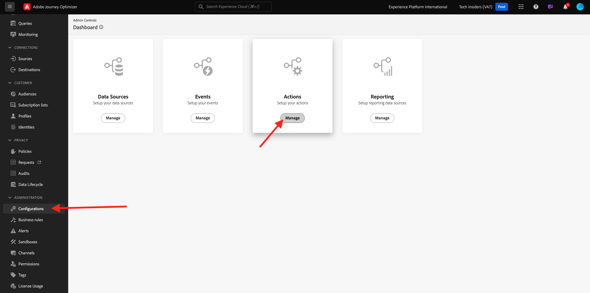
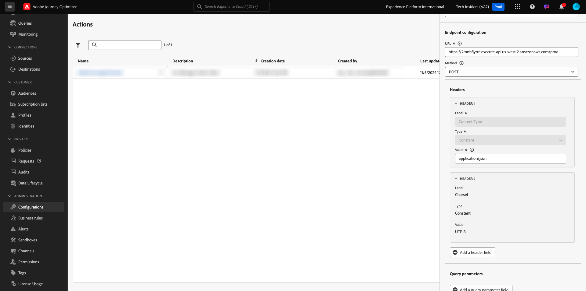
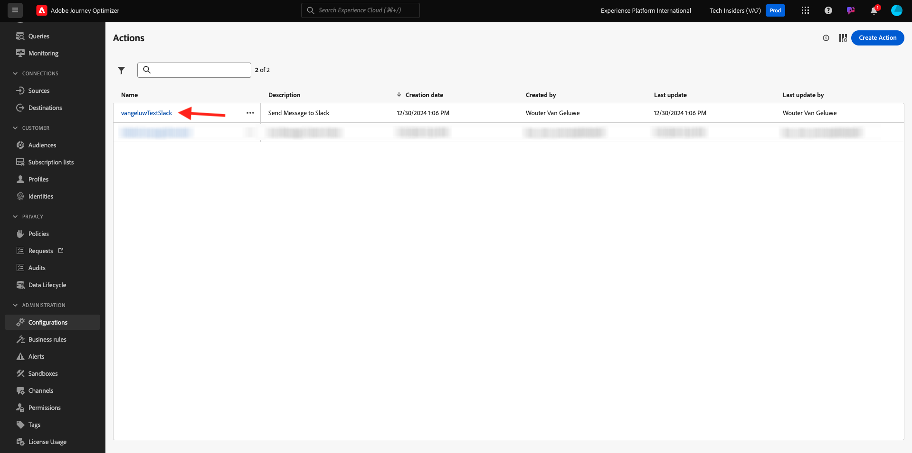

# 3.2.3 Definir una acción personalizada

En este ejercicio, creará una acción personalizada para enviar un mensaje a un canal de Slack.

Inicie sesión en Adobe Journey Optimizer en [Adobe Experience Cloud](https://experience.adobe.com). Haga clic en **Journey Optimizer**.


Se le redirigirá a la vista **Inicio** en Journey Optimizer. Primero, asegúrese de que está usando la zona protegida correcta. La zona protegida que se va a usar se llama `--aepSandboxName--`. Estará en la vista **Inicio** de su zona protegida `--aepSandboxName--`.


Ahora utilizará un canal de Slack existente y enviará mensajes a ese canal de Slack. Slack tiene una API fácil de usar y usted utilizará Adobe Journey Optimizer para almacenar en déclencheur su API.


En el menú de la izquierda, desplácese hacia abajo y haga clic en **Configuraciones**. A continuación, haga clic en el botón **Administrar** en **Acciones**.



Luego verá la lista **Acciones**. Haga clic en **Crear acción**.


Verá una ventana emergente de acción vacía.


Como nombre de la acción, use `--aepUserLdap--TextSlack`.

Definir descripción en: `Send Message to Slack`.

Para la **configuración de URL**, use esto:

- URL: `https://2mnbfjyrre.execute-api.us-west-2.amazonaws.com/prod`
- Método: **POST**

>[!NOTE]
>
>La URL anterior hace referencia a una función Lambda de AWS que reenvía la solicitud al canal del Slack como se ha mencionado anteriormente. Esto se hace para proteger el acceso a un canal de Slack propiedad del Adobe. Si tiene su propio canal de Slack, debe crear una aplicación de Slack a través de [https://api.slack.com/](https://api.slack.com/), luego debe crear un webhook entrante en esa aplicación de Slack y luego reemplazar la dirección URL anterior por la dirección URL del webhook entrante.


No es necesario cambiar los campos de encabezado.



**Autenticación** debe establecerse en **Sin autenticación**.


En **Cargas útiles**, debe definir qué campos se deben enviar al Slack. Lógicamente, desea que Adobe Journey Optimizer y Adobe Experience Platform sean el cerebro de la personalización, por lo que el texto que se enviará al Slack debe definirlo Adobe Journey Optimizer y luego enviarlo al Slack para que lo ejecute.

Para la **solicitud**, haga clic en el icono **Editar carga útil**.


A continuación, verá una ventana emergente vacía.


Copie el texto siguiente y péguelo en la ventana emergente vacía.

```json
{
 "text": {
  "toBeMapped": true,
  "dataType": "string",
  "label": "textToSlack"
 }
}
```

A continuación, verá esto:


Desplácese hacia arriba y haga clic en **Guardar** una vez más para guardar la acción.


La acción personalizada ahora forma parte de la lista **Acciones**.



Ha definido eventos y fuentes de datos y acciones externas. Ahora vamos a consolidar todo eso en un recorrido.

Paso siguiente: [3.2.4 Crear el recorrido y los mensajes](./ex4.md)

[Volver al módulo 3.2](journey-orchestration-external-weather-api-sms.md)

[Volver a todos los módulos](../../../overview.md)
