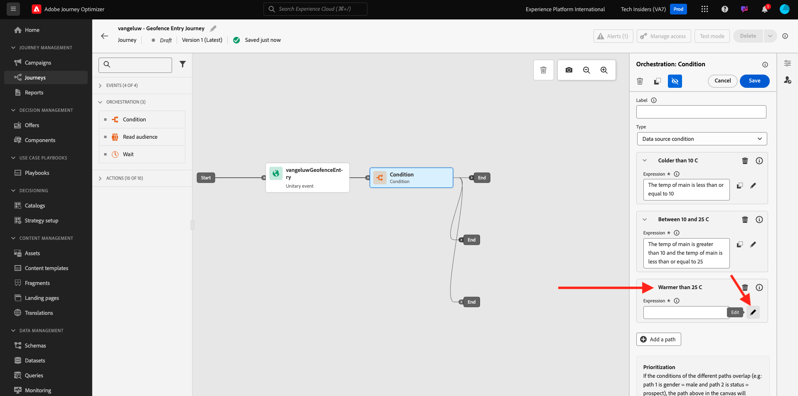
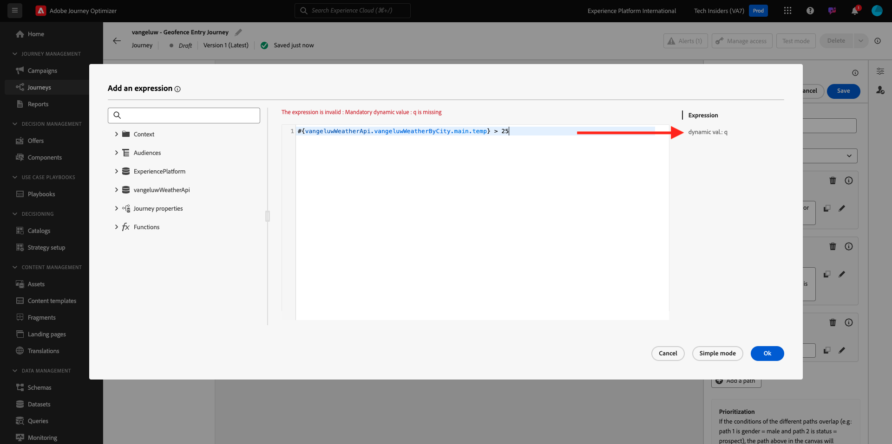

# 3.2.4 Crear el recorrido y los mensajes

En este ejercicio, creará un recorrido y varios mensajes de texto utilizando Adobe Journey Optimizer.

Para este caso de uso, el objetivo es enviar diferentes mensajes SMS en función de las condiciones meteorológicas de la ubicación de su cliente. Se han definido 3 escenarios:

- Más frío que 10° Celsius
- Entre 10° y 25° Celsius
- Más caliente que 25° Celsius

Para estas 3 condiciones, debe definir 3 mensajes SMS en Adobe Journey Optimizer.

## 3.2.4.1 Creación de un recorrido

Inicie sesión en Adobe Journey Optimizer en [Adobe Experience Cloud](https://experience.adobe.com). Haga clic en **Journey Optimizer**.


Se le redirigirá a la vista **Inicio** en Journey Optimizer. Primero, asegúrese de que está usando la zona protegida correcta. La zona protegida que se va a usar se llama `--aepSandboxName--`. Para cambiar de una zona protegida a otra, haga clic en **PRODUCTION Prod (VA7)** y seleccione la zona protegida en la lista. En este ejemplo, la zona protegida se denomina **Habilitación de AEP para el año fiscal 22**. Estará en la vista **Inicio** de su zona protegida `--aepSandboxName--`.


En el menú de la izquierda, ve a **Recorridos** y haz clic en **Crear Recorrido** para comenzar a crear tu Recorrido.


Deberías ponerle nombre a tu recorrido.

Como nombre del recorrido, use `--aepUserLdap-- - Geofence Entry Journey`. En este ejemplo, el nombre del recorrido es `vangeluw - Geofence Entry Journey`. No se deben configurar otros valores en este momento. Haga clic en **Aceptar**.


En la parte izquierda de la pantalla, echa un vistazo a **Eventos**. Debería ver el evento creado anteriormente en esa lista. Selecciónelo y, a continuación, arrástrelo y suéltelo en el lienzo de recorrido. Tu recorrido se ve así. Haga clic en **Ok**.


A continuación, haga clic en **Orquestación**. Ahora verá las funcionalidades de **Orchestration** disponibles. Seleccione **Condición** y arrástrela y suéltela en el lienzo de Recorrido.


Ahora debe definir tres condiciones:

- Hace más frío que 10° Celsius
- Está entre 10° y 25° Celsius
- Hace más calor que 25° Celsius

Vamos a definir la primera condición.

### Condición 1: más frío que 10° Celsius

Haga clic en **Condición**.  Haga clic en **Ruta1** y edite el nombre de la ruta a **Más antigua que 10°C**. Haga clic en el icono **Editar** para ver la expresión de Path1.


Verá una pantalla de **Editor simple** vacía. La consulta será un poco más avanzada, por lo que necesitará el **Modo avanzado**. Haga clic en **Modo avanzado**.


Verá el **Editor avanzado** que permite la entrada de código.


Seleccione el siguiente código y péguelo en el **Editor avanzado**.

`#{--aepUserLdap--WeatherApi.--aepUserLdap--WeatherByCity.main.temp} <= 10`

Entonces verá esto...


Para recuperar la temperatura como parte de esta condición, debe proporcionar la ciudad en la que se encuentra el cliente actualmente.
La **ciudad** debe estar vinculada al parámetro dinámico `q`, tal como vimos anteriormente en la Documentación de la API de clima abierto.

Haga clic en el campo **valor dinámico: q** como se indica en la captura de pantalla.


A continuación, debe buscar el campo que contiene la ciudad actual del cliente en una de las fuentes de datos disponibles.


Para encontrar el campo, vaya a `--aepUserLdap--GeofenceEntry.placeContext.geo.city`.

Al hacer clic en ese campo, se agregará como el valor dinámico para el parámetro `q`. Este campo lo rellenará, por ejemplo, el servicio de geolocalización que haya implementado en su aplicación móvil. En nuestro caso, simularemos esto con la consola de administración del sitio web de demostración. Haga clic en **Aceptar**.


### Condición 2: entre 10° y 25° Celsius

Después de haber agregado la primera condición, verá esta pantalla. Haga clic en **Agregar ruta**.


Haga doble clic en **Ruta1** y edite el nombre de ruta de acceso a **Entre 10 y 25 °C**. Haga clic en el icono **Editar** para la expresión de esta ruta.


Verá una pantalla de **Editor simple** vacía. La consulta será un poco más avanzada, por lo que necesitará el **Modo avanzado**. Haga clic en **Modo avanzado**.


Verá el **Editor avanzado** que permite la entrada de código.


Seleccione el siguiente código y péguelo en el **Editor avanzado**.

`#{--aepUserLdap--WeatherApi.--aepUserLdap--WeatherByCity.main.temp} > 10 and #{--aepUserLdap--WeatherApi.--aepUserLdap--WeatherByCity.main.temp} <= 25`

Entonces verá esto...


Para recuperar la temperatura como parte de esta condición, debe proporcionar la ciudad en la que se encuentra el cliente actualmente.
La **ciudad** debe estar vinculada al parámetro dinámico **q**, tal como vimos anteriormente en la Documentación de la API de clima abierto.

Haga clic en el campo **valor dinámico: q** como se indica en la captura de pantalla.


A continuación, debe buscar el campo que contiene la ciudad actual del cliente en una de las fuentes de datos disponibles.


Para encontrar el campo, vaya a `--aepUserLdap--GeofenceEntry.placeContext.geo.city`. Al hacer clic en ese campo, se agregará como el valor dinámico para el parámetro **q**. Este campo lo rellenará, por ejemplo, el servicio de geolocalización que haya implementado en su aplicación móvil. En nuestro caso, simularemos esto con la consola de administración del sitio web de demostración. Haga clic en **Aceptar**.


A continuación, agregará la tercera condición.

### Condición 3: Más cálido que 25° Celsius

Después de haber agregado la segunda condición, verá esta pantalla. Haga clic en **Agregar ruta**.


Haga doble clic en Ruta1 para cambiar el nombre a **Más cálido que 25 C**.
A continuación, haga clic en el icono **Edit** para la expresión de esta ruta.



Verá una pantalla de **Editor simple** vacía. La consulta será un poco más avanzada, por lo que necesitará el **Modo avanzado**. Haga clic en **Modo avanzado**.


Verá el **Editor avanzado** que permite la entrada de código.


Seleccione el siguiente código y péguelo en el **Editor avanzado**.

`#{--aepUserLdap--WeatherApi.--aepUserLdap--WeatherByCity.main.temp} > 25`

Entonces verá esto...


Para recuperar la temperatura como parte de esta condición, debe proporcionar la ciudad en la que se encuentra el cliente actualmente.
La **ciudad** debe estar vinculada al parámetro dinámico **q**, tal como vimos anteriormente en la Documentación de la API de clima abierto.

Haga clic en el campo **valor dinámico: q** como se indica en la captura de pantalla.



A continuación, debe buscar el campo que contiene la ciudad actual del cliente en una de las fuentes de datos disponibles.


Para encontrar el campo, vaya a ```--aepUserLdap--GeofenceEntry.placeContext.geo.city```. Al hacer clic en ese campo, se agregará como el valor dinámico para el parámetro **q**. Este campo lo rellenará, por ejemplo, el servicio de geolocalización que haya implementado en su aplicación móvil. En nuestro caso, simularemos esto con la consola de administración del sitio web de demostración. Haga clic en **Aceptar**.


Ahora tiene tres rutas configuradas. Haga clic en **Ok**.


Como este es un recorrido para fines de aprendizaje, ahora configuraremos un par de acciones para mostrar la variedad de opciones que ahora tienen los especialistas en marketing para enviar mensajes.

## 3.2.4.2 Envío de mensajes para ruta: inferior a 10° Celsius

Para cada uno de los contextos de temperatura, intentaremos enviar un mensaje de texto a nuestro cliente. Solo podemos enviar un mensaje de texto si tenemos un número de móvil disponible para un cliente, por lo que primero tendremos que verificar que lo hacemos.

Centrémonos en **menores de 10 °C**.


Tomemos otro elemento **Condition** y arrástrelo como se indica en la captura de pantalla siguiente. Comprobaremos si para este cliente, tenemos disponible un número de móvil.


Como este es solo un ejemplo, solo estamos configurando la opción en la que el cliente tiene un número de móvil disponible. Agregue una etiqueta de **¿Tiene dispositivo móvil?**.

Haga clic en el icono **Editar** de la expresión de la ruta **Path1**.


En las fuentes de datos que se muestran a la izquierda, navegue hasta **ExperiencePlatform.ProfileFieldGroup.profile.mobilePhone.number**. Ahora está leyendo el número de teléfono móvil directamente desde el Perfil del cliente en tiempo real de Adobe Experience Platform.


Seleccione el campo **Number** y arrástrelo y suéltelo en el lienzo de condición.

Seleccione el operador **no está vacío**. Haga clic en **Ok**.


Entonces verá esto... Vuelva a hacer clic en **Aceptar**.


El recorrido se verá así. Haz clic en **Acciones** como se indica en la captura de pantalla.


Seleccione la acción **SMS** y arrástrela y suéltela después de la condición que acaba de agregar.


Defina **Category** en **Marketing** y seleccione una superficie SMS que le permita enviar SMS. En este caso, la superficie de correo electrónico que se va a seleccionar es **SMS**.


El siguiente paso es crear el mensaje. Para ello, haga clic en **Editar contenido**.


Ahora verá el panel de mensajes, donde puede configurar el texto de su SMS. Haga clic en el área **Escribir mensaje** para crear su mensaje.


Escriba el siguiente texto: `Brrrr... {{profile.person.name.firstName}}, it's freezing. 20% discount on jackets today!`. Haga clic en **Guardar**.


Entonces verá esto... Haga clic en la flecha de la esquina superior izquierda para volver al recorrido.


Entonces volverás a estar aquí. Haga clic en **Ok**.


En el menú de la izquierda, vuelva a **Actions**, seleccione la acción `--aepUserLdap--TextSlack` y arrástrela y suéltela después de la acción **Message**.


Vaya a **Parámetros de acción** y haga clic en el icono **Editar** del parámetro `TEXTTOSLACK`.


En la ventana emergente, haga clic en **Modo avanzado**.


Seleccione el siguiente código, cópielo y péguelo en el **Editor de modo avanzado**. Haga clic en **Ok**.

`"Brrrr..." + #{ExperiencePlatform.ProfileFieldGroup.profile.person.name.firstName} + " It's freezing. 20% discount on Jackets today!"`


Verá la acción completada. Haga clic en **Ok**.


Esta ruta del recorrido ya está lista.

## 3.2.4.3 Enviar mensajes para ruta: entre 10° y 25° Celsius

Para cada uno de los contextos de temperatura, intentaremos enviar un mensaje de texto a nuestro cliente. Solo podemos enviar un mensaje de texto si tenemos un número de móvil disponible para un cliente, por lo que primero tendremos que verificar que lo hacemos.

Centrémonos en la ruta **entre 10 y 25 °C**.


Tomemos otro elemento **Condition** y arrástrelo como se indica en la captura de pantalla siguiente. Comprobaremos si para este cliente, tenemos disponible un número de móvil.


Como este es solo un ejemplo, solo estamos configurando la opción en la que el cliente tiene un número de móvil disponible. Agregue una etiqueta de **¿Tiene dispositivo móvil?**.

Haga clic en el icono **Editar** de la expresión de la ruta **Path1**.


En las fuentes de datos que se muestran a la izquierda, navegue hasta **ExperiencePlatform.ProfileFieldGroup.profile.mobilePhone.number**. Ahora está leyendo el número de teléfono móvil directamente desde el Perfil del cliente en tiempo real de Adobe Experience Platform.


Seleccione el campo **Number** y arrástrelo y suéltelo en el lienzo de condición.

Seleccione el operador **no está vacío**. Haga clic en **Ok**.


Entonces verá esto... Haga clic en **Ok**.


El recorrido se verá así. Haz clic en **Acciones** como se indica en la captura de pantalla.


Seleccione la acción **SMS** y arrástrela y suéltela después de la condición que acaba de agregar.


Defina **Category** en **Marketing** y seleccione una superficie SMS que le permita enviar SMS. En este caso, la superficie de correo electrónico que se va a seleccionar es **SMS**.


El siguiente paso es crear el mensaje. Para ello, haga clic en **Editar contenido**.


Ahora verá el panel de mensajes, donde puede configurar el texto de su SMS. Haga clic en el área **Escribir mensaje** para crear su mensaje.


Escriba el siguiente texto: `What a nice weather for the time of year, {{profile.person.name.firstName}} - 20% discount on Sweaters today!`. Haga clic en **Guardar**.


Entonces verá esto... Haga clic en la flecha de la esquina superior izquierda para volver al recorrido.


Ahora verá la acción completada. Haga clic en **Ok**.


En el menú de la izquierda, vuelva a **Actions**, seleccione la acción `--aepUserLdap--TextSlack` y arrástrela y suéltela después de la acción **Message**.


Vaya a **Parámetros de acción** y haga clic en el icono **Editar** del parámetro `TEXTTOSLACK`.


En la ventana emergente, haga clic en **Modo avanzado**.


Seleccione el siguiente código, cópielo y péguelo en el **Editor de modo avanzado**. Haga clic en **Ok**.

`"What nice weather for the time of year, " + #{ExperiencePlatform.ProfileFieldGroup.profile.person.name.firstName} + " 20% discount on Sweaters today!"`


Verá la acción completada. Haga clic en **Ok**.


Esta ruta del recorrido ya está lista.

## 3.2.4.4 Enviar mensajes para ruta: Más cálido que 25° Celsius

Para cada uno de los contextos de temperatura, intentaremos enviar un mensaje de texto a nuestro cliente. Solo podemos enviar un mensaje de texto si tenemos un número de móvil disponible para un cliente, por lo que primero tendremos que verificar que lo hacemos.

Centrémonos en una ruta de acceso de **más cálida que los 25 °C**.


Tomemos otro elemento **Condition** y arrástrelo como se indica en la captura de pantalla siguiente. Comprobará si tiene un número de móvil disponible para este cliente.


Como este es solo un ejemplo, solo estamos configurando la opción en la que el cliente tiene un número de móvil disponible. Agregue una etiqueta de **¿Tiene dispositivo móvil?**.

Haga clic en el icono **Editar** de la expresión de la ruta **Path1**.


En las fuentes de datos que se muestran a la izquierda, navegue hasta **ExperiencePlatform.ProfileFieldGroup.profile.mobilePhone.number**. Ahora está leyendo el número de teléfono móvil directamente desde el Perfil del cliente en tiempo real de Adobe Experience Platform.


Seleccione el campo **Number** y arrástrelo y suéltelo en el lienzo de condición.

Seleccione el operador **no está vacío**. Haga clic en **Ok**.


Entonces verá esto... Haga clic en **Aceptar**.


El recorrido se verá así. Haz clic en **Acciones** como se indica en la captura de pantalla.


Seleccione la acción **SMS** y arrástrela y suéltela después de la condición que acaba de agregar.


Defina **Category** en **Marketing** y seleccione una superficie SMS que le permita enviar SMS. En este caso, la superficie de correo electrónico que se va a seleccionar es **SMS**.


El siguiente paso es crear el mensaje. Para ello, haga clic en **Editar contenido**.


Ahora verá el panel de mensajes, donde puede configurar el texto de su SMS. Haga clic en el área **Escribir mensaje** para crear su mensaje.


Escriba el siguiente texto: `So warm, {{profile.person.name.firstName}}! 20% discount on swimwear today!`. Haga clic en **Guardar**.


Entonces verá esto... Haga clic en la flecha de la esquina superior izquierda para volver al recorrido.


Ahora verá la acción completada. Haga clic en **Ok**.


En el menú de la izquierda, vuelva a **Actions**, seleccione la acción `--aepUserLdap--TextSlack` y arrástrela y suéltela después de la acción **Messages**.


Vaya a **Parámetros de acción** y haga clic en el icono **Editar** del parámetro `TEXTTOSLACK`.


En la ventana emergente, haga clic en **Modo avanzado**.


Seleccione el siguiente código, cópielo y péguelo en el **Editor de modo avanzado**. Haga clic en **Ok**.

`"So warm, " + #{ExperiencePlatform.ProfileFieldGroup.profile.person.name.firstName} + "! 20% discount on swimwear today!"`


Verá la acción completada. Haga clic en **Ok**.


Esta ruta del recorrido ya está lista.

## 3.2.4.5 Publish su recorrido

El recorrido está ahora completamente configurado. Haga clic en **Publish**.


Vuelva a hacer clic en **Publish**.


El recorrido se ha publicado.


Siguiente paso: [3.2.5 Déclencheur tu recorrido](./ex5.md)

[Volver al módulo 3.2](journey-orchestration-external-weather-api-sms.md)

[Volver a todos los módulos](../../../overview.md)
