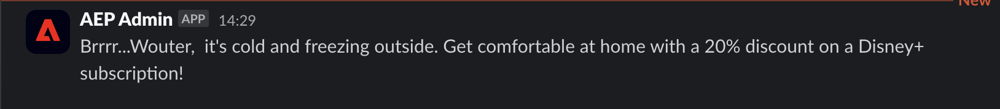

# 3.2.5 Déclencheur de su recorrido

En este ejercicio, probará y almacenará en déclencheur el recorrido que configuró en este módulo.

## 3.2.5.1 Actualizar la configuración del evento de geovalla

Vaya a [Recopilación de datos de Adobe Experience Platform](https://experience.adobe.com/launch/) y seleccione **Etiquetas**.

Esta es la página de Propiedades de recopilación de datos de Adobe Experience Platform que vio antes.

En el módulo 0, Demo System creó dos propiedades de cliente para usted: una para el sitio web y otra para la aplicación móvil. Encuéntralos buscando `--aepUserLdap--` en el cuadro **[!UICONTROL Buscar]**. Haga clic para abrir la propiedad **Web**.

Entonces verá esto...

En el menú de la izquierda, ve a **Reglas** y busca la regla **Evento de geoperímetro**. Haga clic en la regla **Evento de geoperímetro** para abrirla.

A continuación, verá los detalles de esta regla. Haga clic para abrir la acción **Enviar &quot;evento de geovalla&quot; a AEP - déclencheur JO**.

Verá que, cuando se active esta acción, se utilizará un elemento de datos específico para definir la estructura de datos XDM. Debe actualizar ese elemento de datos y definir el **ID de evento** del evento que configuró en el [Ejercicio 8.1](./ex1.md).

Ahora necesita actualizar el elemento de datos **XDM - Evento de geoperímetro**. Para ello, vaya a **Elementos de datos**. Busque **XDM - Evento de geoperímetro** y haga clic para abrir ese elemento de datos.

A continuación, verá esto:

Vaya al campo `_experience.campaign.orchestration.eventID`. Elimine el valor actual y pegue su eventID allí.

Como recordatorio, el ID de evento se puede encontrar en Adobe Journey Optimizer en **Configuraciones > Eventos** y encontrará el ID de evento en la carga útil de ejemplo del evento, que tiene este aspecto: `"eventID": "fa42ab7982ba55f039eacec24c1e32e5c51b310c67f0fa559ab49b89b63f4934"`.

A continuación, debe definir la ciudad en este elemento de datos. Vaya a **placeContext > ubicación geográfica > ciudad** y escriba la ciudad que desee. A continuación, haga clic en **Guardar** o **Guardar en biblioteca**.

Finalmente, debe publicar los cambios. Vaya a **Flujo de publicación** en el menú de la izquierda.

Haga clic en **Agregar todos los recursos modificados** y, a continuación, haga clic en **Guardar y generar en desarrollo**.

## 3.2.5.2 Déclencheur de su recorrido

Vaya a [https://builder.adobedemo.com/projects](https://builder.adobedemo.com/projects). Después de iniciar sesión con su Adobe ID, verá esto. Haga clic en el proyecto del sitio web para abrirlo.

En la página **Screens**, haga clic en **Ejecutar**.

A continuación, verá cómo se abre el sitio web de demostración. Seleccione la URL y cópiela en el portapapeles.

Abra una nueva ventana del explorador de incógnito.

Pegue la dirección URL del sitio web de demostración, que copió en el paso anterior. Luego se le pedirá que inicie sesión con su Adobe ID.

Seleccione el tipo de cuenta y complete el proceso de inicio de sesión.

Luego verá el sitio web cargado en una ventana de incógnito del explorador. Para cada demostración, deberá utilizar una ventana nueva del explorador de incógnito para cargar la URL del sitio web de demostración.

Haga clic en el Adobe del logotipo situado en la esquina superior izquierda de la pantalla para abrir el Visor de perfiles.

Eche un vistazo al panel Visor de perfiles y al Perfil del cliente en tiempo real con el **ID de Experience Cloud** como identificador principal de este cliente actualmente desconocido.

Vaya a la página Registrar/Iniciar sesión. Haga clic en **CREAR UNA CUENTA**.

Complete sus detalles y haga clic en **Registrarse** después de lo cual se le redirigirá a la página anterior.

Abra el panel Visualizador de perfiles y vaya a Perfil del cliente en tiempo real. En el panel Visor de perfiles, debería ver todos los datos personales que se muestran, como los identificadores de correo electrónico y teléfono que acaba de agregar.

En el panel Visor de perfiles, haga clic en **UTILIDADES**. Escriba `geofenceevent` y haga clic en **Enviar**.

Un par de segundos después, recibirá un SMS de Adobe Journey Optimizer.

Paso siguiente: [Resumen y beneficios](./summary.md)

[Volver al módulo 3.2](journey-orchestration-external-weather-api-sms.md)

[Volver a todos los módulos](../../../overview.md)
