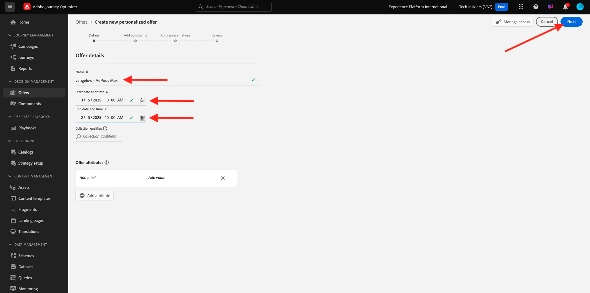
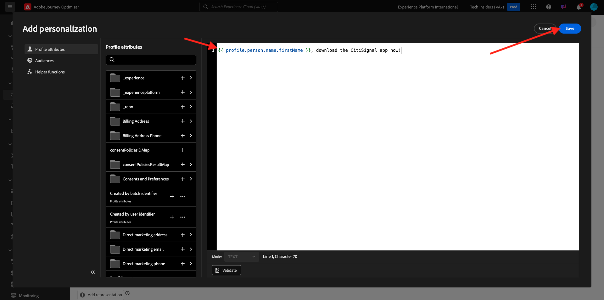

# 3.3.2 Configurar las ofertas y la decisión

## 3.3.2.1 Creación de ofertas personalizadas

En este ejercicio, creará cuatro **Ofertas personalizadas**. Estos son los detalles que se deben tener en cuenta al crear esas ofertas:

| Nombre | Date Range | Vínculo de imagen para correo electrónico | Vínculo de imagen para web | Texto | Prioridad | Idoneidad | Idioma |
|-----|------------|----------------------|--------------------|------|:--------:|--------------|:-------:|
| `--aepUserLdap-- - Nadia Elements Shell` | hoy - 1 mes después | https://bit.ly/3nPiwdZ | https://bit.ly/2INwXjt | `{{ profile.person.name.firstName }}, 10% discount on Nadia Elements Shell` | 25 | todos: mujeres clientes | Inglés (Estados Unidos) |
| `--aepUserLdap-- - Radiant Tee` | hoy - 1 mes después | https://bit.ly/2HfA17v | https://bit.ly/3pEIdzn | `{{ profile.person.name.firstName }}, 5% discount on Radiant Tee` | 15 | todos: mujeres clientes | Inglés (Estados Unidos) |
| `--aepUserLdap-- - Zeppelin Yoga Pant` | hoy - 1 mes después | https://bit.ly/2IOaItW | https://bit.ly/2INZHZd | `{{ profile.person.name.firstName }}, 10% discount on Zeppelin Yoga Pant` | 25 | todos: clientes hombres | Inglés (Estados Unidos) |
| `--aepUserLdap-- - Proteus Fitness Jackshirt` | hoy - 1 mes después | https://bit.ly/330a43n | https://bit.ly/36USaQW | `{{ profile.person.name.firstName }}, 5% discount on Proteus Fitness Jackshirt` | 15 | todos: clientes hombres | Inglés (Estados Unidos) |

{style="table-layout:auto"}

Inicie sesión en Adobe Journey Optimizer en [Adobe Experience Cloud](https://experience.adobe.com). Haga clic en **Journey Optimizer**.

Se le redirigirá a la vista **Inicio** en Journey Optimizer. Primero, asegúrese de que está usando la zona protegida correcta. La zona protegida que se va a usar se llama `--aepSandboxName--`. Para cambiar de una zona protegida a otra, haga clic en **PRODUCTION Prod (VA7)** y seleccione la zona protegida en la lista. En este ejemplo, la zona protegida se denomina **Habilitación de AEP para el año fiscal 22**. Estará en la vista **Inicio** de su zona protegida `--aepSandboxName--`.

En el menú de la izquierda, haz clic en **Ofertas** y luego ve a **Ofertas**. Haga clic en **+ Crear oferta**.

Entonces verá esta ventana emergente. Seleccione **Oferta personalizada** y haga clic en **Siguiente**.

Ahora estás en la vista **Detalles**.

En este caso, debe configurar la oferta `--aepUserLdap-- - Nadia Elements Shell`. Utilice la información de la tabla anterior para rellenar los campos. En este ejemplo, el nombre de la oferta personalizada es **vangeluw - Nadia Elements Shell**. Además, establezca la **fecha y hora de inicio** en ayer y la **fecha y hora de finalización** en una fecha dentro de un mes a partir de ahora.

Una vez finalizado, debería tener esto. Haga clic en **Next**.

Ahora necesita crear **Representaciones**. Las representaciones son una combinación de **Placement** y un recurso real.

Para **Representación 1**, seleccione:

- Canal: web
- Ubicación: Web - Imagen
- Contenido: URL
- Ubicación pública: copie la dirección URL de la columna **Vínculo de imagen para la web** en la tabla anterior

También puede seleccionar **Biblioteca de recursos** para el contenido y luego hacer clic en **Examinar**.

Verá una ventana emergente de la biblioteca Assets, irá a la carpeta **enablement-assets** y seleccionará el archivo de imagen **nadia-web.png**. A continuación, haga clic en **Seleccionar**.

A continuación, verá esto:

Haga clic en **+ Agregar representación**.

Para **Representación 2**, seleccione:

- Canal: correo electrónico
- Ubicación: correo electrónico, imagen
- Contenido: URL
- Ubicación pública: copie la dirección URL de la columna **Vínculo de imagen para correo electrónico** en la tabla anterior

También puede seleccionar **Biblioteca de recursos** para el contenido y luego hacer clic en **Examinar**.

Verá una ventana emergente de la biblioteca Assets, vaya a la carpeta **enablement-assets** y seleccione el archivo de imagen **nadia-email.png**. A continuación, haga clic en **Seleccionar**.

A continuación, verá esto:

A continuación, haga clic en **+ Agregar representación**.

Para **Representación 3**, seleccione:

- Canal: no digital
- Ubicación: no digital, texto

A continuación, debe añadir contenido. En este caso, eso significa añadir el texto que se va a utilizar como llamada a la acción.

Haga clic en **Agregar contenido**.

Entonces verá esta ventana emergente.

Seleccione **Texto personalizado** y rellene estos campos:

Observe el campo **Texto** de la tabla anterior e introduzca ese texto aquí, en este caso: `{{ profile.person.name.firstName }}, 10% discount on Nadia Elements Shell`.

También notará que puede seleccionar cualquier atributo de perfil e incluirlo como un campo dinámico en el texto de la oferta. En este ejemplo, el campo `{{ profile.person.name.firstName }}` se asegurará de que el nombre del cliente que recibirá esta oferta se incluya en el texto de la oferta.

Entonces verá esto... Haga clic en **Guardar**.

Ahora tiene esto. Haga clic en **Next**.

A continuación, verá esto:

Seleccione **By defined decision rule** y haga clic en el icono **+** para agregar la regla **all - Female Customers**.

Entonces verá esto... Complete la **Prioridad** como se indica en la tabla anterior. Haga clic en **Next**.

Verás una descripción general de tu nueva **oferta personalizada**.

Finalmente, haga clic en **Guardar y aprobar**.

A continuación, verá que la oferta personalizada recién creada está disponible en la Información general de ofertas:

Ahora debe repetir los pasos anteriores para crear las otras tres ofertas personalizadas para los productos Radiant Tee, Zeppelin Yoga Pant y Proteus Fitness Jackshirt.

Cuando termine, la pantalla **Información general de ofertas** para **Ofertas personalizadas** debe mostrar todas las ofertas.

## 3.3.2.2 Crear su oferta de reserva

Después de haber creado cuatro ofertas personalizadas, ahora debes configurar una **Oferta de reserva**.

Asegúrese de que está en la vista **Ofertas**:

Haga clic en **+ Crear oferta**.

Entonces verá esta ventana emergente. Seleccione **Oferta de reserva** y haga clic en **Siguiente**.

A continuación, verá esto:

Escriba este nombre para la oferta de reserva: `--aepUserLdap-- - Luma Fallback Offer`. Haga clic en **Next**.

Ahora necesita crear **Representaciones**. Las representaciones son una combinación de **Placement** y un recurso real.

Para **Representación 1**, seleccione:

- Canal: web
- Ubicación: Web - Imagen
- Contenido: URL
- Ubicación pública: `https://bit.ly/3nBOt9h`

También puede seleccionar **Biblioteca de recursos** para el contenido y luego hacer clic en **Examinar**.

Verá una ventana emergente de la biblioteca de Assets, vaya a la carpeta **enablement-assets** y seleccione el archivo de imagen **spriteyogastraps-web.png**. A continuación, haga clic en **Seleccionar**.

A continuación, verá esto:

Para **Representación 2**, seleccione:

- Canal: correo electrónico
- Ubicación: correo electrónico, imagen
- Contenido: URL
- Ubicación pública: `https://bit.ly/3nF4qvE`

También puede seleccionar **Biblioteca de recursos** para el contenido y luego hacer clic en **Examinar**.

Verá una ventana emergente de la biblioteca de Assets, vaya a la carpeta **enablement-assets** y seleccione el archivo de imagen **spriteyogastraps-email.png**. A continuación, haga clic en **Seleccionar**.

A continuación, verá esto:

A continuación, haga clic en **+ Agregar representación**.

Para **Representación 3**, seleccione:

- Canal: no digital
- Ubicación: no digital, texto

A continuación, debe añadir contenido. En este caso, eso significa añadir el vínculo de imagen.

Haga clic en **Agregar contenido**.

Entonces verá esta ventana emergente.

Seleccione **Texto personalizado** y rellene estos campos:

Escriba el texto `{{ profile.person.name.firstName }}, discover our Sprite Yoga Straps!` y haga clic en **Guardar**.

Entonces verá esto... Haga clic en **Next**.

Verá una descripción general de su nueva **oferta de reserva**. Haga clic en **Finalizar**.

Finalmente, haga clic en **Guardar y aprobar**.

En la pantalla **Información general de ofertas**, ahora verá esto:

## 3.3.2.3 Crear su colección

Se usa una colección para **filtrar** un subconjunto de ofertas de la lista de ofertas personalizadas y usarlas como parte de una decisión para acelerar el proceso de decisión.

Ir a **Colecciones**. Haga clic en **+ Crear colección**.

Entonces verá esta ventana emergente. Configure la colección de esta manera. Haga clic en **Next**.

- Nombre de colección: usar `--aepUserLdap-- - Luma Collection`
- Seleccione **Crear colección estática**.

En la pantalla siguiente, seleccione las cuatro **Ofertas personalizadas** que creó en el ejercicio anterior. Haga clic en **Guardar**.

Ahora verá lo siguiente:

## 3.3.2.4 Crear su decisión

Una decisión combina ubicaciones, una colección de ofertas personalizadas y una oferta de reserva que el motor de Offer decisioning utilizará en última instancia para encontrar la mejor oferta para un perfil específico, en función de cada una de las características de oferta personalizadas individuales como prioridad, restricción de elegibilidad y límite total/de usuario.

Para configurar su **decisión**, vaya a **decisiones**. Haga clic en **+ Crear actividad**.

A continuación, verá esto:

Rellene los campos de esta manera. Haga clic en **Next**.

- Nombre: `--aepUserLdap-- - Luma Decision`
- Fecha y hora de inicio: ayer
- Fecha y hora de finalización: hoy + 1 mes

En la siguiente pantalla, debe agregar ubicaciones en ámbitos de decisión. Deberá crear ámbitos de decisión para las ubicaciones **Web - Imagen**, **Correo electrónico - Imagen** y **No digital - Texto**.

Primero, cree el ámbito de decisión para **No digital - Texto** al seleccionar esa ubicación en la lista desplegable. A continuación, haga clic en el botón **Agregar** para agregar criterios de evaluación.

Seleccione su colección `--aepUserLdap-- - Luma Collection` y haga clic en **Agregar**.

Entonces verá esto... Haga clic en el botón **-** para agregar un nuevo ámbito de decisión.

Seleccione la ubicación **Web - Imagen** y agregue la colección `--aepUserLdap-- - Luma Collection` bajo criterios de evaluación. A continuación, haga clic de nuevo en el botón **+** para agregar un nuevo ámbito de decisión.

Seleccione la ubicación **Correo electrónico - Imagen** y agregue la colección `--aepUserLdap-- - Luma Collection` bajo criterios de evaluación. A continuación, haga clic en **Siguiente**.

Ahora necesita seleccionar su **Oferta de reserva**, que se llama `--aepUserLdap-- - Luma Fallback Offer`. Haga clic en **Next**.

Revise su decisión. Haga clic en **Finalizar**.

En la ventana emergente, haz clic en **Guardar y activar**.

Y, por último, ahora verá su decisión en la descripción general:

Ahora ha configurado correctamente su decisión. Su decisión ya está activa y se puede utilizar para ofrecer ofertas optimizadas y personalizadas a sus clientes, en tiempo real.

Paso siguiente: [3.3.3 Prepare la propiedad de cliente de recopilación de datos y la configuración de Web SDK para el Offer decisioning](./ex3.md)

[Volver al módulo 3.3](./offer-decisioning.md)

[Volver a todos los módulos](./../../../overview.md)
