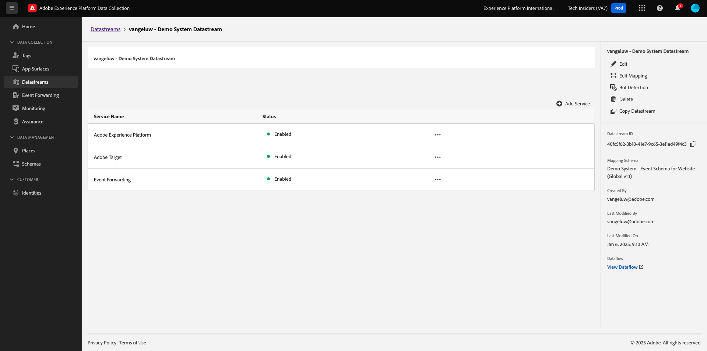
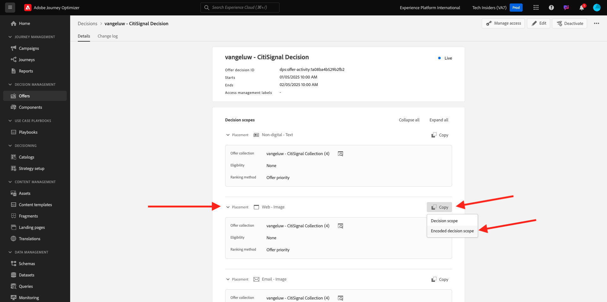

# 3.3.3 Preparar la propiedad del cliente de recopilación de datos de Adobe Experience Platform y la configuración de Web SDK para el Offer decisioning

## 3.3.3.1 Actualizar la secuencia de datos

En el [Ejercicio 0.2](./../../../modules/gettingstarted/gettingstarted/ex2.md), creó su propia **[!UICONTROL secuencia de datos]**. Luego usó el nombre `--aepUserLdap-- - Demo System Datastream`.

En este ejercicio, debe configurar ese **[!UICONTROL conjunto de datos]** para que funcione con **[!DNL Offer Decisioning]**.

Para ello, vaya a [https://experience.adobe.com/#/data-collection/](https://experience.adobe.com/#/data-collection/). Entonces verá esto... Haga clic en **[!UICONTROL Datastreams]** o **[!UICONTROL Datastreams (Beta)]**.

En la esquina superior derecha de la pantalla, seleccione el nombre de la zona protegida, que debe ser `--aepSandboxName--`.


Busque su **[!UICONTROL secuencia de datos]**, que se llama `--aepUserLdap-- - Demo System Datastream`. Haga clic en **[!UICONTROL Flujo de datos]** para abrirlo.


Entonces verá esto... Haga clic en **...** junto a **Adobe Experience Platform** y, a continuación, haga clic en **Editar**.


Para habilitar **[!DNL Offer Decisioning]**, marque la casilla de **[!DNL Offer Decisioning]**. Haga clic en **Guardar**.


Su **[!UICONTROL secuencia de datos]** ya está listo para trabajar con **[!DNL Offer Decisioning]**.



## 3.3.3.2 Configuración de la propiedad de cliente de recopilación de datos de Adobe Experience Platform para solicitar ofertas personalizadas

Vaya a [https://experience.adobe.com/#/data-collection/](https://experience.adobe.com/#/data-collection/), a **[!UICONTROL Cliente]**. Busque las propiedades de recopilación de datos, que se denominan `--aepUserLdap-- - Demo System (DD/MM/YYYY)`. Abra la propiedad de cliente de recopilación de datos para la web.


En su propiedad, vaya a **[!UICONTROL Reglas]** y abra la regla **[!UICONTROL Vista de página]**.


Haga clic para abrir [!UICONTROL Acción] **[!UICONTROL AEP Web SDK - Enviar evento]**.


Entonces verá esto... Verá la opción de menú para **[!UICONTROL Ámbitos de decisión]**.


Por cada solicitud enviada al perímetro de y a Adobe Experience Platform, es posible proporcionar uno o más **[!UICONTROL ámbitos de decisión]**. Un **[!UICONTROL ámbito de decisión]** es una combinación de dos elementos:

- [!UICONTROL ID de decisión]
- [!UICONTROL ID. de ubicación]

Primero echemos un vistazo a dónde se pueden encontrar esos dos elementos.

### 3.3.3.2.1 Recupere su [!UICONTROL ID de ubicación]

La [!UICONTROL ID de ubicación] identifica la ubicación y el tipo de recurso que se requiere. Por ejemplo, la imagen a pantalla completa de la página principal del sitio web de Luma corresponde con la [!UICONTROL ID de ubicación] para [!UICONTROL Web - Imagen].

>[!NOTE]
>
>Como parte del módulo 6, ya ha configurado una actividad de segmentación de experiencias de Adobe Target que cambiará la imagen de la ubicación a pantalla completa en la página principal, como puede ver en la captura de pantalla. Por el bien del ejercicio, ahora hará que sus ofertas aparezcan en la imagen debajo de la imagen a pantalla completa como se indica en la captura de pantalla.


Para encontrar la [!UICONTROL ID de ubicación] para la [!UICONTROL web - imagen], ve a Adobe Journey Optimizer en [Adobe Experience Cloud](https://experience.adobe.com). Haga clic en **Journey Optimizer**.


Se le redirigirá a la vista **Inicio** en Journey Optimizer. Primero, asegúrese de que está usando la zona protegida correcta. La zona protegida que se va a usar se llama `--aepSandboxName--`. Estará en la vista **Inicio** de su zona protegida `--aepSandboxName--`.


A continuación, ve a [!UICONTROL Componentes] y luego a [!UICONTROL Ubicaciones]. Haga clic en la ubicación [!UICONTROL Web - Imagen] para ver sus detalles.


Como puede ver en la imagen anterior, en este ejemplo el [!UICONTROL ID. de ubicación] es `xcore:offer-placement:14bf09dc4190ebba`. Anote el [!UICONTROL ID de ubicación] para su ubicación en [!UICONTROL Web - Imagen], ya que lo necesitará en el próximo ejercicio.

### 3.3.3.2.2 Recupere su [!UICONTROL ID de decisión]

El [!UICONTROL ID de decisión] identifica qué combinación de ofertas personalizadas y oferta de reserva desea utilizar. En el ejercicio anterior creó su propia [!UICONTROL Decisión] y le dio el nombre `--aepUserLdap-- - Luma Decision`.

Para encontrar la [!UICONTROL ID de decisión] de tu `--aepUserLdap-- - Luma Decision`, ve a [https://platform.adobe.com](https://platform.adobe.com).

A continuación, ve a [!UICONTROL Ofertas] y luego a [!UICONTROL Decisiones]. Haga clic para seleccionar [!UICONTROL Decisión], que se llama `--aepUserLdap-- - Luma Decision`.


Como puede ver en la imagen anterior, en este ejemplo el [!UICONTROL ID de decisión] es `xcore:offer-activity:14c052382e1b6505`. Anote el [!UICONTROL ID de decisión] para su decisión `--aepUserLdap-- - Luma Decision`, ya que lo necesitará en el próximo ejercicio.

Ahora que ha recuperado los dos elementos que necesita para crear un **[!UICONTROL ámbito de decisión]**, puede continuar con el siguiente paso, que implica codificar el ámbito de decisión.

### 3.3.3.2.3 Codificación BASE64

El **[!UICONTROL ámbito de decisión]** que debe especificar es una cadena codificada en BASE64. Esta cadena codificada en BASE64 es una combinación de [!UICONTROL ID. de ubicación] y [!UICONTROL ID. de decisión], como puede ver a continuación.

```json
{
  "activityId":"xcore:offer-activity:14c052382e1b6505",
  "placementId":"xcore:offer-placement:14bf09dc4190ebba"
}
```

El **[!UICONTROL ámbito de decisión]** se puede generar de dos maneras:

- Use un servicio público como [https://www.base64encode.org/](https://www.base64encode.org/). Escriba el código JSON como se mencionó anteriormente, haga clic en **[!UICONTROL Codificar]** y obtendrá su cadena codificada en BASE64 a continuación.

  

- Recupere la cadena codificada en BASE64 de Adobe Experience Platform. Vaya a [!UICONTROL Decisiones] y haga clic para abrir la [!UICONTROL Decisión], que se llama `--aepUserLdap-- - Luma Decision`.

  

  Después de abrir `--aepUserLdap-- - Luma Decision`, verá esto. Busque la ubicación [!UICONTROL Web - Imagen] y haga clic en el botón **[!UICONTROL Copiar]**. A continuación, haga clic en **[!UICONTROL Ámbito de decisión codificado]**. **[!UICONTROL Ámbito de decisión]** se ha copiado en el portapapeles.

  

A continuación, vuelva a Launch, a la acción **[!UICONTROL AEP Web SDK - Enviar evento]**.


Pegue el ámbito de decisión codificado en el campo de entrada.


Guarde los cambios en la acción **[!UICONTROL AEP Web SDK - Enviar evento]** haciendo clic en **[!UICONTROL Conservar cambios]**.


A continuación, haga clic en **[!UICONTROL Guardar]** o **[!UICONTROL Guardar en biblioteca]**


En Recopilación de datos de Adobe Experience Platform, vaya a **[!UICONTROL Flujo de publicación]** y abra su **[!UICONTROL Biblioteca de desarrollo]**, que se llama **[!UICONTROL Principal]**. Haga clic en **[!UICONTROL + Agregar todos los recursos modificados]** y luego haga clic en **[!UICONTROL Guardar y generar para desarrollo]**. Los cambios se publicarán en el sitio web de demostración.


Cada vez que esté cargando una **Página general** ahora, como por ejemplo la página principal del sitio web de demostración, el Offer decisioning evaluará cuál es la oferta aplicable y devolverá una respuesta al sitio web con los detalles de la oferta que se va a mostrar. La visualización de la oferta en el sitio web requiere una configuración adicional, que se explica en el siguiente paso.

## 3.3.3.3 Configuración de la propiedad del cliente de recopilación de datos de Adobe Experience Platform para recibir y aplicar ofertas personalizadas

Vaya a [https://experience.adobe.com/#/data-collection/](https://experience.adobe.com/#/data-collection/), para **[!UICONTROL Propiedades]**. Busque las propiedades de recopilación de datos, que se denominan `--aepUserLdap-- - Demo System (DD/MM/YYYY)`. Abra la propiedad de recopilación de datos para la web.


En su propiedad, vaya a **[!UICONTROL Reglas]**.


Busque y abra la regla **Decisión recibida**.


Entonces verá esto... Abrir la acción **Colocar la oferta en la página**.


Haga clic en **[!UICONTROL Abrir editor]**


Sobrescriba el código pegando el siguiente código en el editor.

```javascript
if(!Array.isArray(event.decisions)) {
  console.log('No decisions returned')
  return;
}
console.log("decision",event.decisions)

event.decisions.forEach(function(payload) {
  payload.items.forEach(function(item){
    console.log("Response from Offer Decisioning ", item.data.content);
   
    var element = document.querySelector("#root > div > div > div.app-content > div > section.feature_part.padding_top > div > div.row.align-items-center.justify-content-between > div.col-lg-7.col-sm-6.\\30  > div");
    if(!element){
      console.log("Offer Placement Area Selector not found")
      return;
    }
    if(!item.data){
      return
    }
    //check if offer already exists
    var offer = document.querySelector("#root > div > div > div.app-content > div > section.feature_part.padding_top > div > div.row.align-items-center.justify-content-between > div.col-lg-7.col-sm-6.\\30  > div");
    if(!offer){ 
      element.insertAdjacentHTML('afterbegin', item.data.content) 
    }
    else { 
      console.log("item.data.deliveryURL: " + item.data.deliveryURL)
      document.querySelector("#root > div > div > div.app-content > div > section.feature_part.padding_top > div > div.row.align-items-center.justify-content-between > div.col-lg-7.col-sm-6.\\30  > div").style.background="url('"+item.data.deliveryURL+"')";
      document.querySelector("#root > div > div > div.app-content > div > section.feature_part.padding_top > div > div.row.align-items-center.justify-content-between > div.col-lg-7.col-sm-6.\\30  > div").style.backgroundRepeat="no-repeat";
      document.querySelector("#root > div > div > div.app-content > div > section.feature_part.padding_top > div > div.row.align-items-center.justify-content-between > div.col-lg-7.col-sm-6.\\30  > div").style.backgroundPosition="center center";
      document.querySelector("#root > div > div > div.app-content > div > section.feature_part.padding_top > div > div.row.align-items-center.justify-content-between > div.col-lg-7.col-sm-6.\\30  > div").style.backgroundSize = "contain";
    }  
  })
});
```

Las líneas 26-27-28-29 aplicarán la imagen devuelta por el Offer decisioning al sitio web. Haga clic en **[!UICONTROL Guardar]**.


Haga clic en **[!UICONTROL Conservar cambios]**.


A continuación, haga clic en **[!UICONTROL Guardar]** o **[!UICONTROL Guardar en biblioteca]**


En Recopilación de datos de Adobe Experience Platform, vaya a **[!UICONTROL Flujo de publicación]** y abra su **[!UICONTROL Biblioteca de desarrollo]**, que se llama **[!UICONTROL Principal]**. Haga clic en **[!UICONTROL + Agregar todos los recursos modificados]** y luego haga clic en **[!UICONTROL Guardar y generar para desarrollo]**. Los cambios se publicarán en el sitio web de demostración.


Con este cambio, esta regla de la recopilación de datos de Adobe Experience Platform ahora escucha la respuesta del Offer decisioning que forma parte de la respuesta de Web SDK y, cuando se recibe la respuesta, la imagen de la oferta se muestra en la página principal.

Al ver el sitio web de demostración, verá que esta imagen se reemplazará ahora:

>[!NOTE]
>
>Como parte del módulo 6, ya ha configurado una actividad de segmentación de experiencias de Adobe Target que cambiará la imagen de la ubicación a pantalla completa en la página principal, como puede ver en la captura de pantalla. Por el bien del ejercicio, ahora hará que sus ofertas aparezcan en la imagen debajo de la imagen a pantalla completa como se indica en la captura de pantalla.


Y en lugar de las imágenes predeterminadas del sitio web de Luma, ahora verá una oferta como esta. En este caso, se muestra la oferta de reserva.


Ahora ha configurado dos tipos de personalización:

- 1 actividad de segmentación de experiencias con Adobe Target en el módulo 6
- 1 Implementación del Offer decisioning con la propiedad de recopilación de datos

En el siguiente ejercicio verá cómo puede combinar sus ofertas y decisiones creadas en Adobe Journey Optimizer con una actividad de segmentación de experiencias de Adobe Target.

Siguiente paso: [3.3.4 Combinar Adobe Target y el Offer decisioning](./ex4.md)

[Volver al módulo 3.3](./offer-decisioning.md)

[Volver a todos los módulos](./../../../overview.md)
