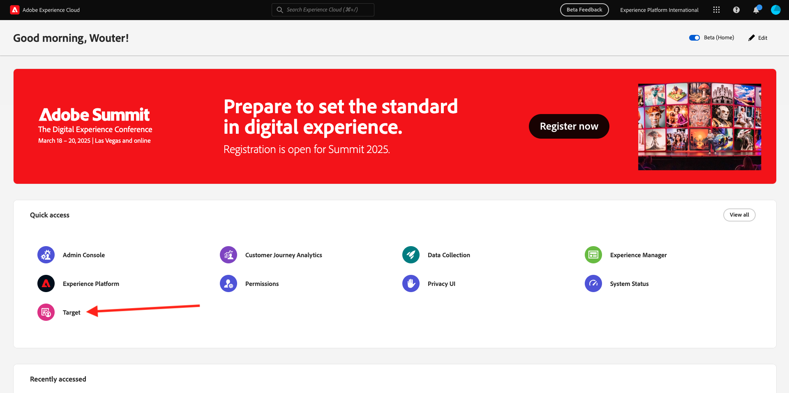

# 3.3.4 Combinación de Adobe Target y Offer Decisioning

## 3.3.4.1 Recopilar el vínculo que se puede compartir del proyecto de demostración

Para cargar el proyecto del sitio web de demostración en Adobe Target, primero debe recopilar un vínculo especial que permita a Adobe Target cargar el proyecto del sitio web de demostración.

Para ello, vaya a [https://builder.adobedemo.com/projects](https://builder.adobedemo.com/projects). Después de iniciar sesión con su Adobe ID, verá esto. Haga clic en el proyecto del sitio web para abrirlo.

Ahora va a ver esto. Haga clic en **Compartir**.

Haga clic en **Generar vínculo** y, a continuación, copie el vínculo en el portapapeles.

Vaya a [https://bitly.com](https://bitly.com), pegue el vínculo que ha copiado y haga clic en **Acortar**. Ahora obtendrá un vínculo abreviado, con este aspecto: `https://bit.ly/3JxN7aG`. Necesitará ese vínculo en el próximo ejercicio.

## 3.3.4.2 Recopilación

Ahora ve a la página principal de Adobe Experience Cloud al [https://experiencecloud.adobe.com/](https://experiencecloud.adobe.com/). Haga clic en **Target**.

En la página de inicio de **Adobe Target**, verás todas las actividades existentes.

Haga clic en **+ Crear actividad** para crear una nueva actividad.

Seleccione **Segmentación de experiencias**.

Ahora selecciona **Visual** y pega el vínculo abreviado en el campo **Introducir URL de actividad**. Haga clic en **Next**.

A continuación, verá que el proyecto del sitio web de demostración se carga en el Compositor de experiencias visuales.

Vaya al modo **Examinar** para hacer clic en **Permitir todo** en la ventana emergente de consentimiento de cookies.

Haga clic en el área que contiene el texto **Categorías destacadas**. Haga clic en **Insertar antes** y, a continuación, seleccione **Decisión de oferta**.

Entonces verá esta ventana emergente. Seleccione su zona protegida `--aepSandboxName--` y luego seleccione la ubicación **Web - Imagen**.

A continuación, seleccione su decisión `--aepUserLdap-- - Luma Decision`. Haga clic en **Guardar**.

Entonces verá esto... Asegúrese de agregar una regla de plantilla adicional **URL** **contiene** **su-nombre-proyecto**. Haga clic **Guardar**.

Entonces verá esto... Haga clic en **Next**.

Escriba un nombre para la oferta, use este nombre: `--aepUserLdap-- - XT with Offers (VEC)`. Haga clic en **Next**.

Entonces verá esto... Defina su **métrica de objetivo** tal como se indicó. Haga clic en **Guardar y cerrar**.

La oferta se habrá creado y se publicará.

Una vez publicada la oferta, puede activarla.

Paso siguiente: [3.3.5 Usa tu decisión en un correo electrónico y sms](./ex5.md)

[Volver al módulo 3.3](./offer-decisioning.md)

[Volver a todos los módulos](./../../../overview.md)
