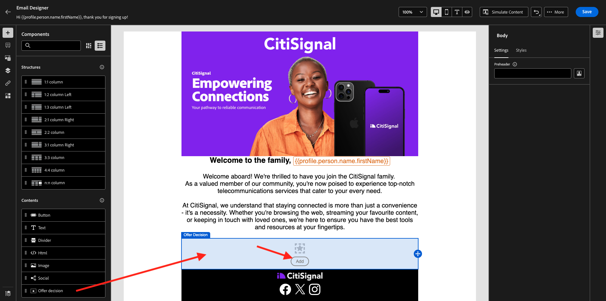
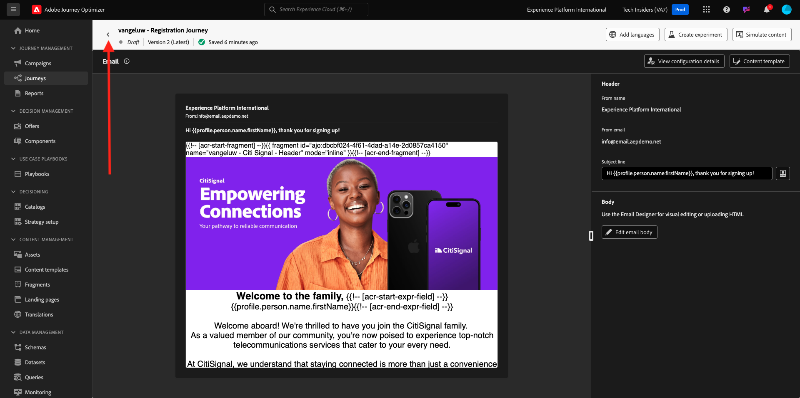
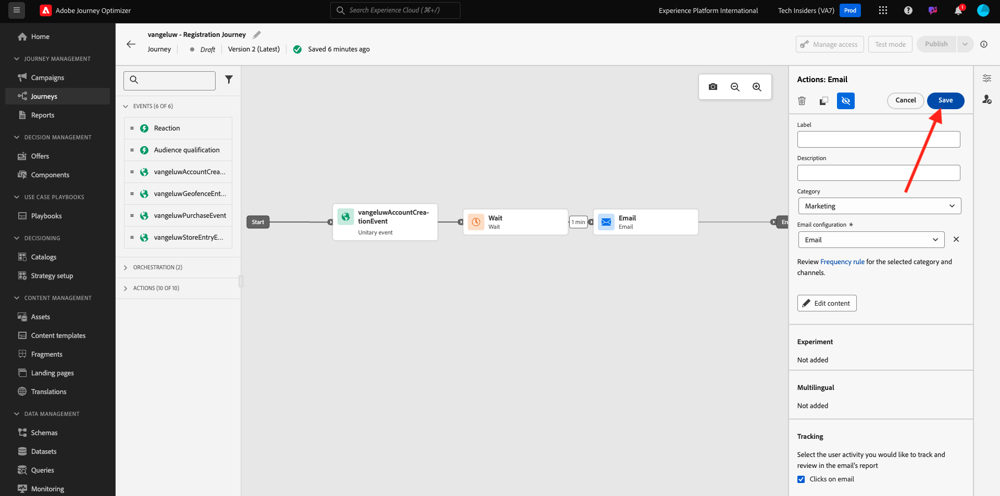

# 3.3.5 Usar su decisión en un correo electrónico

En este ejercicio, utilizará su decisión para personalizar el envío de un correo electrónico y un SMS.

Ir a **Recorridos**. Busque el recorrido que creó en el ejercicio 7.2, que se llama `--aepUserLdap-- - Account Creation Journey`. Haga clic en el recorrido para abrirlo.

Entonces verá esto... Haga clic en **Crear una nueva versión**.

Haga clic en **Crear una nueva versión**.

Haga clic en la acción **Correo electrónico** y, a continuación, haga clic en **Editar contenido**.

A continuación, verá el panel de mensajes. Haga clic en **Enviar correo electrónico a Designer**.

Entonces verá esto...

Entonces verá esto... Arrastre un nuevo componente de estructura **1:1 column** al lienzo.

En el menú, vaya a **Componentes de contenido**. Seleccione el componente **Offer decision** y arrastre y suelte este componente en el marcador de posición de la oferta de contenido del correo electrónico como se indica. A continuación, haga clic en **Agregar**.

Seleccione el tipo de ubicación que desea incluir en el correo electrónico. En el menú desplegable **Ubicaciones**, seleccione **Correo electrónico - Imagen** y, a continuación, seleccione su decisión `--aepUserLdap-- - Luma Decision`. Haga clic en **Agregar**.

Ahora verá todas las ofertas personalizadas y la oferta de reserva que se visualiza dentro del diseñador de correo electrónico. Haga clic en **Simular contenido** para obtener una vista previa del mensaje de correo electrónico con un perfil de cliente real.

Comience por identificar qué perfil desea utilizar para la vista previa. Seleccione el área de nombres **email** e introduzca la dirección de correo electrónico de un perfil de cliente que haya creado en el sitio web de demostración. A continuación, haga clic en **Vista previa**.

Una vez que el correo electrónico se haya mostrado y la oferta se muestre correctamente, haga clic en el botón **Cerrar**.

Finalmente, haga clic en **Guardar**.

A continuación, haga clic en la flecha para volver a la pantalla anterior.

Entonces verá esto... Haga clic en la flecha de la esquina superior izquierda para volver al recorrido.

Haga clic en **Aceptar** para cerrar la acción **Enviar correo electrónico**.

Haga clic en **Publish** para publicar el recorrido actualizado.

Confirme haciendo clic de nuevo en **Publish**.

El mensaje se ha publicado.

Al crear una nueva cuenta en el sitio web de demostración, ahora recibe este correo electrónico:

Ha terminado este ejercicio.

Paso siguiente: [3.3.6 Pruebe su decisión con la API](./ex6.md)

[Volver al módulo 3.3](./offer-decisioning.md)

[Volver a todos los módulos](./../../../overview.md)
