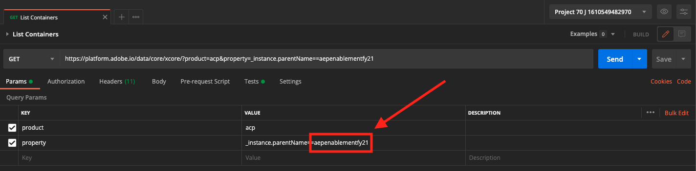
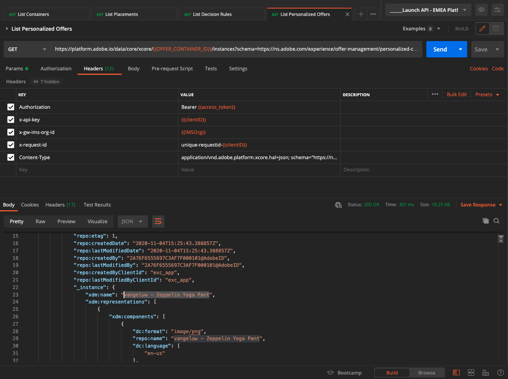
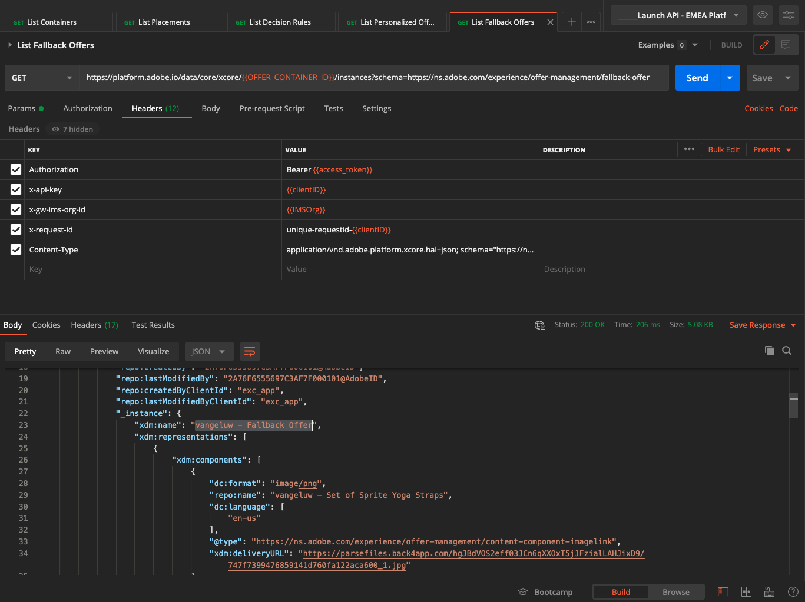
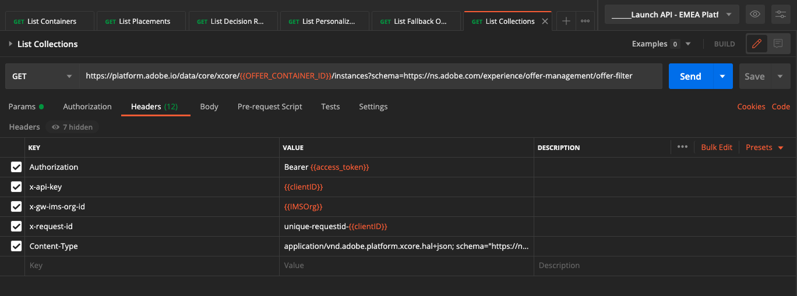
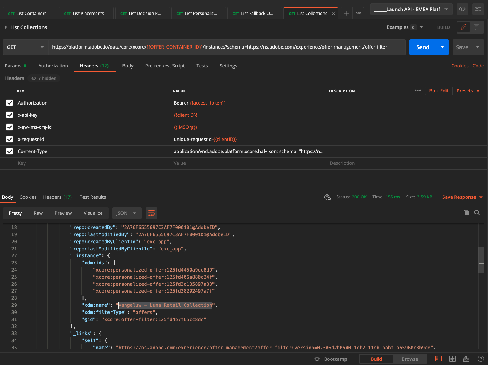

# 3.3.6 Pruebe su decisión mediante la API

## 3.3.6.1 Trabajo con la API de Offer decisioning mediante Postman

Descargue [esta colección de Postman para Offer Decisioning](./../../../assets/postman/postman_offer-decisioning.zip) en su equipo de escritorio y descomprímala. A continuación, tendrá esto:

Ahora tiene este archivo en el escritorio:

- [!UICONTROL _Module 14- Decisioning Service.postman_collection.json]

En [Ejercicio 2.1.3 - Autenticación Postman en el Adobe I/O](./../../../modules/rtcdp-b2c/module2.1/ex3.md) instaló Postman. Tendrá que volver a utilizar Postman para este ejercicio.

Abra Postman. Haga clic en **[!UICONTROL Importar]**.

Haz clic en **[!UICONTROL Cargar archivos]**.

Seleccione el archivo **[!UICONTROL _Module 14- Decisioning Service.postman_collection.json]** y haga clic en **[!UICONTROL Abrir]**.

A continuación, tendrá esta colección disponible en Postman.

Ahora tiene todo lo que necesita en Postman para empezar a interactuar con Adobe Experience Platform a través de las API.

### 3.3.6.1.1 Contenedores de lista

Haga clic para abrir la solicitud **[!UICONTROL GET - Enumerar contenedores]**.

En **[!UICONTROL Parámetros]**, verá esto:

- propiedad: `_instance.parentName==aepenablementfy22`

En ese parámetro, **[!UICONTROL aepenablementfy22]** es el nombre de la zona protegida que se usa en Adobe Experience Platform. La zona protegida que debe usar es `--aepSandboxName--`. Reemplazar el texto **[!UICONTROL aepenablementfy22]** por `--aepSandboxName--`.

Después de reemplazar el nombre de la zona protegida, haga clic en **[!UICONTROL Enviar]**.

Esta es la respuesta, que muestra el contenedor de ofertas para la zona protegida que ha especificado. Copie el **[!UICONTROL contenedor instanceId]** como se indica a continuación y anótelo en un archivo de texto en su equipo. ¡Tendrá que usar este **[!UICONTROL contenedor instanceId]** para el próximo ejercicio!

### 3.3.6.1.2 Enumerar ubicaciones

Haga clic para abrir la solicitud **[!UICONTROL GET - Enumerar ubicaciones]**. Haga clic en **[!UICONTROL Enviar]**.

Ahora está viendo todas las ubicaciones disponibles en el contenedor de ofertas. Las ubicaciones que está viendo se definieron en la interfaz de usuario de Adobe Experience Platform, como puede ver en [Ejercicio 3.3.1.3](./ex1.md).

### 3.3.6.1.3 Reglas de decisión de lista

Haga clic para abrir la solicitud **[!UICONTROL GET - Enumerar reglas de decisión]**. Haga clic en **[!UICONTROL Enviar]**.

En la respuesta, verá las reglas de decisión que definió en la interfaz de usuario de Adobe Experience Platform, como puede ver en [Ejercicio 3.3.1.4](./ex1.md).

### 3.3.6.1.4 Enumerar ofertas personalizadas

Haga clic para abrir la solicitud **[!UICONTROL GET - Enumerar ofertas personalizadas]**. Haga clic en **[!UICONTROL Enviar]**.

En la respuesta, verá las ofertas personalizadas que definió en la interfaz de usuario de Adobe Experience Platform en [Ejercicio 3.3.2.1](./ex2.md).

### 3.3.6.1.5 Enumerar ofertas de reserva

Haga clic para abrir la solicitud **[!UICONTROL GET - Enumerar ofertas de reserva]**. Haga clic en **[!UICONTROL Enviar]**.

En la respuesta, verá la oferta de reserva que definió en la interfaz de usuario de Adobe Experience Platform en [Ejercicio 3.3.2.2](./ex2.md).

### 3.3.6.1.6 Enumerar colecciones

Haga clic para abrir la solicitud **[!UICONTROL GET - Enumerar colecciones]**.

En la respuesta, verá la colección que definió en la interfaz de usuario de Adobe Experience Platform en [Ejercicio 3.3.2.3](./ex2.md).

### 3.3.6.1.7 Obtener ofertas detalladas para el perfil del cliente

Haga clic para abrir la solicitud **[!UICONTROL POST - Obtener ofertas detalladas para el perfil del cliente]**. Esta solicitud es similar a la anterior, pero en realidad devuelve detalles como URL de imagen, texto, etc.

Para esta solicitud, de forma similar al ejercicio anterior, que tiene requisitos similares, debe proporcionar los valores de **[!UICONTROL xdm:placementId]** y **[!UICONTROL xdm:activityId]** para recuperar los detalles específicos de la oferta de un cliente.

Debe rellenarse el campo **[!UICONTROL xdm:activityId]**. Puede recuperarlos en la interfaz de usuario de Adobe Experience Platform, como se indica a continuación.

Debe rellenarse el campo **[!UICONTROL xdm:placementId]**. Puede recuperarlos en la interfaz de usuario de Adobe Experience Platform, como se indica a continuación. En el siguiente ejemplo, puede ver placementId para la ubicación **[!UICONTROL Web - Image]**.

Vaya a **[!UICONTROL Cuerpo]** e introduzca la dirección de correo electrónico del cliente para el que desea solicitar una oferta. Haga clic en **[!UICONTROL Enviar]**.

Finalmente, verá el resultado de qué tipo de oferta personalizada y qué recursos deben mostrarse a este cliente.

Ahora ha completado este ejercicio.

Paso siguiente: [Resumen y beneficios](./summary.md)

[Volver al módulo 3.3](./offer-decisioning.md)

[Volver a todos los módulos](./../../../overview.md)
