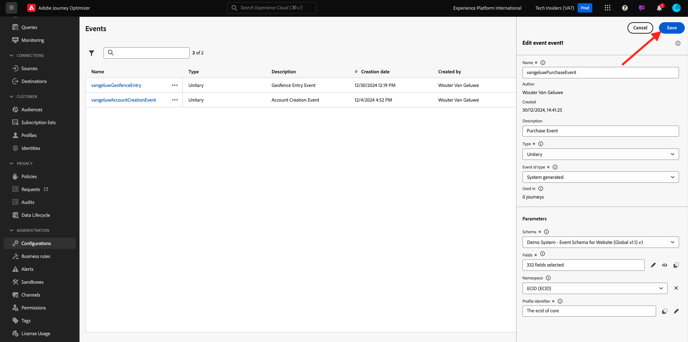
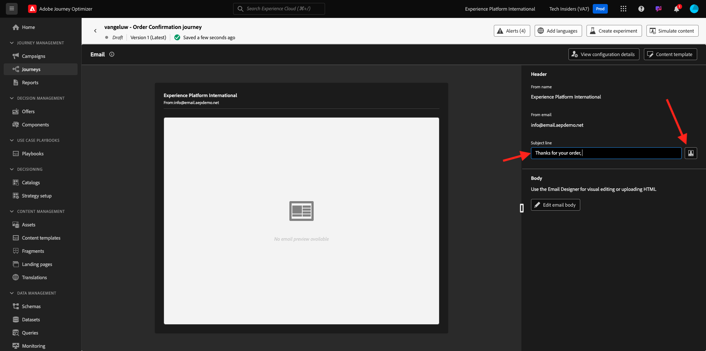
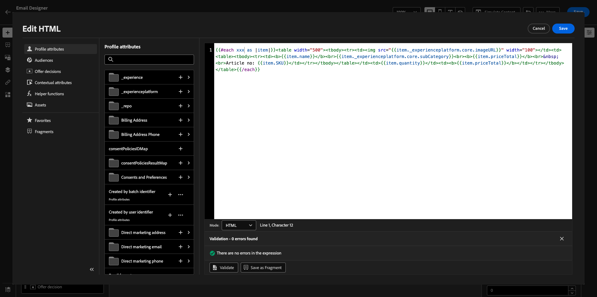
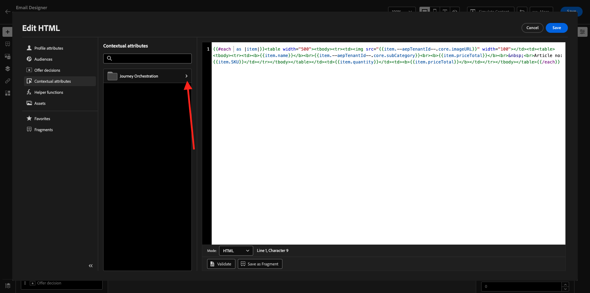
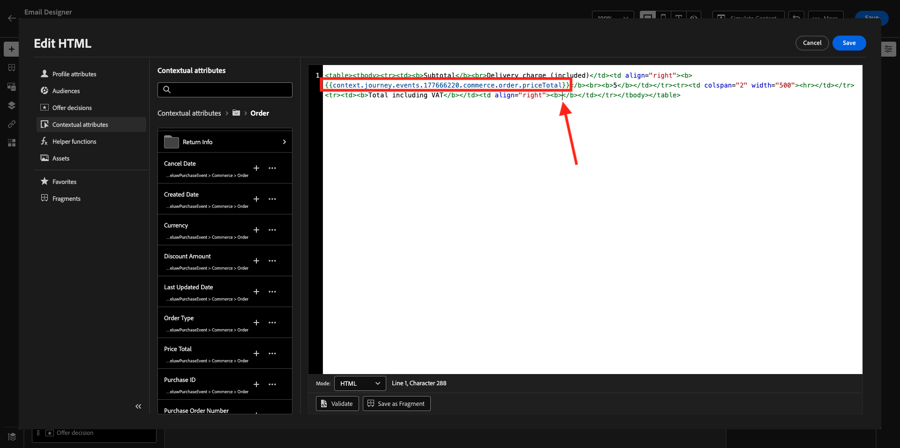
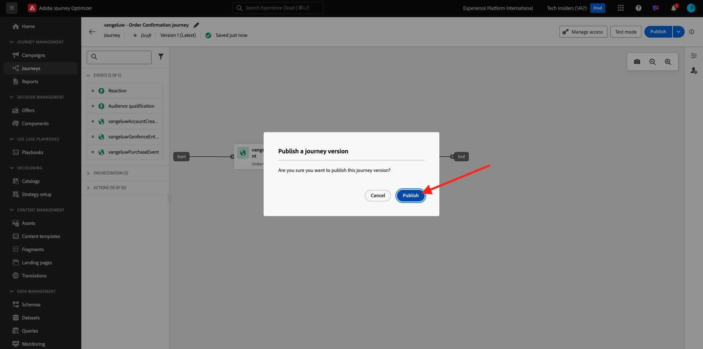
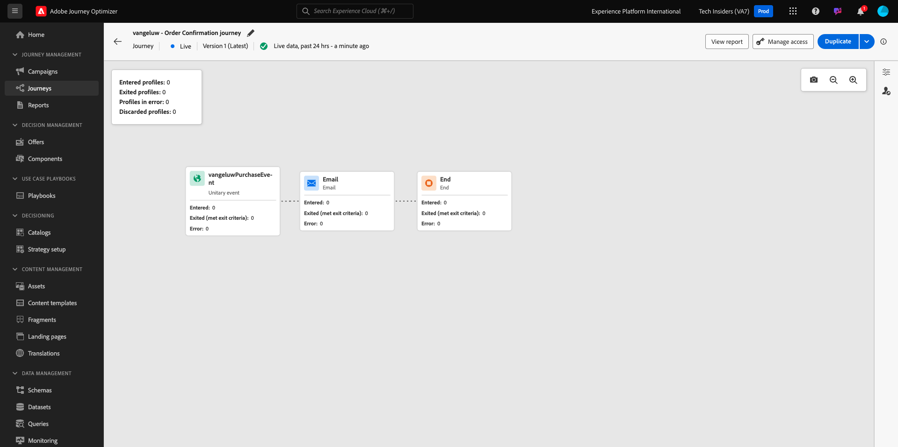
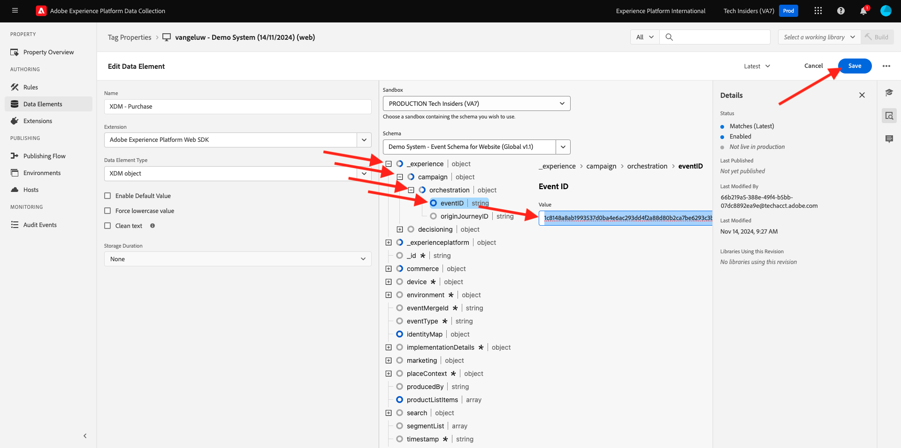

# 3.4.1 Configuración de un recorrido basado en déclencheur: confirmación de pedido

Inicie sesión en Adobe Journey Optimizer en [Adobe Experience Cloud](https://experience.adobe.com). Haga clic en **Journey Optimizer**.


Se le redirigirá a la vista **Inicio** en Journey Optimizer. Primero, asegúrese de que está usando la zona protegida correcta. La zona protegida que se va a usar se llama `--aepSandboxName--`. Para cambiar de una zona protegida a otra, haga clic en **PRODUCTION Prod (VA7)** y seleccione la zona protegida en la lista. En este ejemplo, la zona protegida se denomina **Habilitación de AEP para el año fiscal 22**. Estará en la vista **Inicio** de su zona protegida `--aepSandboxName--`.


## 3.4.1.1 Creación de un evento

En el menú, ve a **Configuraciones** y haz clic en **Administrar** en **Eventos**.


En la pantalla **Eventos**, verá una vista similar a esta. Haga clic en **Crear evento**.


A continuación, verá una configuración de evento vacía.


En primer lugar, asigne al evento un nombre como este: `--aepUserLdap--PurchaseEvent` y agregue una descripción como esta: `Purchase Event`.


A continuación se muestra la selección **Tipo de evento**. Seleccione **Unitario**.


A continuación se muestra la selección **Tipo de ID de evento**. Seleccionar **sistema generado**


A continuación se muestra la selección Esquema. Se ha preparado un esquema para este ejercicio. Use el esquema `Demo System - Event Schema for Website (Global v1.1) v.1`.


Después de seleccionar el esquema, verá una serie de campos seleccionados en la sección **Carga útil**. Haga clic en el icono **Editar/Lápiz** para agregar campos adicionales a este evento.


Entonces verá esta ventana emergente. Ahora debe marcar casillas de verificación adicionales para acceder a datos adicionales cuando se active este evento.


En primer lugar, marque la casilla en la línea `--aepTenantId--`.


A continuación, desplácese hacia abajo y marque la casilla de verificación en la línea `productListItems`.


A continuación, desplácese hacia abajo y marque la casilla de verificación en la línea `commerce`.


A continuación, haga clic en **Aceptar**.

Luego verá que se han agregado campos adicionales al evento. Haga clic en **Guardar**.



El nuevo evento se comparte y ahora verá el evento en la lista de eventos disponibles.

Vuelve a hacer clic en el evento para abrir de nuevo la pantalla **Editar evento**.
Pase el ratón sobre el campo **Carga útil** de nuevo para ver los 3 iconos. Haz clic en el icono **Ver carga**.


Ahora verá un ejemplo de la carga útil esperada. El evento tiene un identificador de evento de orquestación único, que puede encontrar desplazándose hacia abajo en esa carga hasta que vea `_experience.campaign.orchestration.eventID`.


El ID de evento es lo que debe enviarse a Adobe Journey Optimizer para almacenar en déclencheur el recorrido que va a generar en el siguiente paso. Anote este eventID, ya que lo necesitará en uno de los pasos siguientes.
`"eventID": "ef6dd943c94fe1b4763c098ccd1772344662f2a9f614513106cb5ada8be36857"`

Haga clic en **Aceptar**, seguido de **Cancelar**.

El evento está ahora configurado y listo para utilizarse.

## 3.4.1.2 Crear el recorrido

En el menú, ve a **Recorridos** y haz clic en **Crear Recorrido**.


Entonces verá esto... Dé un nombre a su recorrido. Usar `--aepUserLdap-- - Order Confirmation journey`. Haga clic en **Aceptar**.


En primer lugar, debe agregar el evento como punto de partida del recorrido. Busque el evento `--aepUserLdap--PurchaseEvent`, arrástrelo y suéltelo en el lienzo. Haga clic en **Aceptar**.


A continuación, en **Acciones**, busque la acción **Correo electrónico** y agréguela al lienzo.


Defina **Category** en **Marketing** y seleccione una superficie de correo electrónico que le permita enviar correo electrónico. En este caso, la superficie de correo electrónico que se va a seleccionar es **Correo electrónico**. Asegúrese de que las casillas de verificación de **Clics en el correo electrónico** y **aperturas del correo electrónico** estén habilitadas.


El siguiente paso es crear el mensaje. Para ello, haga clic en **Editar contenido**.


Ahora puede ver esto. Haga clic en el campo de texto **Línea de asunto**.


En el área de texto empiece a escribir **Gracias por su pedido,**



La línea de asunto aún no ha finalizado. A continuación, debe traer el token de personalización para el campo **Nombre** que se almacena en `profile.person.name.firstName`. En el menú de la izquierda, desplácese hacia abajo para encontrar el campo **Persona** > **Nombre completo** > **Nombre** y haga clic en el icono **+** para agregar el token de personalización a la línea de asunto. Haga clic en **Guardar**.


Entonces volverás a estar aquí. Haga clic en **Enviar correo electrónico a Designer** para crear el contenido del correo electrónico.


En la siguiente pantalla, haz clic en **Diseñar desde cero**.


En el menú de la izquierda, encontrará los componentes de estructura que puede utilizar para definir la estructura del correo electrónico (filas y columnas).

Arrastrar y soltar 8 veces una columna **1:1** en el lienzo, lo que debería proporcionarle lo siguiente:


Vaya a **Componentes de contenido**.


Arrastre y suelte un componente **Image** en la primera fila. Haga clic en **Examinar**.


Vaya a la carpeta **enablement-assets**, seleccione el archivo **luma-logo.png** y haga clic en **Seleccionar**.


Ahora estás de vuelta aquí. Haga clic en la imagen para seleccionarla y, a continuación, utilice el control deslizante **Size** para reducir un poco el tamaño de la imagen del logotipo.


Vaya a **Componentes de contenido** y arrastre y suelte un componente **Imagen** en la segunda fila. Seleccione el **componente de imagen**, pero NO haga clic en Examinar.


Pegue esta URL de imagen en el campo **Source**: `https://parsefiles.back4app.com/hgJBdVOS2eff03JCn6qXXOxT5jJFzialLAHJixD9/29043bedcde632a9cbe8a02a164189c9_preparing.png`. Esta imagen está alojada fuera del Adobe.


Cuando cambie el ámbito a otro campo, se renderiza la imagen y verá esto:


A continuación, vaya a **Componentes de contenido** y arrastre y suelte un componente **Texto** en la tercera fila.


Seleccione el texto predeterminado en ese componente **Escriba el texto aquí.** y reemplácelo por el siguiente texto:

```javascript
You’re one step closer!

Hi 

We've received your order details!

We will also send you a separate email containing your VAT Invoice.

We'll be back in touch with you as soon as we've finished packing your package. Please read carefully the Order Information detailed below.
```


Coloque el cursor junto al texto **Hi** y haga clic en **Agregar Personalization**.


Vaya al campo **Persona** > **Nombre completo** > **Nombre** y haga clic en el icono **+** para agregar el token de personalización a la línea de asunto. Haga clic en **Guardar**.


A continuación, verá esto:


A continuación, vaya a **Componentes de contenido** y arrastre y suelte un componente **Texto** en la cuarta fila.


Seleccione el texto predeterminado en ese componente **Escriba el texto aquí.** y reemplácelo por el siguiente texto:

`Order Information`

Cambie el tamaño de la fuente a **26px** y centre el texto en esta celda. A continuación, tendrá esto:


A continuación, vaya a **Componentes de contenido** y arrastre y suelte un componente **HTML** en la quinta fila. Haga clic en el componente HTML y, a continuación, en **Mostrar el código fuente**.


En la ventana emergente **Editar HTML**, pegue este HTML:

```<table><tbody><tr><td><b>Items purchased</b></td><td></td><td><b>Quantity</b></td><td><b>Subtotal</b></td></tr><tr><td colspan="4" width="500"><hr></td></tr></tbody></table>```

Haga clic en **Guardar**.


Entonces, tendrás esto. Haga clic en **Guardar** para guardar el progreso.


Vaya a **Componentes de contenido** y arrastre y suelte un componente **HTML** en la sexta fila. Haga clic en el componente HTML y, a continuación, en **Mostrar el código fuente**.


En la ventana emergente **Editar HTML**, pegue este HTML:

```{{#each xxx as |item|}}<table width="500"><tbody><tr><td></td><td><table><tbody><tr><td><b>{{item.name}}</b><br>{{item.--aepTenantId--.core.subCategory}}<br><b>{{item.priceTotal}}</b><br>&nbsp;<br>Article no: {{item.SKU}}</td></tr></tbody></table></td><td>{{item.quantity}}</td><td><b>{{item.priceTotal}}</b></td></tr></tbody></table>{{/each}}```

A continuación, tendrá esto:



Ahora tiene que reemplazar **xxx** por una referencia al objeto productListItems que forma parte del evento que almacena en déclencheur el recorrido.


Primero, elimine **xxx** en el código de HTML.


En el menú de la izquierda, haga clic en **Atributos contextuales**. Este contexto se pasa al mensaje desde el recorrido.


Entonces verá esto... Haga clic en la flecha situada junto a **Journey Orchestration** para explorar en profundidad.



Haga clic en la flecha situada junto a **Eventos** para explorar en profundidad.


Haga clic en la flecha situada junto a `--aepUserLdap--PurchaseEvent` para explorar en profundidad.


Haga clic en la flecha situada junto a **productListItems** para explorar en profundidad.


Haga clic en el icono **+** junto a **Nombre** para agregarlo al lienzo. Entonces, tendrás esto. Ahora necesita seleccionar **.nombre** como se indica en la siguiente captura de pantalla, y luego debe eliminar **.nombre**.


Entonces, tendrás esto. Haga clic en **Guardar**.


Ahora volverá a la Designer de correo electrónico. Haga clic en **Guardar** para guardar el progreso.


A continuación, vaya a **Componentes de contenido** y arrastre y suelte un componente **HTML** en la séptima fila. Haga clic en el componente HTML y, a continuación, en **Mostrar el código fuente**.


En la ventana emergente **Editar HTML**, pegue este HTML:

```<table><tbody><tr><td><b>Subtotal</b><br>Delivery charge (included)</td><td align="right"><b>xxx</b><br><b>5</b></td></tr><tr><td colspan="2" width="500"><hr></td></tr><tr><td><b>Total including VAT</b></td><td align="right"><b>xxx</b></td></tr></tbody></table>```

Hay 2 referencias de **xxx** en este código de HTML. Ahora tiene que reemplazar cada **xxx** por una referencia al objeto productListItems que forma parte del evento que almacena en déclencheur el recorrido.


Primero, elimine el primer **xxx** de su código de HTML.


En el menú de la izquierda, haga clic en **Atributos contextuales**.


Haga clic en la flecha situada junto a **Journey Orchestration** para explorar en profundidad.


Haga clic en la flecha situada junto a **Eventos** para explorar en profundidad.


Haga clic en la flecha situada junto a `--aepUserLdap--PurchaseEvent` para explorar en profundidad.


Haga clic en la flecha situada junto a **Commerce** para explorar en profundidad.


Haga clic en la flecha situada junto a **Pedido** para explorar en profundidad.


Haga clic en el icono **+** junto a **Precio total** para agregarlo al lienzo.


Entonces, tendrás esto. Ahora elimina el segundo **xxx** de tu código de HTML.



Vuelva a hacer clic en el icono **+** junto a **Precio total** para agregarlo al lienzo.


También puede agregar el campo **Currency** desde el objeto **Order** al lienzo, como puede ver aquí.
Cuando hayas terminado, haz clic en **Guardar** para guardar los cambios.


A continuación, volverá a la Designer de correo electrónico. Vuelva a hacer clic en **Guardar**.


Vuelva al panel de mensajes haciendo clic en la **flecha** junto al texto de la línea de asunto en la esquina superior izquierda.


Haga clic en la flecha de la esquina superior izquierda para volver al recorrido.


Haz clic en **Aceptar** para cerrar la acción de correo electrónico.


Haga clic en **Publish** para publicar el recorrido.


Vuelva a hacer clic en **Publish**.



El recorrido se ha publicado.



## 3.4.1.5 Actualizar la propiedad de cliente de recopilación de datos de Adobe Experience Platform

Vaya a [Recopilación de datos de Adobe Experience Platform](https://experience.adobe.com/launch/) y seleccione **Etiquetas**.

Esta es la página de Propiedades de recopilación de datos de Adobe Experience Platform que vio antes.


En el módulo 0, Demo System creó dos propiedades de cliente para usted: una para el sitio web y otra para la aplicación móvil. Encuéntralos buscando `--aepUserLdap--` en el cuadro **[!UICONTROL Buscar]**. Haga clic para abrir la propiedad **Web**.


Vaya a **Elementos de datos**. Busque y abra el elemento de datos **XDM - Purchase**.


Entonces verá esto... Vaya al campo **_experience.campaign.orchestration.eventID** y rellene su eventID aquí. El eventID que se va a rellenar aquí es el eventID que ha creado como parte del ejercicio 10.1.2. Haga clic en **Guardar** o en **Guardar en biblioteca**.



Guarde los cambios en la propiedad de cliente y, a continuación, publique los cambios actualizando la biblioteca de desarrollo.


Los cambios se han implementado y se pueden probar.

## 3.4.1.6 Pruebe el correo electrónico de confirmación de pedido en el sitio web de demostración

Probemos el recorrido actualizado comprando un producto en el sitio web de demostración.

Vaya a [https://builder.adobedemo.com/projects](https://builder.adobedemo.com/projects). Después de iniciar sesión con su Adobe ID, verá esto. Haga clic en el proyecto del sitio web para abrirlo.


En la página **Screens**, haga clic en **Ejecutar**.


A continuación, verá cómo se abre el sitio web de demostración. Seleccione la URL y cópiela en el portapapeles.


Abra una nueva ventana del explorador de incógnito.


Pegue la dirección URL del sitio web de demostración, que copió en el paso anterior. Luego se le pedirá que inicie sesión con su Adobe ID.


Seleccione el tipo de cuenta y complete el proceso de inicio de sesión.


Luego verá el sitio web cargado en una ventana de incógnito del explorador. Para cada demostración, deberá utilizar una ventana nueva del explorador de incógnito para cargar la URL del sitio web de demostración.


Haga clic en el Adobe del logotipo situado en la esquina superior izquierda de la pantalla para abrir el Visor de perfiles.


Eche un vistazo al panel Visor de perfiles y al Perfil del cliente en tiempo real con el **ID de Experience Cloud** como identificador principal de este cliente actualmente desconocido.


Vaya a la página Registrar/Iniciar sesión. Haga clic en **CREAR UNA CUENTA**.


Complete sus detalles y haga clic en **Registrarse** después de lo cual se le redirigirá a la página anterior.


Agregue cualquier producto al carro de compras y vaya a la página **Carro de compras**. Haga clic en **Continuar con el cierre de compra**.


A continuación, compruebe los campos en la página de cierre de compra y haga clic en **Cierre de compra**.


Recibirá el correo electrónico de confirmación del pedido en cuestión de segundos.


Ha terminado este ejercicio.

Siguiente paso: [3.4.2 Configuración de un recorrido de boletín basado en lotes](./ex2.md)

[Volver al módulo 3.4](./journeyoptimizer.md)

[Volver a todos los módulos](../../../overview.md)
