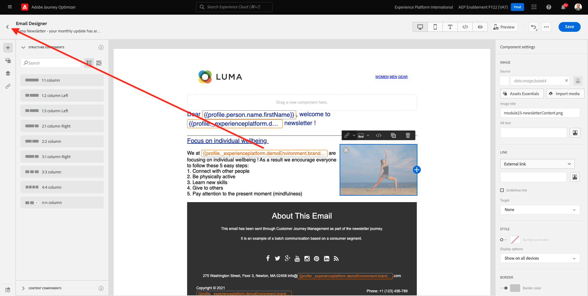

# 3.4.2 Configuración de un recorrido de newsletter basado en lotes

Inicie sesión en Adobe Journey Optimizer en [Adobe Experience Cloud](https://experience.adobe.com). Haga clic en **Journey Optimizer**.

Se le redirigirá a la vista **Inicio** en Journey Optimizer. Primero, asegúrese de que está usando la zona protegida correcta. La zona protegida que se va a usar se llama `--aepSandboxName--`. Para cambiar de una zona protegida a otra, haga clic en **PRODUCTION Prod (VA7)** y seleccione la zona protegida en la lista. En este ejemplo, la zona protegida se denomina **Habilitación de AEP para el año fiscal 22**. Estará en la vista **Inicio** de su zona protegida `--aepSandboxName--`.

## 3.4.2.1 Crear recorrido de la newsletter

Ahora creará un recorrido basado en lotes. A diferencia del recorrido basado en eventos del ejercicio anterior, que se basa en los eventos de experiencia entrantes o en las entradas o salidas de audiencia para almacenar en déclencheur un recorrido para un cliente específico, los recorridos basados en lotes se dirigen a una audiencia completa una vez con contenido único como boletines informativos, promociones únicas o información genérica, o periódicamente con contenido similar enviado de forma regular como, por ejemplo, campañas de cumpleaños y recordatorios.

En el menú, ve a **Recorridos** y haz clic en **Crear Recorrido**.

A la derecha verá un formulario en el que debe especificar el nombre y la descripción del recorrido. Introduzca los siguientes valores:

- **Nombre**: `--aepUserLdap-- - Newsletter Journey`. Por ejemplo: **vangeluw - Recorrido de la newsletter**.
- **Descripción**: Boletín mensual

Haga clic en **Ok**.

En **Orquestación**, arrastre y suelte **Leer audiencia** en el lienzo. Esto significa que, una vez publicado, el recorrido comenzará recuperando toda la audiencia, que luego se convertirá en la audiencia objetivo del recorrido y el mensaje. Haga clic en **Seleccionar una audiencia**.

En la ventana emergente **Elija una audiencia**, busque su ldap y seleccione la audiencia que creó en [Módulo 2.3 - CDP en tiempo real - Cree una audiencia y tome medidas](./../../../modules/rtcdp-b2c/module2.3/real-time-cdp-build-a-segment-take-action.md) con el nombre `--aepUserLdap-- - Interest in Galaxy S24`. Haga clic en **Guardar**.

Haga clic en **Ok**.

En el menú de la izquierda, busca la sección **Acciones** y arrastra y suelta una acción **Correo electrónico** en el lienzo.

Defina **Category** en **Marketing** y seleccione una superficie de correo electrónico que le permita enviar correo electrónico. En este caso, la superficie de correo electrónico que se va a seleccionar es **Correo electrónico**. Asegúrese de que las casillas de verificación de **Clics en el correo electrónico** y **aperturas del correo electrónico** estén habilitadas.

El siguiente paso es crear el mensaje. Para ello, haga clic en **Editar contenido**.

Ahora puede ver esto. Haga clic en el campo de texto **Línea de asunto**.

Escriba este texto para la línea de asunto: `Luma Newsletter - your monthly update has arrived.`. Haga clic en **Guardar**.

Entonces volverás a estar aquí. Haga clic en **Enviar correo electrónico a Designer** para empezar a crear el contenido del correo electrónico.

Entonces verá esto... Haga clic en **Importar HTML**.

En la pantalla emergente, tendrá que arrastrar y soltar el archivo del HTML del correo electrónico. Puede encontrar la plantilla de HTML [aquí](./../../../assets/html/ajo-newsletter.html.zip). Descargue el archivo zip con la plantilla del HTML en el equipo local y descomprima en el equipo de escritorio.

Arrastre y suelte el archivo **ajo-newsletter.html** para cargarlo en Journey Optimizer. Haga clic en **Importar**.

Este contenido de correo electrónico está listo para funcionar, ya que tiene toda la personalización, las imágenes y el texto esperados. Solo se deja vacío el marcador de posición de la oferta.

Podría recibir un mensaje de error: **Error al intentar recuperar los recursos**. Esto está vinculado a la imagen del correo electrónico.

Si aparece este error, seleccione la imagen y haga clic en el botón **Editar imagen**.

Haga clic en **Assets Essentials** para volver a la biblioteca de AEM Assets Essentials.

Entonces verá esta ventana emergente. Vaya a la carpeta **enablement-assets** y seleccione la imagen **luma-newsletterContent.png**. Haga clic en **Seleccionar**.

El correo electrónico básico de la newsletter ya está listo. Haga clic en **Guardar**.

Vuelva al panel de mensajes haciendo clic en la **flecha** junto al texto de la línea de asunto en la esquina superior izquierda.

Haga clic en la flecha de la esquina superior izquierda para volver al recorrido.

Haz clic en **Aceptar** para cerrar la acción de correo electrónico.

El recorrido de la newsletter ya está listo para publicarse. Antes de hacerlo, observe la sección **Programar**, donde puede cambiar este recorrido de una campaña única a una recurrente. Haga clic en el botón **Programar**.

Entonces verá esto... Seleccionar **Una Vez**.

Seleccione una fecha y una hora dentro de la hora siguiente para poder probar el recorrido. Haga clic en **Ok**.

>[!NOTE]
>
>La fecha y la hora de envío del mensaje deben ser dentro de más de una hora.

Haga clic en **Publish**.

Vuelva a hacer clic en **Publish**.

El recorrido básico de la newsletter ya está publicado. El mensaje de correo electrónico de la newsletter se enviará según lo definido en la programación y el recorrido se detendrá en cuanto se envíe el último correo electrónico.

Ha terminado este ejercicio.

Paso siguiente: [3.4.3 Aplicar personalización en un mensaje de correo electrónico](./ex3.md)

[Volver al módulo 3.4](./journeyoptimizer.md)

[Volver a todos los módulos](../../../overview.md)
