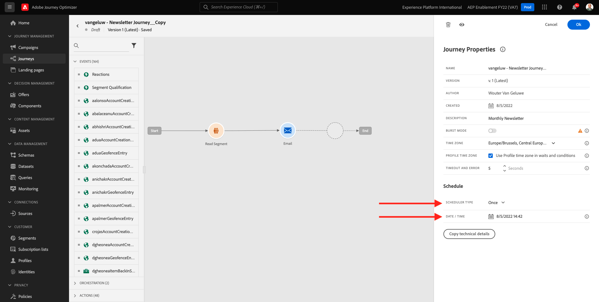

# 3.4.3 Aplicar la personalización en un mensaje de correo electrónico

Inicie sesión en Adobe Experience Cloud en [Adobe Experience Cloud](https://experience.adobe.com). Haga clic en **Adobe Journey Optimizer**.

Se le redirigirá a la vista **Inicio** en Journey Optimizer. Antes de continuar, debe seleccionar una **zona protegida**. La zona protegida que se va a seleccionar se denomina ``--aepTenantId--``. Para ello, haga clic en el texto **[!UICONTROL Producción]** en la línea azul de la parte superior de la pantalla.

## 3.4.3.1 Personalización basada en segmentos

En este ejercicio mejorará el mensaje de correo electrónico de la newsletter con un texto personalizado basado en el abono a segmentos.

Ir a **Recorridos**. Busque el recorrido de la newsletter que ha creado en el ejercicio anterior. Busque `--aepUserLdap-- - Newsletter`. Haga clic en el recorrido para abrirlo.

Entonces verá esto... Haga clic en **Duplicate**.

Haga clic en **Duplicate**.

Seleccione su acción **Correo electrónico** y haga clic en **Editar contenido**.

Haga clic en **Enviar correo electrónico a Designer**.

Entonces verá esto...

Abra **Componentes de contenido** y arrastre un componente **Texto** debajo del contenido de la newsletter actual.

Seleccione todo el texto predeterminado y elimínelo. A continuación, haga clic en el botón **Agregar personalización** de la barra de herramientas.

A continuación, verá esto:

En el menú de la izquierda, haga clic en **Pertenencias a segmentos**.

>[!NOTE]
>
>Si no encuentra el segmento en esta lista, desplácese un poco hacia abajo para obtener instrucciones sobre cómo recuperar el ID de segmento manualmente.

Seleccione el segmento `Luma - Women's Category Interest` y haga clic en el icono **+**, que debería tener este aspecto:

A continuación, debe dejar la primera línea tal cual, y sustituir las líneas 2 y 3 por este código:

``
    Psssst... a private sale in the women category will launch soon, we will keep you posted

    Thanks for taking the time to read our newsletter. Here is a 10% promo code to use on the website: READER10

``

A continuación, tendrá esto:

Haga clic en **Validar** para asegurarse de que el código sea correcto. Haga clic en **Guardar**.

Ahora puedes guardar este mensaje haciendo clic en el botón **Guardar** en la esquina superior derecha. A continuación, haga clic en **Simular contenido**.

Seleccione uno de los perfiles que creó como parte de este tutorial y haga clic en **Vista previa**. A continuación, verá el resultado de la configuración.

Entonces verá esto... A continuación, haga clic en **Cerrar**.

Vuelva al panel de mensajes haciendo clic en la **flecha** junto al texto de la línea de asunto en la esquina superior izquierda.

Haga clic en la flecha de la esquina superior izquierda para volver al recorrido.

Haz clic en **Aceptar** para cerrar la acción de correo electrónico.

Cambia tu **horario** a **Una vez** y define una **fecha/hora**. Haga clic en **Ok**.

>[!NOTE]
>
>La fecha y la hora de envío del mensaje deben ser dentro de más de una hora.

Haz clic en el botón **Publish** del recorrido.

En la ventana emergente, vuelve a hacer clic en **Publish**.

El recorrido básico de la newsletter ya está publicado. El mensaje de correo electrónico de la newsletter se enviará en función de su programación y el recorrido se detendrá en cuanto se haya enviado el último correo electrónico.

Ha terminado este ejercicio.

Siguiente paso: [3.4.4 Configuración y uso de notificaciones push para iOS](./ex4.md)

[Volver al módulo 3.4](./journeyoptimizer.md)

[Volver a todos los módulos](../../../overview.md)
