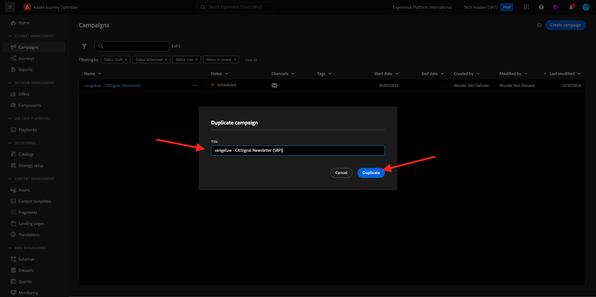

# 3.4.3 Aplicar la personalización basada en segmentos en un mensaje de correo electrónico

Inicie sesión en Adobe Experience Cloud en [Adobe Experience Cloud](https://experience.adobe.com). Haga clic en **Adobe Journey Optimizer**.

Se le redirigirá a la vista **Inicio** en Journey Optimizer. Antes de continuar, debe seleccionar una **zona protegida**. La zona protegida que se va a seleccionar se denomina ``--aepTenantId--``.

## 3.4.3.1 Personalización basada en segmentos

En este ejercicio mejorará el mensaje de correo electrónico de la newsletter que creó en el ejercicio anterior con un texto personalizado basado en el abono a segmentos.

Ir a **Campañas**. Busque el recorrido de la newsletter que ha creado en el ejercicio anterior. Busque `--aepUserLdap-- - CitiSignal Newsletter`. Haga clic con el botón derecho en los 3 puntos **...** y haga clic en **Duplicar**.

Entonces verá esto... Use esto para **Title**: `--aepUserLdap-- - CitiSignal Newsletter (SBP)`. Haga clic en **Duplicate**.

Haga clic en la campaña duplicada para abrirla.

Haga clic en **Editar** para cambiar el contenido.

Haga clic en **Editar cuerpo del correo electrónico**.

Entonces verá esto...

Abra **Componentes de contenido** y arrastre una columna **1:1** sobre la oferta de AirPods.

Arrastre y suelte un componente **Text** en esa columna 1:1.

Seleccione todo el texto predeterminado y elimínelo. A continuación, haga clic en el botón **Agregar personalización** de la barra de herramientas.

Entonces verá esto... En el menú de la izquierda, haga clic en **Audiencias**.

Seleccione el segmento `--aepUserLdap-- - Interest in Plans` y haga clic en el icono **+** para agregarlo al lienzo.

A continuación, debe dejar la primera línea tal cual, y sustituir las líneas 2 y 3 por este código:

``
    PS: It may be a good idea to check if your plan still meets your needs! Click here to be contacted by one of our experts!

    PS: Thanks for taking the time to read our newsletter. Here is a 10% promo code to use on the website: NEWSLETTER10

``

Entonces, tendrás esto. Haga clic en **Guardar**.

Cambie la alineación del texto a **Alineación central**.

Ahora puedes guardar este mensaje haciendo clic en el botón **Guardar** en la esquina superior derecha. A continuación, haga clic en **flecha** junto al texto de la línea de asunto, en la esquina superior izquierda.

Haga clic en **Revisar para activar**.

Haga clic en **Activar**.

Ya se ha publicado su newsletter con personalización basada en segmentos. El mensaje de correo electrónico de la newsletter se enviará en función de su programación y el recorrido se detendrá en cuanto se haya enviado el último correo electrónico.

Si cumple los requisitos para el segmento utilizado, verá esto en el correo electrónico que recibirá:

Ha terminado este ejercicio.

Siguiente paso: [3.4.4 Configuración y uso de notificaciones push para iOS](./ex4.md)

[Volver al módulo 3.4](./journeyoptimizer.md)

[Volver a todos los módulos](../../../overview.md)
