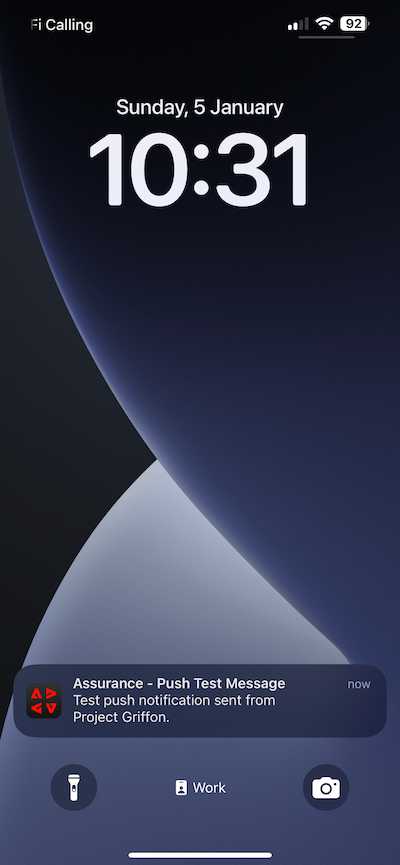

# 3.4.4 Configuración y uso de notificaciones push para iOS

Para utilizar las notificaciones push con Adobe Journey Optimizer, hay que comprobar y conocer varias opciones de configuración.

Estos son todos los ajustes que se deben verificar:

- Conjuntos de datos y esquemas en Adobe Experience Platform
- Flujo de datos para dispositivos móviles
- Propiedad de recopilación de datos para dispositivos móviles
- Superficie de aplicación para certificados push
- Prueba de la configuración push con AEP Assurance

Revisemos estos uno por uno.

Inicie sesión en Adobe Journey Optimizer en [Adobe Experience Cloud](https://experience.adobe.com). Haga clic en **Journey Optimizer**.

Se le redirigirá a la vista **Inicio** en Journey Optimizer. Primero, asegúrese de que está usando la zona protegida correcta. La zona protegida que se va a usar se llama `--aepSandboxName--`. Estará en la vista **Inicio** de su zona protegida `--aepSandboxName--`.

## 3.4.4.1 Conjunto de datos push

Adobe Journey Optimizer utiliza conjuntos de datos para almacenar elementos como los tokens push de dispositivos móviles o las interacciones con mensajes push (como: mensaje enviado, mensaje abierto, etc.) en un conjunto de datos en Adobe Journey Optimizer.

Puede encontrar estos conjuntos de datos en **[!UICONTROL Conjuntos de datos]** en el menú de la izquierda de la pantalla. Para mostrar conjuntos de datos del sistema, haga clic en el icono de filtro.

Habilite la opción **Mostrar conjuntos de datos del sistema** y busque **AJO**. A continuación, verá los conjuntos de datos utilizados para las notificaciones push.

## 3.4.4.2 Flujo de datos para dispositivos móviles

Vaya a [https://experience.adobe.com/#/data-collection/](https://experience.adobe.com/#/data-collection/).

En el menú de la izquierda, ve a **[!UICONTROL Flujo de datos]** y busca el flujo de datos que creaste en [Introducción](./../../../modules/gettingstarted/gettingstarted/ex2.md), que se llama `--aepUserLdap-- - Demo System Datastream (Mobile)`. Haga clic en para abrirlo.

Haga clic en **Editar** en el servicio **Adobe Experience Platform**.

A continuación, verá la configuración del flujo de datos que se definió y en qué conjuntos de datos se almacenarán los eventos y atributos de perfil.

También debe habilitar las siguientes opciones si aún no están habilitadas:

- **Toma de decisiones sobre ofertas**
- **Destinos de personalización**
- **Adobe Journey Optimizer**

Haga clic en **Guardar**.

## 3.4.4.3 Revisar la propiedad de recopilación de datos para móviles

Vaya a [https://experience.adobe.com/#/data-collection/](https://experience.adobe.com/#/data-collection/). Como parte de [Introducción](./../../../modules/gettingstarted/gettingstarted/ex1.md), se crearon 2 propiedades de recopilación de datos.
Ya ha estado utilizando estas propiedades del cliente de recopilación de datos como parte de módulos anteriores.

Haga clic para abrir la propiedad Recopilación de datos para dispositivos móviles.

En su propiedad de recopilación de datos, vaya a **Extensiones**. A continuación, verá las distintas extensiones necesarias para la aplicación móvil. Haga clic para abrir la extensión **Adobe Experience Platform Edge Network**.

A continuación, verá que el flujo de datos para móviles está vinculado aquí. A continuación, haga clic en **Cancelar** para volver a la descripción general de las extensiones.

Entonces volverás a estar aquí de nuevo. Verá la extensión de **AEP Assurance**. AEP Assurance le ayuda a inspeccionar, probar, simular y validar la forma en que recopila datos o sirve experiencias en su aplicación móvil. Puede leer más sobre AEP Assurance y Project Griffon aquí [https://aep-sdks.gitbook.io/docs/beta/project-griffon](https://aep-sdks.gitbook.io/docs/beta/project-griffon).

A continuación, haga clic en **Configurar** para abrir la extensión **Adobe Journey Optimizer**.

Luego verá que aquí es donde se vincula el conjunto de datos para el seguimiento de eventos push.

No es necesario realizar ningún cambio en la propiedad de recopilación de datos.

## 3.4.4.4 Revisar la configuración de la superficie de la aplicación

Vaya a [https://experience.adobe.com/#/data-collection/](https://experience.adobe.com/#/data-collection/). En el menú de la izquierda, ve a **Superficies de aplicación** y abre la Superficie de aplicación para **APNS de aplicación de demostración DX**.

A continuación, verá la superficie de aplicación configurada para iOS y Android.

## 3.4.4.5 Probar la configuración de notificaciones push mediante AEP Assurance.

Una vez que la aplicación esté instalada, la encontrarás en la pantalla de inicio del dispositivo. Haga clic en el icono para abrir la aplicación.

Cuando uses la aplicación por primera vez, se te pedirá que inicies sesión con tu Adobe ID. Complete el proceso de inicio de sesión.

Después de iniciar sesión, verá una notificación que solicita su permiso para enviar notificaciones. Enviaremos notificaciones como parte del tutorial, así que haz clic en **Permitir**.

A continuación, verá la página principal de la aplicación. Vaya a **Configuración**.

En la configuración, verá que actualmente hay un **Proyecto público** cargado en la aplicación. Haga clic en **Proyecto personalizado**.

Ahora puede cargar un proyecto personalizado. Haga clic en el código QR para cargar fácilmente el proyecto.

Después de pasar por la sección **Introducción**, obtuviste este resultado. Haga clic para abrir el **proyecto de venta minorista móvil** que se creó para usted.

En caso de que hayas cerrado accidentalmente la ventana de tu navegador, o para futuras sesiones de demostración o habilitación, también puedes acceder a tu proyecto de sitio web yendo a [https://dsn.adobe.com/projects](https://dsn.adobe.com/projects). Después de iniciar sesión con su Adobe ID, verá esto. Haga clic en el proyecto de la aplicación móvil para abrirlo.

A continuación, haga clic en **Ejecutar**.

A continuación, verá esta ventana emergente, que contiene un código QR. Escanee este código QR desde la aplicación móvil.

Luego verás el identificador de tu proyecto en la aplicación, después de lo cual podrás hacer clic en **Guardar**.

Ahora, vuelve a **Inicio** en la aplicación. La aplicación ya está lista para utilizarse.

Ahora debe escanear un código QR para conectar su dispositivo móvil a la sesión de AEP Assurance.

Para iniciar una sesión de AEP Assurance, vaya a [https://experience.adobe.com/#/data-collection/](https://experience.adobe.com/#/data-collection/). Haga clic en **Assurance** en el menú de la izquierda. A continuación, haga clic en **Crear sesión**.

Haga clic en **Start**.

Rellene los valores:

- Nombre de sesión: use `--aepUserLdap-- - push debugging` y reemplace ldap por su ldap
- URL básica: usar `dxdemo://default`

Haga clic en **Next**.

Luego verá un código QR en la pantalla, que debe escanear con su dispositivo iOS.

En su dispositivo móvil, abra la aplicación de la cámara y escanee el código QR que muestra AEP Assurance.

A continuación, verá una pantalla emergente en la que se le pedirá que introduzca el código PIN. Copie el código PIN de su pantalla de Assurance de AEP y haga clic en **Conectar**.

Entonces verá esto...

En Assurance, ahora verá que un dispositivo está conectado a la sesión de Assurance. Haga clic en **Finalizado**.

Vaya a **Depuración push**.

>[!NOTE]
>
>Si no encuentra **Push Debug** en el menú de la izquierda, haga clic en **Configurar** en la esquina inferior izquierda de la pantalla y agregue **Push Debug** al menú.

Vas a ver algo como esto.

Alguna explicación:

- La primera columna, **Cliente**, muestra los identificadores disponibles en su dispositivo iOS. Verá un ECID y un token push.
- La segunda columna muestra las **credenciales y configuración de App Store**, que se configuraron como parte del ejercicio **3.4.5.4 Crear configuración de aplicación en Launch**
- La segunda columna muestra información de **Perfil**, con información adicional sobre la plataforma en la que se encuentra el token push (APNS o APNSandbox). Si hace clic en el botón **Perfil de Inspect**, se le redirigirá a Adobe Experience Platform y verá el perfil de cliente en tiempo real completo.

Para probar la configuración push, ve al botón **Enviar configuración push de prueba**. Haga clic en **Enviar notificación push de prueba**

Debe asegurarse de que la aplicación **DX Demo** no esté abierta cuando haga clic en el botón **Enviar notificación push**. Si la aplicación está abierta, es posible que la notificación push se reciba en segundo plano y no esté visible.

Verá una notificación push como esta en su dispositivo móvil.

Si ha recibido la notificación push, significa que la configuración es correcta y funciona correctamente y ahora puede crear un recorrido real que envíe un mensaje push desde Journey Optimizer.

## 3.4.4.6 Crear un nuevo evento

Ir a **Journey Optimizer**. En el menú de la izquierda, ve a **Configuraciones** y haz clic en **Administrar** en **Eventos**.

En la pantalla **Eventos**, verá una vista similar a esta. Haga clic en **Crear evento**.

A continuación, verá una configuración de evento vacía.
En primer lugar, asigne al evento un Nombre como este: `--aepUserLdap--StoreEntryEvent` y establezca la descripción en `Store Entry Event`.
A continuación se muestra la selección **Tipo de evento**. Seleccione **Unitario**.
A continuación se muestra la selección **Tipo de ID de evento**. Seleccione **Sistema generado**.

A continuación se muestra la selección Esquema. Se ha preparado un esquema para este ejercicio. Use el esquema `Demo System - Event Schema for Mobile App (Global v1.1) v.1`.

Después de seleccionar el esquema, verá una serie de campos seleccionados en la sección **Carga útil**. El evento está ahora completamente configurado.

Haga clic en **Guardar**.

El evento se ha configurado y guardado. Vuelve a hacer clic en el evento para abrir de nuevo la pantalla **Editar evento**.

Pase el ratón sobre el campo **Carga útil** y haga clic en el icono **Ver carga útil**.

Ahora verá un ejemplo de la carga útil esperada.

Su evento tiene un identificador de evento de orquestación único, que puede encontrar desplazándose hacia abajo en esa carga hasta que vea `_experience.campaign.orchestration.eventID`.

El ID de evento es lo que debe enviarse a Adobe Experience Platform para almacenar en déclencheur el Recorrido que va a generar en el siguiente paso. Escriba este eventID, tal como lo necesitará en el paso siguiente.
`"eventID": "89acd341ec2b7d1130c9a73535029debf2ac35f486bc99236b1a5091d6f4bc68"`

Haga clic en **Aceptar**, seguido de **Cancelar**.

## 3.4.4.7 Creación de un recorrido

En el menú, ve a **Recorridos** y haz clic en **Crear Recorrido**.

Entonces verá esto... Dé un nombre a su recorrido. Usar `--aepUserLdap-- - Store Entry journey`. Haga clic en **Guardar**.

En primer lugar, debe agregar el evento como punto de partida del recorrido. Busque el evento `--aepUserLdap--StoreEntryEvent`, arrástrelo y suéltelo en el lienzo. Haga clic en **Guardar**.

A continuación, en **Acciones**, busque la acción **Push**. Arrastre y suelte la acción **Push** en el lienzo.

Establezca **Category** en **Marketing** y seleccione una superficie push que le permita enviar notificaciones push. En este caso, la superficie de correo electrónico que se va a seleccionar es **Push-iOS-Android**.

>[!NOTE]
>
>Debe existir un canal en Journey Optimizer que esté usando la **superficie de aplicación** tal como se revisó anteriormente.

El siguiente paso es crear el mensaje. Para ello, haga clic en **Editar contenido**.

Entonces verá esto... Haga clic en el icono **personalización** para el campo **Título**.

Entonces verá esto... Ahora puede seleccionar cualquier atributo de perfil directamente desde el Perfil del cliente en tiempo real.

Busque el campo **Nombre** y, a continuación, haga clic en el icono **+** situado junto al campo **Nombre**. Verá el token de personalización del nombre que se está agregando: **{{profile.person.name.firstName}}**.

A continuación, agregue el texto **, ¡bienvenido a nuestra tienda!** detrás de **{{profile.person.name.firstName}}**.

Haga clic en **Guardar**.

Ahora tiene esto. Haga clic en el icono **personalización** para el campo **Cuerpo**.

Escriba este texto **Haga clic aquí para obtener un descuento del 10% al comprar hoy.** y haga clic en **Guardar**.

Entonces, tendrás esto. Haga clic en la flecha de la esquina superior izquierda para volver al recorrido.

Haga clic en **Guardar** para cerrar la acción de inserción.

Haga clic en **Publish**.

Vuelva a hacer clic en **Publish**.

El recorrido se ha publicado.

## 3.4.4.8 Probar el recorrido y el mensaje push

En la aplicación móvil DX Demo 2.0, ve a la pantalla **Configuración**. Haga clic en el botón **Entrada de tienda**.

>[!NOTE]
>
>El botón **Entrada de tienda** se está implementando en este momento. Aún no lo encontrará en la aplicación.

Asegúrese de cerrar la aplicación inmediatamente después de hacer clic en el icono **Entrada de la tienda**; de lo contrario, no se mostrará el mensaje push.

Después de un par de segundos, verá el mensaje.

Ha terminado este ejercicio.

Paso siguiente: [Resumen y beneficios](./summary.md)

[Volver al módulo 3.4](./journeyoptimizer.md)

[Volver a todos los módulos](../../../overview.md)
