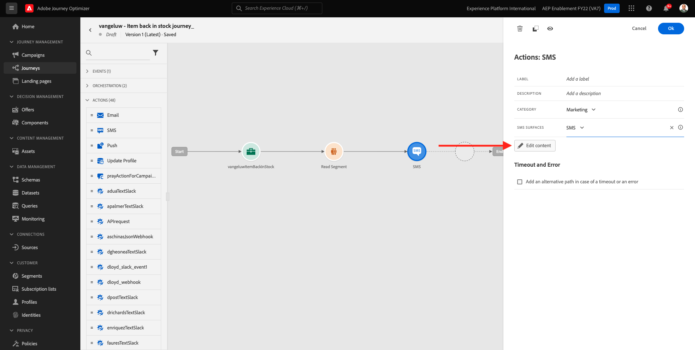
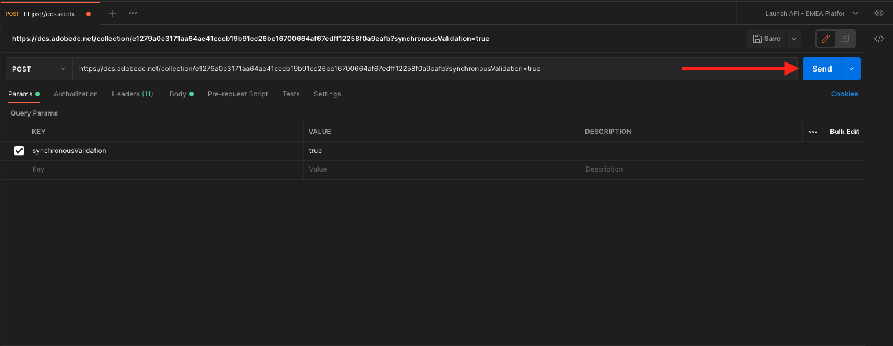

# 3.4.5 Crear un recorrido de evento empresarial

Inicie sesión en Adobe Journey Optimizer en [Adobe Experience Cloud](https://experience.adobe.com). Haga clic en **Journey Optimizer**.


Se le redirigirá a la vista **Inicio** en Journey Optimizer. Primero, asegúrese de que está usando la zona protegida correcta. La zona protegida que se va a usar se llama `--aepSandboxName--`. Para cambiar de una zona protegida a otra, haga clic en **PRODUCTION Prod (VA7)** y seleccione la zona protegida en la lista. En este ejemplo, la zona protegida se denomina **Habilitación de AEP para el año fiscal 22**. Estará en la vista **Inicio** de su zona protegida `--aepSandboxName--`.


## 3.4.5.1 Creación de un evento empresarial

En el menú de la izquierda, haga clic en **Configuraciones**. Haz clic en el botón **Administrar** dentro de la tarjeta **Eventos**.


Los eventos empresariales son un nuevo tipo de evento que puede crear dentro de Journey Optimizer. A diferencia de los **eventos unitarios** que creó en módulos anteriores, los eventos empresariales no los activa el cliente, sino la organización. Ahora creará su evento empresarial.

Haga clic en **Crear evento**.


Introduzca los siguientes valores en el formulario Creación de eventos:

- **Nombre**: `--aepUserLdap--ItemBackInStock`. Por ejemplo: **vangeluwItemBackInStock**
- **Descripción**: este evento se activa cuando un producto vuelve a estar disponible
- **Tipo**: seleccione **Empresa** en la lista desplegable


Para el esquema, seleccione **Sistema de demostración - Esquema de eventos para eventos empresariales de JO (Global v1.1) v.1**. Ahora debe seleccionar los campos del esquema que necesita para nuestro caso de uso.


Siga estos pasos:

Haga clic en el icono **lápiz** en el campo donde dice **1 campo seleccionado**.


Seleccione todos los campos disponibles en el esquema y haga clic en **Aceptar**.


Para la condición: debe especificar qué registros de este esquema activarán el evento empresarial.

Siga estos pasos:

Haga clic en el icono **lápiz** en el campo donde dice **Agregar una condición**.


En el lado izquierdo, expanda el objeto `--aepTenantId--`, expanda el objeto **joBusinessEvents** y arrastre y suelte el campo **eventName** en el lienzo.


Para el campo **eventName**, escriba el siguiente valor: `--aepUserLdap--ItemBackInStock`. Por ejemplo: vangeluwItemBackInStock.
Haga clic en **Aceptar**.


Haga clic en **Aceptar**.


Finalmente, el formulario de creación de eventos debería tener este aspecto. Haz clic en **Guardar** para guardar el evento empresarial.


## 3.4.5.2 Crear un recorrido de evento empresarial

Ahora puede aprovechar este evento empresarial y el mensaje dentro de un recorrido. Ir a **Recorridos**. Haga clic en **Crear Recorrido**.


A la derecha verá un formulario en el que debe especificar el nombre y la descripción del recorrido. Introduzca los siguientes valores:

- **Nombre**: `--aepUserLdap-- - Item back in stock journey`. Por ejemplo: vangeluw - Artículo de nuevo en stock recorrido
- **Descripción**: este recorrido envía un mensaje de texto cuando un artículo vuelve a estar disponible para los visitantes que han mostrado interés.

Haga clic en **Aceptar**.


En el menú de la izquierda, debajo de **Eventos**, busque su ldap. Encontrará el evento empresarial creado anteriormente `--aepUserLdap--ItemBackInStock`. Arrastre y suelte este evento en el lienzo, ya que este será el punto de partida del recorrido.


Como puede ver, se ha agregado automáticamente una actividad **Leer audiencia** al lienzo. Esto se debe a que los eventos empresariales solo envían un déclencheur para que el recorrido lea una audiencia específica, que luego recupera la lista de perfiles de ese recorrido.

Haga clic en la actividad **Leer audiencia**.
La configuración de **Leer audiencia** espera que seleccione la audiencia a la que desea notificar el evento empresarial que acaba de ocurrir. Haga clic en el campo **Seleccionar una audiencia**.


En la ventana emergente **Elija una audiencia**, busque su ldap y seleccione la audiencia que creó en [Módulo 2.3 - CDP en tiempo real - Cree una audiencia y tome medidas](./../../../modules/rtcdp-b2c/module2.3/real-time-cdp-build-a-segment-take-action.md) con el nombre `--aepUserLdap-- - Interest in Galaxy S24`. Haga clic en **Guardar**.


A continuación, haga clic en **Aceptar**.


El siguiente paso es arrastrar y soltar la acción que queremos realizar en este recorrido. Seleccione la acción **SMS** y arrástrela y suéltela después de la condición que acaba de agregar.


Establezca **Category** en **Marketing** y seleccione una superficie de SMS que le permita enviar SMS. En este caso, la superficie de correo electrónico que se va a seleccionar es **SMS**.


El siguiente paso es crear el mensaje. Para ello, haga clic en **Editar contenido**.



Ahora verá el panel de mensajes, donde puede configurar el texto de su SMS. Haga clic en el área **Escribir mensaje** para crear su mensaje.


Escriba el siguiente texto: `Hi {{profile.person.name.firstName}}, the Proteus Fitness Jackshirt is back in stock at Luma.`. Haga clic en **Guardar**.


Vuelva al panel de mensajes haciendo clic en la **flecha** junto al texto de la línea de asunto en la esquina superior izquierda.


Ahora verá la acción de SMS completada. Haga clic en **Ok**.


El recorrido está listo para publicarse. Haga clic en **Publish**.


Vuelva a hacer clic en **Publish**.


El recorrido ya está publicado, ¡ahora puede probarlo!


## 3.4.5.3 Prueba del recorrido de eventos empresariales

Ahora simulará la redistribución de un producto mediante la ingesta de un nuevo evento en el **Sistema de demostración - Esquema de eventos para eventos de negocios de JO (Global v1.1) v.1** mediante Postman.

En el menú de la izquierda, haga clic en **Fuentes** y luego haga clic en la ficha **Cuentas**.


En la ficha **Cuentas**, encontrará la cuenta denominada **Eventos empresariales de Journey Optimizer**. Haga clic en él para abrirlo.


Esta cuenta solo tiene un flujo de datos. Haga clic en el nombre del flujo de datos para seleccionarlo.


Haga clic en **Copiar carga útil de esquema** en el menú derecho. Esta opción copia todo el comando **curl** para insertar un registro en el portapapeles con el esquema de eventos de empresa de JO de **Demo System - (Global v1.1) v.1**.


Pegar el comando Curl dentro de un editor de texto


Vamos a echar un vistazo más de cerca a esta solicitud,

- La solicitud del POST se envía al ID de entrada del DCS
- La solicitud hace referencia al esquema, al conjunto de datos y al ID de organización.
- Finalmente, contiene el nodo xdmEntity, que representa los datos que queremos crear dentro del conjunto de datos.

Ahora necesita reemplazar la siguiente línea `xdmEntity`...

```json
"xdmEntity": {
  "_experienceplatform": {
    "joBusinessEvents": {
      "eventDescription": "string",
      "eventName": "string",
      "stockEventId": "string"
    }
  },
  "_id": "/uri-reference",
  "eventType": "advertising.completes",
  "timestamp": "2018-11-12T20:20:39+00:00"
}
```

...en esta línea, asegúrese de comprobar el campo eventName, tal como debería ser `--aepUserLdap--ItemBackInStock`, que representa la condición especificada en el evento empresarial para almacenar en déclencheur el recorrido.

```json
"xdmEntity": {
  "_experienceplatform": {
    "joBusinessEvents": {
      "eventDescription": "Product Proteus Fitness Jackshirt is back in stock",
      "eventName": "--aepUserLdap--ItemBackInStock",
      "stockEventId": "1"
    }
  },
  "_id": "/uri-reference",
  "eventType": "productBackInStock",
  "timestamp": "2021-04-19T15:25:39+00:00"
}
```

El comando **curl** actualizado debería tener este aspecto:


Selecciónelo todo y cópielo en el portapapeles.

Abra Postman. En el lado izquierdo de Postman, haga clic en **Importar**.


Seleccione la ficha **Texto sin procesar** y pegue el comando copiado anteriormente aquí. Haga clic en **Continuar**.


Haga clic en **Importar**.


Postman ha convertido automáticamente el comando **curl** en un comando REST listo para activarse; simplemente presione el botón **Enviar** para solicitar la creación de ese registro dentro del conjunto de datos.



Compruebe que su solicitud se ha recibido correctamente. Busque el estado **200 OK** en el cartero.


El SMS puede tardar un par de minutos en llegar a su teléfono móvil. Si no es así, es posible que el segmento **Interest in Proteus Fitness Jackshirt** no contenga un perfil con un teléfono móvil correcto. Si es así, visita el sitio web de Luma, visita el producto **Proteus Fitness Jackshirt** y regístrate asegurándote de proporcionar el número de teléfono móvil correcto.


Ya ha terminado este ejercicio.

Paso siguiente: [Resumen y beneficios](./summary.md)

[Volver al módulo 3.4](./journeyoptimizer.md)

[Volver a todos los módulos](../../../overview.md)
