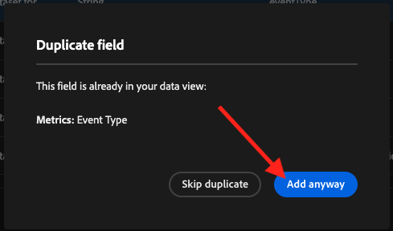
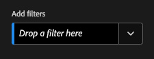

# 4.1.3 Crear una vista de datos

## Objetivos

- Información sobre la IU de vista de datos
- Comprender la configuración básica de la definición de visita
- Explicación de la atribución y la persistencia en una vista de datos

## 4.1.3.1 Vista de datos

Con la conexión terminada, ahora puede progresar para influir en la visualización de. Una diferencia entre Adobe Analytics y CJA es que CJA necesita una vista de datos para limpiar y preparar los datos antes de la visualización.

Una vista de datos es similar al concepto de Grupos de informes virtuales en Adobe Analytics, donde define definiciones de visitas según el contexto, filtros y también cómo se llaman los componentes.

Necesitará un mínimo de una vista de datos por conexión. Sin embargo, en algunos casos de uso, es recomendable tener varias vistas de datos para la misma conexión, con el objetivo de proporcionar perspectivas diferentes a equipos diferentes.
Si quiere que su empresa se base en los datos, debe adaptar cómo se ven los datos en cada equipo. Algunos ejemplos:

- Métricas de UX solo para el equipo de diseño de UX
- Utilice los mismos nombres para los KPI y las métricas para los Google Analytics que para los Customer Journey Analytics, de modo que el equipo de análisis digital solo pueda hablar un idioma.
- Vista de datos filtrada para mostrar, por ejemplo, datos de un solo mercado, de una marca o solo de dispositivos móviles.

En la pantalla **Conexiones**, marque la casilla de verificación que aparece delante de la conexión que acaba de crear. Haga clic en **Crear vista de datos**.

Se le redirigirá al flujo de trabajo **Crear vista de datos**.

## 4.1.3.2 Definición de vista de datos

Ahora puede configurar las definiciones básicas para la vista de datos.

La **conexión** que creó en el ejercicio anterior ya está seleccionada. Su conexión se llama `--aepUserLdap-- – Omnichannel Data Connection`.

A continuación, asigne un nombre a la vista de datos según esta convención de nomenclatura: `--aepUserLdap-- – Omnichannel Data View`.

Escriba el mismo valor para la descripción: `--aepUserLdap-- – Omnichannel Data View`.

| Nombre | Descripción | ID externo |
| ----------------- |-------------|-------------| 
| `--aepUserLdap-- – Omnichannel Data View` | `--aepUserLdap-- – Omnichannel Data View` | `--aepUserLdap--123` |

Para la **Zona horaria**, seleccione la zona horaria **Hora del meridiano de Greenwich; Monrovia, Casablanca [GMT]**. Este es un entorno realmente interesante, ya que algunas empresas operan en diferentes países y regiones geográficas. Asignar el huso horario adecuado para cada país evitará errores típicos en los datos, como creer que, por ejemplo, en Perú, la mayoría de la gente compra camisetas a las 4:00 a.m.

También puede modificar la nomenclatura de las métricas principales (Persona, Sesión y Evento). Esto no es obligatorio, pero a algunos clientes les gusta utilizar Personas, Visitas y Visitas individuales en lugar de Persona, Sesión y Eventos (convención de nomenclatura predeterminada de Customer Journey Analytics).

Ahora debe tener configurada la siguiente configuración:

Haz clic en **Guardar y continuar**.

Haga clic en **Guardar**.

## 4.1.3.3 Componentes de vista de datos

En este ejercicio, configurará los componentes que necesita para analizar los datos y visualizarlos con Analysis Workspace. En esta interfaz de usuario, hay tres áreas principales:

- Izquierda: componentes disponibles de los conjuntos de datos seleccionados
- Medio: componentes añadidos a la vista de datos
- Lado derecho: Configuración de componentes

Ahora tiene que arrastrar y soltar los componentes que necesita para el análisis en **Componentes agregados**. Para ello, debe seleccionar los componentes en el menú de la izquierda y arrastrarlos y soltarlos en el lienzo en el centro.

Empecemos con el primer componente: **Nombre (web.webPageDetails.name)**. Busque este componente y, a continuación, arrástrelo y suéltelo en el lienzo.

Este componente es el nombre de página, tal como se puede derivar de la lectura del campo de esquema `(web.webPageDetails.name)`.

Sin embargo, usar **Name** como nombre no es la mejor convención de nombres para que un usuario empresarial entienda rápidamente esta dimensión.

Cambiemos el nombre a **Nombre de página**. Haga clic en el componente y cambie su nombre en el área **Configuración de componentes**.

Algo muy importante es la **configuración de persistencia**. El concepto de evars y prop no existe en CJA, pero la configuración de Persistencia hace posible un comportamiento similar.

Si no cambia esta configuración, CJA interpretará la dimensión como **Prop** (nivel de visita individual). Además, podemos cambiar la Persistencia para que la dimensión sea un **eVar** (persista el valor a través del recorrido).

Si no está familiarizado con eVars y Props, puede [leer más sobre ellos en la documentación](https://experienceleague.adobe.com/docs/analytics/landing/an-key-concepts.html?lang=es).

Dejemos el nombre de página como una prop. Por lo tanto, no es necesario que cambie ninguna **Configuración de persistencia**.

| Nombre del componente a buscar | Nuevo nombre | Configuración de persistencia |
| ----------------- |-------------| --------------------| 
| Nombre (web.webPageDetails.name) | Nombre de página |          |

A continuación, elija la dimensión **phoneNumber** y suéltela en el lienzo. El nuevo nombre debe ser **Número de teléfono**.

Por último, vamos a cambiar la configuración de Persistencia, ya que el Número móvil debe persistir en el nivel de usuario.

Para cambiar la Persistencia, desplácese hacia abajo en el menú derecho y abra la pestaña **Persistencia**:

Marque la casilla de verificación para modificar la configuración de persistencia. Seleccione **Más reciente** y el ámbito **Persona (ventana de informes)**, ya que solo nos importa el último número de móvil de esa persona. Si el cliente no rellena el móvil en visitas futuras, aún verá rellenado este valor.

| Nombre del componente a buscar | Nuevo nombre | Configuración de persistencia |
| ----------------- |-------------| --------------------| 
| phoneNumber | Número de teléfono | Más reciente, ventana Informes de personas |

El siguiente componente es `web.webPageDetails.pageViews.value`.

En el menú del lado izquierdo, busque `web.webPageDetails.pageViews.value`. Arrastre y suelte esta métrica en el lienzo.

Cambie el nombre a **Vistas de página** en la **configuración de componentes**.

| Nombre del componente a buscar | Nuevo nombre | Configuración de atribución |
| ----------------- |-------------| --------------------| 
| web.webPageDetails.pageViews.value | Page Views |         |

Para la configuración de atribución, no es necesario cambiar nada.

Nota: La configuración de persistencia en las métricas también se puede cambiar en Analysis Workspace. En algunos casos, puede optar por configurarlo aquí para evitar que los usuarios empresariales tengan que pensar cuál es el mejor modelo de persistencia.

A continuación, tendrá que configurar muchos Dimension y métricas, tal como se indica en la tabla siguiente.

### DIMENSION

| Nombre del componente a buscar | Nuevo nombre | Configuración de persistencia |
| ----------------- |-------------| --------------------| 
| brandName | Nombre de marca | Más reciente, sesión |
| sensación de llamada | Sensación de llamada |          |
| ID de llamada | Tipo de interacción de llamada |          |
| callTopic | Tema de llamada | Más reciente, sesión |
| ecid | ECID | Más reciente, ventana Informes de personas |
| email | ID de correo electrónico | Más reciente, ventana Informes de personas |
| Tipo de pago | Tipo de pago |          |
| Método de adición de producto | Método de adición de producto | Más reciente, sesión |
| Tipo de evento | Tipo de evento |         |
| Nombre (productListItems.name) | Nombre de producto |         |
| SKU | SKU (sesión) | Más reciente, sesión |
| El ID de transacción | El ID de transacción |         |
| URL (web.webPageDetails.URL) | URL |         |
| Agente de usuario | Agente de usuario | Más reciente, sesión |

### MÉTRICAS

| Nombre del componente a buscar | Nuevo nombre | Configuración de atribución |
| ----------------- |-------------| --------------------| 
| Cantidad | Cantidad |          |
| commerce.order.priceTotal | Ingresos |         |

La configuración debería tener este aspecto. No olvides **guardar** tu vista de datos. Así que haga clic en **Guardar** ahora.

## 4.1.3.4 Métricas calculadas

Aunque ha organizado todos los componentes de la vista de datos, aún debe adaptar algunos de ellos para que los usuarios empresariales estén listos para iniciar el análisis.

Si lo recuerda, no introdujo métricas específicas, como Agregar al carro de compras, Vista de producto o Compras, en la Vista de datos.
Sin embargo, tiene una dimensión llamada: **Tipo de evento**. Por lo tanto, puede derivar estos tipos de interacción creando 3 métricas calculadas.

Empecemos con la primera métrica: **Vistas del producto**.

En el lado izquierdo, busque **Tipo de evento** y seleccione la dimensión. A continuación, arrástrelo y suéltelo en el lienzo **Componentes incluidos**.
Haga clic para seleccionar la nueva métrica **Tipo de evento**.

Ahora cambie el nombre y la descripción del componente a los siguientes valores:

| Nombre del componente | Descripción del componente |
| ----------------- |-------------| 
| Vistas del producto | Vistas del producto |

Ahora contemos solamente **eventos de vistas del producto**. Para ello, desplácese hacia abajo en **Configuración de componentes** hasta que vea **Incluir valores de exclusión**. Asegúrese de habilitar la opción **Establecer valores de inclusión/exclusión**.

Ya que solamente desea contar **Vistas del producto**, especifique **commerce.productViews** con los criterios.

La métrica calculada ya está lista.

A continuación, repite el mismo proceso para los eventos **Agregar al carro de compras** y **Comprar**.

### Añadir al carro

Primero arrastre y suelte la misma dimensión **Tipo de evento**.

Verá una ventana emergente que alerta de un campo duplicado, ya que estamos utilizando la misma variable. Haz clic en **Agregar de todos modos**:

Ahora, siga el mismo proceso que hemos seguido para las vistas de producto de la métrica:
- Cambie primero el nombre y la descripción.
- Finalmente, agregue **commerce.productListAdds** como criterios para contar solo Agregar al carro de compras

| Nombre | Descripción | Criterios |
| ----------------- |-------------| -------------|
| Añadir al carro | Añadir al carro | commerce.productListAdds |

### Compras

Primero, arrastre y suelte la misma dimensión **Tipo de evento** que hicimos para las dos métricas anteriores.

Verá una ventana emergente que alerta de un campo duplicado, ya que estamos utilizando la misma variable. Haz clic en **Agregar de todos modos**:

Ahora, siga el mismo proceso que para las métricas Vistas del producto y Agregar al carro de compras:
- Cambie primero el nombre y la descripción.
- Finalmente, agregue **commerce.purchases** como criterio para contar solo Agregar a carros de compras

| Nombre | Descripción | Criterios |
| ----------------- |-------------| -------------|
| Compras | Compras | commerce.purchases |

La configuración final debería ser similar a esta. Haz clic en **Guardar y continuar**.

## 4.1.3.5 Configuración de vista de datos

Se le debe redirigir a esta pantalla:

En esta pestaña, puede modificar algunas configuraciones importantes para cambiar la forma en que se procesan los datos. Empecemos por establecer **Tiempo de espera de sesión** en 30 minutos. Gracias a la marca de tiempo de cada evento de experiencia, puede ampliar el concepto de sesión a todos los canales. Por ejemplo, ¿qué sucede si un cliente llama al centro de llamadas después de visitar el sitio web? Con los tiempos de espera de sesión personalizados tiene mucha flexibilidad para decidir qué es una sesión y cómo esa sesión combinará los datos.

En esta pestaña puede modificar otras cosas como filtrar los datos mediante un segmento o filtro. No tendrá que hacer eso en este ejercicio.

Una vez finalizado, haga clic en **Guardar y finalizar**.

>[!NOTE]
>
>Puede volver a esta vista de datos posteriormente y cambiar la configuración y los componentes en cualquier momento. Los cambios afectarán a la forma en que se muestran los datos históricos.

Ahora puede continuar con la parte de visualización y análisis.

Paso siguiente: [4.1.4 Preparación de datos en el Customer Journey Analytics](./ex4.md)

[Volver al módulo 4.1](./customer-journey-analytics-build-a-dashboard.md)

[Volver a todos los módulos](./../../../overview.md)
