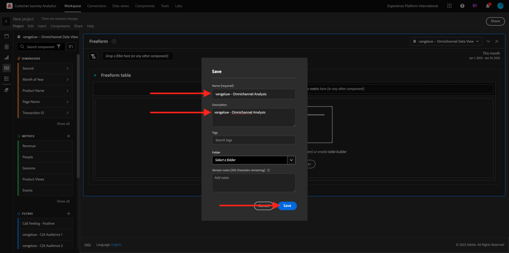

# 4.1.4 Preparación de datos en Analysis Workspace

## Objetivos

- Comprensión de la IU de Analysis Workspace en CJA
- Comprender los conceptos de preparación de datos en Analysis Workspace
- Aprenda a realizar cálculos de datos

## 4.1.4.1 IU de Analysis Workspace en CJA

Analysis Workspace elimina todas las limitaciones típicas de un solo informe de Analytics. Proporciona un lienzo flexible y robusto para la creación de proyectos de análisis personalizados. Arrastre y suelte cualquier número de tablas de datos, visualizaciones y componentes (dimensiones, métricas, segmentos y granularidades de tiempo) en un proyecto. Cree de forma instantánea desgloses y segmentos, cohortes para análisis y alertas, compare segmentos, realice análisis de flujo y visitas en el orden previsto, y revise y programe informes para compartir con cualquier persona de su empresa.

Customer Journey Analytics lleva esta solución sobre los datos de Platform. Recomendamos encarecidamente ver este vídeo de información general de cuatro minutos:

>[!VIDEO](https://video.tv.adobe.com/v/35109?quality=12&learn=on&enablevpops)

Si no ha utilizado Analysis Workspace anteriormente, le recomendamos encarecidamente que vea este vídeo:

>[!VIDEO](https://video.tv.adobe.com/v/26266?quality=12&learn=on&enablevpops)

### Cree Su Proyecto

Ahora es el momento de crear su primer espacio de trabajo de CJA. Vaya a la pestaña **Workspace** dentro de CJA.
Haga clic en **Crear proyecto**.

Entonces verá esto... Seleccione **Proyecto de Workspace en blanco** y haga clic en **Crear**.

A continuación, verá un proyecto vacío.

En primer lugar, asegúrese de seleccionar la Vista de datos correcta en la esquina superior derecha de la pantalla. La vista de datos que se va a seleccionar es `--aepUserLdap-- - Omnichannel Data View`.

A continuación, guarde el proyecto y asígnele un nombre. Puede utilizar el siguiente comando para guardar:

| Sistema operativo | Método abreviado |
| ----------------- |-------------| 
| Windows | Control + S |
| Mac | Comando + S |

Verá esta ventana emergente:

Utilice esta convención de nombres:

| Nombre | Descripción |
| ----------------- |-------------| 
| `--aepUserLdap-- - Omnichannel Analysis` | `--aepUserLdap-- - Omnichannel Analysis` |

A continuación, haga clic en **Guardar**.

## 4.1.4.2 Métricas calculadas

Aunque hemos organizado todos los componentes de la vista de datos, aún necesita adaptar algunos de ellos para que los usuarios empresariales estén listos para iniciar el análisis. Además, durante cualquier análisis, puede crear una métrica calculada para profundizar en la búsqueda de perspectivas.

Por ejemplo, crearemos una **tasa de conversión** calculada con la métrica o el evento **Compras** que definimos en la vista de datos.

### Tasa de conversión

Empecemos a abrir el creador de métricas calculadas. Haga clic en **+** para crear su primera métrica calculada en Analysis Workspace.

Se mostrará **Creador de métricas calculadas**:

Busque **Compras** en la lista de Métricas del menú del lado izquierdo. En **Métricas** haga clic en **Mostrar todo**

Ahora arrastre y suelte la métrica **Compras** en la definición de métrica calculada.

Normalmente, la tasa de conversión significa **Conversiones / Sesiones**. Hagamos el mismo cálculo en el lienzo de definición de métrica calculada. Busque la métrica **Sesiones**, arrástrela y suéltela en el generador de definiciones, en el evento **Compras**.

Observe que el operador de división se selecciona automáticamente.

La tasa de conversión suele representarse en forma de porcentaje. Por lo tanto, vamos a cambiar el formato a porcentaje y también seleccionar 2 decimales.

Finalmente, cambie el nombre y la descripción de la métrica calculada:

| Título | Descripción | ID externo |
| ----------------- |-------------| -------------| 
| Tasa de conversión | Tasa de conversión | conversionRate |

Entonces tendrá esto. Haga clic en **Guardar**.

Vuelva a hacer clic en **Guardar**.

## 4.1.4.3 Dimensiones calculadas: Filtros (segmentación) e intervalos de fechas

### Filtros: Dimensiones calculadas

Los cálculos no están pensados para ser solo para métricas. Antes de comenzar cualquier análisis, también es interesante crear **Dimensiones calculadas**. Básicamente, esto significaba **segmentos** de nuevo en Adobe Analytics. En Customer Journey Analytics, estos segmentos se denominan **Filtros**.

La creación de filtros ayudará a los usuarios empresariales a iniciar el análisis con algunas dimensiones calculadas valiosas. Esto automatizará algunas tareas y ayudará en la parte de adopción. Estos son algunos ejemplos:

1. Medios propios, medios de pago,
2. Visitas nuevas y recurrentes
3. Clientes con carro de compras abandonado

Estos filtros se pueden crear antes o durante la parte de análisis (que se muestra en el siguiente ejercicio).

### Intervalos de fechas: dimensiones de tiempo calculadas

Las dimensiones temporales son otro tipo de dimensiones calculadas. Algunas ya están creadas, pero también tiene la capacidad de crear sus propias dimensiones de tiempo personalizadas en la fase de preparación de datos.

En estas dimensiones de tiempo calculadas, ayudaremos a los analistas y a los usuarios empresariales a recordar fechas importantes y a utilizarlas para filtrar y cambiar el tiempo de los informes. Preguntas y dudas típicas que vienen a nuestras mentes cuando hacemos análisis:

- ¿Cuándo fue el Black Friday el año pasado? ¿Del 21 al 29?
- ¿Cuándo hicimos esa campaña de televisión en diciembre?
- ¿De cuándo a cuándo realizamos las Ventas de Verano 2018? Quiero compararlo con el 2019. Por cierto, ¿sabes los días exactos en 2019?

Ya ha finalizado el ejercicio de preparación de datos con CJA Analysis Workspace.

Paso siguiente: [4.1.5 Visualización mediante Customer Journey Analytics](./ex5.md)

[Volver al módulo 4.1](./customer-journey-analytics-build-a-dashboard.md)

[Volver a todos los módulos](./../../../overview.md)
