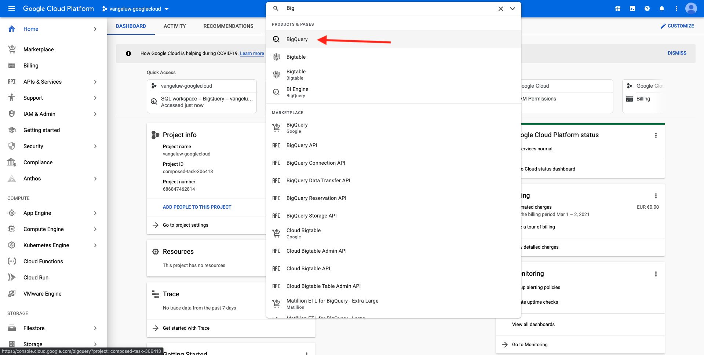

# 4.2.1 Crear su cuenta de Google Cloud Platform

## Objetivos

- Cree su cuenta de Google Cloud Platform
- Familiarícese con la consola de Google Cloud Platform
- Creación y preparación de un proyecto de BigQuery

## 4.2.1.1 Por qué conectar Google BigQuery a Adobe Experience Platform para obtener datos de Google Analytics

Google Cloud Platform (GCP) es un conjunto de servicios públicos de computación en la nube que ofrece Google. Google Cloud Platform incluye una serie de servicios alojados para el desarrollo de aplicaciones, almacenamiento y computación que se ejecutan en hardware de Google.

BigQuery es uno de estos servicios y siempre se incluye con Google Analytics 360. Los datos de los Google Analytics se muestrean con frecuencia cuando intentamos obtener datos directamente de ellos (API, por ejemplo). Es por eso que Google incluye BigQuery para obtener datos no muestreados, de modo que las marcas puedan hacer análisis avanzados usando SQL y beneficiarse de la potencia de GCP.

Los datos de Google Analytics se cargan a diario en BigQuery mediante un mecanismo por lotes. Como tal, no tiene ningún sentido utilizar esta integración de GCP/BigQuery para casos de uso de personalización y activación en tiempo real.

Si una marca desea ofrecer casos de uso de personalización en tiempo real basados en datos de Google Analytics, puede recopilar esos datos en el sitio web con Google Tag Manager y luego transmitirlos a Adobe Experience Platform en tiempo real.

El conector Source GCP/BigQuery debe usarse para...

- realice un seguimiento del comportamiento de todos los clientes en el sitio web y cargue esos datos en Adobe Experience Platform para análisis, ciencia de datos y casos de uso de personalización que no requieran activación en tiempo real.
- cargar datos históricos de los Google Analytics en Adobe Experience Platform, para casos de uso de análisis y ciencia de datos.

## 4.2.1.2 Crear su cuenta de Google

Para obtener una cuenta de Google Cloud Platform, necesita una cuenta de Google.

## 4.2.1.3 Activación de la cuenta de Google Cloud Platform

Ahora que tiene su cuenta de Google, puede crear un entorno de Google Cloud Platform. Para ello, vaya a [https://console.cloud.google.com/](https://console.cloud.google.com/).

En la página siguiente, acepte los términos y condiciones.

A continuación, haga clic en **Seleccionar un proyecto**.

Haga clic en **NUEVO PROYECTO**.

Asigne un nombre al proyecto según esta convención de nombres:

| Convención | Ejemplo |
| ----------------- |-------------| 
| `--aepUserLdap---googlecloud` | delaigle-googlecloud |

Haga clic en **Crear**.

Espere hasta que la notificación en la parte superior derecha de la pantalla le indique que la creación ha finalizado. A continuación, haga clic en **Ver proyecto**.

A continuación, vaya a la barra de búsqueda en la parte superior de la pantalla y escriba **BigQuery**. Seleccione el primer resultado.

A continuación, se le redirigirá a la consola de BigQuery y verá un mensaje emergente.

**Haga clic en Listo**.

El objetivo de este módulo es obtener los datos de los Google Analytics en Adobe Experience Platform. Para ello, necesitamos datos ficticios en un conjunto de datos de Google Analytics para empezar.

Haga clic en **Agregar datos** en el menú del lado izquierdo, seguido de **Explorar conjuntos de datos públicos**.

A continuación, verá esta ventana:

Escriba el término de búsqueda **Ejemplo de Google Analytics** en la barra de búsqueda y seleccione el primer resultado.

Verá la siguiente pantalla con una descripción del conjunto de datos. Haga clic en **VER CONJUNTO DE DATOS**.

Luego se le redirigirá a BigQuery, donde verá este conjunto de datos de **bigquery-public-data** en **Explorer**.

En **Explorer**, debería ver varias tablas. No dude en explorarlos. Vaya a `google_analytics_sample`.

Haga clic para abrir la tabla `ga_sessions`.

Antes de continuar con el siguiente ejercicio, anote los siguientes elementos en un archivo de texto independiente en el equipo:

| Credencial | Nombre | Ejemplo |
| ----------------- |-------------| -------------|
| Nombre de proyecto | `--aepUserLdap---googlecloud` | vangeluw-googlecloud |
| Identificador de proyecto | random | compuso-tarea-306413 |

Encontrará su nombre de proyecto e ID de proyecto haciendo clic en su **Nombre de proyecto** en la barra de menús superior:

A continuación, verá su ID de proyecto a la derecha:

Ahora puede pasar al ejercicio 12.2, donde se ensuciará las manos consultando los datos de los Google Analytics.

Paso siguiente: [4.2.2 Cree su primera consulta en BigQuery](./ex2.md)

[Volver al módulo 4.2](./customer-journey-analytics-bigquery-gcp.md)

[Volver a todos los módulos](./../../../overview.md)
