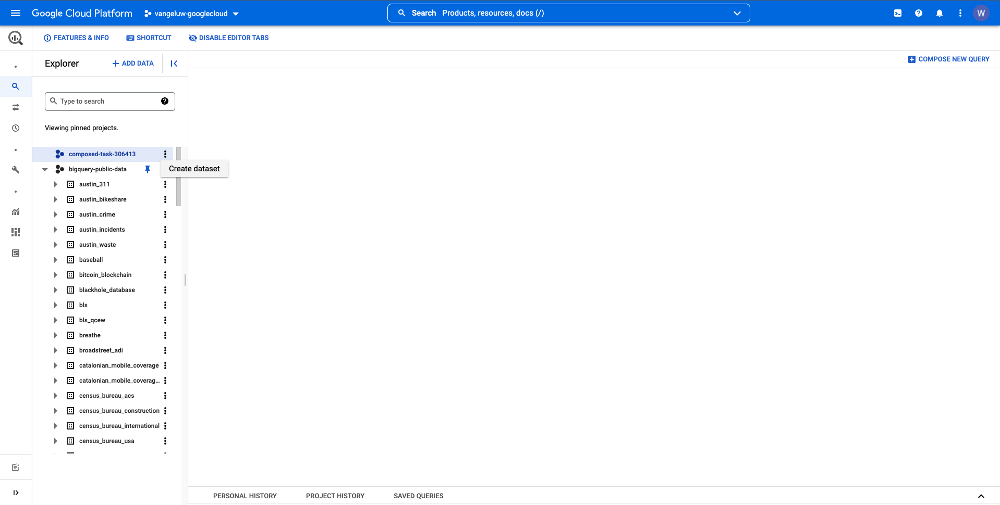
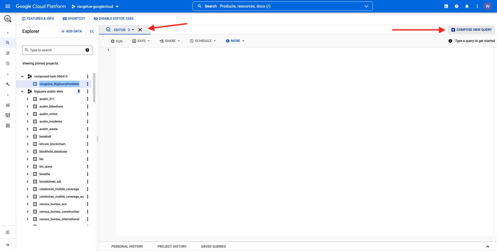
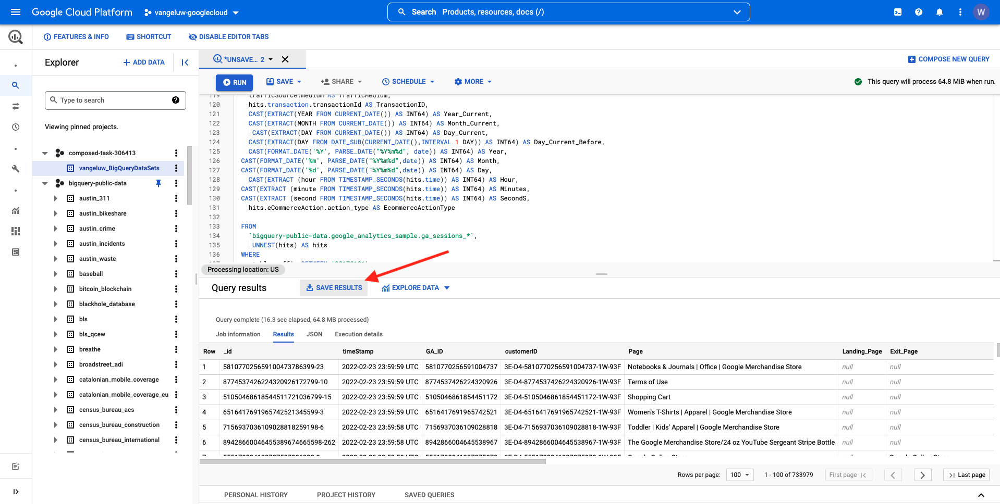

# 4.2.2 Cree su primera consulta en BigQuery

## Objetivos

- Exploración de la IU de BigQuery
- Creación de una consulta SQL en BigQuery
- Guarde los resultados de la consulta SQL en un conjunto de datos dentro de BigQuery

## Contexto

Cuando los datos de los Google Analytics están en BigQuery, las dimensiones, las métricas y otras variables están todas anidadas. Además, los datos de los Google Analytics se cargan diariamente en diferentes tablas. Esto significa que intentar conectar tablas de Google Analytics dentro de BigQuery a Adobe Experience Platform directamente es muy difícil y no es una buena idea.

La solución a este problema es transformar los datos de los Google Analytics en un formato legible para facilitar la ingesta en Adobe Experience Platform.

## 4.2.2.1 Crear un conjunto de datos para guardar nuevas tablas de BigQuery

Vaya a la [consola de BigQuery](https://console.cloud.google.com/bigquery).


En **Explorer**, verás tu identificador de proyecto. Haga clic en su ID de proyecto (no haga clic en el conjunto de datos **bigquery-public-data**).


Puede ver que aún no hay ningún conjunto de datos, por lo que vamos a crear uno ahora.
Haga clic en **CREAR CONJUNTO DE DATOS**.



A la derecha de la pantalla, verá el menú **Crear conjunto de datos**.


Para el **ID del conjunto de datos**, use la siguiente convención de nombres. Para los demás campos, mantenga la configuración predeterminada.

| Nombre | Ejemplo |
| ----------------- | ------------- | 
| `--aepUserLdap--_BigQueryDataSets` | vangeluw_BigQueryDataSets |


A continuación, haga clic en **Crear conjunto de datos**.


A continuación, volverá a la consola de BigQuery con el conjunto de datos creado.


## 4.2.2.2 Cree su primera SQL BigQuery

A continuación, creará su primera consulta en BigQuery. El objetivo de esta consulta es tomar los datos de muestra de los Google Analytics y transformarlos para que se puedan introducir en Adobe Experience Platform. Vaya a la ficha **EDITOR**.



Copie la siguiente consulta SQL y péguela en el editor de consultas. No dude en leer la consulta y comprender la sintaxis de BigQuery de los Google Analytics.


```sql
SELECT
  CONCAT(fullVisitorId, CAST(hitTime AS String), '-', hitNumber) AS _id,
  TIMESTAMP(DATETIME(Year_Current, Month_Current, Day_Current, Hour, Minutes, Seconds)) AS timeStamp,
  fullVisitorId as GA_ID,
  -- Fake CUSTOMER ID
  CONCAT('3E-D4-',fullVisitorId, '-1W-93F' ) as customerID,
  Page,
  Landing_Page,
  Exit_Page,
  Device,
  Browser,
  MarketingChannel,
  TrafficSource,
  TrafficMedium,
  -- Enhanced Ecommerce
  TransactionID,
  CASE
      WHEN EcommerceActionType = '2' THEN 'Product_Detail_Views'
      WHEN EcommerceActionType = '3' THEN 'Adds_To_Cart'
      WHEN EcommerceActionType = '4' THEN 'Product_Removes_From_Cart'
      WHEN EcommerceActionType = '5' THEN 'Product_Checkouts'
      WHEN EcommerceActionType = '6' THEN 'Product_Refunds'
    ELSE
    NULL
  END
     AS Ecommerce_Action_Type,
  -- Entrances (metric)
  SUM(CASE
      WHEN isEntrance = TRUE THEN 1
    ELSE
    0
  END
    ) AS Entries,
    
--Pageviews (metric)
    COUNT(*) AS Pageviews,
    
 -- Exits 
    SUM(
    IF
      (isExit IS NOT NULL,
        1,
        0)) AS Exits,
        
 --Bounces
   SUM(CASE
      WHEN isExit = TRUE AND isEntrance = TRUE THEN 1
    ELSE
    0
  END
    ) AS Bounces,
        
  -- Unique Purchases (metric)
  COUNT(DISTINCT TransactionID) AS Unique_Purchases,
  -- Product Detail Views (metric)
  COUNT(CASE
      WHEN EcommerceActionType = '2' THEN fullVisitorId
    ELSE
    NULL
  END
    ) AS Product_Detail_Views,
  -- Product Adds To Cart (metric)
  COUNT(CASE
      WHEN EcommerceActionType = '3' THEN fullVisitorId
    ELSE
    NULL
  END
    ) AS Adds_To_Cart,
  -- Product Removes From Cart (metric)
  COUNT(CASE
      WHEN EcommerceActionType = '4' THEN fullVisitorId
    ELSE
    NULL
  END
    ) AS Product_Removes_From_Cart,
  -- Product Checkouts (metric)
  COUNT(CASE
      WHEN EcommerceActionType = '5' THEN fullVisitorId
    ELSE
    NULL
  END
    ) AS Product_Checkouts,
  -- Product Refunds (metric)
  COUNT(CASE
      WHEN EcommerceActionType = '7' THEN fullVisitorId
    ELSE
    NULL
  END
    ) AS Product_Refunds
  FROM (
  SELECT
    -- Landing Page (dimension)
    CASE
      WHEN hits.isEntrance = TRUE THEN hits.page.pageTitle
    ELSE NULL
  END
    AS Landing_page,
    
        -- Exit Page (dimension)
    CASE
      WHEN hits.isExit = TRUE THEN hits.page.pageTitle
    ELSE
    NULL
  END
    AS Exit_page,
    
    hits.page.pageTitle AS Page,
    hits.isEntrance,
    hits.isExit,
    hits.hitNumber as hitNumber,
    hits.time as hitTime,
    date as Fecha,
    fullVisitorId,
    visitStartTime,
    device.deviceCategory AS Device,
    device.browser AS Browser,
    channelGrouping AS MarketingChannel,
    trafficSource.source AS TrafficSource,
    trafficSource.medium AS TrafficMedium,
    hits.transaction.transactionId AS TransactionID,
    CAST(EXTRACT(YEAR FROM CURRENT_DATE()) AS INT64) AS Year_Current,
    CAST(EXTRACT(MONTH FROM CURRENT_DATE()) AS INT64) AS Month_Current,
     CAST(EXTRACT(DAY FROM CURRENT_DATE()) AS INT64) AS Day_Current,
    CAST(EXTRACT(DAY FROM DATE_SUB(CURRENT_DATE(),INTERVAL 1 DAY)) AS INT64) AS Day_Current_Before,
    CAST(FORMAT_DATE('%Y', PARSE_DATE("%Y%m%d", date)) AS INT64) AS Year,
  CAST(FORMAT_DATE('%m', PARSE_DATE("%Y%m%d",date)) AS INT64) AS Month,
  CAST(FORMAT_DATE('%d', PARSE_DATE("%Y%m%d",date)) AS INT64) AS Day,
    CAST(EXTRACT (hour FROM TIMESTAMP_SECONDS(hits.time)) AS INT64) AS Hour,
  CAST(EXTRACT (minute FROM TIMESTAMP_SECONDS(hits.time)) AS INT64) AS Minutes,
  CAST(EXTRACT (second FROM TIMESTAMP_SECONDS(hits.time)) AS INT64) AS SecondS,
    hits.eCommerceAction.action_type AS EcommerceActionType
  
  FROM
    `bigquery-public-data.google_analytics_sample.ga_sessions_*`,
     UNNEST(hits) AS hits
  WHERE
    _table_suffix BETWEEN '20170101'
    AND '20170331'
    AND totals.visits = 1
    AND hits.type = 'PAGE'
    )
    
GROUP BY
  1,
  2,
  3,
  4,
  5,
  6,
  7,
  8,
  9,
  10,
  11,
  12,
  13,
  14
    
  ORDER BY 2 DESC
```

Cuando esté listo, haga clic en **Ejecutar** para ejecutar la consulta:


La ejecución de la consulta puede tardar un par de minutos.

Una vez que la consulta haya terminado de ejecutarse, verá el siguiente resultado en los **resultados de la consulta**.


## 4.2.2.3 Guarde los resultados de la consulta SQL de BigQuery

El siguiente paso es guardar el resultado de la consulta haciendo clic en el botón **GUARDAR RESULTADOS**.



Como ubicación de salida, seleccione **tabla BigQuery**.


Verá una nueva ventana emergente donde ya están rellenados **Nombre de proyecto** y **Nombre de conjunto de datos**. El nombre del conjunto de datos debe ser el conjunto de datos que creó al principio de este ejercicio, con esta convención de nombres:

| Nombre | Ejemplo |
| ----------------- | ------------- | 
| `--aepUserLdap--_BigQueryDataSets` | `vangeluw_BigQueryDataSets` |

Ahora debe introducir un Nombre de tabla. Utilice esta convención de nombres:

| Nombre | Ejemplo |
| ----------------- |------------- | 
| `--aepUserLdap--_GAdataTableBigQuery` | `vangeluw_GAdataTableBigQuery` |


Haga clic en **GUARDAR**.

Puede llevar algún tiempo hasta que los datos estén listos en la tabla que ha creado. Después de un par de minutos, actualice el explorador. Luego debería ver dentro del conjunto de datos la tabla `--aepUserLdap--_GAdataTableBigquery` en **Explorer** dentro del proyecto BigQuery.


Ahora puede continuar con el siguiente ejercicio, en el que conectará esta tabla a Adobe Experience Platform.

Siguiente paso: [4.2.3 Conectar GCP y BigQuery a Adobe Experience Platform](./ex3.md)

[Volver al módulo 4.2](./customer-journey-analytics-bigquery-gcp.md)

[Volver a todos los módulos](./../../../overview.md)
