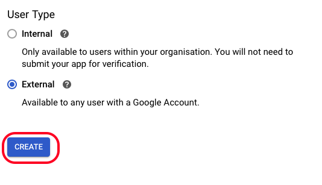
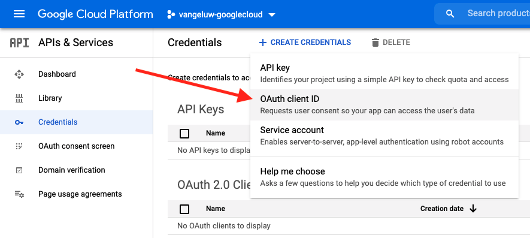
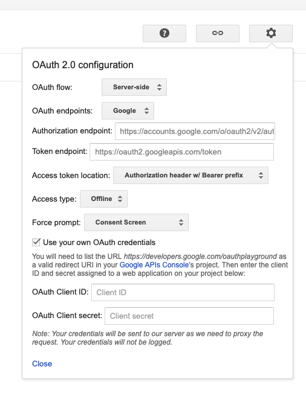
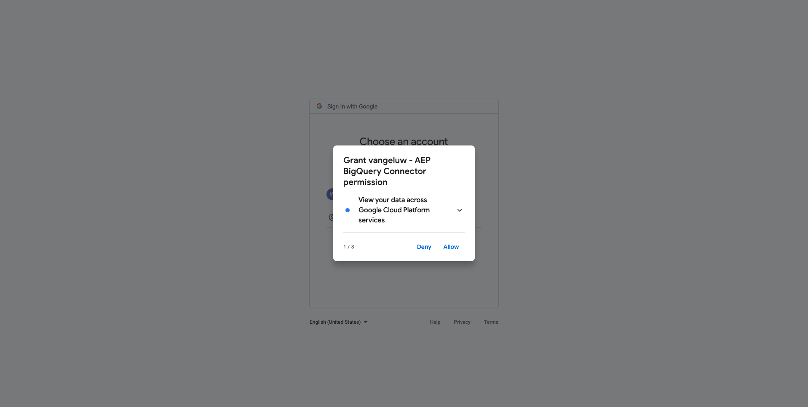

# 4.2.3 Conexión de GCP y BigQuery con Adobe Experience Platform

## Objetivos

- Explore la API y los servicios de Google Cloud Platform
- Familiarícese con OAuth Playground para probar las API de Google
- Creación de la primera conexión de BigQuery en Adobe Experience Platform

## Contexto

Adobe Experience Platform proporciona un conector en **Sources** que le ayudará a incorporar conjuntos de datos de BigQuery a Adobe Experience Platform. Este conector de datos se basa en la API de Google BigQuery. Por lo tanto, es importante preparar correctamente su Google Cloud Platform y su entorno de BigQuery para recibir llamadas de API desde Adobe Experience Platform.

Para configurar el conector de Source de BigQuery en Adobe Experience Platform, necesita estos 4 valores:

- proyecto
- clientId
- clientSecret
- refreshToken

Hasta ahora solo tiene el primero, el **identificador de proyecto**. Este valor de **ID del proyecto** es un ID aleatorio que generó Google cuando creó el proyecto BigQuery durante el ejercicio 12.1.

Copie el ID del proyecto en un archivo de texto separado.

| Credencial | Nombre | Ejemplo |
| ----------------- |-------------| -------------|
| Identificador de proyecto | random | compuso-tarea-306413 |

Puedes comprobar tu ID de proyecto en cualquier momento haciendo clic en tu **Nombre del proyecto** en la barra de menú superior:

Verá su ID de proyecto a la derecha:

En este ejercicio aprenderá a obtener los otros 3 campos obligatorios:

- clientId
- clientSecret
- refreshToken

## 4.2.3.1 API y servicios de Google Cloud

Para empezar, vuelva a la página de inicio de Google Cloud Platform. Para ello, simplemente haga clic en el logotipo en la esquina superior izquierda de la pantalla.

Una vez que esté en la página de inicio, vaya al menú de la izquierda, haga clic en **API y servicios** y luego haga clic en **Tablero**.

Ahora verá la página principal de **API y servicios**.

En esta página, puede ver el uso de las distintas conexiones de API de Google. Para configurar una conexión de API de modo que Adobe Experience Platform pueda leer desde BigQuery, debe seguir estos pasos:

- Primero, debe crear una pantalla de consentimiento de OAuth para habilitar futuras autenticaciones. Las razones de seguridad de Google también requieren que un ser humano realice la primera autenticación antes de permitir el acceso mediante programación.
- Segundo, necesita las credenciales de la API (clientId y clientSecret) que se utilizarán para la autenticación de la API y el acceso a su conector de BigQuery.

## 4.2.3.2 Pantalla de consentimiento de OAuth

Empecemos por crear la pantalla de consentimiento de OAuth. En el menú de la izquierda de la página principal de **API y servicios**, haga clic en **Pantalla de consentimiento de OAuth**.

A continuación, verá esto:

Seleccione el tipo de usuario: **Externo**. A continuación, haga clic en **CREAR**.

A continuación, se encuentra en la ventana **Configuración de la pantalla de consentimiento de OAuth**.

Lo único que hay que hacer aquí es escribir el nombre de la pantalla de consentimiento en el campo **Nombre de aplicación** y seleccionar el **correo electrónico de asistencia al usuario**. Para el nombre de la aplicación, utilice esta convención de nombres:

| Nombre | Ejemplo |
| ----------------- |-------------| 
| `--aepUserLdap-- - AEP BigQuery Connector` | vangeluw: conector BigQuery de AEP |

A continuación, desplácese hacia abajo hasta que vea **Información de contacto del desarrollador** y rellene una dirección de correo electrónico.

Haga clic en **GUARDAR Y CONTINUAR**.

Entonces verá esto... Haga clic en **GUARDAR Y CONTINUAR**.

Entonces verá esto... Haga clic en **GUARDAR Y CONTINUAR**.

Entonces verá esto... Haga clic en **VOLVER AL TABLERO**.

Entonces verá esto... Haga clic en **APLICACIÓN DE PUBLISH**.

Haga clic en **CONFIRMAR**.

Entonces verá esto...

En el siguiente paso, finalizará la configuración de la API y obtendrá sus credenciales de la API.

## 4.2.3.3 Credenciales de la API de Google: Secreto del cliente e ID del cliente

En el menú de la izquierda, haga clic en **Credenciales**. A continuación, verá esto:

Haga clic en el botón **+ CREAR CREDENCIALES**.

Verá 3 opciones... Haga clic en **ID de cliente de OAuth**:

En la pantalla siguiente, seleccione **aplicación web**.

Aparecerán varios campos nuevos. Ahora necesita escribir el **Nombre** del ID de cliente de OAuth y también los **URI de redireccionamiento autorizados**.

Siga esta convención de nombres:

| Campo | Valor | Ejemplo |
| ----------------- |-------------| -------------| 
| Nombre | ldap: Conector de AEP BigQuery | vangeluw - Conector de Platform BigQuery |
| URI de redireccionamiento autorizados | https://developers.google.com/oauthplayground | https://developers.google.com/oauthplayground |

El campo **URI de redireccionamiento autorizados** es muy importante porque lo necesitará más adelante para obtener el RefreshToken que necesita para finalizar la configuración del conector Source de BigQuery en Adobe Experience Platform.

Antes de continuar, debe presionar físicamente el botón **Entrar** después de ingresar la URL para almacenar el valor en el campo **URI de redireccionamiento autorizados**. Si no hace clic en el botón **Entrar**, se encontrará con problemas en una etapa posterior, en el **sitio de reproducción de OAuth 2.0**.

A continuación, haga clic en **Crear**:

Ahora verá su ID de cliente y su Secreto de cliente.

Copie estos dos campos y péguelos en un archivo de texto en su escritorio. Siempre puede acceder a estas credenciales más adelante, pero es más fácil guardarlas en un archivo de texto junto al ID de proyecto de BigQuery.

Como recapitulación de la configuración del conector de Source de BigQuery en Adobe Experience Platform, ahora tiene estos valores ya disponibles:

| Credenciales del conector de BigQuery | Valor |
| ----------------- |-------------| 
| Identificador de proyecto | su propio ID de proyecto (por ejemplo,: compuesto-tarea-306413) |
| clientid | yourclientid |
| client secret | yourclientsecret |

Todavía le falta **refreshToken**. refreshToken es un requisito por razones de seguridad. En el mundo de las API, los tokens suelen caducar cada 24 horas. Por lo tanto, **refreshToken** es necesario para actualizar el token de seguridad cada 24 horas, para que la configuración del Conector de Source pueda seguir conectándose a Google Cloud Platform y BigQuery.

## 4.2.3.4 API de BigQuery y refreshToken

Existen muchas maneras de obtener un refreshToken para acceder a las API de Google Cloud Platform. Una de estas opciones es, por ejemplo, utilizar Postman.
Sin embargo, Google ha creado algo más fácil de probar y reproducir con sus API, una herramienta llamada **OAuth 2.0 Playground**.

Para acceder al área de reproducción de **OAuth 2.0**, ve a [https://developers.google.com/oauthplayground](https://developers.google.com/oauthplayground).

Luego verá la página principal del **sitio de reproducción de OAuth 2.0**.

Haz clic en el icono **engranaje** en la parte superior derecha de la pantalla:

Asegúrese de que la configuración sea la misma que se puede ver en la imagen anterior.

Compruebe la configuración para estar seguro al 100 %.

Una vez finalizado, marque la casilla de **Usar sus propias credenciales de OAuth**

Deben aparecer dos campos, y usted tiene el valor para ellos.

Rellene los campos siguientes a esta tabla:

| Configuración de API de Playground | Sus credenciales de la API de Google |
| ----------------- |-------------| 
| ID de cliente de OAuth | su propio ID de cliente (en el archivo de texto de su escritorio) |
| Secreto de cliente de OAuth | su propio Secreto de cliente (en el archivo de texto de su escritorio) |

Copie el **ID de cliente** y el **Secreto de cliente** del archivo de texto que creó en su escritorio.

Una vez que hayas rellenado tus credenciales, haz clic en **Cerrar**

En el menú de la izquierda, puede ver todas las API de Google disponibles. Busque **API de BigQuery v2**.

A continuación, seleccione el ámbito como se indica en la siguiente imagen:

Una vez que los haya seleccionado, debería ver un botón azul que dice **Autorizar API**. Haga clic en ella.

Seleccione la cuenta de Google que utilizó para configurar GCP y BigQuery.

Podría ver una gran advertencia: **Esta aplicación no está verificada**. Esto sucede porque Platform BigQuery Connector aún no se ha revisado formalmente, por lo que Google no sabe si es una aplicación auténtica o no. Debe ignorar esta notificación.

Haga clic en **Avanzado**.

A continuación, haga clic en **Ir a ldap - Conector de AEP BigQuery (no seguro)**.

Se le redirigirá a la pantalla de consentimiento de OAuth que ha creado.

Si utiliza la autenticación de doble factor (2FA), introduzca el código de verificación que se le ha enviado.

Google ahora le mostrará ocho mensajes de **permiso** diferentes. Haga clic en **Permitir** para las ocho solicitudes de permiso. (Este es un procedimiento que debe ser seguido y confirmado una vez por un ser humano real, antes de que la API permita solicitudes programáticas)

Una vez más, no se mostrarán **ocho ventanas emergentes diferentes**, tiene que hacer clic en **Permitir** para todas ellas.

Después de las ocho solicitudes de permiso, verá esta descripción general. Haga clic en **Permitir** para finalizar el proceso.

Después de hacer clic con el botón **Permitir** por última vez, se te enviará de vuelta al área de reproducción de OAuth 2.0 y verás lo siguiente:

Haga clic en **Código de autorización de Exchange para tokens**.

Después de un par de segundos, la vista **Paso 2 - Código de autorización de intercambio para tokens** se cerrará automáticamente y verá **Paso 3 - Configurar la solicitud a la API**.

Tiene que volver al **Código de autorización de Exchange del paso 2 para tokens**, así que haga clic en el **Código de autorización de Exchange del paso 2 para tokens** de nuevo para visualizar el **token de actualización**.

Ahora verá **Actualizar token**.

Copie el **token de actualización** y péguelo en el archivo de texto del escritorio junto con las demás credenciales del conector de Source de BigQuery:

| Credenciales del conector de Source de BigQuery | Valor |
| ----------------- |-------------| 
| Identificador de proyecto | su propio ID de proyecto aleatorio (por ejemplo,: apt-Summer-273608) |
| clientid | yourclientid |
| client secret | yourclientsecret |
| refreshToken | yourrefreshtoken |

A continuación, vamos a configurar el conector de Source en Adobe Experience Platform.

## 4.2.3.5: Conexión de Platform con su propia tabla de BigQuery

Inicie sesión en Adobe Experience Platform desde esta dirección URL: [https://experience.adobe.com/platform](https://experience.adobe.com/platform).

Después de iniciar sesión, llegará a la página principal de Adobe Experience Platform.

Antes de continuar, debe seleccionar una **zona protegida**. La zona protegida que se va a seleccionar se denomina ``--aepSandboxName--``. Para ello, haga clic en el texto **[!UICONTROL Producción]** en la línea azul de la parte superior de la pantalla. Después de seleccionar la zona protegida adecuada, verá que la pantalla cambia y ahora está en la zona protegida dedicada.

En el menú de la izquierda, vaya a Fuentes. Luego verá la página principal de **Sources**. En el menú **Orígenes**, haga clic en **Bases de datos**. Haz clic en la tarjeta **Google BigQuery**. A continuación, haga clic en **Configurar** o en **+ Configurar**.

Ahora debe crear una nueva conexión.

Haz clic en **Nueva cuenta**. Ahora debe completar todos los campos siguientes, según la configuración realizada en GCP y BigQuery.

Empecemos por nombrar la conexión:

Utilice esta convención de nombres:

| Credenciales del conector de BigQuery | Valor | Ejemplo |
| ----------------- |-------------| -------------| 
| Nombre de la cuenta | `--aepUserLdap-- - BigQuery Connection` | vangeluw - Conexión de BigQuery |
| Descripción | `--aepUserLdap-- - BigQuery Connection` | vangeluw - Conexión de BigQuery |

Lo que debería darte algo como esto:

A continuación, rellene los detalles de la API de GCP y BigQuery **Autenticación de cuenta** que almacenó en un archivo de texto en su escritorio:

| Credenciales del conector de BigQuery | Valor |
| ----------------- |-------------| 
| Identificador de proyecto | su propio ID de proyecto aleatorio (por ejemplo,: apt-Summer-273608) |
| clientId | ... |
| clientSecret | ... |
| refreshToken | ... |

Los detalles de la **autenticación de la cuenta** deberían tener un aspecto similar al siguiente:

Después de rellenar todos estos campos, haga clic en **Conectar con el origen**.

Si los detalles de **Autenticación de cuenta** se han completado correctamente, debería ver una confirmación visual de que la conexión funciona correctamente al ver la confirmación de **Conectado**.

Ahora que se ha creado la conexión, haga clic en **Siguiente**:

Ahora verá el conjunto de datos de BigQuery que creó durante el ejercicio 12.2.

¡Bien hecho! En el siguiente ejercicio, cargará datos de esa tabla y los asignará a un esquema y a un conjunto de datos en Adobe Experience Platform.

Paso siguiente: [4.2.4 Carga de datos de BigQuery en Adobe Experience Platform](./ex4.md)

[Volver al módulo 4.2](./customer-journey-analytics-bigquery-gcp.md)

[Volver a todos los módulos](./../../../overview.md)
