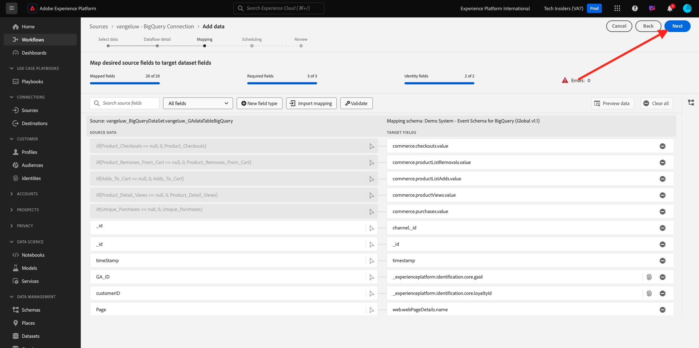
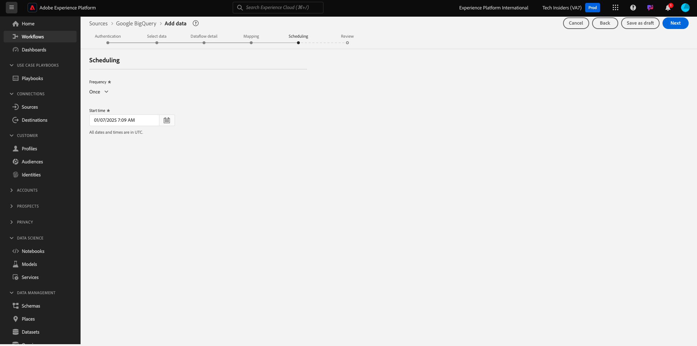
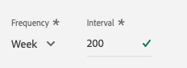
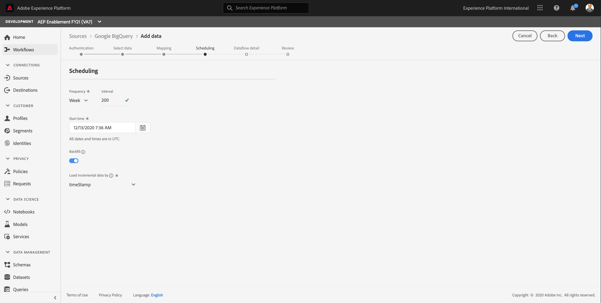

# 4.2.4 Carga de datos de BigQuery en Adobe Experience Platform

## Objetivos

- Asignación de datos de BigQuery a un esquema XDM
- Carga de datos de BigQuery en Adobe Experience Platform
- Familiarícese con la interfaz de usuario del conector de Source de BigQuery

## Antes de comenzar

Después del ejercicio 12.3, debería tener esta página abierta en Adobe Experience Platform:

**Si lo tiene abierto, continúe con el ejercicio 12.4.1.**

**Si no lo tienes abierto, ve a [Adobe Experience Platform](https://experience.adobe.com/platform/home).**

En el menú de la izquierda, vaya a Fuentes. Luego verá la página principal de **Sources**. En el menú **Orígenes**, haga clic en **Bases de datos**.

Seleccione el conector de Source **Google BigQuery** y haga clic en **+ Configurar**.

A continuación, verá la pantalla de selección de cuenta de Google BigQuery.

Seleccione su cuenta y haga clic en **Siguiente**.

Verá la vista **Agregar datos**.

## 4.2.4.1 Selección de tabla de BigQuery

En la vista **Agregar datos**, seleccione su conjunto de datos de BigQuery.

Ahora puede ver una previsualización de datos de ejemplo de los datos de Google Analytics en BigQuery.

Haga clic en **Next**.

## 4.2.4.2 Asignación de XDM

Ahora verá lo siguiente:

Ahora debe crear un nuevo conjunto de datos o seleccionar uno existente en el que cargar los datos de los Google Analytics. Para este ejercicio, ya se han creado un conjunto de datos y un esquema. No es necesario crear un nuevo esquema o conjunto de datos.

Seleccione **conjunto de datos existente**. Abra el menú desplegable para seleccionar un conjunto de datos. Busque el conjunto de datos denominado `Demo System - Event Dataset for BigQuery (Global v1.1)` y selecciónelo. Haga clic en **Next**.

Desplácese hacia abajo. Ahora necesita asignar cada **campo Source** desde Google Analytics/BigQuery a un **campo de destino XDM**, campo por campo.

Utilice la siguiente tabla de asignación para este ejercicio.

| Campo de origen | Campo de destino |
| ----------------- |-------------| 
| **_id** | _id |
| **_id** | canal._id |
| timeStamp | timestamp |
| GA_ID | ``--aepTenantId--``.identification.core.gaid |
| customerID | ``--aepTenantId--``.identification.core.loyaltyId |
| Página | web.webPageDetails.name |
| Device | device.type |
| Explorador | environment.browserDetails.vendor |
| MarketingChannel | marketing.trackingCode |
| TrafficSource | channel.typeAtSource |
| TrafficMedium | channel.mediaType |
| TransactionID | commerce.order.payments.transactionID |
| Ecommerce_Action_Type | eventType |
| Pageviews | web.webPageDetails.pageViews.value |
| Unique_Purchases | commerce.purchases.value |
| Product_Detail_Views | commerce.productViews.value |
| Adds_To_Cart | commerce.productListAdds.value |
| Product_Removes_From_Cart | commerce.productListRemovals.value |
| Product_Checkouts | commerce.checkouts.value |

Después de copiar y pegar la asignación anterior en la interfaz de usuario de Adobe Experience Platform, compruebe si no ve ningún error debido a errores tipográficos o espacios iniciales o finales.

Ahora tiene una **asignación** como esta:

Los campos de origen **GA_ID** y **customerID** están asignados a un identificador en este esquema XDM. Esto permite enriquecer los datos de los Google Analytics (datos de comportamiento de la aplicación/web) con otros conjuntos de datos, como los datos de fidelidad o del centro de llamadas.

Haga clic en **Next**.

## 4.2.4.3 Programación de la conexión y la ingesta de datos

Ahora verá la ficha **Programación**:

En la ficha **Programación**, puede definir una frecuencia para el proceso de ingesta de datos para esta **asignación** y los datos.

Como está utilizando datos de demostración en Google BigQuery que no se actualizarán, no hay necesidad real de configurar una programación en este ejercicio. Debe seleccionar algo y, para evitar demasiados procesos de ingesta de datos inútiles, debe configurar la frecuencia de esta manera:

- Frecuencia: **Semana**
- Intervalo: **200**

**Importante**: asegúrese de activar el conmutador **Relleno**.

Por último, pero no menos importante, debe definir un campo **delta**.

El campo **delta** se usa para programar la conexión y cargar solo las filas nuevas que llegan al conjunto de datos de BigQuery. Un campo delta suele ser siempre una columna de marca de tiempo. Por lo tanto, para futuras ingestas de datos programadas, solo se incorporarán las filas con una marca de tiempo nueva y más reciente.

Seleccione **timeStamp** como campo delta.

Ahora tiene esto.

Haga clic en **Next**.

## 4.2.4.4 Revisar e iniciar la conexión

En la vista **Detalle del flujo de conjuntos de datos**. debe asignar un nombre a la conexión, que le ayudará a encontrarla más adelante.

Utilice esta convención de nombres:

| Campo | Nombre | Ejemplo |
| ----------------- |-------------| -------------|
| Nombre de flujo de conjunto de datos | DataFlow - ldap - Interacción de sitio web de BigQuery | DataFlow - vangeluw - Interacción con el sitio web de BigQuery |
| Descripción | DataFlow - ldap - Interacción de sitio web de BigQuery | DataFlow - vangeluw - Interacción con el sitio web de BigQuery |

Haga clic en **Next**.

Ahora verá una descripción general detallada de su conexión. Asegúrese de que todo es correcto antes de continuar, ya que algunos ajustes ya no se pueden cambiar posteriormente, como la asignación XDM.

Haga clic en **Finalizar**.

La configuración de la conexión puede tardar un poco, por lo que no se preocupe si ve lo siguiente:

Una vez creada la conexión, verá lo siguiente:

Ya está listo para continuar con el siguiente ejercicio, en el que utilizará Customer Journey Analytics para crear potentes visualizaciones sobre los datos de los Google Analytics.

Paso siguiente: [4.2.5 Análisis de datos de Google Analytics mediante el Customer Journey Analytics](./ex5.md)

[Volver al módulo 4.2](./customer-journey-analytics-bigquery-gcp.md)

[Volver a todos los módulos](./../../../overview.md)
