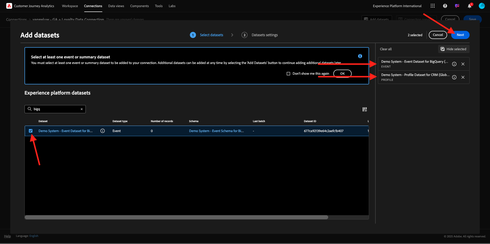
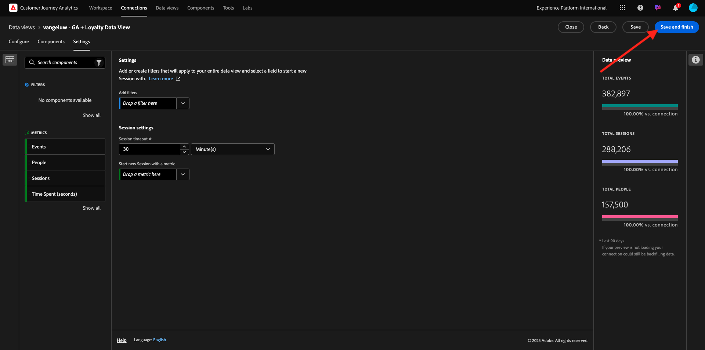
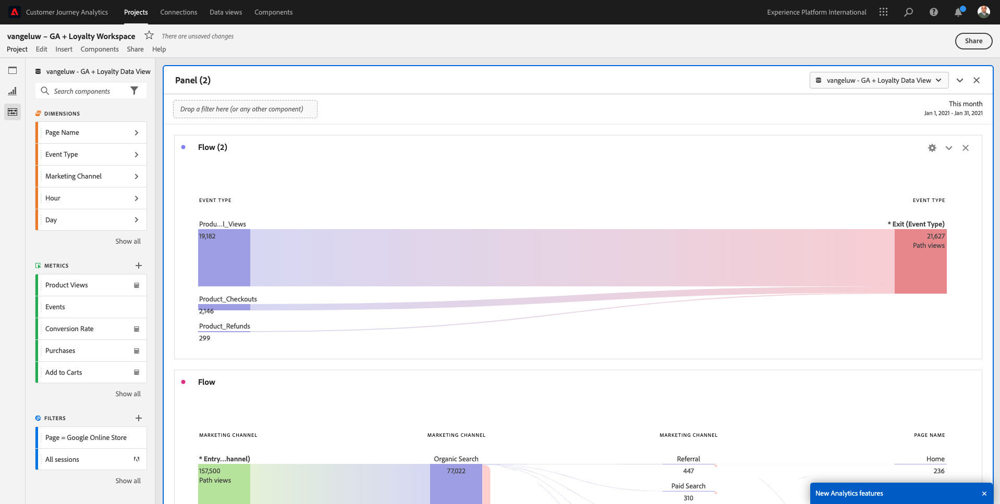

# 4.2.5 Analizar los datos de los Google Analytics mediante Customer Journey Analytics

## Objetivos

- Conecte nuestro conjunto de datos de BigQuery a Customer Journey Analytics (CJA)
- Conecte y únase a Google Analytics con Datos de fidelización.
- Familiarícese con la IU de CJA

## 4.2.5.1 Crear una conexión

Vaya a [analytics.adobe.com](https://analytics.adobe.com) para acceder al Customer Journey Analytics.

En la página de inicio del Customer Journey Analytics, vaya a **Connections**.

Aquí puede ver todas las diferentes conexiones realizadas entre CJA y Platform. Estas conexiones tienen el mismo objetivo que los grupos de informes en Adobe Analytics. Sin embargo, la recopilación de los datos es totalmente diferente. Todos los datos proceden de conjuntos de datos de Adobe Experience Platform.

Haga clic en **Crear nueva conexión**.

Verá la interfaz de usuario de **Crear conexión**.

Para el nombre, utilice este : `--aepUserLdap-- - GA + Loyalty Data Connection`.

Debe seleccionar la zona protegida correcta para utilizarla. En el menú de zona protegida, seleccione la zona protegida, que debe ser `--aepSandboxName--`. En este ejemplo, la zona protegida que se va a usar es **Tech Insiders**.

**Promedio de eventos diarios** en **menos de 1 millón**.

En el menú del conjunto de datos, ahora puede empezar a añadir conjuntos de datos. Haga clic en **Agregar conjuntos de datos**.

Los conjuntos de datos que se agregarán son:
- `Demo System - Profile Dataset for CRM (Global v1.1)`
- `Demo System - Event Dataset for BigQuery (Global v1.1)`

Busque ambos conjuntos de datos, marque su casilla de verificación y haga clic en **Siguiente**.

A continuación, verá esto:

Para el conjunto de datos `Demo System - Event Dataset for BigQuery (Global v1.1)`, cambie **ID de persona** a **loyaltyId** y establezca el **tipo de origen de datos** a **Datos web**. Habilite ambas opciones para **Importar todos los datos nuevos** y **rellenar todos los datos existentes**.

Para el conjunto de datos `Demo System - Event Dataset for BigQuery (Global v1.1)`, compruebe que el **ID de persona** esté establecido en **crmId** y establezca el **tipo de origen de datos** en **Datos web**. Habilite ambas opciones para **Importar todos los datos nuevos** y **rellenar todos los datos existentes**. Haga clic en **Agregar conjuntos de datos**.

Entonces, estarás aquí. Haga clic en **Guardar**.

Después de haber creado su **conexión**, es posible que pasen unas horas antes de que sus datos estén disponibles en CJA.

A continuación, verá la conexión en la lista de conexiones disponibles.

## 4.2.5.2 Crear una vista de datos

Con la conexión terminada, ahora puede progresar para influir en la visualización de. Una diferencia entre Adobe Analytics y CJA es que CJA necesita una vista de datos para limpiar y preparar los datos antes de la visualización.

Una vista de datos es similar al concepto de grupos de informes virtuales en Adobe Analytics, donde define definiciones de visitas según el contexto, filtros y también cómo se llaman los componentes.

Necesitará un mínimo de una vista de datos por conexión. Sin embargo, en algunos casos de uso, es recomendable tener varias vistas de datos para la misma conexión, con el objetivo de proporcionar perspectivas diferentes a equipos diferentes.

Si quiere que su empresa se base en los datos, debe adaptar cómo se ven los datos en cada equipo. Algunos ejemplos:

- Métricas de UX solo para el equipo de diseño de UX
- Utilice los mismos nombres para los KPI y las métricas para los Google Analytics que para los Customer Journey Analytics, de modo que el equipo de análisis digital solo pueda hablar un idioma.
- vista de datos filtrada para mostrar, por ejemplo, datos de 1 mercado solamente, o de 1 marca, o solo de dispositivos móviles.

En la pantalla **Conexiones**, marque la casilla de verificación que aparece delante de la conexión que acaba de crear. Haga clic en **Crear vista de datos**.

Se le redirigirá al flujo de trabajo **Crear vista de datos**.

Ahora puede configurar las definiciones básicas para la vista de datos. Cosas como el huso horario, el tiempo de espera de sesión o el filtrado de vista de datos (la parte de segmentación similar a los grupos de informes virtuales en Adobe Analytics).

La **conexión** que creó en el ejercicio anterior ya está seleccionada. Su conexión se llama `--aepUserLdap-- - GA + Loyalty Data Connection`.

A continuación, asigne un nombre a la vista de datos según esta convención de nomenclatura: `--aepUserLdap-- - GA + Loyalty Data View`.

Escriba el mismo valor para la descripción: `--aepUserLdap-- - GA + Loyalty Data View`.

Antes de realizar cualquier análisis o visualización, es necesario crear una vista de datos con todos los campos, dimensiones y métricas y su configuración de atribución.

| Campo | Convención de nomenclatura |
| ----------------- |-------------|  
| Nombre de conexión | `--aepUserLdap-- - GA + Loyalty Data View` | vangeluw: GA + vista de datos de fidelización |
| Descripción | `--aepUserLdap-- - GA + Loyalty Data View` |
| ID externo | `--aepUserLdap--GA` |

Haz clic en **Guardar y continuar**.

Haga clic en **Guardar**.

Ahora puede agregar componentes a la vista de datos. Como puede ver, algunas métricas y dimensiones se añaden automáticamente.

Agregue los siguientes componentes a la vista de datos. Asegúrese también de actualizar los nombres de campo a nombres descriptivos. Para ello, seleccione la métrica o dimensión y actualice el campo **Nombre del componente** en el menú derecho.

| Tipo de componente | Nombre original del componente | Nombre para mostrar | Ruta del componente |
| -----------------| -----------------|-----------------|-----------------|
| Métrica | commerce.checkouts.value | Cierres de compra | `commerce.checkouts.value` |
| Métrica | commerce.productListRemovals.value | Eliminaciones del carro | `commerce.productListRemovals.value` |
| Métrica | commerce.productListAdds | Adiciones al carro | `commerce.productListAdds` |
| Métrica | commerce.productViews.value | Vistas del producto | `commerce.productViews.value` |
| Métrica | commerce.purchases.value | Compras | `commerce.purchases.value` |
| Métrica | web.webPageDetails.pageViews | Page Views | `web.webPageDetails.pageViews` |
| Métrica | puntos | Puntos de fidelización | `_experienceplatform.loyaltyDetails.points` |
| Dimensión | nivel | Nivel de fidelización | `_experienceplatform.loyaltyDetails.level` |
| Dimensión | channel.mediaType | Traffic Medium | `channel.mediaType` |
| Dimensión | channel.typeAtSource | Traffic Source | `channel.typeAtSource` |
| Dimensión | Código de seguimiento | Canal de marketing | `marketing.trackingCode` |
| Dimensión | gaid | ID de Google Analytics | `_experienceplatform.identification.core.gaid` |
| Dimensión | web.webPageDetails.name | Título de página | `web.webPageDetails.name` |
| Dimensión | Proveedor | Explorador | `environment.browserDetails.vendor` |
| Dimensión | Tipo | Device Type | `device.type` |
| Dimensión | loyaltyId | ID de fidelización | `_experienceplatform.identification.core.loyaltyId` |
| Dimensión | commerce.order.payments.transactionID | El ID de transacción | `commerce.order.payments.transactionID` |
| Dimensión | eventType | Tipo de evento | `eventType` |
| Dimensión | timestamp | Marca de tiempo | `timestamp` |
| Dimensión | `_id` | Identificador | `_id` |

Luego tendrá algo así:...

A continuación, debe realizar algunos cambios en el contexto de persona y sesión para algunos de estos componentes cambiando **Configuración de atribución o persistencia**.

Cambie **Configuración de atribución** para los siguientes componentes:

| Componente |
| -----------------|
| Traffic Source |
| Canal de marketing |
| Explorador |
| Traffic Medium |
| Device Type |
| ID de Google Analytics |

Para ello, seleccione el componente, haga clic en **Usar modelo de atribución personalizado** y establezca el **Modelo** en **Más reciente** y la **Caducidad** en **Ventana de informes de persona**. Repita este proceso para todos los componentes mencionados anteriormente.

Después de realizar los cambios en la configuración de atribución para todos los componentes mencionados anteriormente, debe tener esta vista. Haz clic en **Guardar y continuar**.

En la pantalla **Configuración**, no se requieren cambios. Haga clic en **Guardar y finalizar**.

Ya está listo para analizar los datos de los Google Analytics en Adobe Analytics Analysis Workspace. Vamos a pasar al siguiente ejercicio.

## 4.2.5.3 Crear el proyecto

En Customer Journey Analytics, ve a **Workspace**. Haga clic en **Crear proyecto**

Seleccione **Proyecto Workspace en blanco** y haga clic en **Crear**.

Ahora tiene un proyecto en blanco:

Primero, guarde el proyecto y asígnele un nombre. Puede utilizar el siguiente comando para guardar:

| Sistema operativo | Método abreviado |
| ----------------- |-------------| 
| Windows | Control + S |
| Mac | Comando + S |

Verás esta ventana emergente. Utilice esta convención de nombres:

| Nombre | Descripción |
| ----------------- |-------------| 
| `--aepUserLdap-- – GA + Loyalty Workspace` | `--aepUserLdap-- – GA + Loyalty Workspace` |

A continuación, haga clic en **Guardar**.

A continuación, asegúrese de seleccionar la vista de datos correcta en la esquina superior derecha de la pantalla. Esta es la vista de datos que creó en el ejercicio anterior, con la convención de nombres `--aepUserLdap-- - GA + Loyalty Data View`.

### 4.2.5.3.1 Tablas improvisadas

Las tablas improvisadas funcionan, más o menos, como tablas dinámicas en Excel. Selecciona algo de la barra izquierda, lo arrastra y lo suelta en la forma libre y obtendrá un informe de tabla.

Las tablas improvisadas son casi ilimitadas. Puede hacer (casi) cualquier cosa y esto aporta mucho valor en comparación con los Google Analytics (ya que esta herramienta tiene algunas limitaciones de análisis). Esta es una de las razones para cargar datos de Google Analytics en otra herramienta de análisis.

Veamos dos ejemplos en los que necesita utilizar SQL, BigQuery y algo de tiempo para responder preguntas sencillas que no son posibles de hacer en la interfaz de usuario de Google Analytics o en Google Data Studio:

- ¿Cuántas personas llegan al cierre de compra desde el explorador Safari divididas por canal de marketing? Compruebe que el explorador Safari está filtrando la métrica de cierre de compra. Acabamos de arrastrar y soltar la variable Explorador = Safari en la parte superior de la columna de cierre de compra.

- Como analista, puedo ver que el Canal de marketing social tiene bajas conversiones. Utilizo la atribución de último contacto como predeterminada, pero ¿qué sucede con el primer contacto? Al pasar el ratón por encima de cualquier métrica, se muestra la configuración de la métrica. Ahí puedo seleccionar el modelo de atribución que desee. Puede realizar la atribución en GA (no en el estudio de datos) como una actividad independiente, pero no puede tener otras métricas o dimensiones no relacionadas con el análisis de atribución dentro de la misma tabla.

Respondamos a estas preguntas y a algunas más con Analysis Workspace en CJA.

En primer lugar, seleccione el intervalo de fechas correcto (**Hoy**) en el lado derecho del panel. Seleccionar **Aplicar**.

>[!NOTE]
>
>Si acaba de crear la **conexión de datos** y la **vista de datos**, es posible que tenga que esperar un par de horas. CJA necesita algo de tiempo para rellenar los datos históricos cuando hay una gran cantidad de registros de datos.

Vamos a arrastrar y soltar algunas dimensiones y métricas para analizar los canales de marketing. Primero use la dimensión **Canal de marketing** y arrástrela y suéltela en el lienzo de la **tabla de forma libre**. (Haga clic en **Mostrar todo** en caso de que no vea la métrica inmediatamente en el menú Métricas)

A continuación, verá esto:

A continuación, debe agregar las métricas a la tabla de forma libre. Debe agregar estas métricas: **Personas**, **Sesiones**, **Vistas del producto**, **Cierres de compra**, **Compras**, **Tasa de conversión** (Métrica calculada).

Para poder hacerlo, debe crear la Métrica calculada **Tasa de conversión**. Para ello, haga clic en el icono **+** junto a Métricas:

Como nombre para la métrica calculada, use **Tasa de conversión** y use **tasa de conversión** para **identificador externo**. A continuación, arrastre las métricas **purchase** y **sesiones** al lienzo. Establezca **Formato** en **Porcentaje** y **Lugares decimales** en **2**. Finalmente, haga clic en **Guardar**.

Haga clic en **Guardar**.

A continuación, para usar todas estas métricas en la **tabla de forma libre**, arrástrelas y suéltelas una por una en la **tabla de forma libre**. Consulte el ejemplo siguiente.

Terminarás con una mesa como esta...

Como se mencionó anteriormente, **las tablas de forma libre** le proporcionan la libertad que necesita para realizar análisis en profundidad. Por ejemplo, puede elegir cualquier otro Dimension para desglosar una métrica específica dentro de la tabla.

Por ejemplo, vaya a dimensiones, busque y seleccione la variable **Browser**.

A continuación, verá una descripción general de los valores disponibles para este Dimension.

Elija el Dimension **Safari** y arrástrelo y suéltelo sobre una métrica, por ejemplo **Cierres de compra**. A continuación, verá esto:

Al hacerlo, acaba de responder una pregunta potencial que tenía: ¿Cuántas personas llegan a la página de cierre de compra utilizando Safari, divididas por canal de marketing?

Respondamos ahora a la pregunta sobre la atribución.

Busque la métrica **Compra** en la tabla.

Pase el ratón sobre la métrica y aparecerá el icono **Settings**. Haga clic en ella.

Aparecerá un menú contextual. Marque la casilla de verificación de **modelo de atribución no predeterminado**.

En la ventana emergente que verá, puede cambiar fácilmente los modelos de atribución y la ventana retrospectiva (que es bastante compleja de lograr con SQL).

Seleccione **Primer contacto** como modelo de atribución.

Elija **Persona** para la ventana retrospectiva.

Ahora haga clic en **Aplicar**.

Ahora puede ver que el modelo de atribución para esa métrica en particular es Ahora Primer contacto.

Puede realizar todos los desgloses que desee, sin límites de tipos de variables, segmentos, dimensiones o intervalos de fechas.

Algo aún más especial es la capacidad de unirse a cualquier conjunto de datos de Adobe Experience Platform para enriquecer los datos de comportamiento digital de los Google Analytics. Por ejemplo, datos sin conexión, de centro de llamadas, de fidelidad o CRM.

Para mostrar esa funcionalidad, vamos a configurar su primer desglose que combine datos sin conexión con datos en línea. Elija la dimensión **Nivel de fidelidad** y arrástrela y suéltela en cualquier **Canal de marketing**, por ejemplo, **Búsqueda orgánica**:

A continuación, analicemos qué **Tipo de dispositivo** utilizan los clientes que llegaron al sitio usando **Búsqueda orgánica** con un **Nivel de fidelidad** que es **Bronce**. Tome el Dimension **Device Type** y arrástrelo y suéltelo en **Bronze**. A continuación, verá esto:

Puede ver que, para el primer desglose, se utiliza Nivel de fidelidad. Esta dimensión proviene de un conjunto de datos y un esquema diferentes a los que utilizó para el conector BigQuery. La ID de persona **loyaltyID** (Sistema de demostración - Esquema de evento para BigQuery (Global v1.1)) y **loyaltyID** (Sistema de demostración - Esquema de perfil para fidelidad (Global v1.1)) coinciden entre sí. Por lo tanto, puede combinar eventos de experiencia de Google Analytics con datos de perfil del esquema de fidelización.

Podemos seguir dividiendo las filas con segmentos o intervalos de fechas específicos (tal vez para reflejar campañas de TV específicas) para hacer preguntas al Customer Journey Analytics y obtener respuestas sobre la marcha.

Lograr el mismo resultado final con SQL y, a continuación, una herramienta de visualización de terceros es todo un desafío. Especialmente cuando haces preguntas y tratas de obtener las respuestas sobre la marcha. Customer Journey Analytics no tiene este desafío y permite a los analistas de datos consultar los datos de forma flexible y en tiempo real.

## 4.2.5.3.2 Análisis de canales o de abandonos

Los canales son un excelente mecanismo para comprender los pasos principales de un recorrido del cliente. Estos pasos también pueden proceder de interacciones sin conexión (por ejemplo, desde el centro de llamadas) y, a continuación, puede combinarlos con puntos de contacto digitales en el mismo canal.

Customer Journey Analytics le permite hacer eso y mucho más. Si recuerda el Módulo 13, hemos sido capaces de hacer clic con el botón derecho y hacer cosas como:

- Analizar a dónde van los usuarios después de un paso de visitas en el orden previsto
- Cree un segmento a partir de cualquier punto del canal
- Consulte Tendencia en cualquier fase de una visualización de gráfico de líneas

Veamos otra cosa que puede hacer: ¿Cómo se compensa mi canal de Recorrido del cliente este mes con el mes anterior? ¿Qué hay de móvil frente a escritorio?

A continuación creará dos paneles:

- Análisis de canal (enero)
- Análisis de canal (febrero)

Verá que estamos comparando un embudo en diferentes periodos de tiempo (enero y febrero) divididos por Tipo de dispositivo.

Este tipo de análisis no es posible dentro de la interfaz de usuario de Google Analytics o es muy limitado. Por lo tanto, CJA añade mucho valor a los datos capturados por los Google Analytics.

Para crear la primera visualización de abandonos. Cierre el panel actual para empezar con uno nuevo.

Fíjese en el lado derecho del panel y haga clic en la flecha para cerrarlo.

A continuación, haga clic en **+** para crear un panel nuevo.

Ahora seleccione la visualización **Visitas en el orden previsto**.

Como analista, imagine que desea comprender lo que está sucediendo con su canal de comercio electrónico principal: Inicio > Búsqueda interna > Detalles del producto > Cierre de compra > Compra.

Empecemos por añadir algunos pasos nuevos al canal. Para ello, abra la dimensión **Nombre de página**.

A continuación, verá todas las páginas disponibles que se han visitado.

Arrastre y suelte **Home** en el primer paso.

Como segundo paso, use **Almacenar resultados de búsqueda**

Ahora necesita agregar algunas acciones de comercio electrónico. En los Dimension, busque la dimensión Dimension **Tipo de evento**. Haga clic en para abrir la dimensión.

Seleccione **Product_Detail_Views** y arrástrelo y suéltelo en el paso siguiente.

Seleccione **Product_Checkouts** y arrástrelo y suéltelo en el paso siguiente.

Cambie el tamaño de la visualización de abandonos.

La visualización de abandonos ya está lista.

Para empezar a analizar y documentar las perspectivas, siempre es buena idea realizar una visualización de **Texto**. Para agregar una visualización de **Texto**, haga clic en el icono **Gráfico** en el menú de la izquierda para ver todas las visualizaciones disponibles. A continuación, arrastre y suelte la visualización **Text** en el lienzo. Cambie el tamaño y muévalo para que se parezca a la imagen siguiente.

Y, de nuevo, cambie su tamaño para adaptarlo al tablero de mandos:

Las visualizaciones de visitas en el orden previsto también permiten desgloses. Use la dimensión **Tipo de dispositivo** abriéndola y arrastrando y soltando algunos de los valores uno por uno en la visualización:

Al final, tendrá una visualización más avanzada:

Customer Journey Analytics le permite hacer eso y mucho más. Al hacer clic con el botón derecho en cualquier lugar de la visita en orden previsto, puede...

- Analizar a dónde van los usuarios desde un paso de abandonos
- Cree un segmento a partir de cualquier punto del canal
- Tendencia de cualquier paso en una visualización de Línea
- Compare cualquier embudo con diferentes periodos de tiempo de forma visual.

Por ejemplo, haga clic con el botón derecho en cualquier paso de la visita en el orden previsto para ver algunas de estas opciones de análisis.

## 4.2.5.3.3 Análisis y visualización de flujo

Si desea realizar análisis de flujo avanzados con Google Analytics, debe utilizar SQL para extraer los datos y, a continuación, utilizar una solución de terceros para la parte de visualización. El Customer Journey Analytics ayudará con eso.

En este paso, configurará un análisis de flujo para responder a esta pregunta: ¿Cuáles son los principales canales de contribución antes de una página de aterrizaje específica?  Con dos arrastrar y soltar y un clic, como analista, puede descubrir el flujo del usuario hacia la página de aterrizaje con los dos últimos toques de los canales de marketing.

Otras preguntas que el Customer Journey Analytics puede ayudarle a responder:

- ¿Cuál es la combinación principal de canales antes de una página de aterrizaje específica?
- ¿Qué hace que un usuario salga de la sesión cuando llega a Product_Checkout? ¿Dónde estaban los pasos anteriores?

Comencemos de nuevo con un panel en blanco para responder a estas preguntas. Cierre el panel actual y haga clic en **+**.

Ahora seleccione la visualización **Flujo**.

Ahora vamos a configurar un análisis de flujo de canal de marketing de varias rutas. Arrastre y suelte la dimensión **Canal de marketing** en el área de **Dimension de entrada**.

Ahora puede ver las primeras rutas de entrada:

Haga clic en la primera ruta para verla en profundidad.

Ahora puede ver la siguiente ruta (Canal de marketing).

Vamos a hacer un tercer análisis en profundidad. Haga clic en la primera opción de la nueva ruta, **Referencia**.

Ahora debería ver la visualización de esta manera:

Vamos a complicar las cosas. Imagine que desea analizar cuál era la página de aterrizaje después de dos rutas de marketing? Para ello, puede utilizar una dimensión secundaria para cambiar la última ruta. Busque la dimensión **Nombre de página**, arrástrela y suéltela de esta manera:

Ahora verá lo siguiente:

Vamos a hacer otro análisis de flujo. Esta vez analizará lo que ha sucedido después de un punto de salida específico. Otras soluciones de Analytics requieren el uso de SQL/ETL y, de nuevo, una herramienta de visualización de terceros para lograr lo mismo.

Traer una nueva **visualización de flujo** al panel.

A continuación, tendrá esto:

Busque el Dimension **Tipo de evento** y arrástrelo y suéltelo en el área **Dimensión de salida**.

Ahora puede ver qué **rutas de tipo de evento** condujeron a los clientes a la salida.

Vamos a investigar lo que pasó antes de la salida de la caja-acción. Haga clic en la ruta **Product_Checkouts**:

Aparecerá una nueva ruta de acción con algunos datos que no son reveladores.

¡Analicemos más a fondo! Busque el Dimension **Nombre de página** y arrástrelo y suéltelo en la nueva ruta generada.

Ahora tiene un análisis de flujo avanzado en minutos. Puede hacer clic en las diferentes rutas para ver cómo se conectan desde la salida a los pasos anteriores.

Ahora dispone de un potente kit para analizar canales y explorar rutas de comportamiento del cliente a través de puntos de contacto digitales, pero también sin conexión.

No olvide guardar los cambios.

## 4.2.5.4 Compartir el proyecto

>[!IMPORTANT]
>
>El contenido siguiente está pensado para su información - Usted **NO** tiene que compartir su proyecto con otra persona.

Para su información: puede compartir este proyecto con compañeros para colaborar o analizar preguntas comerciales juntos.

Siguiente paso: [Resumen y beneficios](./summary.md)

[Volver al módulo 4.2](./customer-journey-analytics-bigquery-gcp.md)

[Volver a todos los módulos](./../../../overview.md)
