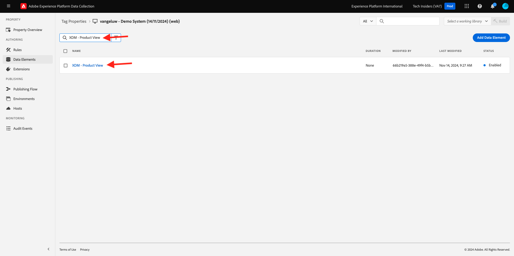

# 1.1.3 Introducción a la recopilación de datos de Adobe Experience Platform

## Contexto

Ahora vamos a echar un vistazo más profundo a los componentes básicos de la recopilación de datos de Adobe Experience Platform para comprender qué se instala en su sitio web de demostración. Observará de cerca la extensión SDK para web de Adobe Experience Platform, configurará un elemento de datos y una regla y aprenderá a publicar una biblioteca.

## Extensión de SDK web de Adobe Experience Platform

Una extensión es un conjunto de código empaquetado que amplía la interfaz de recopilación de datos de Adobe Experience Platform y la funcionalidad de la biblioteca. La recopilación de datos de Adobe Experience Platform es la plataforma y las extensiones son como aplicaciones que se ejecutan en la plataforma. Todas las extensiones utilizadas en el tutorial se crean y administran mediante Adobe, pero los terceros pueden crear sus propias extensiones para limitar la cantidad de código personalizado que los usuarios de recopilación de datos de Adobe Experience Platform deben administrar.

Vaya a [Recopilación de datos de Adobe Experience Platform](https://experience.adobe.com/launch/) y seleccione **Etiquetas**.

Esta es la página de Propiedades de recopilación de datos de Adobe Experience Platform que vio antes.

En **Introducción**, Demo System creó dos propiedades de cliente para usted: una para el sitio web y otra para la aplicación móvil. Encuéntralos buscando `--aepUserLdap--` en el cuadro **[!UICONTROL Buscar]**.
Haga clic para abrir la propiedad **Web**.

A continuación, verá la página Información general de la propiedad. Haz clic en **[!UICONTROL Extensiones]** en el carril izquierdo, luego haz clic en **SDK web de Adobe Experience Platform** y, a continuación, haz clic en **[!UICONTROL Configurar]**.

Bienvenido al SDK web de Adobe Experience Platform. Aquí puede configurar la extensión con la secuencia de datos que creó en [Introducción](./../../../modules/gettingstarted/gettingstarted/ex2.md), así como algunas configuraciones más avanzadas.

El dominio Edge predeterminado es siempre **edge.adobedc.net**. Si ha implementado una configuración CNAME en su entorno de Adobe Experience Cloud o Adobe Experience Platform, deberá actualizar el **[!UICONTROL dominio de Edge]**.

Si el dominio Edge de su instancia es diferente del predeterminado, actualice el dominio Edge aquí. Si no está seguro, utilice el dominio predeterminado. Un dominio Edge permite configurar un servidor de seguimiento de origen, que a su vez utiliza una configuración CNAME en el back-end para garantizar que los datos se recopilen en el Adobe.

En **[!UICONTROL Datastreams]**, ya seleccionó su secuencia de datos en la sección **Introducción**. Ha seleccionado esta secuencia de datos: `--aepUserLdap-- - Demo System Datastream`, de la lista del cuadro **[!UICONTROL Secuencia de datos]**, para cada uno de los entornos.

Haga clic en **[!UICONTROL Guardar]** para volver a la vista Extensiones.

## Elementos de datos

Los Data Elements son los componentes básicos del diccionario de datos (o mapa de datos). Utilice Data Elements para recopilar, organizar y entregar datos a través de la tecnología de marketing y publicidad.

Un solo elemento de datos es una variable cuyo valor puede asignarse a cadenas de consulta, URL, valores de cookies, variables JavaScript, etc. Puede hacer referencia a este valor por su nombre de variable en toda la recopilación de datos de Adobe Experience Platform. Esta colección de Data Elements se convierte en el diccionario de los datos definidos que puede utilizar para crear reglas (eventos, condiciones y acciones). Este diccionario de datos se comparte en toda la recopilación de datos de Adobe Experience Platform para utilizarlo con cualquier extensión agregada a su propiedad.

Ahora va a editar un elemento de datos ya existente en un formato compatible con SDK web.

Haga clic en Elementos de datos en el carril izquierdo para que se le redirija a la página Elementos de datos.

>[!NOTE]
>
>Solo está editando un elemento de datos en este ejercicio, pero puede ver el botón **[!UICONTROL Agregar elemento de datos]** en esta página, que se usaría para agregar una nueva variable al diccionario de datos. Esto se podría utilizar en toda la recopilación de datos de Adobe Experience Platform. No dude en consultar algunos de los demás elementos de datos ya existentes, la mayoría de los cuales utilizan el almacenamiento local como fuente de datos.

En la barra de búsqueda, escriba **XDM - Vista de producto** y haga clic en el elemento de datos que devuelve.

Esta pantalla muestra el objeto XDM que va a editar. El Experience Data Model (XDM) es un concepto que se explorará mucho más a lo largo de este Tutorial técnico, pero por ahora es suficiente para entenderlo como el formato que requiere el SDK web de Adobe Experience Platform. Agregarás un poco más de información a los datos recopilados en las páginas de artículos del sitio web de demostración.

Haga clic en el botón &quot;+&quot; junto a **web**, en la parte inferior del árbol.

Haga clic en el botón &quot;+&quot; junto a **webPageDetails**.

Haz clic en **siteSection**. Ahora ve que **siteSection** aún no está vinculada a ningún elemento de datos. Vamos a cambiar eso.

Desplácese hacia arriba e introduzca el texto `%Product Category%`. Haga clic en **[!UICONTROL Guardar]**.

En este punto, la extensión SDK para web de Adobe Experience Platform está instalada y ha actualizado un elemento de datos para recopilar datos con una estructura XDM. A continuación, vamos a comprobar las reglas que enviarán datos en el momento correcto.

## Reglas

La recopilación de datos de Adobe Experience Platform es un sistema basado en reglas. Busca la interacción de usuarios y datos asociados. Cuando se cumplen los criterios descritos en las reglas, la regla activa la extensión, script o el código del lado del cliente identificados.

Genere reglas para integrar los datos y las funciones de marketing y tecnología publicitaria que unifique productos dispares en una única solución.

Vamos a desglosar la regla que envía datos en páginas de artículos.

Haz clic en **[!UICONTROL Reglas]** en el carril izquierdo.

**[!UICONTROL Buscar]** por `Product View`.

Haga clic en la regla que devuelve.

Veamos los elementos individuales que componen esta regla.

Para todas las reglas: si se produce un **[!UICONTROL evento]** especificado, se evalúan las **[!UICONTROL condiciones]** y, a continuación, las **[!UICONTROL acciones]** especificadas se realizan si es necesario.

Haga clic en el evento **Principal - Evento personalizado**. Esta es la vista que se carga.

Haga clic en el menú desplegable **Tipo de evento**.

En esta sección se enumeran algunas de las interacciones estándar que se pueden utilizar para indicar a la recopilación de datos de Adobe Experience Platform que ejecute las acciones en caso de que se cumplan las condiciones.

Haga clic en **[!UICONTROL Cancelar]** para volver a la regla.

Haga clic en la acción **Enviar evento de experiencia de &quot;vista de producto&quot;**.

Aquí puede ver los datos que el SDK web de Adobe Experience Platform envía al perímetro de. Más específicamente, se usa la **aleación** **[!UICONTROL instancia]** del SDK web. El evento **[!UICONTROL Type]** está establecido en **Vistas del producto Commerce (carrito)** y los datos XDM que está enviando son el elemento de datos **XDM - Vista del producto** que cambió anteriormente.

Ahora que ha consultado la regla, puede publicar todos los cambios en la recopilación de datos de Adobe Experience Platform.

## Publish en una biblioteca

Finalmente, para validar la regla y el elemento de datos que acaba de actualizar, debe publicar una biblioteca que contenga los elementos editados en nuestra propiedad. Hay algunos pasos rápidos que debe seguir en la sección **[!UICONTROL Publicación]** de la recopilación de datos de Adobe Experience Platform.

Haga clic en **[!UICONTROL Flujo de publicación]** en el panel de navegación izquierdo

Haga clic en la biblioteca existente, llamada **Principal**.

Haga clic en el botón **Agregar todos los recursos modificados**. Siguiente,
Haga clic en el botón **Guardar y generar para desarrollo**.

La biblioteca puede tardar unos minutos en crearse y, cuando se complete, mostrará un punto verde a la izquierda del nombre de la biblioteca.

Como puede ver en la pantalla Flujo de publicación, hay mucho más en el proceso de publicación de la recopilación de datos de Adobe Experience Platform que está fuera del ámbito de este tutorial. Solo vamos a usar una sola biblioteca en nuestro entorno de desarrollo.

Paso siguiente: [1.1.4 Recopilación de datos web del lado del cliente](./ex4.md)

[Volver al módulo 1.1](./data-ingestion-launch-web-sdk.md)

[Volver a todos los módulos](./../../../overview.md)
