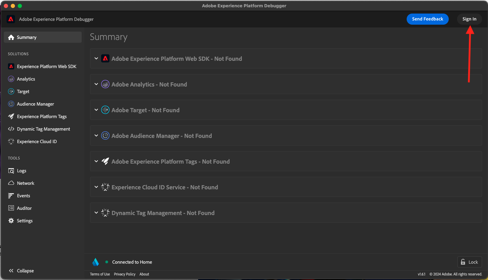
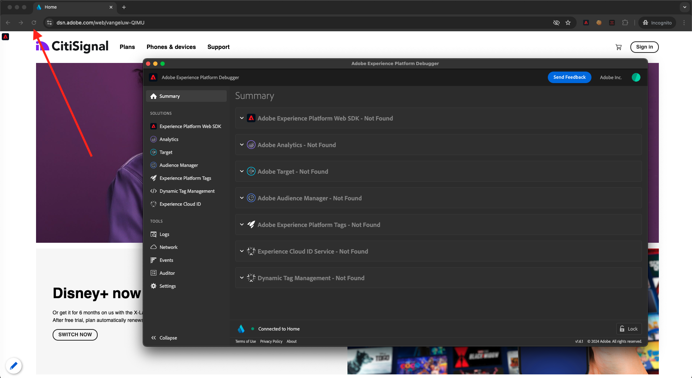

# 1.1.4 Recopilación de datos web del lado del cliente

## Validar los datos de la solicitud

### Instalación de Adobe Experience Platform Debugger

Experience Platform Debugger es una extensión disponible para los navegadores Chrome y Firefox que permite ver la tecnología de Adobe implementada en las páginas web. Instale la versión de su navegador preferido:

- [Extensión de Firefox](https://addons.mozilla.org/es/firefox/addon/adobe-experience-platform-dbg/)

- [Extensión de Chrome](https://chrome.google.com/webstore/detail/adobe-experience-platform/bfnnokhpnncpkdmbokanobigaccjkpob)

Adobe Experience Cloud Si nunca antes ha utilizado Debugger (y este es diferente del anterior), puede que desee ver este vídeo de información general de cinco minutos:

>[!VIDEO](https://video.tv.adobe.com/v/32156?quality=12&learn=on&enablevpops)

Dado que cargará el sitio web de demostración en modo incógnito, debe asegurarse de que Experience Platform Debugger también esté disponible en modo incógnito. Para ello, vaya a **chrome://extensions** en el explorador y abra la extensión de Experience Platform Debugger.

Compruebe que estos 2 ajustes están activados:

- Modo de desarrollador
- Permitir en incógnito

### Abrir el sitio web de demostración

Vaya a [https://dsn.adobe.com](https://dsn.adobe.com). Después de iniciar sesión con su Adobe ID, verá esto. Haga clic en los 3 puntos **...** del proyecto del sitio web y, a continuación, haga clic en **Ejecutar** para abrirlo.

A continuación, verá cómo se abre el sitio web de demostración. Seleccione la URL y cópiela en el portapapeles.

Abra una nueva ventana del explorador de incógnito.

Pegue la dirección URL del sitio web de demostración, que copió en el paso anterior. Luego se le pedirá que inicie sesión con su Adobe ID.

Seleccione el tipo de cuenta y complete el proceso de inicio de sesión.

Luego verá el sitio web cargado en una ventana de incógnito del explorador. Para cada demostración, deberá utilizar una ventana nueva del explorador de incógnito para cargar la URL del sitio web de demostración.

### Usar Experience Platform Debugger para ver las llamadas que se realizan a Edge

Asegúrese de tener abierto el sitio web de demostración y haga clic en el icono de la extensión de Experience Platform Debugger.

Se abrirá Debugger para mostrar los detalles de la implementación creada en la propiedad de recopilación de datos de Adobe Experience Platform. Recuerde que está depurando la extensión y las reglas que acaba de editar.

Haga clic en el botón **[!UICONTROL Iniciar sesión]** en la parte superior derecha para autenticarse. Si ya tiene una pestaña del explorador abierta con la interfaz de recopilación de datos de Adobe Experience Platform, el paso de autenticación será automático y no tendrá que volver a introducir su nombre de usuario y contraseña.

Se iniciará sesión en el depurador.

Pulse el botón de recarga del sitio web de demostración para conectar el depurador a esa pestaña específica.

Confirme que Debugger está **[!UICONTROL conectado a la página principal]**, como se muestra arriba, y luego haga clic en el icono **[!UICONTROL bloquear]** para bloquear Debugger en el sitio web de demostración. Si no lo hace, Debugger seguirá cambiando para exponer los detalles de implementación de cualquier pestaña del explorador que esté enfocada, lo que puede resultar confuso. Una vez que el depurador esté bloqueado, el icono cambiará a **Desbloquear**.

A continuación, vaya a cualquier página del sitio web de demostración, como la página de categoría **Planes**.

Ahora haga clic en **[!UICONTROL Experience Platform Web SDK]** en el panel de navegación izquierdo para ver las **[!UICONTROL solicitudes de red]**.

Cada solicitud contiene una fila **[!UICONTROL events]**.

Haga clic para abrir una fila **[!UICONTROL events]**. Observe cómo puede ver el evento **web.webpagedetails.pageViews**, así como otras variables integradas que se ajustan al formato **Web SDK ExperienceEvent XDM**.

Estos tipos de detalles de solicitud también están visibles en la pestaña Red (Network). Filtre las solicitudes con **interaction** para localizar las solicitudes enviadas por Web SDK. Puede encontrar todos los detalles de la carga útil XDM en la sección Carga útil:

Siguiente paso: [1.1.5 Implementar Adobe Analytics y Adobe Audience Manager](./ex5.md)

[Volver al módulo 1.1](./data-ingestion-launch-web-sdk.md)

[Volver a todos los módulos](./../../../overview.md)
