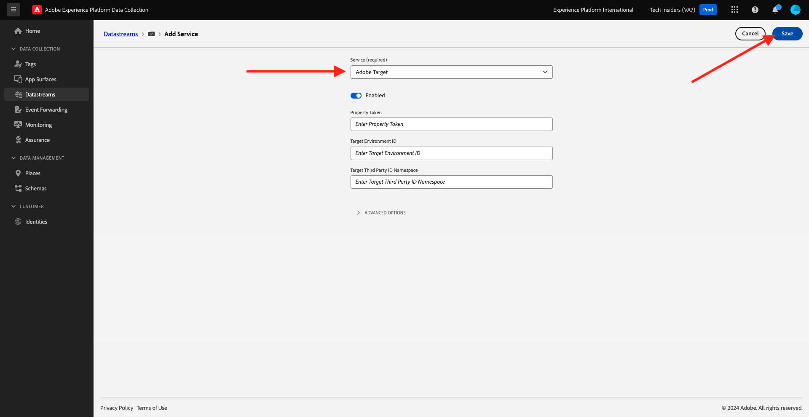

# 1.1.6 Implementación de Adobe Target

## 1.1.6.1 Actualizar el conjunto de datos para utilizar Adobe Target

Si desea enviar datos recopilados por el SDK web a Adobe Target y obtener una respuesta de Adobe Target con una experiencia personalizada para cada cliente, siga estos pasos.

Vaya a [https://experience.adobe.com/launch/](https://experience.adobe.com/launch/) y luego a **Datastreams**.

En la esquina superior derecha de la pantalla, seleccione el nombre de la zona protegida, que debe ser `--aepSandboxName--`. Abra la secuencia de datos específica, que se llama `--aepUserLdap-- - Demo System Datastream`.

Entonces verá esto... Para habilitar Adobe Target, haga clic en **+Agregar servicio**.

Entonces verá esto... Seleccione el servicio **Adobe Target**, después del cual puede proporcionar información adicional de forma opcional. En este momento no es necesario guardar esto, así que haz clic en **Cancelar**.

Paso siguiente: [1.1.7 Requisitos de esquema XDM en Adobe Experience Platform](./ex7.md)

[Volver al módulo 1.1](./data-ingestion-launch-web-sdk.md)

[Volver a todos los módulos](./../../../overview.md)
