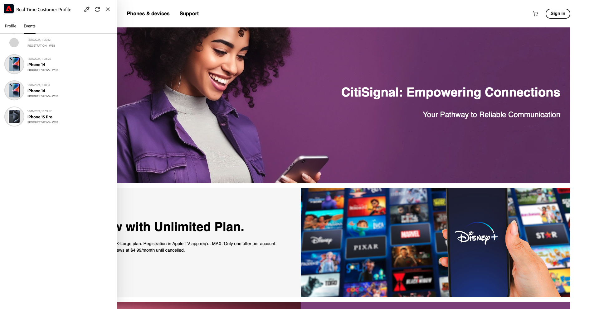

# 1.2.1 - De desconocido a conocido en el sitio web

## Contexto

El recorrido de lo desconocido a lo conocido es uno de los temas más importantes entre las marcas en estos días, como lo es el recorrido del cliente desde la adquisición hasta la retención.

Adobe Experience Platform juega un papel muy importante en este recorrido. Platform es el cerebro para la comunicación, el sistema de experiencia de registro.

Platform es un entorno en el cual la palabra **customer** es más amplia que solo **known**-customers. Esto es algo muy importante a mencionar al hablar con marcas: un visitante desconocido en el sitio web también es un cliente desde la perspectiva de Platform y, como tal, todo el comportamiento como visitante desconocido también se envía a Platform. Gracias a ese enfoque, cuando este cliente finalmente se convierte en un cliente conocido, una marca puede visualizar lo que sucedió antes de ese momento también. Esto ayuda desde la perspectiva de la atribución y la optimización de la experiencia.

## ¿Qué vas a hacer?

Ahora introducirá datos en Adobe Experience Platform y esos datos se vincularán a identificadores como ECID y direcciones de correo electrónico. El objetivo de esto es comprender el contexto empresarial de lo que está a punto de hacer desde la perspectiva de la configuración. En el siguiente ejercicio, empezará a configurar todo lo que necesita para que la ingesta de datos sea posible en su propio entorno de zona protegida.

### Flujo de Recorrido del cliente

Vaya a [https://builder.adobedemo.com/projects](https://builder.adobedemo.com/projects). Después de iniciar sesión con su Adobe ID, verá esto. Haga clic en el proyecto del sitio web para abrirlo.

A continuación, verá cómo se abre el sitio web de demostración. Seleccione la URL y cópiela en el portapapeles.

Abra una nueva ventana del explorador de incógnito.

Pegue la dirección URL del sitio web de demostración, que copió en el paso anterior. Luego se le pedirá que inicie sesión con su Adobe ID.

Seleccione el tipo de cuenta y complete el proceso de inicio de sesión.

Luego verá el sitio web cargado en una ventana de incógnito del explorador. Para cada demostración, deberá utilizar una ventana nueva del explorador de incógnito para cargar la URL del sitio web de demostración.

Haga clic en el Adobe del logotipo situado en la esquina superior izquierda de la pantalla para abrir el Visor de perfiles.

Eche un vistazo al panel Visor de perfiles y al Perfil del cliente en tiempo real con el **ID de Experience Cloud** como identificador principal de este cliente actualmente desconocido.

También puede ver todos los eventos de experiencia recopilados según el comportamiento del cliente. La lista está actualmente vacía, pero cambiará pronto.

Vaya a la categoría de producto **Hombres**. A continuación, haz clic en el producto **Montana Wind Jacket**.

A continuación, verá la página de detalles del producto. Ahora se ha enviado a Adobe Experience Platform un evento de experiencia de tipo **Vista de producto** mediante la implementación del SDK web que revisó en el módulo 1.

Abra el panel Visor de Provile y eche un vistazo a los **Eventos de experiencia**.

Vuelva a la página de categoría **Mujeres** y haga clic en otro producto. Se ha enviado otro evento de experiencia a Adobe Experience Platform.

Abra el panel Visor de perfiles. Ahora verá 2 eventos de experiencia del tipo **Vista de producto**. Aunque el comportamiento es anónimo, podemos rastrear cada clic y almacenarlo en Adobe Experience Platform. Una vez que se conozca al cliente anónimo, podremos fusionar automáticamente todos los comportamientos anónimos con el perfil conocido.

Vaya a la página Registrar/Iniciar sesión. Haga clic en **CREAR UNA CUENTA**.

Complete sus detalles y haga clic en **Registrarse** después de lo cual se le redirigirá a la página anterior.

Abra el panel Visualizador de perfiles y vaya a Perfil del cliente en tiempo real. En el panel Visor de perfiles, debería ver todos los datos personales que se muestran, como los identificadores de correo electrónico y teléfono que acaba de agregar.

En el panel Visor de perfiles, vaya a Eventos de experiencia. Verá los 2 productos que vio antes en el panel Visor de perfiles. Ambos eventos ahora también están conectados al perfil &quot;conocido&quot;.

Ahora ha introducido datos en Adobe Experience Platform y los ha vinculado a identificadores como ECID y direcciones de correo electrónico. El objetivo de esto es comprender el contexto empresarial de lo que está a punto de hacer. En el siguiente ejercicio, empezará a configurar todo lo que necesita para que sea posible toda esa ingesta de datos.

Siguiente paso: [1.2.2 Configurar esquemas y establecer identificadores](./ex2.md)

[Volver al módulo 1.2](./data-ingestion.md)

[Volver a todos los módulos](../../../overview.md)
