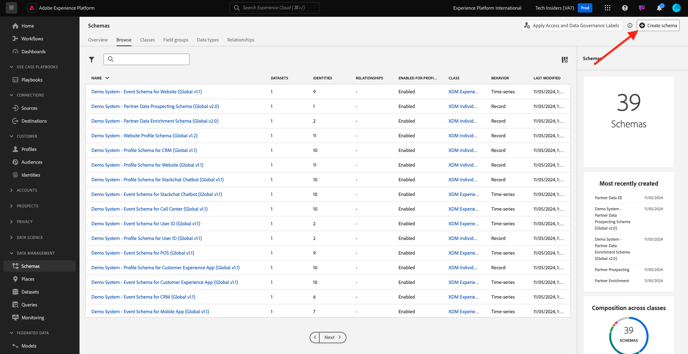
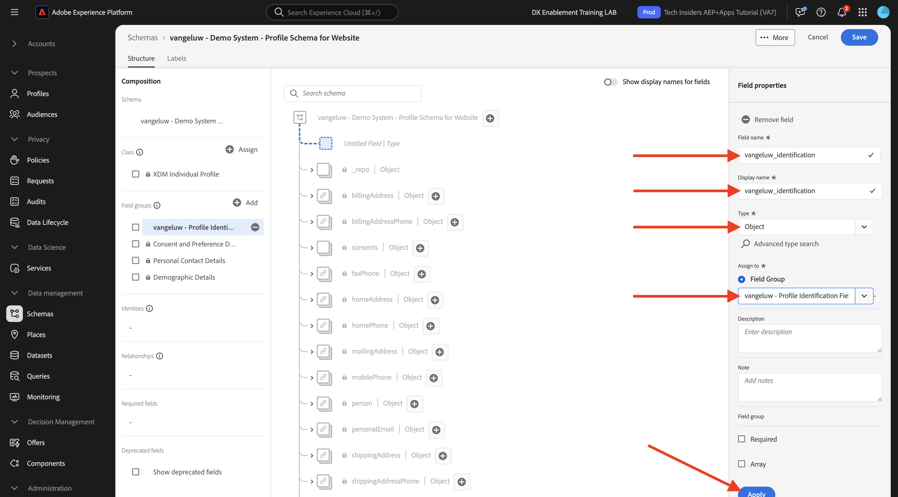
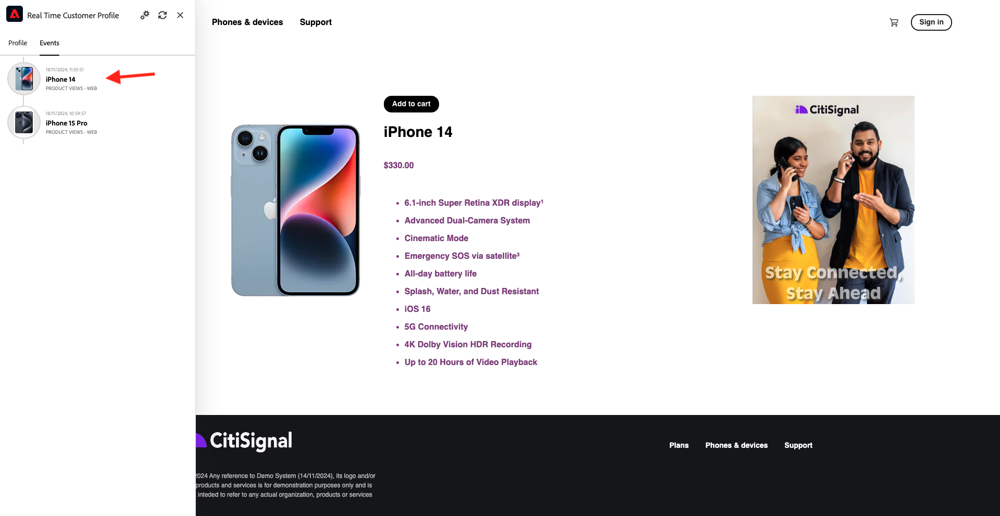
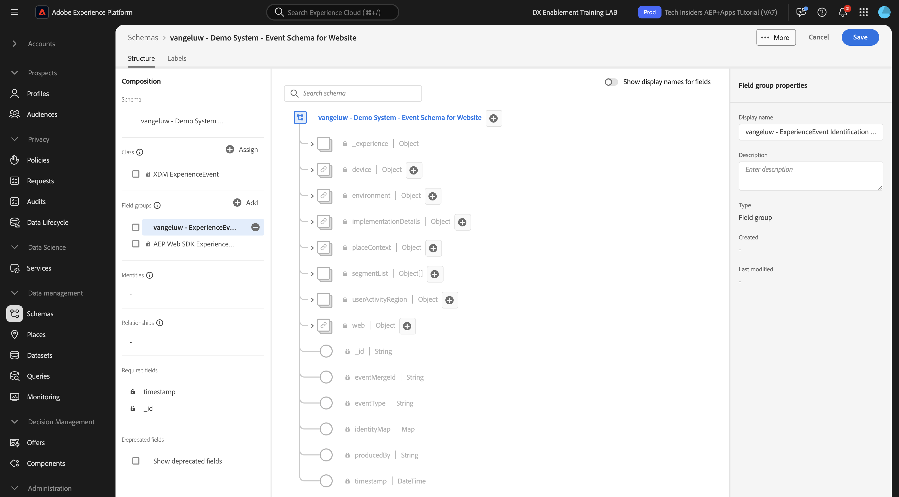

# 1.2.2 Configuración de esquemas y definición de identificadores

En este ejercicio, configurará los esquemas XDM necesarios para clasificar la información de perfil y el comportamiento del cliente. En cada esquema XDM, también debe configurar un identificador principal para vincular toda la información a.

## Historia

Antes de empezar a configurar los esquemas XDM y a definir los identificadores principales, tenemos que pensar en el contexto empresarial de lo que estamos intentando hacer:

- Desea datos
- Desea vincular datos a un cliente
- Desea crear un perfil de cliente progresivo en tiempo real

Existen dos tipos de datos que queremos capturar:

- ¿Quién es este cliente?
- ¿Qué hace este cliente?

Sin embargo, la pregunta **¿Quién es este cliente?** es una pregunta muy abierta que tiene muchas respuestas. Cuando su empresa desea ver respondida esta pregunta, está buscando información demográfica como Nombre, Apellidos y Dirección. Pero también para información de contacto, como una dirección de correo electrónico o un número de teléfono móvil. Y también para información relacionada con el idioma, OptIn/OptOut y tal vez incluso imágenes de perfil. Y, por último, lo que realmente necesita saber es cómo identificaremos a este cliente en los distintos sistemas que utiliza su compañía.

Lo mismo ocurre con la pregunta **¿Qué hace este cliente?**. Es una pregunta muy abierta con muchas respuestas. Cuando su empresa desea ver respondida esta pregunta, está buscando cualquier interacción que un cliente haya tenido con cualquiera de sus propiedades en línea y sin conexión. ¿Qué páginas o productos se han visitado? ¿Este cliente ha añadido un producto a su carro de compras o incluso ha comprado un artículo? ¿Qué dispositivo y navegador se ha utilizado para navegar por el sitio web? ¿Qué tipo de información busca este cliente y cómo podemos utilizarla para configurar y ofrecer una experiencia agradable a este cliente? Y, por último, lo que realmente necesitamos saber es cómo identificaremos a este cliente en los distintos sistemas que utilizará su compañía.

## 1.2.1.1: quién es este cliente

Capturando la respuesta a **¿Quién es este cliente?** para su compañía se completó a través de la página de inicio de sesión/registro.

Desde la perspectiva de esquema, vemos esto como una **Clase**. La pregunta: **¿Quién es este cliente?** es algo que definimos en la clase **[!UICONTROL XDM Individual Profile]**.

Por lo tanto, cuando crea un esquema XDM para capturar la respuesta a **, ¿quién es este cliente?**, en primer lugar, tendrá que crear y definir 1 esquema que haga referencia a la clase **[!UICONTROL XDM Individual Profile]**.

Para especificar qué tipo de respuestas se pueden dar a esa pregunta, necesitará definir [!UICONTROL Grupos de campos]. [!UICONTROL Los grupos de campos] son extensiones de la clase Profile y tienen configuraciones muy específicas. Por ejemplo, la información demográfica como Nombre, Apellido, Sexo y Cumpleaños forma parte del [!UICONTROL Grupo de campos]: **[!UICONTROL Detalles demográficos]**.

En segundo lugar, su empresa debe decidir cómo identificar a este cliente. En el caso de su empresa, el identificador principal de un cliente conocido puede ser un ID de cliente específico, como una dirección de correo electrónico, por ejemplo. Pero técnicamente, hay otras formas de identificar a un cliente en su empresa, como usar un número de teléfono móvil.
En este laboratorio, definiremos la dirección de correo electrónico como identificador principal y el número de teléfono como identificador secundario.

Por último, es importante distinguir el canal en el que se capturaron los datos. En este caso, hablaremos de los registros de sitios web y el esquema que se debe definir debe reflejar **dónde** se capturaron los datos de registro. El canal también tendrá un papel importante a la hora de influir en los datos que se capturan. Por lo tanto, es una práctica recomendada definir esquemas para cada combinación de canal, identificador principal y tipo de datos recopilados.

En función de lo anterior, debe configurar un esquema en Adobe Experience Platform.

Inicie sesión en Adobe Experience Platform desde esta dirección URL: [https://experience.adobe.com/platform](https://experience.adobe.com/platform).

Después de iniciar sesión, llegará a la página principal de Adobe Experience Platform.

Antes de continuar, debe seleccionar una **zona protegida**. La zona protegida que se va a seleccionar se denomina ``--module2sandbox--``. Para ello, haga clic en el texto **[!UICONTROL Producción]** en la línea azul de la parte superior de la pantalla. Después de seleccionar la zona protegida adecuada, verá que la pantalla cambia y ahora está en la zona protegida dedicada.

En Adobe Experience Platform, haga clic en **[!UICONTROL Esquemas]** en el menú de la izquierda de la pantalla. Verá la lista de [!UICONTROL esquemas] disponibles.

Debe crear un nuevo esquema. Para crear un nuevo esquema, haga clic en el botón **[!UICONTROL + Crear esquema]** y seleccione **[!UICONTROL Perfil individual de XDM]**.

Después de hacer clic en el botón **[!UICONTROL + Crear esquema]**, se crea un nuevo esquema y se le pedirá que seleccione o cree **grupos de campos**.

Ahora necesita definir la respuesta a la pregunta **: ¿Quién es este cliente?** debería tener el aspecto siguiente.
En la introducción de este laboratorio, observamos la necesidad de los siguientes atributos para definir un cliente:

- Información demográfica como nombre, apellido y dirección
- Información de contacto, como dirección postal, dirección de correo electrónico o número de teléfono móvil
- Otra información vinculada a Idioma, OptIn/OptOut y tal vez incluso imágenes de perfil.
- Identificador principal de un cliente

Para que esa información forme parte del esquema, debe agregar los siguientes [!UICONTROL grupos de campos] al esquema:

- Datos demográficos (información demográfica)
- Datos personales de contacto (información de contacto)
- Detalles de preferencia (otra información)
- Grupo de campos de identificación de perfil personalizado de su empresa (identificadores principal y secundario)

En la pantalla **[!UICONTROL Agregar grupo de campos]**, seleccione [!UICONTROL Grupo de campos] **[!UICONTROL Detalles demográficos]**, **[!UICONTROL Detalles de contacto personal]** y **[!UICONTROL Detalles de preferencia]**.

Haga clic en el botón **[!UICONTROL Agregar grupos de campos]** para agregar el [!UICONTROL grupo de campos] al esquema.

Ahora tendrá esto:

A continuación, necesita un nuevo [!UICONTROL grupo de campos] para capturar el **[!UICONTROL identificador]** que se usa para la recopilación de datos. Como ha visto en el ejercicio anterior, existe un concepto de Identificadores primarios y secundarios. El identificador principal es el más importante, ya que todos los datos recopilados se vinculan a este identificador.

Ahora creará su propio [!UICONTROL grupo de campos] personalizado y, como tal, ampliará el [!UICONTROL esquema XDM] para satisfacer los requisitos de su propia compañía.

Haga clic en el botón **[!UICONTROL + Agregar]** para empezar a agregar un [!UICONTROL grupo de campos].

En lugar de reutilizar un [!UICONTROL grupo de campos] existente, ahora creará su propio [!UICONTROL grupo de campos]. Puede hacerlo seleccionando **[!UICONTROL Crear nuevo grupo de campos]**.

Ahora necesita proporcionar un **[!UICONTROL Nombre para mostrar]** y **[!UICONTROL Descripción]** para su nuevo [!UICONTROL grupo de campos].

Como nombre del esquema, se utiliza lo siguiente:
`--aepUserLdap-- - Profile Identification Field Group`

Por ejemplo, para ldap **[!UICONTROL vangeluw]**, este debe ser el nombre del esquema:

**[!UICONTROL vangeluw - Grupo de campos de identificación de perfil]**

Eso debería darte algo como esto:

Haga clic en el botón **[!UICONTROL Agregar grupos de campos]** para agregar el [!UICONTROL grupo de campos] recién creado a su esquema.

Ahora debe tener esta estructura de esquema configurada.

El nuevo [!UICONTROL grupo de campos] sigue vacío, así que tendrá que agregar campos a ese [!UICONTROL grupo de campos].
En la lista [!UICONTROL Grupo de campos], haga clic en su [!UICONTROL grupo de campos] personalizado.

Ahora verá aparecer una serie de botones nuevos.

En el nivel superior del esquema, haga clic en el botón **[!UICONTROL + Agregar campo]**.

Después de hacer clic en el botón **[!UICONTROL + Agregar campo]**, ahora verá un nuevo **[!UICONTROL objeto]** en el esquema. Este objeto representa un **[!UICONTROL objeto]** personalizado en su esquema y recibe su nombre por su ID de inquilino de Adobe Experience Platform. Su id. de inquilino de Adobe Experience Platform es `--aepTenantId--`.

Ahora agregará un nuevo objeto debajo de ese inquilino. Para ello, haga clic en el campo **[!UICONTROL Nuevo campo]** bajo el objeto de inquilino.

Utilice estas definiciones de objeto:

- Nombre de campo: **[!UICONTROL identificación]**
- Nombre para mostrar: **[!UICONTROL identificación]**
- Tipo: **[!UICONTROL objeto]**

Haga clic en **[!UICONTROL Aplicar]** para guardar los cambios.

Después de hacer clic en **[!UICONTROL Aplicar]**, ahora verá su objeto **[!UICONTROL identification]** en el esquema.

Ahora agregará tres campos nuevos bajo el objeto **[!UICONTROL identification]**:

- ecid:
   - Nombre de campo: **[!UICONTROL ecid]**
   - Nombre para mostrar: **[!UICONTROL ecid]**
   - Tipo: **[!UICONTROL Cadena]**

- emailId
   - Nombre de campo: **[!UICONTROL emailId]**
   - Nombre para mostrar: **[!UICONTROL emailId]**
   - Tipo: **[!UICONTROL Cadena]**

- mobilenr
   - Nombre de campo: **[!UICONTROL mobilenr]**
   - Nombre para mostrar: **[!UICONTROL mobilenr]**
   - Tipo: **[!UICONTROL Cadena]**

Cada campo se definirá como de tipo **[!UICONTROL Cadena]** y configuraremos estos campos como **[!UICONTROL Identidades]**. Para el esquema **[!UICONTROL Esquema de registro de sitio web]**, suponemos que un cliente siempre se identificará por su dirección de correo electrónico, lo que significa que debe configurar el campo **[!UICONTROL emailId]** como identificador **[!UICONTROL principal]**, y los demás campos como identificadores **[!UICONTROL secundarios]**.

Para agregar los campos, haga clic en el botón **[!UICONTROL +]** situado junto al objeto **[!UICONTROL identification]**.

Ahora tiene un campo vacío. Debe configurar los 3 campos anteriores tal como se indica.

Así es como debe verse cada campo después de su configuración inicial de campo.

Haga clic en el botón **[!UICONTROL +]** junto al objeto **[!UICONTROL identification]** para crear un nuevo campo y rellenar los campos como se indica.

- ecid

Para guardar el campo, desplácese hacia abajo en **[!UICONTROL Propiedades del campo]** hasta que vea el botón **[!UICONTROL Aplicar]**. Haga clic en el botón **[!UICONTROL Aplicar]**.

Haga clic en el botón **[!UICONTROL +]** junto al objeto **[!UICONTROL identification]** para crear un nuevo campo y rellenar los campos como se indica.

- emailId

Para guardar el campo, desplácese hacia abajo en **[!UICONTROL Propiedades del campo]** hasta que vea el botón **[!UICONTROL Aplicar]**. Haga clic en el botón **[!UICONTROL Aplicar]**.

Haga clic en el botón **[!UICONTROL +]** junto al objeto **[!UICONTROL identification]** para crear un nuevo campo y rellenar los campos como se indica.

- mobilenr

Para guardar el campo, desplácese hacia abajo en **[!UICONTROL Propiedades del campo]** hasta que vea el botón **[!UICONTROL Aplicar]**. Haga clic en el botón **[!UICONTROL Aplicar]**.

Ahora tiene 3 campos, pero estos campos aún no se han definido como **[!UICONTROL Identity]**-fields.

Para empezar a definir estos campos como **[!UICONTROL campos de identidad]**, siga estos pasos:

- Seleccione el campo **[!UICONTROL emailId]**.
- En el lado derecho, en las propiedades del campo, desplácese hacia abajo hasta que vea **[!UICONTROL Identidad]**. Marque la casilla de verificación de **[!UICONTROL Identidad]**.

  

- Ahora marque la casilla de verificación de **[!UICONTROL Identidad principal]**.

  

- Por último, seleccione el área de nombres **[!UICONTROL Email]** de la lista de **[!UICONTROL Áreas de nombres]**. Identity Graph utiliza un área de nombres en Adobe Experience Platform para clasificar identificadores en áreas de nombres y definir la relación entre esas áreas de nombres.

  

- Finalmente, haga clic en **[!UICONTROL Aplicar]** para guardar los cambios.

  

A continuación, debe definir los demás campos de **[!UICONTROL ecid]** y **[!UICONTROL mobilenr]** como identificadores secundarios.

- Seleccione el campo **[!UICONTROL ecid]**.
- En el lado derecho, en las propiedades del campo, desplácese hacia abajo hasta que vea **[!UICONTROL Identidad]**. Marque la casilla de verificación de **[!UICONTROL Identidad]**.

  

- A continuación, seleccione el área de nombres **[!UICONTROL ECID]** de la lista de **[!UICONTROL áreas de nombres]**. Identity Graph utiliza un [!UICONTROL espacio de nombres] en Adobe Experience Platform para clasificar identificadores en áreas de nombres y definir la relación entre esas áreas de nombres.

  

- Haga clic en **[!UICONTROL Aplicar]** para guardar los cambios.

  

- Seleccione el campo **[!UICONTROL mobilenr]**.
- En el lado derecho, en las propiedades del campo, desplácese hacia abajo hasta que vea **[!UICONTROL Identidad]**. Marque la casilla de verificación de **[!UICONTROL Identidad]**.

  

- Asegúrese de seleccionar el área de nombres **[!UICONTROL Phone]** de la lista de **[!UICONTROL Áreas de nombres]**. Identity Graph utiliza un área de nombres en Adobe Experience Platform para clasificar identificadores en áreas de nombres y definir la relación entre esas áreas de nombres.

  

- Haga clic en **[!UICONTROL Aplicar]** para guardar los cambios.

  

El objeto **[!UICONTROL identification]** debería tener un aspecto similar a este, con los 3 campos de identificación que ahora también muestran un icono de **[!UICONTROL huella digital]** para mostrar que se han definido como identificadores.

Ahora vamos a darle un nombre a su esquema. Seleccione el campo **Esquema sin título**.

Como nombre para nuestro esquema, utilizará esto:

`--aepUserLdap-- - Demo System - Profile Schema for Website`

Reemplaza **[!UICONTROL ldap]** por tu ldap específico. Por ejemplo, para ldap **[!UICONTROL vangeluw]**, este debe ser el nombre del esquema:

**[!UICONTROL vangeluw - Sistema de demostración - Esquema de perfil para el sitio web]**

Eso debería darte algo como esto:

Ahora ha definido un esquema, ha vinculado los [!UICONTROL grupos de campos] existentes y los recientemente creados, y ha definido identificadores.

Haga clic en **[!UICONTROL Guardar]** para guardar los cambios.

Lo último que hay que hacer aquí es activar el esquema que se vinculará al **[!UICONTROL perfil]**.
Al habilitar su esquema para Perfil, se asegura de que todos los datos enviados a Adobe Experience Platform con este esquema formarán parte del entorno Perfil del cliente en tiempo real, lo que garantiza que todos esos datos se puedan utilizar en tiempo real para consultas, segmentación y activación.

Para ello, vamos a seleccionar el nombre del esquema.

En la pestaña derecha del esquema, verá **[!UICONTROL Alternar perfil]**, que está desactivada actualmente.

Active el conmutador [!UICONTROL Perfil] - haciendo clic en él.

Verá este mensaje:

Haga clic en **[!UICONTROL Habilitar]** para habilitar este esquema para el perfil.

Su esquema está configurado para formar parte de [!UICONTROL Perfil del cliente en tiempo real].

Finalmente, haga clic en **[!UICONTROL Guardar]** para guardar el esquema.

### 1.2.1.2: ¿Qué hace este cliente?

Registrando la respuesta a la pregunta **¿Qué hace este cliente?** para su compañía se completó mediante, por ejemplo, una vista de producto en una página de producto.

Desde la perspectiva de esquema, vemos esto como una **[!UICONTROL Clase]**. La pregunta: **¿Qué hace este cliente?** es algo que definimos en la clase **[!UICONTROL ExperienceEvent]**.

Por lo tanto, cuando crea un [!UICONTROL esquema XDM] para capturar la respuesta a **¿Qué hace este cliente?**, en primer lugar, tendrá que crear y definir 1 esquema que haga referencia a la clase **[!UICONTROL ExperienceEvent]**.

Para especificar qué tipo de respuestas se pueden dar a esa pregunta, necesitará definir [!UICONTROL Grupo de campos]. [!UICONTROL Los grupos de campos] son extensiones de la clase [!UICONTROL ExperienceEvent] y tienen configuraciones muy específicas. Por ejemplo, la información sobre el tipo de productos que un cliente vio o agregó al carro de compras forma parte de [!UICONTROL Grupo de campos] **Detalles de Commerce**.

En segundo lugar, su empresa debe decidir cómo identificará el comportamiento de este cliente. Dado que hablamos de interacciones en un sitio web, es posible que su empresa conozca al cliente, pero es igualmente posible que un visitante anónimo desconocido esté activo en el sitio web. Así que no podemos usar un identificador como email-address. En este caso, es probable que su empresa decida usar el [!UICONTROL ID de Experience Cloud (ECID)] como identificador principal.

Por último, es importante distinguir el canal en el que se capturaron los datos. En este caso, se hablará de las interacciones del sitio web y el esquema que debe definirse debe reflejar **dónde** se capturaron los datos de interacción. El canal también tendrá un papel importante a la hora de influir en los datos que se capturan. Por lo tanto, es una práctica recomendada definir esquemas para cada combinación de canal, identificador principal y tipo de datos recopilados.

En función de lo anterior, debe configurar un esquema en Adobe Experience Platform.

Después de iniciar sesión, llegará a la página principal de Adobe Experience Platform.

Antes de continuar, debe seleccionar una **[!UICONTROL zona protegida]**. La [!UICONTROL zona protegida] que se va a seleccionar se llama ``--module2sandbox--``. Para ello, haga clic en el texto **[!UICONTROL Producción]** en la línea azul de la parte superior de la pantalla. Después de seleccionar la zona protegida adecuada, verá que la pantalla cambia y ahora está en la zona protegida dedicada.

En Adobe Experience Platform, haga clic en **[!UICONTROL Esquemas]** en el menú de la izquierda de la pantalla.

En [!UICONTROL Esquemas], verá todos los esquemas existentes.

Debe crear un nuevo esquema. Para crear un nuevo esquema, haga clic en el botón **[!UICONTROL + Crear esquema]** y seleccione **[!UICONTROL XDM ExperienceEvent]**.

Después de hacer clic en el botón **[!UICONTROL + Crear esquema]**, se crea un nuevo esquema y se le pedirá que seleccione o cree **grupos de campos**.

Ahora necesita definir la respuesta a la pregunta **¿Qué hace este cliente?** debería tener el aspecto siguiente.
En la introducción de este laboratorio, observamos la necesidad de los siguientes atributos para definir lo que hace un cliente:

- ¿Qué páginas o productos se han visitado?
- ¿Este cliente ha añadido un producto a su carro de compras o incluso ha comprado un artículo?
- ¿Qué dispositivo y navegador se ha utilizado para navegar por el sitio web?
- ¿Qué tipo de información busca este cliente y cómo podemos utilizarla para configurar y ofrecer una experiencia agradable a este cliente?
- Identificador principal de un cliente

Para que esa información forme parte del esquema, debe agregar el siguiente [!UICONTROL grupo de campos] al esquema:

- Detalles de la Web
- Detalles de comercio
- Detalles del entorno
- Identificación de perfil personalizada de su compañía [!UICONTROL Grupo de campos] (identificadores primarios y secundarios)

En la pantalla **[!UICONTROL Agregar grupo de campos]**, seleccione [!UICONTROL Grupos de campos] **[!UICONTROL Detalles web]**, **[!UICONTROL Detalles de Commerce]** y **[!UICONTROL Detalles del entorno]**.

Haga clic en el botón **[!UICONTROL Agregar grupos de campos]** para agregar el grupo de campos al esquema.

A continuación, tendrá esto:

A continuación, debe crear un nuevo [!UICONTROL grupo de campos] para capturar el **[!UICONTROL identificador]** que se usa para la recopilación de datos. Como ha visto en el ejercicio anterior, existe un concepto de Identificadores primarios y secundarios. El identificador principal es el más importante, ya que todos los datos recopilados se vinculan a este identificador.

Ahora creará su propio [!UICONTROL grupo de campos] personalizado y, como tal, ampliará el [!UICONTROL esquema XDM] para satisfacer los requisitos de su propia compañía.

Un [!UICONTROL grupo de campos] está vinculado a una [!UICONTROL clase], lo que significa que no puede reutilizar el [!UICONTROL grupo de campos] creado anteriormente.

Haga clic en el botón **[!UICONTROL + Agregar]** para empezar a agregar un [!UICONTROL grupo de campos].

En lugar de reutilizar un [!UICONTROL grupo de campos] existente, ahora creará su propio [!UICONTROL grupo de campos]. Puede hacerlo seleccionando **[!UICONTROL Crear nuevo grupo de campos]**.

Ahora necesita proporcionar un **[!UICONTROL Nombre para mostrar]** y **[!UICONTROL Descripción]** para su nuevo grupo de campos.

Como nombre del grupo de campos, utilice el siguiente:

`--aepUserLdap-- - ExperienceEvent Identification Field Group`

Por ejemplo, para ldap **[!UICONTROL vangeluw]**, este debe ser el nombre del esquema:

**[!UICONTROL vangeluw - Grupo de campos de identificación de ExperienceEvent]**

Eso debería darte algo como esto:

Haga clic en el botón **[!UICONTROL Agregar grupo de campos]** para agregar el [!UICONTROL grupo de campos] recién creado a su esquema.

Ahora debería tener esta estructura de [!UICONTROL Esquema].

El nuevo [!UICONTROL grupo de campos] sigue vacío, así que tendrá que agregar campos a ese grupo de campos.
En la lista [!UICONTROL Grupo de campos], haga clic en su [!UICONTROL grupo de campos] personalizado.

Ahora verá aparecer una serie de botones nuevos.

En el nivel superior del esquema, junto al nombre del esquema, haga clic en el botón **[!UICONTROL +]**.

Después de hacer clic en el botón **[!UICONTROL +]**, ahora verá un nuevo **[!UICONTROL objeto]** en su esquema. Este objeto representa un **[!UICONTROL objeto]** personalizado en su [!UICONTROL esquema] y tiene el nombre de su ID de inquilino de Adobe Experience Platform. Su id. de inquilino de Adobe Experience Platform es `--aepTenantId--`.

Ahora agregará un nuevo objeto debajo de ese inquilino. Para ello, haga clic en el campo **[!UICONTROL Nuevo campo]** bajo el objeto de inquilino.

Utilice estas definiciones de objeto:

- Nombre de campo: **[!UICONTROL identificación]**
- Nombre para mostrar: **[!UICONTROL identificación]**
- Tipo: **[!UICONTROL objeto]**

Desplácese hacia abajo y haga clic en **[!UICONTROL Aplicar]** para guardar los cambios.

Después de hacer clic en **[!UICONTROL Aplicar]**, ahora verá su objeto **[!UICONTROL identification]** en el esquema.

Ahora agregará 1 nuevo campo bajo el objeto **[!UICONTROL identification]**.

Haga clic en el botón **[!UICONTROL +]** junto al objeto **[!UICONTROL identification]** para crear un nuevo campo.

El campo ECID se definirá como tipo **[!UICONTROL Cadena]** y configurará este campo como **[!UICONTROL Identidad]**. Para el esquema **[!UICONTROL Sistema de demostración - Esquema de evento para el sitio web]**, suponemos que un cliente siempre se identificará por su [!UICONTROL ECID], lo que significa que debe configurar el campo **[!UICONTROL ECID]** como un identificador **principal**

Ahora tiene un campo vacío. Debe configurar el campo anterior como se indica.

- ecid:

   - Nombre de campo: **[!UICONTROL ecid]**
   - Nombre para mostrar: **[!UICONTROL ecid]**
   - Tipo: **[!UICONTROL Cadena]**

Así debería verse el campo [!UICONTROL ecid] después de la configuración inicial del campo:

Desplácese hacia abajo y haga clic en **[!UICONTROL Aplicar]**.

Ahora tiene un nuevo campo, pero aún no se ha definido este campo como **[!UICONTROL Identity]**-field.

Para empezar a definir estos campos como **[!UICONTROL campos de identidad]**, siga estos pasos:

- Seleccione el campo **[!UICONTROL ecid]**.
- En el lado derecho, en las propiedades del campo, desplácese hacia abajo hasta que vea **[!UICONTROL Identidad]**. Marque la casilla de verificación de **[!UICONTROL Identidad]**.

- Ahora marque la casilla de verificación de **[!UICONTROL Identidad principal]**.

- Por último, seleccione el área de nombres **[!UICONTROL ECID]** de la lista de **[!UICONTROL áreas de nombres]**. [!UICONTROL Identity Graph] utiliza un [!UICONTROL espacio de nombres] en Adobe Experience Platform para clasificar identificadores en áreas de nombres y definir la relación entre esas áreas de nombres.

  

- Finalmente, haga clic en **[!UICONTROL Aplicar]** para guardar los cambios.

  

El objeto **[!UICONTROL identification]** debería tener un aspecto similar a este, y el campo ecid ahora también muestra un icono de **huella digital** para mostrar que se han definido como identificadores.

Ahora vamos a darle un nombre a su esquema. Seleccione el campo **Esquema sin título**.

Como nombre del esquema, se utiliza lo siguiente:
`--aepUserLdap-- - Demo System - Event Schema for Website`

Por ejemplo, para ldap **[!UICONTROL vangeluw]**, este debe ser el nombre del esquema:

**[!UICONTROL vangeluw - Sistema de demostración - Esquema de eventos para el sitio web]**

Eso debería darte algo como esto:

Haga clic en **[!UICONTROL Guardar]** para guardar los cambios.

Es importante tener en cuenta que, cuando finalmente se incorporan datos en este esquema, algunos campos son obligatorios.
Por ejemplo, los campos **[!UICONTROL _id]** y **[!UICONTROL timestamp]** son campos obligatorios.

- _id necesita contener un id único para una ingesta de datos específica
- la marca de tiempo debe ser la marca de tiempo de esta visita, con el formato **[!UICONTROL &quot;AAAA-MM-DDTHH:MM:SSSZ&quot;]**, como por ejemplo: **[!UICONTROL &quot;2019-04-08T07:20:000Z&quot;]**

Ahora ha definido un esquema, ha vinculado los [!UICONTROL grupos de campos] existentes y los recientemente creados, y ha definido identificadores.

Lo último que hay que hacer aquí es activar el esquema que se vinculará al **[!UICONTROL perfil]**.
Al habilitar su esquema para [!UICONTROL Profile], se asegura de que todos los datos enviados a Adobe Experience Platform con este esquema formarán parte del perfil del cliente en tiempo real, lo que garantiza que todos esos datos se puedan usar en tiempo real para consultas, segmentación y activación.

Para ello, vamos a seleccionar el nombre del esquema.

En la ficha derecha del esquema, verá una opción **[!UICONTROL Perfil]**, que está desactivada actualmente.

Active el conmutador [!UICONTROL Perfil] - haciendo clic en él.

Verá este mensaje:

Haga clic en **[!UICONTROL Habilitar]** para habilitar este esquema para el perfil.

El esquema ahora está configurado para formar parte del Perfil del cliente en tiempo real.

Finalmente, haga clic en **[!UICONTROL Guardar]** para guardar el esquema.

Ya ha terminado de crear esquemas activados para utilizarlos en el perfil del cliente en tiempo real.

Veamos los conjuntos de datos en el siguiente ejercicio.

Siguiente Paso: [1.2.3 Configurar Conjuntos De Datos](./ex3.md)

[Volver al módulo 1.2](./data-ingestion.md)

[Volver a todos los módulos](../../../overview.md)
