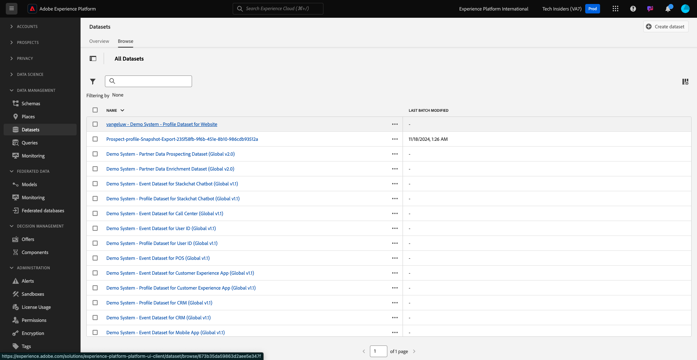

# 1.2.3 Configuración de conjuntos de datos

En este ejercicio, configurará los conjuntos de datos necesarios para capturar y almacenar información de perfil y comportamiento del cliente. Todos los conjuntos de datos que cree en esta interfaz utilizarán uno de los esquemas creados en el paso anterior.

## Historia

Después de definir cuál es la respuesta a las preguntas **¿Quién es este cliente?** y **¿Qué hace este cliente?** debería tener el aspecto siguiente: ahora necesita crear un contenedor que utilice esa información para recibir y validar los datos enviados a Adobe Experience Platform.

## 1.2.3.1: Crear conjuntos de datos

Ahora necesita crear 2 conjuntos de datos:

- 1 conjunto de datos para capturar la información que responde a **¿Quién es este cliente?** - pregunta.
- 1 conjunto de datos para capturar la información que responde a **¿Qué hace este cliente?** - pregunta.

Inicie sesión en Adobe Experience Platform desde esta dirección URL: [https://experience.adobe.com/platform](https://experience.adobe.com/platform).

Después de iniciar sesión, llegará a la página principal de Adobe Experience Platform.

Antes de continuar, debe seleccionar una **[!UICONTROL zona protegida]**. La zona protegida que se va a seleccionar se denomina ``--module2sandbox--``. Para ello, haga clic en el texto **[!UICONTROL Producción]** en la línea azul de la parte superior de la pantalla. Después de seleccionar la [!UICONTROL zona protegida] adecuada, verá el cambio en la pantalla y ahora se encuentra en la [!UICONTROL zona protegida] dedicada.

En Adobe Experience Platform, haga clic en **[!UICONTROL Conjuntos de datos]** en el menú de la izquierda de la pantalla.  A continuación, verá esto:

Empecemos creando el conjunto de datos para capturar la información de registro del sitio web.

Debe crear un nuevo conjunto de datos. Para crear un nuevo conjunto de datos, haga clic en el botón **[!UICONTROL + Crear conjunto de datos]**.

Después de hacer clic en el botón **[!UICONTROL + Crear conjunto de datos]**, verá la siguiente pantalla.

Debe definir un conjunto de datos a partir del esquema que definió en el paso anterior. Haga clic en la opción **[!UICONTROL Crear conjunto de datos a partir del esquema]** -.

En la siguiente pantalla, debe seleccionar el esquema que creó en 1, `--aepUserLdap-- - Demo System - Profile Schema for Website`.

Después de seleccionar el esquema, haga clic en **[!UICONTROL Siguiente]** para continuar.

Vamos a darle un nombre a su conjunto de datos.

Como nombre del conjunto de datos, utilice este:

`--aepUserLdap-- - Demo System - Profile Dataset for Website`

Por ejemplo, para ldap **[!UICONTROL vangeluw]**, este debe ser el nombre del esquema:

**[!UICONTROL vangeluw - Sistema de demostración - Conjunto de datos de perfil para el sitio web]**

Eso debería darte algo como esto:

Haga clic en **[!UICONTROL Finalizar]** para finalizar la configuración del conjunto de datos.

Ahora verá lo siguiente:

Volver a la descripción general de [!UICONTROL Conjuntos de datos]. Ahora verá el conjunto de datos que ha creado en la ventana emergente de información general.

A continuación, configurará un segundo conjunto de datos para capturar las interacciones con el sitio web.

Debe crear un nuevo conjunto de datos. Para crear un nuevo conjunto de datos, haga clic en el botón **[!UICONTROL + Crear conjunto de datos]**.

Después de hacer clic en el botón **[!UICONTROL + Crear conjunto de datos]**, verá la siguiente pantalla.

Debe definir un conjunto de datos a partir del esquema que definió en el paso anterior. Haga clic en la opción **[!UICONTROL Crear conjunto de datos a partir del esquema]** -.

En la siguiente pantalla, debe seleccionar el esquema que creó en 2.2, `--aepUserLdap-- - Demo System - Event Schema for Website`.

Después de seleccionar el esquema, haga clic en **[!UICONTROL Siguiente]** para continuar.

Vamos a darle un nombre a su conjunto de datos.

Como nombre de nuestro conjunto de datos, utilizaremos esto:

`--aepUserLdap-- - Demo System - Event Dataset for Website`

Por ejemplo, para ldap **[!UICONTROL vangeluw]**, este debe ser el nombre del esquema:

**[!UICONTROL vangeluw - Sistema de demostración - Conjunto de datos de evento para el sitio web]**

Eso debería darte algo como esto:

Haga clic en **[!UICONTROL Finalizar]** para finalizar la configuración del conjunto de datos.

A continuación, verá esto:

Vuelva a la pantalla de información general de [!UICONTROL Conjuntos de datos].

Ahora debe permitir que los conjuntos de datos formen parte del Perfil del cliente en tiempo real de Adobe Experience Platform.

Abra el conjunto de datos `--aepUserLdap--` - Sistema de demostración - Conjunto de datos de perfil para el sitio web al hacer clic en él.

Busque el icono de alternancia [!UICONTROL Perfil] a la derecha de la pantalla.

Haga clic en la opción [!UICONTROL Perfil] para habilitar este conjunto de datos para [!UICONTROL Perfil].

Haga clic en **[!UICONTROL Habilitar]**.

El conjunto de datos está habilitado para [!UICONTROL Perfil].

Vuelva a la información general de los conjuntos de datos y abra el conjunto de datos `--aepUserLdap-- - Demo System - Event Dataset` para el sitio web al hacer clic en él.

Busque el icono de alternancia [!UICONTROL Perfil] a la derecha de la pantalla.

Haga clic en la opción [!UICONTROL Perfil] para habilitar [!UICONTROL Perfil].

Haga clic en **[!UICONTROL Habilitar]**.

El conjunto de datos está habilitado para [!UICONTROL Perfil].

Paso siguiente: [1.2.4 Ingesta de datos de fuentes sin conexión](./ex4.md)

[Volver al módulo 1.2](./data-ingestion.md)

[Volver a todos los módulos](../../../overview.md)
