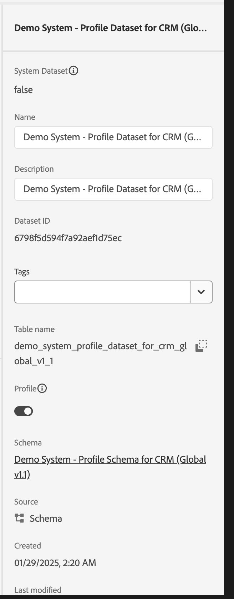
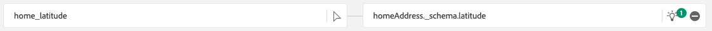

# 1.2.4 Ingesta de datos desde fuentes sin conexión

En este ejercicio, el objetivo es incorporar datos externos como datos CRM en Platform.

## Objetivos de aprendizaje

- Obtenga información sobre cómo generar datos de prueba
- Obtenga información sobre cómo introducir CSV
- Aprenda a utilizar la IU web para la ingesta de datos a través de flujos de trabajo
- Comprender las funciones de control de datos de Experience Platform

## Recursos

- IU de Mockaroo: [https://www.mockaroo.com/](https://www.mockaroo.com/)
- IU DE Experience Platform: [https://experience.adobe.com/platform/](https://experience.adobe.com/platform/)

## Tareas

- Cree un archivo CSV con la fecha de demostración. Introduzca el archivo CSV en Adobe Experience Platform utilizando los flujos de trabajo disponibles.
- Comprensión de las opciones de gobernanza de datos en Adobe Experience Platform

## 1.2.4.1 Crear su conjunto de datos de CRM a través de una herramienta de generación de datos

Para ello necesita 1000 líneas de muestra de datos CRM.

Abra la plantilla Mockaroo en [https://www.mockaroo.com/12674210](https://www.mockaroo.com/12674210).

En la plantilla, verá los siguientes campos:

- Identificación
- first_name
- last_name
- email
- género
- birthDate
- home_latitude
- home_longitude
- country_code
- ciudad
- país

Todos estos campos se han definido para producir datos compatibles con Platform.

Para generar el archivo CSV, haga clic en el botón **[!UICONTROL Descargar datos]** que le proporcionará un archivo CSV con 1000 líneas de datos de demostración.

Abra el archivo CSV en Microsoft Excel para visualizar su contenido.

Con el archivo CSV listo, puede continuar con la asignación con XDM.

### 1.2.4.2 Verificar el conjunto de datos de incorporación de CRM en Adobe Experience Platform

Abra [Adobe Experience Platform](https://experience.adobe.com/platform) y vaya a **[!UICONTROL Conjuntos de datos]**.

Antes de continuar, debe seleccionar una **[!UICONTROL zona protegida]**. La zona protegida que se va a seleccionar se denomina ``--module2sandbox--``. Para ello, haga clic en el texto **[!UICONTROL Producción]** en la línea azul de la parte superior de la pantalla. Después de seleccionar la [!UICONTROL zona protegida] adecuada, verá el cambio en la pantalla y ahora se encuentra en la [!UICONTROL zona protegida] dedicada.

En Adobe Experience Platform, haga clic en **[!UICONTROL Conjuntos de datos]** en el menú de la izquierda de la pantalla.

Va a utilizar un conjunto de datos compartido basado en esta habilitación. El conjunto de datos compartido ya se ha creado y se llama **[!UICONTROL Sistema de demostración - Conjunto de datos de perfil para CRM (Global v1.1)]**.

Abra el conjunto de datos **[!UICONTROL Sistema de demostración - Conjunto de datos de perfil para CRM (Global v1.1)]**.

En la pantalla de información general, puede ver 3 partes principales de información.

En primer lugar, el panel [!UICONTROL Actividad del conjunto de datos] muestra el número total de registros CRM en el conjunto de datos y los lotes ingeridos y su estado

En segundo lugar, desplazándose hacia abajo por la página puede comprobar cuándo se han introducido los lotes de datos, cuántos registros se han incorporado y también si el lote se ha incorporado correctamente. El **[!UICONTROL ID de lote]** es el identificador de un trabajo por lotes específico, y el **[!UICONTROL ID de lote]** es importante ya que se puede usar para solucionar problemas de por qué un lote específico no se incorporó correctamente.

Por último, la pestaña [!UICONTROL Información del conjunto de datos] muestra información importante como el [!UICONTROL ID del conjunto de datos] (de nuevo, importante desde el punto de vista de la solución de problemas), el nombre del conjunto de datos y si este se habilitó para el perfil.

La configuración más importante aquí es el vínculo entre el conjunto de datos y el esquema. El esquema define qué datos se pueden introducir y el aspecto que deben tener.

En este caso, estamos usando el **[!UICONTROL Sistema de demostración - Esquema de perfil para CRM (Global v1.1)]**, que está asignado a la clase de **[!UICONTROL Perfil]** y tiene extensiones implementadas, también llamadas grupos de campos.

Al hacer clic en el nombre del esquema, se le redirige a la descripción general de [!UICONTROL Schema], donde puede ver todos los campos que se han activado para este esquema.

Cada esquema debe tener definido un descriptor principal personalizado. En el caso de nuestro conjunto de datos de CRM, el esquema ha definido que el campo **[!UICONTROL crmId]** debe ser el identificador principal. Si desea crear un esquema y vincularlo al [!UICONTROL Perfil del cliente en tiempo real], debe definir un [!UICONTROL grupo de campos] personalizado que haga referencia al descriptor principal.

En la captura de pantalla anterior, puede ver que nuestro descriptor se encuentra en `--aepTenantId--.identification.core.crmId`, que se establece como [!UICONTROL Identificador principal], vinculado al [!UICONTROL área de nombres] de **[!UICONTROL Sistema de demostración - CRMID]**.

Cada esquema y, como tal, cada conjunto de datos que debería usarse en [!UICONTROL Perfil del cliente en tiempo real] debería tener un [!UICONTROL identificador principal]. Este [!UICONTROL identificador principal] es el usuario identificador de la marca para un cliente en ese conjunto de datos. En el caso de un conjunto de datos de CRM, puede ser la dirección de correo electrónico o el ID de CRM; en el caso de un conjunto de datos de centro de llamadas, puede ser el número móvil de un cliente.

Se recomienda crear un esquema independiente y específico para cada conjunto de datos y establecer el descriptor de cada conjunto de datos específicamente para que coincida con el funcionamiento de las soluciones actuales utilizadas por la marca.

### 1.2.4.3 Uso de un flujo de trabajo para asignar un archivo CSV a un esquema XDM

El objetivo de esto es incorporar datos CRM en Platform. Todos los datos que se incorporan en Platform deben asignarse al esquema XDM específico. Actualmente, tiene un conjunto de datos CSV con 1000 líneas en un lado y un conjunto de datos vinculado a un esquema en el otro. Para cargar ese archivo CSV en ese conjunto de datos, debe realizarse una asignación. Para facilitar este ejercicio de asignación, tenemos **[!UICONTROL Flujos de trabajo]** disponibles en Adobe Experience Platform.

El [!UICONTROL flujo de trabajo] que usaremos aquí, es el [!UICONTROL flujo de trabajo] denominado **[!UICONTROL Asignar CSV a esquema XDM]** en el menú [!UICONTROL Ingesta de datos].

Haga clic en el botón **[!UICONTROL Asignar CSV a esquema XDM]**. Haga clic en **[!UICONTROL Iniciar]** para iniciar el proceso.

En la siguiente pantalla, debe seleccionar un conjunto de datos para introducir el archivo en. Puede elegir entre seleccionar un conjunto de datos ya existente o crear uno nuevo. Para este ejercicio, reutilizaremos uno existente: seleccione **[!UICONTROL Sistema de demostración - Conjunto de datos de perfil para CRM (Global v1.1)]** como se indica a continuación y deje el resto de configuraciones establecidas como predeterminadas.

Haga clic en **[!UICONTROL Siguiente]** para ir al paso siguiente.

Arrastre y suelte su archivo CSV o haga clic en **[!UICONTROL Examinar]**, navegue por su equipo hasta el escritorio y seleccione su archivo CSV.

Después de seleccionar el archivo CSV, se cargará inmediatamente y verá una previsualización del archivo en cuestión de segundos.

Haga clic en **[!UICONTROL Siguiente]** para ir al paso siguiente. Puede tardar unos segundos mientras el archivo se procesa por completo.

Ahora necesita asignar los encabezados de columna CSV con una propiedad XDM en su **[!UICONTROL sistema de demostración: conjunto de datos de perfil para CRM]**.

Adobe Experience Platform ya ha hecho algunas propuestas para usted al intentar vincular los [!UICONTROL Atributos de Source] con los [!UICONTROL Campos de esquema de destino].

Para las [!UICONTROL asignaciones de esquema], Adobe Experience Platform ya ha intentado vincular campos. Sin embargo, no todas las propuestas de mapeo son correctas. Ahora necesita **aceptar los campos de destino** uno por uno.

#### birthDate

El campo de esquema de Source **birthDate** debe estar vinculado al campo de destino **person.birthDate**.

#### ciudad

El campo de esquema de Source **city** debe estar vinculado al campo de destino **homeAddress.city**.

#### país

El campo de esquema de Source **country** debe estar vinculado al campo de destino **homeAddress.country**.

#### country_code

El campo de esquema de Source **country_code** debe estar vinculado al campo de destino **homeAddress.countryCode**.

#### email

El campo de esquema de Source **email** debe estar vinculado al campo de destino **personalEmail.address**.

#### crmid

El campo Esquema de Source ** crmid** debe estar vinculado al campo de destino **`--aepTenantId--`.identification.core.crmId**.

#### first_name

El campo de esquema de Source **first_name** debe estar vinculado al campo de destino **person.name.firstName**.

#### género

El campo de esquema de Source **gender** debe estar vinculado al campo de destino **person.gender**.

#### home_latitude

El campo de esquema de Source **home_latitude** debe estar vinculado al campo de destino **homeAddress._schema.latitude**.

#### home_longitude

El campo de esquema de Source **home_longitude** debe estar vinculado al campo de destino **homeAddress._schema.longitude**.

#### Identificación

El campo de esquema de Source **id** debe estar vinculado al campo de destino **_id**.

#### last_name

El campo de esquema de Source **last_name** debe estar vinculado al campo de destino **person.name.lastName**.

Ahora debería tener esto:

Haga clic en el botón **[!UICONTROL Finalizar]** para finalizar el flujo de trabajo.

Después de hacer clic en **[!UICONTROL Finalizar]**, verá la descripción general de **Flujo de datos** y, después de un par de minutos, podrá actualizar la pantalla para ver si el flujo de trabajo se completó correctamente. Haga clic en **nombre del conjunto de datos de destino**.

A continuación, verá el conjunto de datos donde se ha procesado la ingesta.

En el conjunto de datos, verá un [!UICONTROL ID de lote] que se acaba de ingerir, con 1000 registros ingeridos y un estado de **[!UICONTROL Éxito]**.

Haga clic en el botón **[!UICONTROL Previsualizar conjunto de datos]**- para obtener una vista rápida de una pequeña muestra del conjunto de datos y asegurarse de que los datos cargados sean correctos.

Una vez cargados los datos, puede definir el enfoque de control de datos correcto para su conjunto de datos.

### 1.2.5.4 Agregar la gobernanza de datos al conjunto de datos

Ahora que los datos del cliente se han introducido, debe asegurarse de que este conjunto de datos esté correctamente controlado para el control de uso y exportación. Haga clic en la ficha **[!UICONTROL Control de datos]** y observe que puede establecer tres tipos de restricciones: Contractual, Identidad y Datos confidenciales.

Puede encontrar más información sobre las distintas etiquetas y cómo se aplicarán en el futuro en el marco de directivas en este vínculo: [https://www.adobe.io/apis/experienceplatform/home/dule/duleservices.html](https://www.adobe.io/apis/experienceplatform/home/dule/duleservices.html)

Restrinjamos los datos de identidad para todo el conjunto de datos. Pase el ratón sobre el nombre del conjunto de datos y haga clic en el icono Lápiz para editar la configuración.

Vaya a **[!UICONTROL Datos de identidad]** y verá que la opción **[!UICONTROL I2]** está marcada. Esto supondrá que todos los fragmentos de información de este conjunto de datos son al menos indirectamente identificables para la persona.

Haga clic en **[!UICONTROL Guardar cambios]** y observe que **[!UICONTROL I2]** ahora está establecido para todos los campos de datos del conjunto de datos.

También puede establecer estos indicadores para campos de datos individuales; por ejemplo, es probable que el campo **[!UICONTROL firstName]** se clasifique como un nivel **[!UICONTROL I1]** para información directamente identificable.

Seleccione el campo **[!UICONTROL firstName]** marcando la casilla de verificación y haga clic en **[!UICONTROL Editar etiquetas de control]** en la esquina superior derecha de la pantalla.

Vaya a **[!UICONTROL Datos de identidad]** y verá que la opción **[!UICONTROL I2]** ya está marcada (heredada del conjunto de datos). El campo firstName también tiene una configuración específica de campo y se establece como **[!UICONTROL I1 - Datos directamente identificables]**.

Con esto, ahora ha ingerido y clasificado correctamente los datos CRM en Adobe Experience Platform.

Siguiente Paso: [1.2.5 Zona De Aterrizaje De Datos](./ex5.md)

[Volver al módulo 1.2](./data-ingestion.md)

[Volver a todos los módulos](../../../overview.md)
