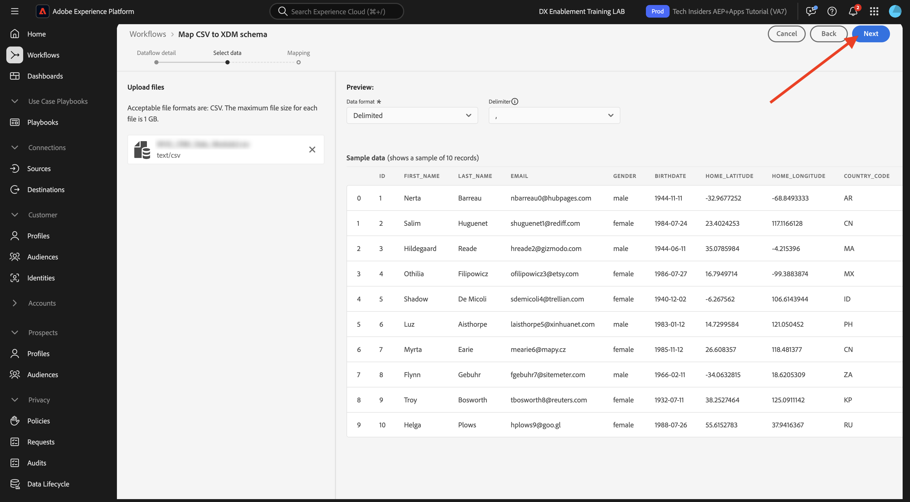
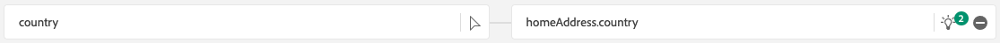

# 1.2.4 Ingesta de datos desde fuentes sin conexión

En este ejercicio, el objetivo es incorporar datos externos como datos CRM en Platform.

## Objetivos de aprendizaje

- Obtenga información sobre cómo generar datos de prueba
- Obtenga información sobre cómo introducir CSV
- Aprenda a utilizar la IU web para la ingesta de datos a través de flujos de trabajo
- Comprender las funciones de control de datos de Experience Platform

## Recursos

- Macaco: [https://www.mockaroo.com/](https://www.mockaroo.com/)
- Adobe Experience Platform: [https://experience.adobe.com/platform/](https://experience.adobe.com/platform/)

## Tareas

- Cree un archivo CSV con datos de demostración. Introduzca el archivo CSV en Adobe Experience Platform utilizando los flujos de trabajo disponibles.
- Comprensión de las opciones de gobernanza de datos en Adobe Experience Platform

## Crear un conjunto de datos de CRM mediante una herramienta de generador de datos

Para este ejercicio, necesita 1000 líneas de muestra de datos CRM.

Abra la plantilla Mockaroo en [https://www.mockaroo.com/12674210](https://www.mockaroo.com/12674210).

En la plantilla, verá los siguientes campos:

- Identificación
- first_name
- last_name
- email
- género
- birthDate
- home_latitude
- home_longitude
- country_code
- ciudad
- país
- crmId
- consent.email
- consent.commercialEmail
- consent.any

Todos estos campos se han definido para producir datos compatibles con Platform.

Para generar el archivo CSV, haga clic en el botón **[!UICONTROL Generar datos]** que creará y descargará un archivo CSV con 1000 líneas de datos de demostración.

Abra el archivo CSV para visualizar su contenido.

Con el archivo CSV listo, puede continuar con la ingesta en AEP.

### Verificar el conjunto de datos

Vaya a [https://experience.adobe.com/platform](https://experience.adobe.com/platform).

Antes de continuar, debe seleccionar una **[!UICONTROL zona protegida]**. La zona protegida que se va a seleccionar se denomina ``--aepSandboxName--``.

En Adobe Experience Platform, haga clic en **[!UICONTROL Conjuntos de datos]** en el menú de la izquierda de la pantalla.

Utilizará un conjunto de datos compartido. El conjunto de datos compartido ya se ha creado y se llama **[!UICONTROL Sistema de demostración - Conjunto de datos de perfil para CRM (Global v1.1)]**. Haga clic en él para abrirlo.

En la pantalla de información general, puede ver 3 partes principales de información.

>[!NOTE]
>
>Es posible que la vista del conjunto de datos esté vacía si no se ha producido ninguna actividad en los últimos 7 días.

En primer lugar, el panel [!UICONTROL Actividad del conjunto de datos] muestra el número total de registros CRM en el conjunto de datos y los lotes ingeridos y su estado

En segundo lugar, desplazándose hacia abajo por la página puede comprobar cuándo se han introducido los lotes de datos, cuántos registros se han incorporado y también si el lote se ha incorporado correctamente. El **[!UICONTROL ID de lote]** es el identificador de un trabajo por lotes específico, y el **[!UICONTROL ID de lote]** es importante ya que se puede usar para solucionar problemas de por qué un lote específico no se incorporó correctamente.

Por último, la ficha de información [!UICONTROL Conjunto de datos] muestra información importante como el [!UICONTROL ID del conjunto de datos] (de nuevo, importante desde el punto de vista de la solución de problemas), el nombre del conjunto de datos y si este se habilitó para el perfil.

La configuración más importante aquí es el vínculo entre el conjunto de datos y el esquema. El esquema define qué datos se pueden introducir y el aspecto que deben tener.

En este caso, estamos usando el **[!UICONTROL Sistema de demostración - Esquema de perfil para CRM (Global v1.1)]**, que está asignado a la clase de **[!UICONTROL Perfil]** y tiene extensiones implementadas, también llamadas grupos de campos.

Al hacer clic en el nombre del esquema, se le redirige a la descripción general de [!UICONTROL Schema], donde puede ver todos los campos que se han activado para este esquema.

Cada esquema debe tener definido un descriptor principal personalizado. En el caso de nuestro conjunto de datos de CRM, el esquema ha definido que el campo **[!UICONTROL crmId]** debe ser el identificador principal. Si desea crear un esquema y vincularlo al [!UICONTROL Perfil del cliente en tiempo real], debe definir un [!UICONTROL grupo de campos] personalizado que haga referencia al descriptor principal.

También puede ver que su identidad principal se encuentra en `--aepTenantId--.identification.core.crmId`, vinculada al [!UICONTROL espacio de nombres] de **[!UICONTROL Demo System - CRMID]**.

Cada esquema y, como tal, cada conjunto de datos que debería usarse en [!UICONTROL Perfil del cliente en tiempo real] debería tener un [!UICONTROL identificador principal]. Este [!UICONTROL identificador principal] es el usuario identificador de la marca para un cliente en ese conjunto de datos. En el caso de un conjunto de datos de CRM, puede ser la dirección de correo electrónico o el ID de CRM; en el caso de un conjunto de datos de centro de llamadas, puede ser el número móvil de un cliente.

Se recomienda crear un esquema independiente y específico para cada conjunto de datos y establecer el descriptor de cada conjunto de datos específicamente para que coincida con el funcionamiento de las soluciones actuales utilizadas por la marca.

### Uso de un flujo de trabajo para asignar un archivo CSV a un esquema XDM

El objetivo de este ejercicio es incorporar datos CRM en AEP. Todos los datos que se incorporan en Platform deben asignarse al esquema XDM específico. Actualmente, tiene un conjunto de datos CSV con 1000 líneas en un lado y un conjunto de datos vinculado a un esquema en el otro. Para cargar ese archivo CSV en ese conjunto de datos, debe realizarse una asignación. Para facilitar este ejercicio de asignación, tenemos **[!UICONTROL Flujos de trabajo]** disponibles en Adobe Experience Platform.

Haga clic en **[!UICONTROL Asignar CSV a esquema XDM]** y, a continuación, haga clic en **[!UICONTROL Iniciar]** para iniciar el proceso.

En la siguiente pantalla, debe seleccionar un conjunto de datos para introducir el archivo en. Puede elegir entre seleccionar un conjunto de datos ya existente o crear uno nuevo. Para este ejercicio, reutilizaremos uno existente: seleccione **[!UICONTROL Sistema de demostración - Conjunto de datos de perfil para CRM (Global v1.1)]** como se indica a continuación y deje el resto de configuraciones establecidas como predeterminadas.

Haga clic en **Next**.

Arrastre y suelte su archivo CSV o haga clic en **[!UICONTROL Elegir archivos]** y navegue en su equipo hasta el escritorio y seleccione su archivo CSV.

Después de seleccionar el archivo CSV, se cargará inmediatamente y verá una previsualización del archivo en cuestión de segundos.

Haga clic en **Next**.

Ahora necesita asignar los encabezados de columna del archivo CSV con una propiedad XDM en su **[!UICONTROL sistema de demostración: conjunto de datos de perfil para CRM]**.

Adobe Experience Platform ya ha hecho algunas propuestas para usted al intentar vincular los [!UICONTROL Atributos de Source] con los [!UICONTROL Campos de esquema de destino].

>[!NOTE]
>
>Si ve algún error en la pantalla de asignación, no se preocupe. Después de seguir las siguientes instrucciones, se resolverán estos errores.

Para las [!UICONTROL asignaciones de esquema], Adobe Experience Platform ya ha intentado vincular campos. Sin embargo, no todas las propuestas de mapeo son correctas. Ahora necesita actualizar los **campos de destino** uno por uno.

#### birthDate

El campo de esquema de Source **birthDate** debe estar vinculado al campo de destino **person.birthDate**.

#### ciudad

El campo de esquema de Source **city** debe estar vinculado al campo de destino **homeAddress.city**.

#### país

El campo de esquema de Source **country** debe estar vinculado al campo de destino **homeAddress.country**.

#### country_code

El campo de esquema de Source **country_code** debe estar vinculado al campo de destino **homeAddress.countryCode**.

#### email

El campo de esquema de Source **email** debe estar vinculado al campo de destino **personalEmail.address**.

#### crmid

El campo de esquema de Source **crmid** debe estar vinculado al campo de destino **`--aepTenantId--`.identification.core.crmId**.

#### first_name

El campo de esquema de Source **first_name** debe estar vinculado al campo de destino **person.name.firstName**.

#### género

El campo de esquema de Source **gender** debe estar vinculado al campo de destino **person.gender**.

#### home_latitude

El campo de esquema de Source **home_latitude** debe estar vinculado al campo de destino **homeAddress._schema.latitude**.

#### home_longitude

El campo de esquema de Source **home_longitude** debe estar vinculado al campo de destino **homeAddress._schema.longitude**.

#### Identificación

El campo de esquema de Source **id** debe estar vinculado al campo de destino **_id**.

#### last_name

El campo de esquema de Source **last_name** debe estar vinculado al campo de destino **person.name.lastName**.

#### consents.marketing.email.val

El campo de esquema de Source **permission.email** debe estar vinculado al campo de destino **conents.marketing.email.val**.

#### consents.marketing.commercialEmail.val

El campo de esquema de Source **permission.CommercialEmail** debe estar vinculado al campo de destino **conents.marketing.CommercialEmail.val**.

#### consents.marketing.any.val

El campo de esquema de Source **permission.any** debe estar vinculado al campo de destino **conents.marketing.any.val**.

Ahora debería tener esto. Haga clic en **Finalizar**.

Después de hacer clic en **[!UICONTROL Finalizar]**, verá la descripción general de **Flujo de datos** y, después de un par de minutos, podrá actualizar la pantalla para ver si el flujo de trabajo se completó correctamente. Haga clic en **nombre del conjunto de datos de destino**.

Verá el conjunto de datos donde se ha procesado su ingesta y verá un [!UICONTROL ID de lote] que se ha ingerido en este momento, con 1000 registros ingeridos y un estado de **[!UICONTROL Éxito]**. Haga clic en **[!UICONTROL Previsualizar conjunto de datos]**.

Ahora verá una pequeña muestra del conjunto de datos para asegurarse de que los datos cargados son correctos.

Una vez cargados los datos, puede definir el enfoque de control de datos correcto para su conjunto de datos.

### Adición del control de datos al conjunto de datos

Ahora que los datos del cliente se han introducido, debe asegurarse de que este conjunto de datos esté correctamente controlado para el control de uso y exportación. Haga clic en la pestaña **[!UICONTROL Control de datos]** y observe que puede establecer varios tipos de restricciones: Contrato, Identidad y Sensible, Ecosistema de socio y Personalizado.

Restrinjamos los datos de identidad para todo el conjunto de datos. Pase el ratón sobre el nombre del conjunto de datos y haga clic en el icono Lápiz para editar la configuración.

Vaya a **[!UICONTROL Etiquetas de identidad]** y verá que la opción **[!UICONTROL I2]** está marcada. Esto supondrá que todos los fragmentos de información de este conjunto de datos son al menos indirectamente identificables para la persona.

Haga clic en **[!UICONTROL Guardar cambios]**.

En otro módulo, profundizaremos en el marco de quién de la gobernanza de datos y las etiquetas.

Con esto, ahora ha ingerido y clasificado correctamente los datos CRM en Adobe Experience Platform.

Siguiente Paso: [1.2.5 Zona De Aterrizaje De Datos](./ex5.md)

[Volver al módulo 1.2](./data-ingestion.md)

[Volver a todos los módulos](../../../overview.md)
