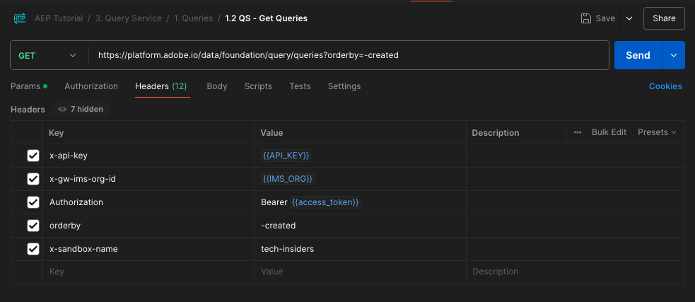

# 5.1.8 API del servicio de consultas

## Objetivo

- Utilice la API del servicio de consultas para administrar plantillas de consultas y programaciones de consultas

## Contexto

En este ejercicio, ejecutará llamadas de API para administrar plantillas de consulta y programaciones de consultas mediante una colección de Postman. Definirá plantillas de consulta, ejecutará consultas regulares y consultas CTAS. Una consulta **CTAS** (cree una tabla como consulta de selección) almacena su conjunto de resultados en un conjunto de datos explícito. Mientras que las consultas regulares se almacenan en un conjunto de datos implícito (o generado por el sistema), que normalmente se exporta en formato de archivo parquet.

## Documentación

- [Ayuda del servicio de consultas de Adobe Experience Platform](https://experienceleague.adobe.com/docs/experience-platform/query/api/getting-started.html)
- [API de servicio de consultas](https://www.adobe.io/apis/experienceplatform/home/api-reference.html#!acpdr/swagger-specs/qs-api.yaml)

## API del servicio de consultas

La API del servicio de consultas permite administrar consultas no interactivas con el lago de datos de Adobe Experience Platform.

No interactivo significa que una solicitud para ejecutar una consulta no dará como resultado una respuesta inmediata. La consulta se procesará y su conjunto de resultados se almacenará en un conjunto de datos implícito o explícito (CTAS: create table as select).

## Consulta de muestra

Como consulta de ejemplo, usará la primera consulta enumerada en [4.3: consultas, consultas, consultas... y análisis de pérdida](./ex3.md):

¿Cuántas vistas de productos tenemos diariamente?

**SQL**

```sql
select date_format( timestamp , 'yyyy-MM-dd') AS Day,
       count(*) AS productViews
from   demo_system_event_dataset_for_website_global_v1_1
where  --aepTenantId--.demoEnvironment.brandName IN ('Citi Signal')
and eventType = 'commerce.productViews'
group by Day
limit 10;
```

## Consultas

>[!IMPORTANT]
>
>Si eres un empleado de Adobe, sigue las instrucciones aquí para usar [PostBuster](./../../../postbuster.md).

Abra Postman en el equipo. Como parte del módulo 2.1, creó un entorno de Postman e importó una colección de Postman. Siga las instrucciones de [Ejercicio 2.1.3](./../../../modules/rtcdp-b2c/module2.1/ex3.md) por si aún no lo ha hecho.

Como parte de la colección de Postman que importó, verá una carpeta **3. Servicio de consultas**. Si no ve esta carpeta, vuelva a descargar la [colección de Postman](./../../../assets/postman/postman_profile.zip) y vuelva a importar esa colección en Postman como se indica en el [Ejercicio 2.1.3](./../../../modules/rtcdp-b2c/module2.1/ex3.md).


>[!NOTE]
>
>En este momento, sólo la carpeta **1. Consultas** contiene solicitudes. Otras solicitudes se añadirán en una fase de capa.

Abra esa carpeta y conozca las llamadas de API del servicio de consulta para ejecutar, supervisar y descargar el conjunto de resultados de la consulta.

Una llamada del POST a [/query/queries] con la siguiente carga útil almacenará en déclencheur la ejecución de nuestra consulta;

### Crear consulta

Haga clic en la solicitud **1.1 QS - Crear consulta** y vaya a **Encabezados**. A continuación, verá esto:


Vamos a centrarnos en este campo de encabezado:

| Clave | Valor |
| ----------- | ----------- |
| x-sandbox-name | `--aepSandboxName--` |

>[!NOTE]
>
>Debe especificar el nombre de la zona protegida de Adobe Experience Platform que está utilizando. El campo de encabezado **x-sandbox-name** debe ser `--aepSandboxName--`.

Vaya a la sección **Body** de esta solicitud. En **Cuerpo** de esta solicitud, verá lo siguiente:


```sql
{
    "name" : "ldap - QS API demo - Citi Signal - Product Views Per Day",
	"description": "ldap - QS API demo - Citi Signal - Product Views Per Day",
	"dbName": "--aepSandboxName--:all",
	"sql": "select date_format( timestamp , 'yyyy-MM-dd') AS Day, count(*) AS productViews from demo_system_event_dataset_for_website_global_v1_1 where --aepTenantId--.demoEnvironment.brandName IN ('Citi Signal') and eventType = 'commerce.productViews' group by Day limit 10"
}
```

Atención: actualice la variable **name** en la siguiente solicitud reemplazando **ldap** por su **específico—aepUserLdap—**.

Después de agregar su **ldap** específico, el cuerpo debería tener un aspecto similar al siguiente:

```json
{
    "name" : "vangeluw - QS API demo - Citi Signal - Product Views Per Day",
	"description": "vangeluw - QS API demo - Citi Signal - Product Views Per Day",
	"dbName": "tech-insiders:all",
	"sql": "select date_format( timestamp , 'yyyy-MM-dd') AS Day, count(*) AS productViews from demo_system_event_dataset_for_website_global_v1_1 where _experienceplatform.demoEnvironment.brandName IN ('Citi Signal') and eventType = 'commerce.productViews' group by Day limit 10"
}
```

>[!NOTE]
>
>La clave **dbName** del cuerpo de JSON anterior hace referencia a la zona protegida que se usa en la instancia de Adobe Experience Platform. Si está usando la zona protegida de PROD, dbName debería ser **prod:all**, si usa otra zona protegida como por ejemplo **tech-insiders**, dbName debería ser igual a **tech-insiders:all**.

A continuación, haga clic en el botón azul **Enviar** para crear el segmento y ver los resultados.


Cuando se realiza correctamente, la solicitud del POST devolverá la siguiente respuesta:

```json
{
    "isInsertInto": false,
    "request": {
        "dbName": "module7:all",
        "sql": "select date_format( timestamp , 'yyyy-MM-dd') AS Day, count(*) AS productViews from demo_system_event_dataset_for_website_global_v1_1 where _experienceplatform.demoEnvironment.brandName IN ('Luma Telco', 'Citi Signal') and eventType = 'commerce.productViews' group by Day limit 10",
        "name": "vangeluw - QS API demo - Citi Signal - Product Views Per Day",
        "description": "vangeluw - QS API demo - Citi Signal - Product Views Per Day"
    },
    "clientId": "5a143b5ae4aa4631a1f3b09cd051333f",
    "state": "SUBMITTED",
    "rowCount": 0,
    "errors": [],
    "isCTAS": false,
    "version": 1,
    "id": "8f0d7f25-f7aa-493b-9792-290f884a7e5b",
    "elapsedTime": 0,
    "updated": "2021-01-20T13:23:13.951Z",
    "client": "API",
    "userId": "A3392DB95FFF08EE0A495E87@techacct.adobe.com",
    "created": "2021-01-20T13:23:13.951Z",
    "_links": {
        "self": {
            "href": "https://platform-va7.adobe.io/data/foundation/query/queries/8f0d7f25-f7aa-493b-9792-290f884a7e5b",
            "method": "GET"
        },
        "soft_delete": {
            "href": "https://platform-va7.adobe.io/data/foundation/query/queries/8f0d7f25-f7aa-493b-9792-290f884a7e5b",
            "method": "PATCH",
            "body": "{ \"op\": \"soft_delete\"}"
        },
        "cancel": {
            "href": "https://platform-va7.adobe.io/data/foundation/query/queries/8f0d7f25-f7aa-493b-9792-290f884a7e5b",
            "method": "PATCH",
            "body": "{ \"op\": \"cancel\"}"
        }
    }
}
```

El **estado** actual de la consulta es **ENVIADO**, una vez ejecutado su estado pasará a ser **CORRECTO**.

También puede buscar las consultas enviadas a través de la interfaz de usuario de Adobe Experience Platform, abrir [Adobe Experience Platform](https://experience.adobe.com/#/@experienceplatform/platform/home), navegar hasta **Consultas**, **Registrar** y seleccionar la consulta:


### Obtener consultas

Haga clic en la solicitud **1.2 QS - Obtener consultas** y vaya a **Encabezados**. A continuación, verá esto:



Vamos a centrarnos en este campo de encabezado:

| Clave | Valor |
| ----------- | ----------- |
| x-sandbox-name | `--aepSandboxName--` |

>[!NOTE]
>
>Debe especificar el nombre de la zona protegida de Adobe Experience Platform que está utilizando. El campo de encabezado **x-sandbox-name** debe ser `--aepSandboxName--`.

Ir a **Parámetros**. A continuación, verá esto:


El parámetro **orderby** le permite especificar un criterio de ordenación basado en la propiedad **created**. Observe el signo **&#39;-&#39;** delante de created, lo que significa que el orden en que se devuelve la lista de consultas usará su fecha de creación en el orden **descendente**. La consulta debe estar en la parte superior de la lista.

A continuación, haga clic en el botón azul **Enviar** para crear el segmento y ver los resultados.


Si la solicitud se realiza correctamente, devolverá una respuesta de similar a la siguiente. El **estado** de la respuesta puede ser **ENVIADO**, **EN CURSO** o **CORRECTO**. La consulta puede tardar varios minutos en tener un estado **SUCCESS**. Puede repetir el envío de esta solicitud varias veces, hasta que vea el estado **SUCCESS**.

```json
{
    "queries": [
        {
            "isInsertInto": false,
            "sessionType": "HTTP_SESSION",
            "request": {
                "dbName": "tech-insiders:all",
                "sql": "select date_format( timestamp , 'yyyy-MM-dd') AS Day, count(*) AS productViews from demo_system_event_dataset_for_website_global_v1_1 where _experienceplatform.demoEnvironment.brandName IN ('Citi Signal') and eventType = 'commerce.productViews' group by Day limit 10",
                "name": "vangeluw - QS API demo - Citi Signal - Product Views Per Day",
                "description": "vangeluw - QS API demo - Citi Signal - Product Views Per Day"
            },
            "computeMetrics": null,
            "clientId": "b7d8a1fc396242889bb31dc83644e91d",
            "state": "IN_PROGRESS",
            "rowCount": 0,
            "isService": false,
            "errors": [],
            "isCTAS": false,
            "version": 1,
            "id": "a535234e-dc0c-42ea-bcad-eb09c5997d76",
            "elapsedTime": 8088,
            "updated": "2024-12-04T14:17:10.627Z",
            "client": "API",
            "effectiveSQL": "select date_format( timestamp , 'yyyy-MM-dd') AS Day, count(*) AS productViews from demo_system_event_dataset_for_website_global_v1_1 where _experienceplatform.demoEnvironment.brandName IN ('Citi Signal') and eventType = 'commerce.productViews' group by Day limit 10",
            "userId": "8CD31E54673C49EE0A495E05@techacct.adobe.com",
            "isParentLevel": true,
            "created": "2024-12-04T14:14:22.637Z",
                "version": 1,
    "_links": {
        "next": {
            "href": "https://platform-va7.adobe.io/data/foundation/query/queries?orderby=-created&start=2024-11-22T00:32:04.505Z"
        },
        "prev": {
            "href": "https://platform-va7.adobe.io/data/foundation/query/queries?orderby=-created&start=2024-12-04T14:14:22.637Z&isPrevLink=true"
        }
    }
}
```

Cuando el estado sea **SUCCESS**, continúe con la siguiente solicitud.

### Obtener estado de la consulta

Haga clic en la solicitud **1.3 QS - Obtener estado de la consulta** y vaya a **Encabezados**. A continuación, verá esto:


Vamos a centrarnos en este campo de encabezado:

| Clave | Valor |
| ----------- | ----------- |
| x-sandbox-name | `--aepSandboxName--` |

>[!NOTE]
>
>Debe especificar el nombre de la zona protegida de Adobe Experience Platform que está utilizando. El campo de encabezado **x-sandbox-name** debe ser `--aepSandboxName--`.

A continuación, haga clic en el botón azul **Enviar** para crear el segmento y ver los resultados.


Si la solicitud se realiza correctamente, devolverá una respuesta de similar a la siguiente.

```json
{
    "isInsertInto": false,
    "sessionType": "HTTP_SESSION",
    "request": {
        "dbName": "tech-insiders:all",
        "sql": "select date_format( timestamp , 'yyyy-MM-dd') AS Day, count(*) AS productViews from demo_system_event_dataset_for_website_global_v1_1 where _experienceplatform.demoEnvironment.brandName IN ('Citi Signal') and eventType = 'commerce.productViews' group by Day limit 10",
        "name": "vangeluw - QS API demo - Citi Signal - Product Views Per Day",
        "description": "vangeluw - QS API demo - Citi Signal - Product Views Per Day"
    },
    "computeMetrics": {
        "executorVMSeconds": 138,
        "clusterCpuSeconds": 3312,
        "clusterVMHours": 0.07666666805744171,
        "driverVMSeconds": 138,
        "clusterVMSeconds": 276
    },
    "clientId": "b7d8a1fc396242889bb31dc83644e91d",
    "state": "SUCCESS",
    "rowCount": 1,
    "isService": false,
    "errors": [],
    "isCTAS": false,
    "version": 1,
    "id": "a535234e-dc0c-42ea-bcad-eb09c5997d76",
    "elapsedTime": 199219,
    "updated": "2024-12-04T14:17:41.856Z",
    "client": "API",
    "effectiveSQL": "select date_format( timestamp , 'yyyy-MM-dd') AS Day, count(*) AS productViews from demo_system_event_dataset_for_website_global_v1_1 where _experienceplatform.demoEnvironment.brandName IN ('Citi Signal') and eventType = 'commerce.productViews' group by Day limit 10",
    "userId": "8CD31E54673C49EE0A495E05@techacct.adobe.com",
    "isParentLevel": true,
    "created": "2024-12-04T14:14:22.637Z",
    "_links": {
        "self": {
            "href": "https://platform-va7.adobe.io/data/foundation/query/queries/a535234e-dc0c-42ea-bcad-eb09c5997d76",
            "method": "GET"
        },
        "soft_delete": {
            "href": "https://platform-va7.adobe.io/data/foundation/query/queries/a535234e-dc0c-42ea-bcad-eb09c5997d76",
            "method": "PATCH",
            "body": "{ \"op\": \"soft_delete\"}"
        },
        "referenced_datasets": [
            {
                "id": "672a10b1074ceb2af0aa7034",
                "href": "https://platform-va7.adobe.io/data/foundation/catalog/dataSets/672a10b1074ceb2af0aa7034"
            }
        ]
    }
}
```

Cuando una consulta alcanza el estado de **SUCCESS**, la respuesta también indicará el número de filas recuperadas por la consulta a través de la propiedad **rowCount**. En nuestro ejemplo, la consulta devuelve 10 filas. Veamos en la siguiente sección cómo podemos recuperar las 10 filas.

### Recuperar resultado de consulta

La respuesta **SUCCESS** anterior incluye una propiedad **referenced_datasets**, que apunta al conjunto de datos implícito que almacena el resultado de la consulta. Para obtener acceso al resultado, usamos su propiedad **href** o **id**.

Haga clic en la solicitud **1.4 QS - Obtener resultado de la consulta** y vaya a **Encabezados**. A continuación, verá esto:


Vamos a centrarnos en este campo de encabezado:

| Clave | Valor |
| ----------- | ----------- |
| x-sandbox-name | `--aepSandboxName--` |

>[!NOTE]
>
>Debe especificar el nombre de la zona protegida de Adobe Experience Platform que está utilizando. El campo de encabezado **x-sandbox-name** debe ser `--aepSandboxName--`.

A continuación, haga clic en el botón azul **Enviar** para crear el segmento y ver los resultados.


La respuesta de esta solicitud apuntará a los archivos del conjunto de datos:

```json
{
    "672a10b1074ceb2af0aa7034": {
        "name": "Demo System - Event Dataset for Website (Global v1.1)",
        "description": "Demo System - Event Dataset for Website (Global v1.1)",
        "enableErrorDiagnostics": false,
        "tags": {
            "adobe/siphon/partition/definition": [
                "day(timestamp, _ACP_DATE)",
                "identity(_ACP_BATCHID)"
            ],
            "adobe/siphon/meta": [
                "acpBufferedFlag::false"
            ],
            "aep/siphon/partitions": [
                "_ACP_DATE",
                "_ACP_BATCHID"
            ],
            "acp_granular_plugin_validation_flags": [
                "identity:enabled",
                "profile:disabled"
            ],
            "adobe/pqs/table": [
                "demo_system_event_dataset_for_website_global_v1_1"
            ],
            "acp_granular_validation_flags": [
                "requiredFieldCheck:enabled"
            ],
            "aep/siphon/cleanup/trash/timestamp": [
                "1733302532212"
            ],
            "acp_validationContext": [
                "enabled"
            ],
            "adobe/siphon/table/format": [
                "delta"
            ],
            "unifiedProfile": [
                "enabled:true",
                "enabledAt:2024-11-05 12:33:59"
            ],
            "aep/siphon/cleanup/meta/timestamp": [
                "1733302532287"
            ],
            "unifiedIdentity": [
                "enabled:true"
            ]
        },
        "state": "ACTIVE",
        "imsOrg": "907075E95BF479EC0A495C73@AdobeOrg",
        "sandboxId": "79e3c8b2-0609-4564-a3c8-b20609a5648c",
        "extensions": {
            "adobe_lakeHouse": {
                "metrics": {
                    "storageSize": 810709,
                    "rowCount": 1141,
                    "asOf": 1732494676514
                }
            },
            "adobe_unifiedProfile": {}
        },
        "version": "1.0.21",
        "created": 1730810034023,
        "updated": 1733302532348,
        "createdClient": "d75039d36ca543c78612f7aac18e6c2b",
        "createdUser": "53FB1E5E66CDC87D0A495FC0@techacct.adobe.com",
        "updatedUser": "acp_foundation_dataTracker@AdobeID",
        "classification": {
            "dataBehavior": "time-series",
            "managedBy": "CUSTOMER"
        },
        "viewId": "672a10b2074ceb2af0aa7035",
        "fileDescription": {
            "format": "parquet"
        },
        "files": "@/dataSetFiles?dataSetId=672a10b1074ceb2af0aa7034",
        "schemaRef": {
            "id": "https://ns.adobe.com/experienceplatform/schemas/d9b88a044ad96154637965a97ed63c7b20bdf2ab3b4f642e",
            "contentType": "application/vnd.adobe.xed-full+json;version=1"
        }
    }
}
```

Paso siguiente: [Resumen y beneficios](./summary.md)

[Volver al módulo 5.1](./query-service.md)

[Volver a todos los módulos](../../../overview.md)
