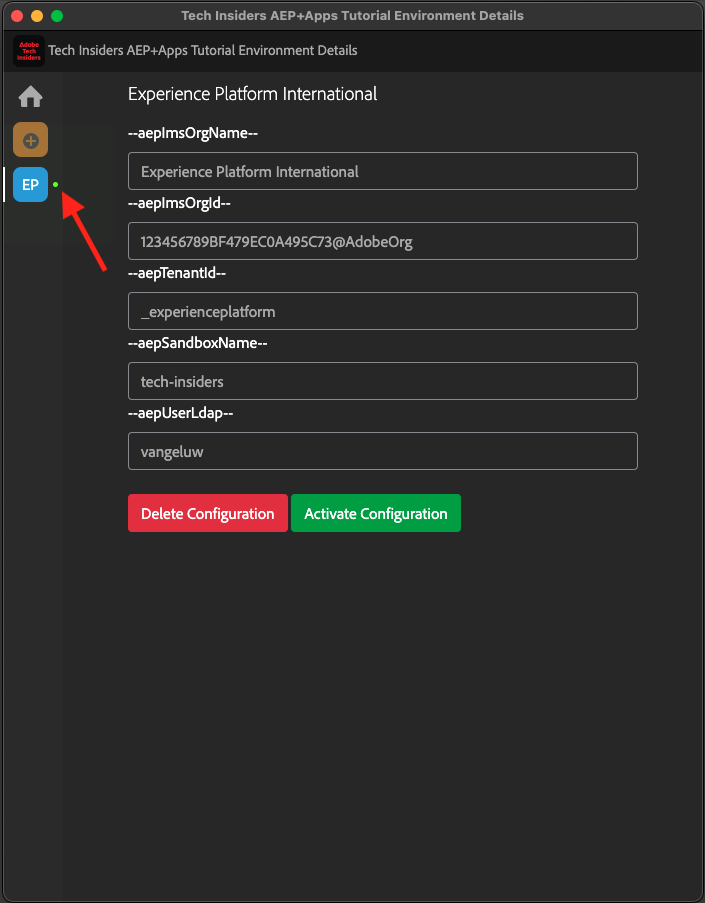

# 0.1 Instalar la extensión de Chrome para la documentación de Experience League

## 0.1.1 ¿Por qué hemos creado una extensión de Chrome?

La documentación se ha convertido en genérica para que cualquier persona pueda reutilizarla fácilmente, utilizando cualquier instancia de Adobe Experience Platform.
Al hacer que la documentación sea reutilizable, se introdujeron **Variables de entorno** en la documentación, lo que significa que encontrará las **claves** siguientes en la documentación. Cada clave es una variable específica para un entorno específico, y la extensión de Chrome cambiará esa variable por usted y, como tal, le facilitará la copia de código y texto de las páginas del tutorial y su pegado en las distintas interfaces de usuario que utilizará como parte del tutorial.

A continuación se puede encontrar un ejemplo de estos valores. Actualmente, estos valores aún no se pueden usar, pero tan pronto como instale y active la extensión de Chrome, verá que estas variables cambian al texto &quot;normal&quot; que puede copiar y reutilizar.

| Nombre | Clave |
|:-------------:| :---------------:|
| ID de organización de AEP IMS | `--aepImsOrgId--` |
| ID de inquilino de AEP | `--aepTenantId--` |
| Nombre de zona protegida AEP | `--aepSandboxName--` |
| LDAP del perfil del alumno | `--aepUserLdap--` |

Por ejemplo, en la siguiente captura de pantalla puede ver una referencia a `--aepTenantId--`.

Una vez instalada la extensión, el mismo texto se cambia automáticamente para reflejar los valores específicos de la instancia.

La extensión también le permite hacer lo siguiente:

- Regístrese para acceder al tutorial

## 0.1.2 Instalación de la extensión de Chrome

Para instalar esa extensión de Chrome, abra el explorador Chrome y vaya a: [https://chrome.google.com/webstore/detail/platform-learn-configurat/hhnbkfgioecmhimdhooigajdajplinfi/related?hl=en&amp;authuser=0](https://chrome.google.com/webstore/detail/platform-learn-configurat/hhnbkfgioecmhimdhooigajdajplinfi/related?hl=en&amp;authuser=0). Entonces verá esto...

Haga clic en **Agregar a Chrome**.

Entonces verá esto... Haga clic en **Agregar extensión**.

A continuación, se instala la extensión y se muestra una notificación similar.

En el menú de **extensiones**, haga clic en el icono de **pieza del rompecabezas** y ancle la extensión **Aprendizaje de plataforma - Configuración** al menú de extensión.

## 0.1.2 Configuración de la extensión de Chrome

Vaya a [https://experienceleague.adobe.com/docs/platform-learn/comprehensive-technical-tutorial-v22/overview.html?lang=en](https://experienceleague.adobe.com/docs/platform-learn/comprehensive-technical-tutorial-v22/overview.html?lang=en) y, a continuación, haga clic en el icono de la extensión para abrirla.

Entonces verá esta ventana emergente. Haga clic en el icono **+**.

Introduzca su nombre y el ID de configuración creado para su entorno de Adobe Experience Platform. Haga clic en **Crear nuevo**.

>[!IMPORTANT]
>
>Si es un empleado de Adobe: puede encontrar el ID de configuración que desea utilizar en el repositorio interno de Github (https://git.corp.adobe.com/vangeluw/platformenablement).
>
>Si usted es un socio de soluciones de Adobe, póngase en contacto con su socio de soluciones o envíe un correo electrónico a **spphelp@adobe.com**.

En el menú de la izquierda de la extensión, ahora verá un icono con las iniciales. Haga clic en ella. Luego verá la asignación entre las **variables de entorno** y los valores de instancia de Adobe Experience Platform específicos. Haga clic en **Activar configuración**.

Después de activar la configuración, verá un punto verde junto a las iniciales. Esto significa que el ID de configuración ya está activo. También verá una serie de opciones de menú adicionales.

Ahora tiene dos opciones:

- Si ya es un usuario de la habilitación con una configuración existente, vaya a **0.1.3 Usuario existente: inicio de sesión**
- Si es un usuario completamente nuevo que inicia este tutorial por primera vez, vaya a **0.1.4 Suscripción** y omita **0.1.3 Usuario existente - Iniciar sesión**

## 0.1.3 Usuario existente: inicio de sesión

>[!IMPORTANT]
>
>Ejercicio **0.1.3 Usuario existente: iniciar sesión** solo funcionará si ya es un usuario que se registró en este tutorial.

Si es un usuario que está configurando esta extensión de Chrome por primera vez, haga clic en el icono morado en el menú de la izquierda. Entonces verá esto...

Rellene los valores según sea necesario.

>[!IMPORTANT]
>
>El **LDAP** es el campo más importante: debe usar el mismo LDAP que usó la primera vez que se registró en el tutorial. Esto garantizará que su progreso se cargue correctamente. Si no está seguro de cuál es su ldap, eche un vistazo a su dirección de correo electrónico. Utilice el texto que aparece antes del @-symbol en su dirección de correo electrónico como LDAP. Si su dirección de correo electrónico es **techinsiders@adobe.com**, el LDAP que escriba aquí debería ser **vangeluw**).

Haga clic en **Aceptar**.

Después de 30 seg-1 minuto, tu pantalla cambiará y regresarás a **Inicio**, donde verás esto:

La extensión de Chrome ya está configurada y puede comprobar si todo funciona correctamente.

## 0.1.4 Nuevo usuario: suscripción

>[!IMPORTANT]
>
>Ejercicio **0.1.4 Nuevo usuario - Suscribirse** está dirigido a los nuevos usuarios que inician este tutorial por primera vez.

Si es un usuario nuevo que se inscribe en este tutorial por primera vez, haga clic en el icono amarillo del menú. Entonces verá esto...

Rellene los campos según sea necesario. Haga clic en **Guardar**.

>[!IMPORTANT]
>
>El **LDAP** es el campo más importante. Si no está seguro de cuál es su ldap, eche un vistazo a su dirección de correo electrónico. Utilice el texto que aparece antes del @-symbol en su dirección de correo electrónico como LDAP. Si su dirección de correo electrónico es **techinsiders@adobe.com**, el LDAP que escriba aquí debería ser **vangeluw**).

Después de 30 seg-1 minuto, tu pantalla cambiará y regresarás a **Inicio**, donde verás esto:

La extensión de Chrome ya está configurada y puede comprobar si todo funciona correctamente.

## 0.1.5 Verificar el contenido del tutorial

Como prueba, ve a [esta página](https://experienceleague.adobe.com/docs/platform-learn/comprehensive-technical-tutorial-v22/module4/ex3.html?lang=en).

Ahora debería ver que todas las **variables de entorno** han sido reemplazadas por sus valores verdaderos, según el ID de configuración de la extensión de Chrome.

Ahora debería tener una vista similar a la siguiente, donde las variables de entorno `--aepTenantId--` han sido reemplazadas por su ID de inquilino real, que en este caso es **_experienceplatform**.

Paso siguiente: [0.2 Use el sistema de demostración siguiente para configurar la propiedad de cliente de recopilación de datos de Adobe Experience Platform](./ex2.md)

[Volver al módulo 0](./getting-started.md)

[Volver a todos los módulos](./../../../overview.md)
