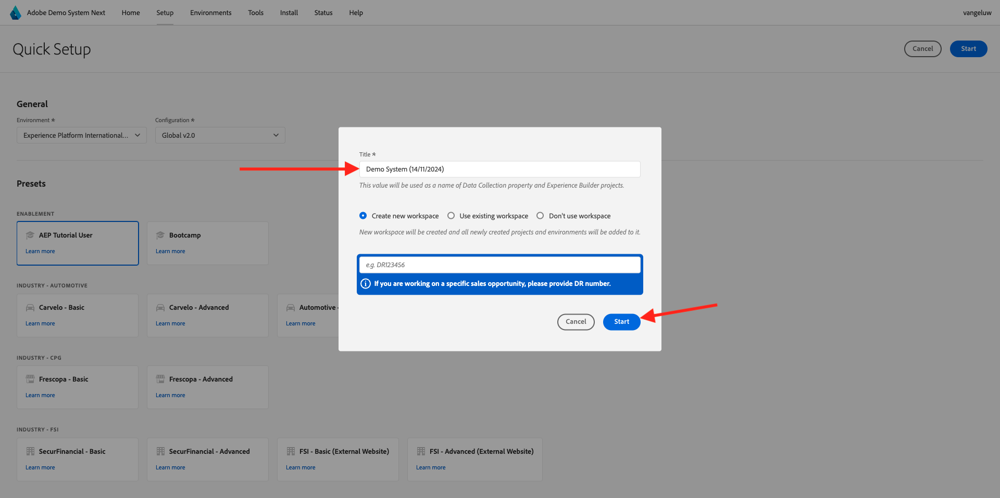

# 0.2 Usar Demo System Next para configurar la propiedad de cliente de recopilación de datos de Adobe Experience Platform

Después de registrarse en el Tutorial técnico completo de Adobe Experience Platform, hay un proceso automatizado que le proporcionará acceso al sistema de demostración, para que pueda acceder y ejecutar la configuración siguiente.

Una vez que tenga acceso al sistema de demostración, siga los pasos a continuación.

Vaya a [https://dashboard.adobedemo.com/](https://dashboard.adobedemo.com/). Seleccione su zona protegida y haga clic en **Configuración rápida**.

Verá lo siguiente:

En **General** - **Entorno**, seleccione su instancia de Adobe Experience Platform y su zona protegida, en este caso:

- **Experience Platform Internacional**
- **aepenablementfy22**
- Configuración: seleccione **Global v2.0**

A continuación, seleccione el ajuste preestablecido **Usuario de habilitación** y haga clic en **Iniciar**.

En la ventana emergente, escriba un nombre para la propiedad de recopilación de datos. Use esta convención de nombres: **Sistema de demostración (DD/MM/AAAA)**. Información: el LDAP se añadirá automáticamente, no es necesario que lo añada usted mismo.

Haga clic en **Start**.

A continuación, verá esta ventana emergente, que muestra el progreso al crear su sitio web y proyectos de aplicaciones móviles, así como las propiedades de recopilación de datos.

Una vez completado el proceso de configuración rápida, tendrá lo siguiente:

- 1 proyecto de venta minorista por web, que permite utilizar un sitio web de demostración con la marca de demostración de Luma
- 1 proyecto de venta minorista móvil, que permite utilizar una aplicación móvil de demostración con la marca de demostración de Luma
- 1 Proyecto de CX App Retail, que permite utilizar una aplicación de centro de llamadas y clientelización con la marca de demostración de Luma.
- 1 Propiedad de recopilación de datos para la web, que utilizará para recopilar datos del sitio web
- 1 propiedad de recopilación de datos para móviles, que utilizará para recopilar datos de la aplicación móvil

Mantenga esta pantalla abierta ya que la necesitará en los siguientes pasos.

Paso siguiente: [0.3 Crear su secuencia de datos](./ex3.md)

[Volver al módulo 0](./getting-started.md)

[Volver a todos los módulos](./../../../overview.md)
