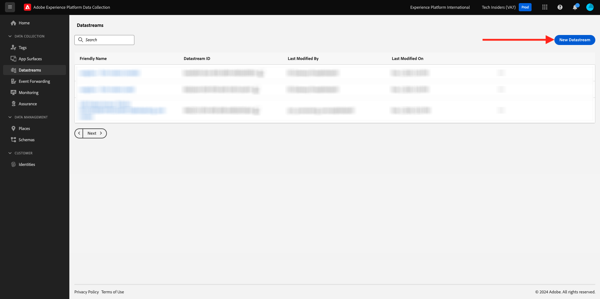
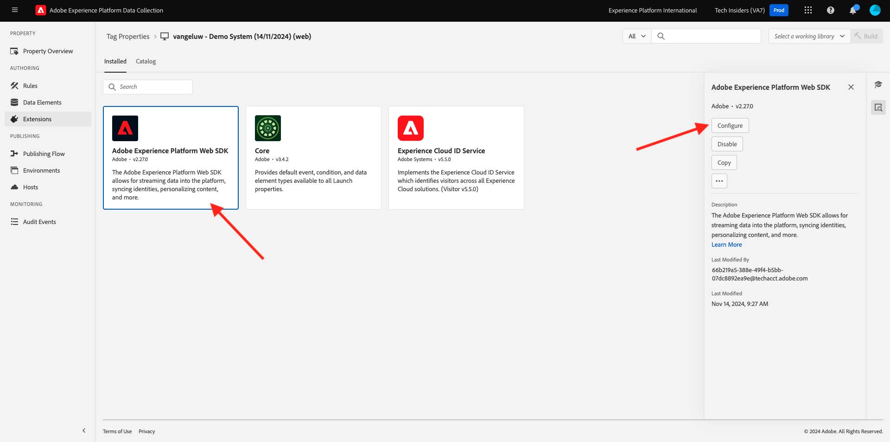
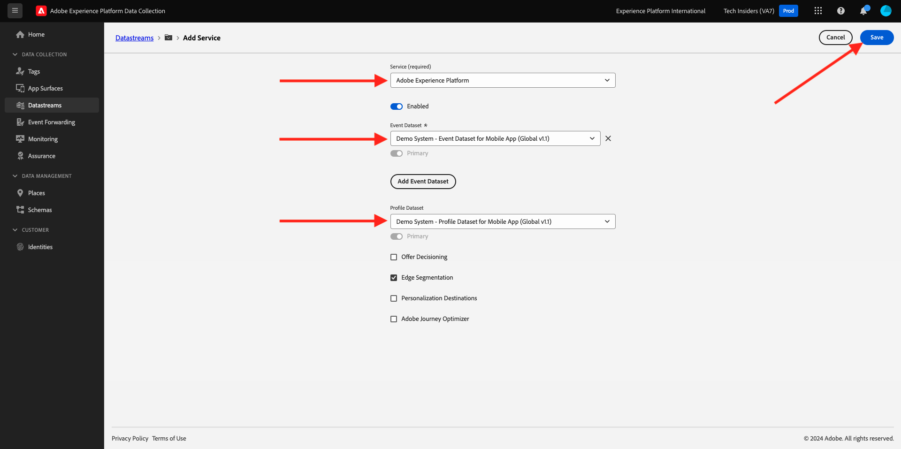

# 0.3 Crear su secuencia de datos

Vaya a [https://experience.adobe.com/#/data-collection/](https://experience.adobe.com/#/data-collection/). Después del ejercicio anterior, ahora tiene dos propiedades de recopilación de datos: una para la web y otra para el móvil.

Estas propiedades están casi listas para utilizarse, pero antes de empezar a recopilar datos con estas propiedades, debe configurar una secuencia de datos. Obtendrá más información sobre el concepto de conjunto de datos y su significado en el Ejercicio 1.2.

Por ahora, siga estos pasos.

## 0.3.1 Creación de un flujo de datos para la web

Haga clic en **[!UICONTROL Datastreams]** o **[!UICONTROL Datastreams (Beta)]**.

En la esquina superior derecha de la pantalla, seleccione el nombre de la zona protegida, que debe ser `--aepSandboxName--`.

Haga clic en **[!UICONTROL Nueva secuencia de datos]**.

Para **[!UICONTROL Nombre descriptivo]** y para la descripción opcional, escriba `--aepUserLdap-- - Demo System Datastream`. Para Esquema de eventos, seleccione **Sistema de demostración - Esquema de eventos para el sitio web (Global v1.1)**. Haga clic en **Guardar**.

Entonces verá esto... Haga clic en **Agregar servicio**.

Seleccione el servicio **[!UICONTROL Adobe Experience Platform]**, que mostrará campos adicionales. Entonces verá esto...

Para Conjunto de datos de evento, seleccione **Sistema de demostración - Conjunto de datos de evento para el sitio web (Global v1.1)** y para Conjunto de datos de perfil, seleccione **Sistema de demostración - Conjunto de datos de perfil para el sitio web (Global v1.1)**. Haga clic en **Guardar**.

Ahora va a ver esto.

Eso es todo por ahora. En [Módulo 1.1](./../../../modules/datacollection/module1.1/data-ingestion-launch-web-sdk.md) aprenderá más sobre el SDK web y cómo configurar todas sus funcionalidades.

En el menú de la izquierda, haga clic en **[!UICONTROL Etiquetas]**.

Filtre los resultados de búsqueda para ver las dos propiedades de recopilación de datos. Abra la propiedad de **Web** al hacer clic en ella.

Entonces verá esto... Haga clic en **Extensiones**.

En la extensión SDK para web de Adobe Experience Platform, haga clic en **Configurar**.

Entonces verá esto... Para **Datastreams**, actualmente verá un valor ficticio establecido en 1. Ahora necesita hacer clic en el botón de opción **Elegir de la lista**. En la lista desplegable, seleccione la secuencia de datos que creó anteriormente.

Asegúrese de haber seleccionado **Flujo de datos**. SUGERENCIA: Puede filtrar los resultados de la lista desplegable fácilmente escribiendo su `--aepUserLdap--`.

Desplácese hacia abajo hasta que vea **Recopilación de datos**. Asegúrese de que la casilla de verificación para **Habilitar la recopilación de datos de clics** no esté habilitada. Haga clic en **Guardar** para guardar los cambios.

Vaya a **Flujo de publicación**.

Haga clic en **...** para **Principal** y luego haga clic en **Editar**.

Haga clic en **Agregar todos los recursos modificados** y, a continuación, haga clic en **Guardar y generar para desarrollo**.

Los cambios se están publicando y estarán listos en un par de minutos.

## 0.3.2 Crear un flujo de datos para dispositivos móviles

Vaya a [https://experience.adobe.com/#/data-collection/](https://experience.adobe.com/#/data-collection/).

Haga clic en **[!UICONTROL Datastreams]** o **[!UICONTROL Datastreams (Beta)]**.

En la esquina superior derecha de la pantalla, seleccione el nombre de la zona protegida, que debe ser `--aepSandboxName--`.

Haga clic en **[!UICONTROL Nueva secuencia de datos]**.

Para **[!UICONTROL Nombre descriptivo]** y para la descripción opcional, escriba `--aepUserLdap-- - Demo System Datastream (Mobile)`. Para Esquema de eventos, seleccione **Sistema de demostración - Esquema de eventos para aplicación móvil (Global v1.1)**. Haga clic en **Guardar**.

Haga clic en **[!UICONTROL Guardar]**.

Entonces verá esto... Haga clic en **Agregar servicio**.

Seleccione el servicio **[!UICONTROL Adobe Experience Platform]**, que mostrará campos adicionales. Entonces verá esto...

Para Conjunto de datos de evento, seleccione **Sistema de demostración - Conjunto de datos de evento para aplicación móvil (Global v1.1)** y para Conjunto de datos de perfil, seleccione **Sistema de demostración - Conjunto de datos de perfil para aplicación móvil (Global v1.1)**. Haga clic en **Guardar**.

Entonces verá esto...

La secuencia de datos ya está lista para utilizarse en la propiedad de cliente de recopilación de datos de Adobe Experience Platform para dispositivos móviles.

Vaya a **Etiquetas** y filtre los resultados de búsqueda para ver sus dos propiedades de recopilación de datos. Abra la propiedad de **Mobile** al hacer clic en ella.

Entonces verá esto... Haga clic en **Extensiones**.

En la extensión **Adobe Experience Platform Edge Network**, haga clic en **Configurar**.

Entonces verá esto... Ahora debe seleccionar la zona protegida y la secuencia de datos correctos que acaba de configurar. La zona protegida que se va a usar es `--aepSandboxName--` y el conjunto de datos se llama `--aepUserLdap-- - Demo System Datastream (Mobile)`.

Para el **dominio de Edge Network**, use el dominio predeterminado que es **edge.adobedc.net**.

Haga clic en **Guardar** para guardar los cambios.

Vaya a **Flujo de publicación**.

Haga clic en **...** junto a **Principal** y, a continuación, haga clic en **Editar**.

Haga clic en **Agregar todos los recursos modificados** y luego haga clic en **Guardar y generar para desarrollo**.

Los cambios se están publicando y estarán listos en un par de minutos.

Paso siguiente: [0.4 Usar el sitio web](./ex4.md)

[Volver al módulo 0](./getting-started.md)

[Volver a todos los módulos](./../../../overview.md)