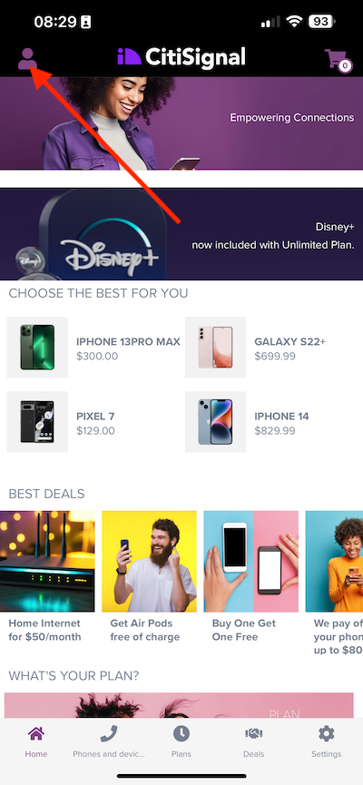

# 2.1.1 De desconocido a conocido en el sitio web

## Contexto

El recorrido de lo desconocido a lo conocido es uno de los temas más importantes entre las marcas en estos días, como lo es el recorrido del cliente desde la adquisición hasta la retención.

Adobe Experience Platform juega un papel muy importante en este recorrido. Platform es el cerebro para la comunicación, el &quot;sistema de experiencia de registro&quot;.

Platform es un entorno en el que la palabra cliente es más amplia que solo los clientes conocidos. Un visitante desconocido del sitio web también es un cliente desde la perspectiva de Platform y, como tal, todo el comportamiento como visitante desconocido también se envía a Platform. Gracias a ese enfoque, cuando este visitante finalmente se convierte en un cliente conocido, una marca también puede visualizar lo que sucedió antes de ese momento. Esto ayuda desde la perspectiva de la atribución y la optimización de la experiencia.

## Flujo de recorrido del cliente

Vaya a [https://dsn.adobe.com](https://dsn.adobe.com). Después de iniciar sesión con su Adobe ID, verá esto. Haga clic en los 3 puntos **...** del proyecto del sitio web y, a continuación, haga clic en **Ejecutar** para abrirlo.

A continuación, verá cómo se abre el sitio web de demostración. Seleccione la URL y cópiela en el portapapeles.

Abra una nueva ventana del explorador de incógnito.

Pegue la dirección URL del sitio web de demostración, que copió en el paso anterior. Luego se le pedirá que inicie sesión con su Adobe ID.

Seleccione el tipo de cuenta y complete el proceso de inicio de sesión.

Luego verá el sitio web cargado en una ventana de incógnito del explorador. Para cada ejercicio, deberá utilizar una ventana nueva del explorador de incógnito para cargar la URL del sitio web de demostración.

Haga clic en el Adobe del logotipo situado en la esquina superior izquierda de la pantalla para abrir el Visor de perfiles.

Eche un vistazo al panel Visor de perfiles y al Perfil del cliente en tiempo real con el **ID de Experience Cloud** como identificador principal de este cliente actualmente desconocido.

También puede ver todos los eventos de experiencia recopilados según el comportamiento del cliente. La lista está actualmente vacía, pero cambiará pronto.

Vaya a la categoría de productos **Teléfonos y dispositivos**. A continuación, haz clic en el producto **iPhone 15 Pro**.

A continuación, verá la página de detalles del producto. Ahora se ha enviado a Adobe Experience Platform un evento de experiencia de tipo **Vista de producto** mediante la implementación del SDK web que revisó en el módulo 1.

Abra el panel Visor de Provile y eche un vistazo a los **Eventos de experiencia**.

Vuelva a la página de categoría **Teléfonos y dispositivos** y haga clic en otro producto. Se ha enviado otro evento de experiencia a Adobe Experience Platform. Abra el panel Visor de perfiles. Ahora verá 2 eventos de experiencia del tipo **Vista de producto**. Aunque el comportamiento es anónimo, con el consentimiento adecuado, puede rastrear cada clic y almacenarlo en Adobe Experience Platform. Una vez que se conozca al cliente anónimo, podremos fusionar automáticamente todos los comportamientos anónimos con el perfil conocido.

Vaya a la página Registrar/Iniciar sesión. Haga clic en **Iniciar sesión**.

Haga clic en **Crear una cuenta**.

Complete sus detalles y haga clic en **Registrarse** después de lo cual se le redirigirá a la página anterior.

Abra el panel Visualizador de perfiles y vaya a Perfil del cliente en tiempo real. En el panel Visor de perfiles, debería ver todos los datos personales que se muestran, como los identificadores de correo electrónico y teléfono que acaba de agregar.

En el panel Visor de perfiles, vaya a Eventos de experiencia. Verá los 2 productos que vio antes en el panel Visor de perfiles. Ambos eventos ahora también están conectados al perfil &quot;conocido&quot;.

Ahora ha introducido datos en Adobe Experience Platform y los ha vinculado a identificadores como ECID y direcciones de correo electrónico. El objetivo de esto es comprender el contexto empresarial de lo que está a punto de hacer. En el siguiente ejercicio, empezará a configurar todo lo que necesita para que sea posible toda esa ingesta de datos.

### Navegar por la aplicación móvil

Después de convertirse en un cliente conocido, es hora de empezar a usar la aplicación móvil. Abra la aplicación móvil en el iPhone y, a continuación, inicie sesión en la aplicación.

Si ya no tienes la aplicación instalada, o si no recuerdas cómo instalarla, mira aquí: [Usa la aplicación móvil](../../gettingstarted/gettingstarted/ex5.md)

Después de instalar la aplicación según las instrucciones, verá la página de aterrizaje de la aplicación con la marca Citi Signal cargada. Haga clic en el icono de cuenta en la parte superior izquierda de la pantalla.

En la pantalla Inicio de sesión, inicie sesión con la dirección de correo electrónico que utilizó en el sitio web de escritorio. Haga clic en **Iniciar sesión**.

Vaya a la pantalla de inicio de la aplicación y haga clic en para abrir cualquier producto.

A continuación, verá la página de detalles del producto.

Vaya a la pantalla de inicio de la aplicación y deslice hacia la izquierda en la pantalla para ver el panel Visor de perfiles. Verá el producto que acaba de ver en la sección **Eventos de experiencia**, junto con todas las vistas de productos de la sesión del sitio web anterior.

>[!NOTE]
>
>Pueden pasar un par de minutos antes de que vea la vista consolidada en la aplicación y en el sitio web.

Ahora vuelva al equipo de escritorio y actualice la página principal, después de lo cual verá que el producto también aparece allí.

>[!NOTE]
>
>Pueden pasar un par de minutos antes de que vea la vista consolidada en la aplicación y en el sitio web.

Ahora ha introducido datos en Adobe Experience Platform y los ha vinculado a identificadores como ECID y direcciones de correo electrónico. El objetivo de este ejercicio era comprender el contexto empresarial de lo que está a punto de hacer. Ahora ha creado de forma eficaz un perfil de cliente en tiempo real y entre dispositivos. En el próximo ejercicio, verá el perfil en Adobe Experience Platform.

Paso siguiente: [2.1.2 Visualice su propio perfil de cliente en tiempo real: IU](./ex2.md)

[Volver al módulo 2.1](./real-time-customer-profile.md)

[Volver a todos los módulos](../../../overview.md)
