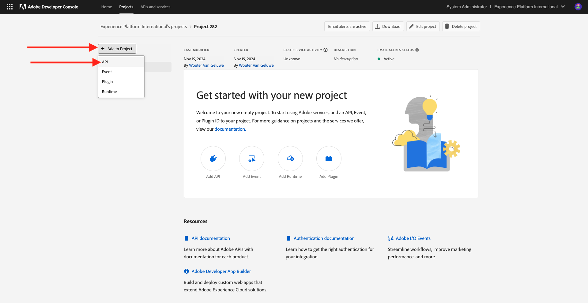
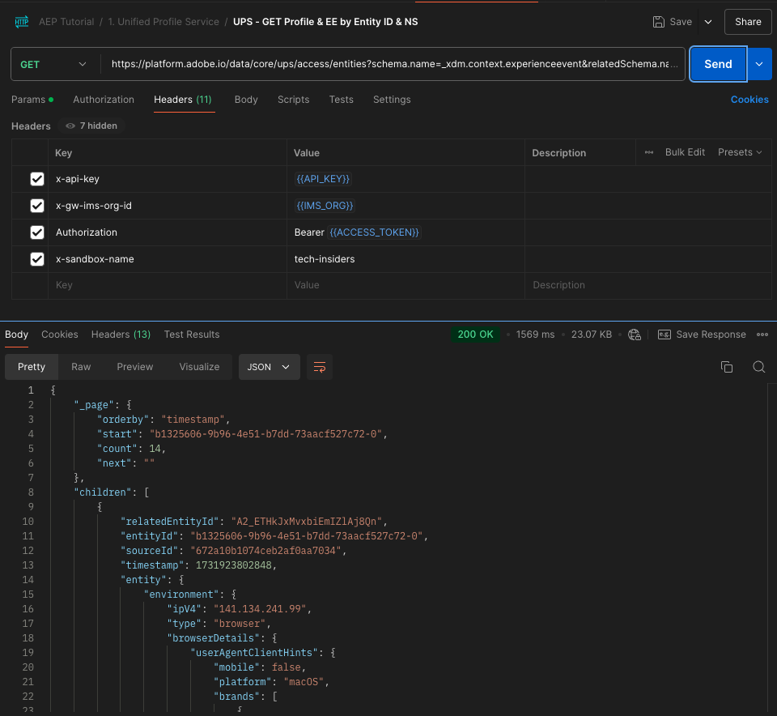

# 2.1.3 Visualice su propio perfil de cliente en tiempo real: API

En este ejercicio, utilizará Postman y Adobe I/O para consultar las API de Adobe Experience Platform y ver su propio perfil de cliente en tiempo real.

## Contexto

En el Perfil del cliente en tiempo real, todos los datos de perfil se muestran junto con los datos de evento, así como las suscripciones a segmentos existentes. Los datos mostrados pueden proceder de cualquier lugar, de aplicaciones de Adobe y soluciones externas. Esta es la vista más potente de Adobe Experience Platform, el sistema de registro de experiencias.

El perfil del cliente en tiempo real lo pueden consumir todas las aplicaciones de Adobe, pero también soluciones externas como centros de llamadas o aplicaciones de clientelización en tienda. La manera de hacerlo es conectar esas soluciones externas a las API de Adobe Experience Platform.

## Sus identificadores

En el panel Visor de perfiles del sitio web, puede encontrar varias identidades. Cada identidad está vinculada a un área de nombres.


En el panel de rayos X, podemos ver 4 combinaciones diferentes de ID y áreas de nombres:

| Identidad | Área de nombres |
|:-------------:| :---------------:|
| ID DEL Experience Cloud (ECID) | 79943948563923140522865572770524243489 |
| ID DEL Experience Cloud (ECID) | 70559351147248820114888181867542007989 |
| ID de correo electrónico | woutervangeluwe+18112024-01@gmail.com |
| Identificador de número de móvil | +32473622044+18112024-01 |

Recuerde estos identificadores para el siguiente paso.

## Configuración del proyecto de Adobe I/O

En este ejercicio utilizará Adobe I/O de forma bastante intensiva para consultar las API de Platform. Siga los siguientes pasos para configurar el Adobe I/O.

Ir a [https://developer.adobe.com/console/home](https://developer.adobe.com/console/home)


Asegúrese de seleccionar la instancia de Adobe Experience Platform correcta en la esquina superior derecha de la pantalla. Su instancia es `--aepImsOrgName--`. Haga clic en **Crear nuevo proyecto**.


Seleccione **+ Agregar al proyecto** y seleccione **API**.



A continuación, verá esto:


Haz clic en el icono **Adobe Experience Platform**.
/images/api2.png)

Seleccione la **API de Experience Platform** y haga clic en **Siguiente**.


Ahora va a ver esto. Proporcione un nombre para su credencial: `--aepUserLdap-- - OAuth credential`. Haga clic en **Next**.


A continuación, debe seleccionar un perfil de producto que defina qué permisos están disponibles para esta integración.

Seleccione los perfiles de producto necesarios.

>[!NOTE]
>
> Los nombres de perfil de producto variarán en la instancia de Adobe Experience Platform a medida que sean específicos de la instancia. Debe seleccionar al menos un perfil de producto con los derechos de acceso adecuados, que se configuran en la interfaz de usuario de permisos de Adobe Admin Console y AEP.

Haga clic en **Guardar API configurada**.


La integración de Adobe I/O ya está lista.


Haga clic en el botón **Descargar para Postman** y, a continuación, haga clic en **Servidor OAuth** para descargar un entorno de Postman (espere hasta que se descargue el entorno, puede tardar un par de segundos).


Su proyecto de IO tiene actualmente un nombre genérico. Debe asignar un nombre descriptivo a la integración. Haga clic en **Proyecto X** (o nombre similar) como se indica


Haga clic en **Editar proyecto**.


Escriba un nombre y una descripción para la integración: `--aepUserLdap-- AEP Tutorial`.

Haga clic en **Guardar**.


La integración de Adobe I/O ha finalizado.


>[!NOTE]
>
>Hay un paso adicional para garantizar que este proyecto de Adobe I/O tenga acceso a la configuración de permisos de Adobe Experience Platform. La credencial de API del proyecto debe agregarse a la interfaz de usuario de permisos de Adobe Experience Platform, para la cual se requieren derechos de acceso de administrador del sistema. Los pasos se documentan a continuación, pero es posible que deba ponerse en contacto con el administrador del sistema para que se procese en caso de que no tenga los derechos de acceso requeridos.

## Permisos de AEP para credenciales de API

Ir a [Adobe Experience Platform](https://experience.adobe.com/platform). Después de iniciar sesión, llegará a la página principal de Adobe Experience Platform.

Vaya a **Permisos**, a **Roles** y haga clic en el perfil de producto correspondiente.

>[!NOTE]
>
> Los nombres de perfil de producto variarán en la instancia de Adobe Experience Platform a medida que sean específicos de la instancia. Debe seleccionar al menos un perfil de producto con los derechos de acceso adecuados, que se configuran en la interfaz de usuario de permisos de Adobe Admin Console y AEP.


Haga clic en **credenciales de API**.


Haga clic en **+ Agregar credenciales de API**.


Seleccione el proyecto de Adobe I/O recién creado y haga clic en **Guardar**.


## Autenticación de Postman en el Adobe I/O

Vaya a [https://www.postman.com/downloads/](https://www.postman.com/downloads/).

Descargue e instale la versión correspondiente de Postman para su sistema operativo.


Después de la instalación de Postman, inicie la aplicación.

En Postman, hay 2 conceptos: entornos y colecciones.

- El entorno contiene todas las variables de entorno que son más o menos coherentes. En el entorno, encontrará cosas como la organización IMS de nuestro entorno de plataforma, junto con credenciales de seguridad como su clave privada y otras. El archivo de entorno es el que descargó durante la configuración del Adobe I/O en el ejercicio anterior. Su nombre es: **`oauth_server_to_server.postman_environment.json`**.

- La colección contiene una serie de solicitudes de API que puede utilizar. Utilizaremos 2 colecciones
   - 1 colección para autenticación en Adobe I/0
   - 1 Colección para los ejercicios de este módulo
   - 1 colección para los ejercicios del módulo Real-Time CDP, para la creación de destinos

Descargue el archivo [postman.zip](./../../../assets/postman/postman_profile.zip) en su escritorio local.

En este archivo **postman.zip** encontrará los siguientes archivos:

- `Adobe IO - OAuth.postman_collection.json`
- `AEP Tutorial.postman_collection.json`
- `Destination_Authoring_API.json`

Descomprima el archivo **postman.zip** y almacene estos 3 archivos en una carpeta del equipo de escritorio, junto con el entorno de Postman descargado del Adobe I/O. Debe tener estos 4 archivos en esa carpeta:


Vuelva a Postman. Haga clic en **Importar**.


Haga clic en **archivos**.


Vaya a la carpeta del escritorio en la que extrajo los 4 archivos descargados. Seleccione estos 4 archivos al mismo tiempo y haga clic en **Abrir**.


Después de hacer clic en **Abrir**, Postman le mostrará una descripción general del entorno y las colecciones que está a punto de importar. Haga clic en **Importar**.


Ahora tiene todo lo que necesita en Postman para empezar a interactuar con Adobe Experience Platform a través de las API.

Lo primero que debe hacer es asegurarse de que está autenticado correctamente. Para autenticarse, debe solicitar un token de acceso.

Asegúrese de haber seleccionado el entorno adecuado antes de ejecutar cualquier solicitud. Puede comprobar el Entorno seleccionado actualmente comprobando la lista desplegable Entorno en la esquina superior derecha.

El entorno seleccionado debe tener un nombre similar a este, `--aepUserLdap-- OAuth Credential`.


El entorno y las colecciones de Postman ya están configurados y funcionan. Ahora puede autenticarse desde Postman en el Adobe I/O.

En la colección **E/S de Adobe - OAuth**, seleccione la solicitud con el nombre **POST - Obtener token de acceso**. Haga clic en **Enviar**.


Después de un par de segundos, debería ver una respuesta en la sección **Body** de Postman:


Si la configuración se ha realizado correctamente, debería ver una respuesta similar que contenga la siguiente información:

| Clave | Valor |
|:-------------:| :---------------:| 
| token_type | **portador** |
| access_token | **keyJhbGciOiJSU...jrNZ6mdaQ** |
| expires_in | **86399** |

El Adobe I/O le ha proporcionado un token de **bearer**, con un valor específico (el token de acceso muy largo) y un período de caducidad.

El token que hemos recibido ahora es válido durante 24 horas. Esto significa que, después de 24 horas, si desea utilizar Postman para autenticarse en el Adobe I/O, deberá generar un nuevo token ejecutando esta solicitud de nuevo.

## API de perfil de cliente en tiempo real, esquema: perfil

Ahora puede continuar y enviar su primera solicitud a las API de perfil del cliente en tiempo real de Platform.

En Postman, busque la colección **Tutorial de AEP**.


En **1. Servicio de perfil unificado**, haga clic en la primera solicitud con el nombre **UPS - Perfil de GET por identificador de entidad y NS**.


Para esta solicitud, hay tres variables requeridas:

| Clave | Valor | Definición |
|:-------------:| :---------------:| :---------------:| 
| entityId | **id** | el ID de cliente específico |
| entityIdNS | **espacio de nombres** | el área de nombres específica aplicable al ID |
| schema.name | **_xdm.context.profile** | el esquema específico para el que desea recibir información |

Por lo tanto, si desea solicitar a las API de Adobe Experience Platform que le devuelvan toda la información de perfil para su propio ECID, deberá configurar la solicitud de la siguiente manera:

| Clave | Valor |
|:-------------:| :---------------:| 
| entityId | **yourECID** |
| entityIdNS | **ecid** |
| schema.name | **_xdm.context.profile** |


También debe verificar los campos **Header** - de su solicitud. Vaya a **Encabezados**. A continuación, verá esto:


>[!NOTE]
>
>Debe especificar el nombre de la zona protegida de Adobe Experience Platform que está utilizando. x-sandbox-name debe ser `--aepSandboxName--`.

| Clave | Valor |
| ----------- | ----------- |
| x-sandbox-name | `--aepSandboxName--` |


Una vez que hayas comprobado el nombre de la zona protegida, haz clic en **Enviar** para enviar la solicitud a Platform.

Debería obtener una respuesta inmediata de Platform, que le muestre algo similar a esto:


Esta es la respuesta completa de Platform:

```javascript
{
    "A2_ETHkJxMvxbiEmIZlAj8Qn": {
        "entityId": "A2_ETHkJxMvxbiEmIZlAj8Qn",
        "mergePolicy": {
            "id": "64e4b0ed-dfc3-4084-8e67-643e977168d7"
        },
        "sources": [
            "672a10cdb015162aefedfc0f",
            "672a10b1a05e282aee19737c"
        ],
        "tags": [
            "0938B898-469A-4513-8E86-87464307120F:va7",
            "3ba34930-405e-4b31-aafa-bac22d35203e:va7"
        ],
        "identityGraph": [
            "G7z3JAFBY4I6Rzg",
            "A2_ETHkJxMvxbiEmIZlAj8Qn",
            "BkFvK4QcJpSPByuDGF4UAS0wMQ",
            "BUF9zMKLrXq72p4HpbsHv1SDGF4UAS0wMUBnbWFpbC5jb20",
            "A29btmFXmrfrYbXQWISCT9ZD"
        ],
        "entity": {
            "_experienceplatform": {
                "identification": {
                    "core": {
                        "ecid": "79943948563923140522865572770524243489",
                        "phoneNumber": "+32473622044+18112024-01",
                        "email": "woutervangeluwe+18112024-01@gmail.com"
                    }
                }
            },
            "userAccount": {
                "ID": "3688250"
            },
            "pushNotificationDetails": [
                {
                    "denylisted": false,
                    "token": "2E0945F186CE5ED8CBFD1EB519A8CF38BA2B28A67FB381D45AA15EE37D289214",
                    "identity": {
                        "namespace": {
                            "code": "ECID"
                        },
                        "id": "70559351147248820114888181867542007989"
                    },
                    "platform": "apns",
                    "appID": "com.adobe.demosystem.dxdemo"
                }
            ],
            "personalEmail": {
                "address": "woutervangeluwe+18112024-01@gmail.com"
            },
            "_repo": {
                "createDate": "2024-11-18T10:39:12.296Z"
            },
            "extSourceSystemAudit": {
                "lastUpdatedDate": "2024-11-19T07:46:52.001Z"
            },
            "testProfile": true,
            "mobilePhone": {
                "number": "+32473622044"
            },
            "consents": {
                "metadata": {
                    "time": "2024-11-19T07:46:52.001Z"
                },
                "idSpecific": {
                    "ECID": {
                        "70559351147248820114888181867542007989": {
                            "collect": {
                                "val": "y"
                            }
                        }
                    }
                }
            },
            "person": {
                "name": {
                    "lastName": "Van Geluwe",
                    "firstName": "Wouter"
                }
            },
            "userActivityRegions": {
                "IRL1": {
                    "captureTimestamp": "2024-11-19T07:46:51.239Z"
                }
            },
            "identityMap": {
                "ecid": [
                    {
                        "id": "70559351147248820114888181867542007989"
                    },
                    {
                        "id": "79943948563923140522865572770524243489"
                    }
                ],
                "email": [
                    {
                        "id": "woutervangeluwe+18112024-01@gmail.com"
                    }
                ],
                "phone": [
                    {
                        "id": "+32473622044+18112024-01"
                    }
                ],
                "userid": [
                    {
                        "id": "3688250"
                    }
                ]
            }
        },
        "lastModifiedAt": "2024-11-19T07:47:23Z"
    }
}
```

Estos son todos los datos de perfil disponibles en Platform para este ECID.

No es necesario que utilice el ECID para solicitar datos de perfil al Perfil del cliente en tiempo real de Platform; puede utilizar cualquier ID en cualquier área de nombres para solicitar estos datos.

Volvamos a Postman y supongamos que somos el centro de llamadas y enviemos una solicitud a Platform especificando el área de nombres de **Phone** y su número de móvil.

Por lo tanto, si desea solicitar a las API de Platform que le devuelvan toda la información de perfil de un teléfono específico, deberá configurar la solicitud de la siguiente manera:

| Clave | Valor |
|:-------------:| :---------------:| 
| entityId | **tu número de teléfono** |
| entityIdNS | **teléfono** (reemplazar ecid por teléfono) |
| schema.name | **_xdm.context.profile** |

Si tu número de teléfono contiene símbolos especiales como **+**, tienes que seleccionar tu número de teléfono completo, hacer clic con el botón derecho y hacer clic en **EncodeURIComponent**.


A continuación, tendrá esto:


También debe verificar los campos **Header** - de su solicitud. Vaya a **Encabezados**. A continuación, verá esto:


>[!NOTE]
>
>Debe especificar el nombre de la zona protegida de Adobe Experience Platform que está utilizando. x-sandbox-name debe ser `--aepSandboxName--`.

| Clave | Valor |
| ----------- | ----------- |
| x-sandbox-name | `--aepSandboxName--` |


Haga clic en **Enviar** y compruebe la respuesta. Verá que es la misma que antes cuando usaba el ECID como identidad.


Hagamos lo mismo con tu dirección de correo electrónico especificando el área de nombres de **email** y tu dirección de correo electrónico.

Por lo tanto, si desea solicitar a las API de Platform que le devuelvan toda la información de perfil de una dirección de correo electrónico específica, deberá configurar la solicitud de la siguiente manera:

| Clave | Valor |
|:-------------:| :---------------:| 
| entityId | **su correo electrónico** |
| entityIdNS | **correo electrónico** (reemplazar teléfono por correo electrónico) |
| schema.name | **_xdm.context.profile** |

Si su dirección de correo electrónico contiene símbolos especiales como **+**, debe seleccionar su dirección de correo electrónico completa, hacer clic con el botón secundario y hacer clic en **EncodeURIComponent**.


A continuación, tendrá esto:


También debe verificar los campos **Header** - de su solicitud. Vaya a **Encabezados**. A continuación, verá esto:

>[!NOTE]
>
>Debe especificar el nombre de la zona protegida de Adobe Experience Platform que está utilizando. x-sandbox-name debe ser `--aepSandboxName--`.


| Clave | Valor |
| ----------- | ----------- |
| x-sandbox-name | `--aepSandboxName--` |

Haga clic en **Enviar** y verifique la respuesta. Verá de nuevo que es lo mismo que antes con el ECID y el número de teléfono.


Se trata de un tipo muy importante de flexibilidad que se ofrece a las marcas. Esto significa que cualquier entorno puede enviar una solicitud a Platform, utilizando su propio ID y área de nombres, sin tener que comprender la complejidad de varias áreas de nombres e ID.

A modo de ejemplo:

- el centro de llamadas puede solicitar datos de Platform usando el área de nombres **phone**
- el sistema de fidelización puede solicitar datos de Platform usando el espacio de nombres **email**
- las aplicaciones en línea pueden utilizar el espacio de nombres **ecid**

El centro de llamadas no sabe necesariamente qué tipo de identificador se utiliza en el sistema de fidelización y el sistema de fidelización no sabe necesariamente qué tipo de identificador se utiliza en las aplicaciones en línea. Cada sistema individual puede utilizar la información que tiene y que comprende para obtener la información que necesita, cuando la necesita.

## API de perfil del cliente en tiempo real, esquema: perfil y ExperienceEvent

Después de haber consultado correctamente las API de Platform para obtener datos de perfil, hagamos lo mismo con los datos de ExperienceEvent.

En Postman, busque la colección **Tutorial de AEP**.


En **1. Servicio de perfil unificado**, seleccione la segunda solicitud con el nombre **UPS - Perfil de GET &amp; EE por ID de entidad &amp; NS**.


Para esta solicitud, hay cuatro variables requeridas:

| Clave | Valor | Definición |
|:-------------:| :---------------:|  :---------------:| 
| schema.name | **_xdm.context.experienceevent** | el esquema específico para el que desea recibir información. En este caso, buscamos datos que estén asignados al esquema ExperienceEvent. |
| relatedSchema.name | **_xdm.context.profile** | Mientras buscamos datos asignados al esquema de ExperienceEvent, necesitamos especificar una identidad para la que queramos recibir esos datos. El esquema que tiene acceso a la identidad es el esquema de perfil, por lo que relatedSchema es el esquema de perfil. |
| relatedEntityId | **id** | el ID de cliente específico |
| relatedEntityIdNS | **espacio de nombres** | el área de nombres específica aplicable al ID |

Por lo tanto, si desea solicitar a las API de Platform que le devuelvan toda la información de perfil para su propio ecid, deberá configurar la solicitud de la siguiente manera:

| Clave | Valor |
|:-------------:| :---------------:| 
| schema.name | **_xdm.context.experienceevent** |
| relatedSchema.name | **_xdm.context.profile** |
| relatedEntityId | **yourECID** |
| relatedEntityIdNS | **ecid** |


También debe verificar los campos **Header** - de su solicitud. Vaya a **Encabezados**. A continuación, verá esto:


>[!NOTE]
>
>Debe especificar el nombre de la zona protegida de Adobe Experience Platform que está utilizando. x-sandbox-name debe ser `--aepSandboxName--`.

| Clave | Valor |
| ----------- | ----------- |
| x-sandbox-name | `--aepSandboxName--` |

Haga clic en **Enviar** para enviar la solicitud a Platform.

Debería obtener una respuesta inmediata de Platform, que le muestre algo similar a esto:



A continuación se muestra la respuesta completa de Platform. En este ejemplo, hay ocho ExperienceEvents vinculados al ECID de este cliente. Eche un vistazo a lo siguiente para ver las diferentes variables de la solicitud, ya que lo que ve a continuación es la consecuencia directa de la configuración en Launch en ejercicios anteriores.

Además, cuando el panel de rayos X muestra información de ExperienceEvent, está utilizando la siguiente carga útil para analizar y recuperar la información, como el nombre del producto (busque productName en la siguiente carga útil) y la URL de imagen del producto (busque productImageUrl en la siguiente carga útil).

```javascript
{
    "_page": {
        "orderby": "timestamp",
        "start": "b1325606-9b96-4e51-b7dd-73aacf527c72-0",
        "count": 14,
        "next": ""
    },
    "children": [
        {
            "relatedEntityId": "A2_ETHkJxMvxbiEmIZlAj8Qn",
            "entityId": "b1325606-9b96-4e51-b7dd-73aacf527c72-0",
            "sourceId": "672a10b1074ceb2af0aa7034",
            "timestamp": 1731923802848,
            "entity": {
                "environment": {
                    "ipV4": "141.134.241.99",
                    "type": "browser",
                    "browserDetails": {
                        "userAgentClientHints": {
                            "mobile": false,
                            "platform": "macOS",
                            "brands": [
                                {
                                    "brand": "Chromium",
                                    "version": "130"
                                },
                                {
                                    "brand": "Google Chrome",
                                    "version": "130"
                                },
                                {
                                    "brand": "Not?A_Brand",
                                    "version": "99"
                                }
                            ]
                        },
                        "userAgent": "Mozilla/5.0 (Macintosh; Intel Mac OS X 10_15_7) AppleWebKit/537.36 (KHTML, like Gecko) Chrome/130.0.0.0 Safari/537.36",
                        "viewportHeight": 992,
                        "viewportWidth": 1920
                    }
                },
                "web": {
                    "webPageDetails": {
                        "name": "Home",
                        "viewName": "Home",
                        "pageViews": {
                            "value": 1
                        },
                        "URL": "https://dsn.adobe.com/web/vangeluw-QIMU"
                    },
                    "webReferrer": {
                        "URL": "https://auth.services.adobe.com/"
                    }
                },
                "_experienceplatform": {
                    "interactionDetails": {
                        "core": {
                            "channel": "web"
                        }
                    },
                    "demoEnvironment": {
                        "brandName": "vangeluw-QIMU"
                    },
                    "identification": {
                        "core": {
                            "ecid": "79943948563923140522865572770524243489"
                        }
                    }
                },
                "implementationDetails": {
                    "name": "https://ns.adobe.com/experience/alloy/reactor",
                    "version": "2.24.0+2.27.0",
                    "environment": "browser"
                },
                "identityMap": {
                    "ECID": [
                        {
                            "id": "79943948563923140522865572770524243489",
                            "authenticatedState": "ambiguous",
                            "primary": true
                        }
                    ]
                },
                "eventType": "web.webpagedetails.pageViews",
                "_id": "b1325606-9b96-4e51-b7dd-73aacf527c72-0",
                "placeContext": {
                    "localTime": "2024-11-18T10:56:42.848+01:00",
                    "localTimezoneOffset": -60
                },
                "device": {
                    "screenOrientation": "landscape",
                    "screenWidth": 1920,
                    "screenHeight": 1080
                },
                "timestamp": "2024-11-18T09:56:42.848Z"
            },
            "lastModifiedAt": "2024-11-18T09:56:45Z"
        },
    "_links": {
        "next": {
            "href": ""
        }
    }
}
```

Estos son todos los datos de ExperienceEvent disponibles en Platform para este ECID.

No es necesario que utilice el ECID para solicitar datos de ExperienceEvent del perfil en tiempo real de Adobe Experience Platform; puede utilizar cualquier ID en cualquier área de nombres para solicitar estos datos.

Paso siguiente: [2.1.4 Crear un segmento: IU](./ex4.md)

[Volver al módulo 2.1](./real-time-customer-profile.md)

[Volver a todos los módulos](../../../overview.md)
