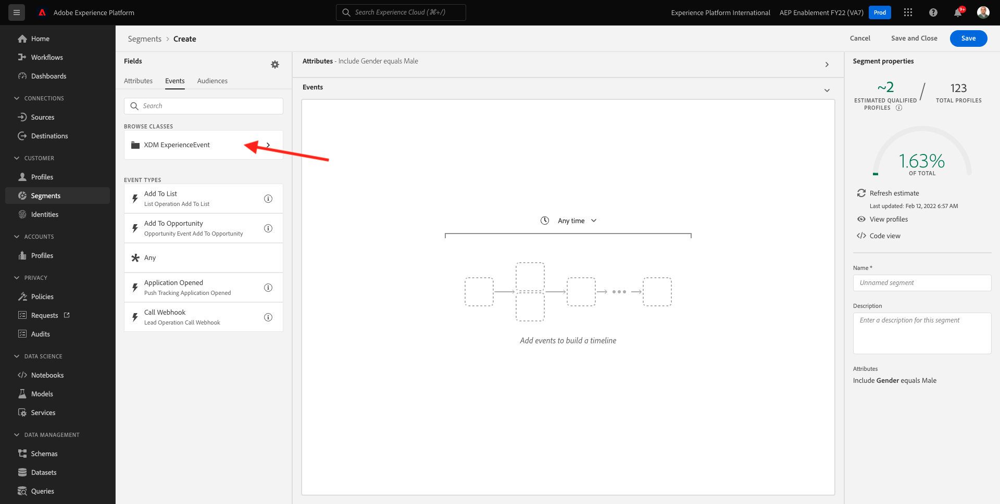

# 2.1.4 Crear un segmento: IU

En este ejercicio, creará un segmento utilizando el Generador de segmentos de Adobe Experience Platform.

## Historia

Ir a [Adobe Experience Platform](https://experience.adobe.com/platform). Después de iniciar sesión, llegará a la página principal de Adobe Experience Platform.


Antes de continuar, debe seleccionar una **zona protegida**. La zona protegida que se va a seleccionar se denomina ``--aepSandboxName--``. Para ello, haga clic en el texto **[!UICONTROL Producción]** en la línea azul de la parte superior de la pantalla. Después de seleccionar la [!UICONTROL zona protegida] adecuada, verá el cambio en la pantalla y ahora se encuentra en la [!UICONTROL zona protegida] dedicada.


En el menú de la izquierda, ve a **Segmentos**. En esta página, puede ver una descripción general de todos los segmentos existentes. Haga clic en el botón **+ Crear segmento** para comenzar a crear un nuevo segmento.


Una vez que esté en el nuevo generador de segmentos, verá inmediatamente la opción de menú **Atributos** y la referencia de **Perfil individual XDM**.


Dado que XDM es el lenguaje que alimenta el negocio de la experiencia, XDM también es la base del generador de segmentos. Todos los datos que se incorporen en Platform deben asignarse a XDM y, como tales, todos los datos pasan a formar parte del mismo modelo de datos independientemente de dónde provengan. Esto le ofrece una gran ventaja a la hora de crear segmentos, ya que desde esta interfaz de usuario del generador de segmentos puede combinar datos de cualquier origen en el mismo flujo de trabajo. Los segmentos creados en el Generador de segmentos se pueden enviar a soluciones como Adobe Target, Adobe Campaign y Adobe Audience Manager para su activación.

Vamos a crear un segmento que incluya todos los clientes **hombres**.

Para llegar al atributo de género, debe comprender y conocer XDM.

El sexo es un atributo de la persona, que se puede encontrar en Atributos. Para llegar allí, empezarás haciendo clic en **Perfil particular de XDM**. Entonces verá esto... En la ventana **XDM Individual Profile**, seleccione **Person**.


Entonces verá esto... En **Persona**, puedes encontrar el atributo **Género**. Arrastre el atributo Gender al generador de segmentos.


Ahora puede elegir el género específico de las opciones rellenadas previamente. En este caso, vamos a elegir **Hombre**.


Después de seleccionar **Hombre**, puede obtener una estimación de la población del segmento presionando el botón **Actualizar estimación**. Esto resulta muy útil para un usuario empresarial, ya que puede ver el impacto de ciertos atributos en el tamaño de segmento resultante.


A continuación, verá una estimación como la siguiente:


A continuación, debería refinar un poco su segmento. Necesita crear un segmento con todos los clientes hombres que vieron el producto **Proteus Fitness Jackshirt (Naranja)**.

Para crear este segmento, debe añadir un Evento de experiencia. Puede encontrar todos los eventos de experiencias haciendo clic en el icono **Eventos** en la barra de menús de **Campos**.


A continuación, verá el nodo **XDM ExperienceEvents** de nivel superior. Haga clic en **ExperienceEvent de XDM**.



Vaya a **Elementos de lista de productos**.


Seleccione **Name** y arrastre y suelte el objeto **Name** del menú de la izquierda en el lienzo del generador de segmentos en la sección **Events**.


A continuación, verá esto:


El parámetro de comparación debe ser **igual a** y en el campo de entrada, ingrese **MONTANA WIND JACKET**.


Cada vez que agregue un elemento al generador de segmentos, puede hacer clic en el botón **Actualizar estimación** para obtener una nueva estimación de la población del segmento.

Hasta ahora, solo ha utilizado la interfaz de usuario de para crear el segmento, pero también hay una opción de código para crear un segmento.

Al crear un segmento, está creando una consulta de Profile Query Language (PQL). Para visualizar el código PQL, haga clic en el conmutador **Vista de código** en la esquina superior derecha del generador de segmentos.


Ahora puede ver la instrucción completa de PQL:

```sql
person.gender in ["male"] and CHAIN(xEvent, timestamp, [C0: WHAT(productListItems.exists(name.equals("MONTANA WIND JACKET", false)))])
```

También puede obtener una vista previa de una muestra de los perfiles de clientes que forman parte de este segmento, haciendo clic en **Ver perfiles**.


Por último, asigne un nombre al segmento y guárdelo.

Como convención de nombres, utilice:

- `--aepUserLdap-- - Male customers with interest in Montana Wind Jacket`


A continuación, haga clic en el botón **Guardar y cerrar** para guardar el segmento, tras lo cual volverá a la página Información general del segmento.


Ahora puede continuar con el siguiente ejercicio y crear un segmento a través de la API.

Paso siguiente: [2.1.5 Crear un segmento: API](./ex5.md)

[Volver al módulo 2.1](./real-time-customer-profile.md)

[Volver a todos los módulos](../../../overview.md)
