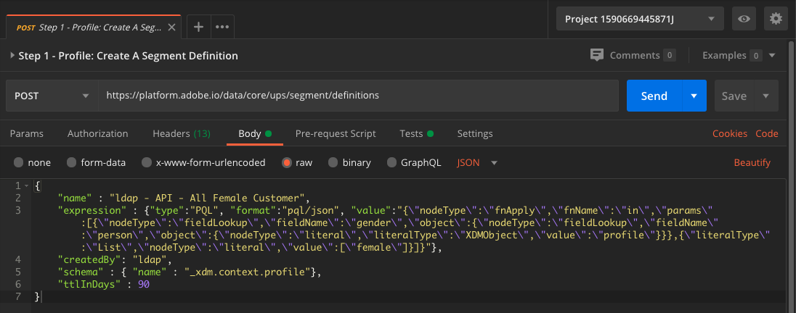

# 2.1.5 Crear un segmento: API

En este ejercicio, utilizará Postman y Adobe I/O para crear un segmento y almacenar los resultados de ese segmento como un conjunto de datos, utilizando las API de Adobe Experience Platform.

## Historia

En el Perfil del cliente en tiempo real, todos los datos de perfil se muestran junto con los datos de evento y las suscripciones a segmentos existentes. Los datos que se muestran pueden proceder de cualquier lugar, de aplicaciones de Adobe y soluciones externas. Esta es la vista más potente de Adobe Experience Platform, el sistema de registro de experiencias.

## 2.1.5.1: creación de un segmento a través de la API de Platform

Vaya a Postman.

Busque la colección: **_Habilitación de Adobe Experience Platform**. En esta colección, verá una carpeta **2. Segmentación**. En este ejercicio se utilizarán estas solicitudes.


A continuación, seguiremos todos los pasos necesarios para crear un segmento a través de la API. Vamos a crear un segmento simple: &quot;**ldap** - Todos los clientes femeninos&quot;.

### Paso 1: Creación de una definición de segmento

Haga clic en la solicitud **Paso 1 - Perfil: Cree Una Definición De Segmento**.


Vaya a la sección **Body** de esta solicitud.


En **Cuerpo** de esta solicitud, verá lo siguiente:



El idioma usado para esta solicitud se llama Profile Query Language o **PQL**.

Puede encontrar más información y documentación sobre PQL [aquí](https://experienceleague.adobe.com/docs/experience-platform/segmentation/pql/overview.html?lang=en).


Atención: actualice la variable **name** en la siguiente solicitud reemplazando **ldap** por su **ldap** específico.

```json
{
    "name" : "ldap - API - All Female Customer",
    "expression" : {"type":"PQL", "format":"pql/json", "value":"{\"nodeType\":\"fnApply\",\"fnName\":\"in\",\"params\":[{\"nodeType\":\"fieldLookup\",\"fieldName\":\"gender\",\"object\":{\"nodeType\":\"fieldLookup\",\"fieldName\":\"person\",\"object\":{\"nodeType\":\"literal\",\"literalType\":\"XDMObject\",\"value\":\"profile\"}}},{\"literalType\":\"List\",\"nodeType\":\"literal\",\"value\":[\"female\"]}]}"},
    "createdBy": "ldap",
    "schema" : { "name" : "_xdm.context.profile"},
    "ttlInDays" : 90
}
```

Después de agregar su **ldap** específico, el cuerpo debería tener un aspecto similar al siguiente:

```json
{
    "name" : "vangeluw - API - All Female Customer",
    "expression" : {"type":"PQL", "format":"pql/json", "value":"{\"nodeType\":\"fnApply\",\"fnName\":\"in\",\"params\":[{\"nodeType\":\"fieldLookup\",\"fieldName\":\"gender\",\"object\":{\"nodeType\":\"fieldLookup\",\"fieldName\":\"person\",\"object\":{\"nodeType\":\"literal\",\"literalType\":\"XDMObject\",\"value\":\"profile\"}}},{\"literalType\":\"List\",\"nodeType\":\"literal\",\"value\":[\"female\"]}]}"},
    "createdBy": "vangeluw",
    "schema" : { "name" : "_xdm.context.profile"},
    "ttlInDays" : 90
}
```

También debe verificar los campos **Header** - de su solicitud. Vaya a **Encabezados**. A continuación, verá esto:


| Clave | Valor |
| -------------- | ------------------ |
| x-sandbox-name | `--aepSandboxName--` |

>[!NOTE]
>
>Debe especificar el nombre de la zona protegida de Adobe Experience Platform que está utilizando. x-sandbox-name debe ser `--aepSandboxName--`.

Ahora, haga clic en el botón azul **Enviar** para crear el segmento y ver los resultados.


Después de este paso, puede ver la definición del segmento en la interfaz de usuario de Platform. Para comprobar esto, inicia sesión en Adobe Experience Platform y ve a **Segmentos**.


### Paso 2: Creación de un trabajo de POST de segmentos

En el ejercicio anterior creó un segmento _streaming_. Un segmento de streaming evalúa continuamente las cualificaciones en tiempo real. Lo que está haciendo aquí es crear un segmento _batch_. El segmento por lotes le proporciona una vista previa del aspecto que podría tener el segmento en términos de calificaciones, pero _eso no significa que el segmento se haya ejecutado_. Actualmente, _nadie cumple los requisitos para este segmento_. Para que las personas cumplan los requisitos, debe ejecutarse el segmento por lotes, que es exactamente lo que haremos aquí.

Ahora vamos a asignar un POST a un trabajo de segmento.

Vaya a Postman.


En su colección de Postman, haga clic en la solicitud denominada **Paso 2 - Trabajo del segmento de POST** para abrirla.


También debe verificar los campos **Header** - de su solicitud. Vaya a **Encabezados**. A continuación, verá esto:


| Clave | Valor |
| -------------- | ------------------ |
| x-sandbox-name | `--aepSandboxName--` |

>[!NOTE]
>
>Debe especificar el nombre de la zona protegida de Adobe Experience Platform que está utilizando. x-sandbox-name debe ser `--aepSandboxName--`.

Haz clic en el botón azul **Enviar**.

Debería ver un resultado similar:


Este trabajo de segmento se está ejecutando y puede tardar un poco. En el paso 3, podrá comprobar el estado de este trabajo.


### Paso 3: Estado del trabajo de GET

Vaya a Postman.


En su colección de Postman, haga clic en la solicitud denominada **Paso 3 - Estado del trabajo de GET**.


También debe verificar los campos **Header** - de su solicitud. Vaya a **Encabezados**. A continuación, verá esto:


| Clave | Valor |
| -------------- | ------------------ |
| x-sandbox-name | `--aepSandboxName--` |

>[!NOTE]
>
>Debe especificar el nombre de la zona protegida de Adobe Experience Platform que está utilizando. x-sandbox-name debe ser `--aepSandboxName--`.

Haz clic en el botón azul **Enviar**.

Debería ver un resultado similar:


En este ejemplo, el **estado** del trabajo se ha establecido en **EN COLA**.

Repita esta solicitud haciendo clic en el botón azul **Enviar** cada par de minutos hasta que el **estado** se establezca en **CORRECTO**.


Una vez que el estado sea **CORRECTO**, el trabajo del segmento se ha ejecutado y los clientes ahora califican para el segmento.

¡Enhorabuena! Ha completado correctamente el ejercicio Segmentación. Ahora veamos cómo se puede activar el Perfil del cliente en tiempo real en toda la empresa.

Siguiente paso: [2.1.6 Nos vemos en acción con el perfil del cliente en tiempo real en el centro de llamadas](./ex6.md)

[Volver al módulo 2.1](./real-time-customer-profile.md)

[Volver a todos los módulos](../../../overview.md)
