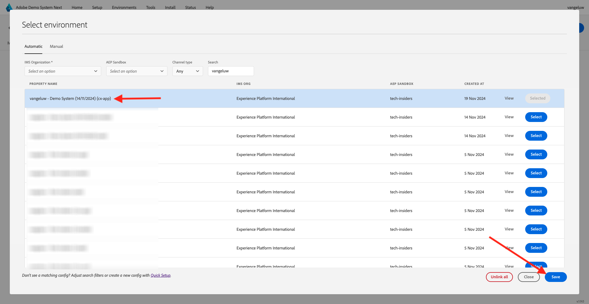

# 2.1.6 Ver el perfil del cliente en tiempo real en acción en el centro de llamadas

En este ejercicio, el objetivo es hacer que revise el recorrido del cliente y actúe como un cliente real.

En este sitio web, hemos implementado Adobe Experience Platform. Cada acción se considera un evento de experiencia y se envía a Adobe Experience Platform en tiempo real, lo que hidrata el Perfil del cliente en tiempo real.

En un ejercicio anterior, comenzó como un cliente anónimo que exploraba el sitio y, después de un par de pasos, se convirtió en un cliente conocido.

Cuando ese mismo cliente finalmente atiende su teléfono y llama a su centro de llamadas, es crucial que la información de otros canales esté disponible de inmediato, para que la experiencia del centro de llamadas pueda ser relevante y personalizada.

## 2.1.6.1 Uso de la aplicación CX

Como parte de nuestro sistema de demostración, hemos creado una plantilla de aplicación CX que se puede utilizar para simular un entorno de centro de llamadas. Siga estos pasos para crear un proyecto de aplicación CX de este tipo.

Vaya a [https://builder.adobedemo.com/projects](https://builder.adobedemo.com/projects). Haga clic en **Nuevo proyecto**.

A continuación, verá su proyecto de aplicación CX. Haga clic en el proyecto para abrirlo.

En su proyecto de aplicación CX, vaya a **Integraciones**. Seleccione la propiedad de recopilación de datos Adobe Experience Platform que se creó en el módulo 0. Debe seleccionar la propiedad que tiene **(enablement)** en su nombre. A continuación, haga clic en **Ejecutar**.

Entonces verá esto...

En el panel Visor de perfiles, puede ver estas combinaciones de ID y áreas de nombres:

| Identidad | Área de nombres |
|:-------------:| :---------------:|
| ID DEL Experience Cloud (ECID) | 12507560687324495704459439363261812234 |
| ID de correo electrónico | woutervangeluwe+06022022-01@gmail.com |
| Identificador de número de móvil | +32473622044+06022022-01 |

Cuando el cliente llama a su centro de llamadas, se puede usar el número de teléfono para identificar al cliente. En este ejercicio, utilizará el número de teléfono para recuperar el perfil del cliente en la aplicación CX.

Seleccione **Número de teléfono** en el menú desplegable e introduzca el número de teléfono que utilizó en el sitio web. Pulse **Intro**.

Ahora verá la información que, idealmente, se mostraría en el centro de llamadas, de modo que los empleados del centro de llamadas tengan toda la información relevante disponible inmediatamente cuando hablen con un cliente.

Paso siguiente: [Resumen y beneficios](./summary.md)

[Volver al módulo 2.1](./real-time-customer-profile.md)

[Volver a todos los módulos](../../../overview.md)
