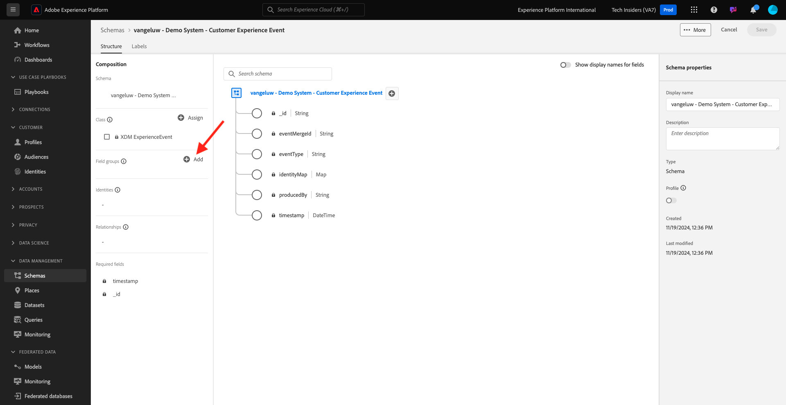

# 2.2.1 AI del cliente: preparación de datos (ingesta)

Para que los servicios inteligentes descubran datos de sus eventos de marketing, los datos deben enriquecerse semánticamente y mantenerse en una estructura estándar. Los servicios inteligentes aprovechan los esquemas XDM (Experience Data Model) de Adobe para conseguirlo.
En concreto, todos los conjuntos de datos que se utilizan en Intelligent Services deben cumplir con el esquema XDM **Evento de experiencia del consumidor**.

## 2.2.1.1 Crear esquema

En este ejercicio, creará un esquema que contiene el mixin **Evento de experiencia del consumidor**, que requiere el servicio inteligente **inteligencia artificial aplicada al cliente**.

Inicie sesión en Adobe Experience Platform desde esta dirección URL: [https://experience.adobe.com/platform](https://experience.adobe.com/platform).

Después de iniciar sesión, llegará a la página principal de Adobe Experience Platform.

Antes de continuar, debe seleccionar una **zona protegida**. La zona protegida que se va a seleccionar se denomina ``--module10sandbox--``. Para ello, haga clic en el texto **[!UICONTROL Producción]** en la línea azul de la parte superior de la pantalla. Después de seleccionar la zona protegida adecuada, verá que la pantalla cambia y ahora está en la zona protegida dedicada.

En el menú de la izquierda, haz clic en **Esquemas** y ve a **Examinar**. Haga clic en **Crear esquema**.

En la ventana emergente, seleccione **XDM ExperienceEvent**.

Entonces verá esto...

Busque y seleccione los **mixins** siguientes para agregarlos a este esquema:

- Evento de experiencia del consumidor

  

- Detalles del ID del usuario final

  

Haga clic en **Agregar grupos de campos**.

Entonces verá esto... Seleccione el mixin **Detalles del identificador de usuario final**.

Vaya al campo **endUserIDs._experience.email.id**.

En el menú derecho del campo **endUserIDs._experience.email.id**, desplácese hacia abajo y marque la casilla de verificación de **Identidad**, marque la casilla de verificación de **Identidad principal** y seleccione el **Área de nombres de identidad** de **Correo electrónico**.

Vaya al campo **endUserIDs._experience.mcid.id**. Marque la casilla de verificación de **Identidad** y seleccione el **área de nombres de identidad** de **ECID**. Haga clic en **Aplicar**.

Asigne un nombre al esquema ahora.

Como nombre para nuestro esquema, utilizará esto:

- `--aepUserLdap-- - Demo System - Customer Experience Event`

Por ejemplo, para ldap **vangeluw**, este debe ser el nombre del esquema:

- **vangeluw - Sistema de demostración - Evento de experiencia del cliente**

Eso debería darte algo como esto. Haga clic en el botón **+ Agregar** para agregar nuevos **mixins**.

Seleccione el nombre del esquema. Ahora debería habilitar su esquema para **Perfil**, haciendo clic en la opción **Perfil**.

Entonces verá esto... Haga clic en **Habilitar**.

Ahora debería tener esto. Haga clic en **Guardar** para guardar el esquema.

## 2.2.1.2 Crear conjunto de datos

En el menú de la izquierda, haga clic en **Conjuntos de datos** y vaya a **Examinar**. Haga clic en **Crear conjunto de datos**.

Haga clic en **Crear conjunto de datos a partir del esquema**.

En la siguiente pantalla, seleccione el conjunto de datos que creó en el ejercicio anterior, que se llama **[!UICONTROL ldap - Sistema de demostración - Evento de experiencia del cliente]**. Haga clic en **Next**.

Como nombre para su conjunto de datos, utilice `--aepUserLdap-- - Demo System - Customer Experience Event Dataset`. Haga clic en **Finalizar**.

Se ha creado el conjunto de datos. Habilite la opción **Perfil**.

Haga clic en **Habilitar**.

Ahora debería tener esto:

Ya está listo para empezar a ingerir datos de evento de experiencias del consumidor y empezar a utilizar el servicio de inteligencia artificial aplicada al cliente.

## 2.2.1.3 Descargar datos de prueba de Experience Event

Una vez configurados el **esquema** y el **conjunto de datos**, ya puede ingerir datos de evento de experiencia. Dado que la inteligencia artificial aplicada al cliente requiere datos en **2 trimestres al menos**, necesitará ingerir datos preparados de forma externa.

Los datos preparados para los eventos de experiencia deben cumplir con los requisitos y el esquema del mixin [Consumer Experience Event XDM Mixin](https://github.com/adobe/xdm/blob/797cf4930d5a80799a095256302675b1362c9a15/docs/reference/context/experienceevent-consumer.schema.md).

Descargue el archivo que contiene datos de ejemplo de esta ubicación: [https://dashboard.adobedemo.com/data](https://dashboard.adobedemo.com/data). Haga clic en el botón **Descargar**.

Alternativamente, si no puede acceder al vínculo anterior, también puede descargar el archivo desde esta ubicación: [https://aepmodule10.s3-us-west-2.amazonaws.com/retail-v1-dec2020-xl.json.zip](https://aepmodule10.s3-us-west-2.amazonaws.com/retail-v1-dec2020-xl.json.zip).

Ahora ha descargado un archivo denominado **retail-v1-dec2020-xl.json.zip**. Coloque el archivo en el escritorio del equipo y descomprímalo, tras lo cual verá un archivo llamado **retail-v1.json**. Necesitará este archivo en el siguiente ejercicio.

## 2.2.1.4 Ingesta de datos de prueba de Evento de experiencia

En Adobe Experience Platform, vaya a **Conjuntos de datos** y abra su conjunto de datos, que se llama **[!UICONTROL ldap - Sistema de demostración - Conjunto de datos de evento de experiencia del cliente]**.

En su conjunto de datos, haga clic en **Elegir archivos** para agregar datos.

En la ventana emergente, selecciona el archivo **retail-v1.json** y haz clic en **Abrir**.

Verá los datos que se están importando y se creará un nuevo lote con el estado **Cargando**. No se aleje de esta página hasta que se haya cargado el archivo.

Una vez que se haya cargado el archivo, verá que el estado del lote cambia de **Cargando** a **Procesando**.

La ingesta y el procesamiento de los datos pueden tardar entre 10 y 20 minutos.

Una vez que la ingesta de datos se realice correctamente, el estado del lote cambiará a **Correcto**.

Siguiente paso: [2.2.2 inteligencia artificial aplicada al cliente - Crear una nueva instancia (configurar)](./ex2.md)

[Volver al módulo 2.2](./intelligent-services.md)

[Volver a todos los módulos](./../../../overview.md)
