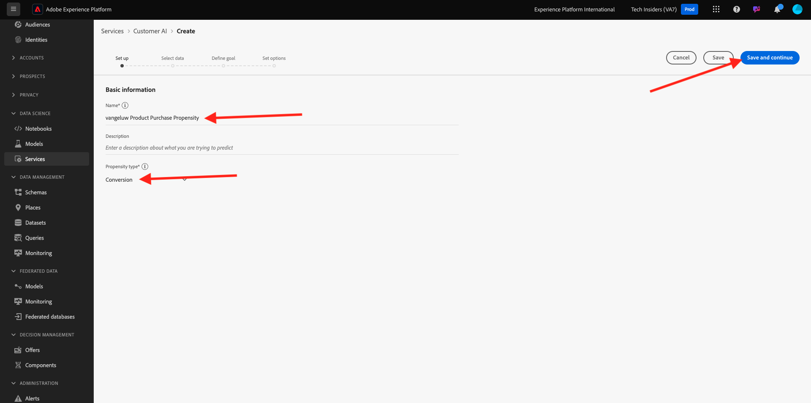

# 2.2.2 Inteligencia artificial aplicada al cliente: crear una nueva instancia (configurar)

La inteligencia artificial aplicada al cliente funciona analizando los datos de evento de experiencia del consumidor existentes para predecir puntuaciones de pérdida o tendencia de conversión. La creación de una nueva instancia de inteligencia artificial aplicada al cliente permite a los especialistas en marketing definir objetivos y medidas.

## 2.2.2.1 Configuración de una nueva instancia de inteligencia artificial aplicada al cliente

En Adobe Experience Platform, haga clic en **Servicios** en el menú de la izquierda. Aparece el explorador **Services** y muestra todos los servicios disponibles a su disposición. En la tarjeta de inteligencia artificial aplicada al cliente, haga clic en **Abrir**.

Haga clic en **Crear instancia**.

Entonces verá esto...

Introduzca los detalles necesarios para la instancia de inteligencia artificial aplicada al cliente:

- Nombre: use `--aepUserLdap-- Product Purchase Propensity`
- Descripción: uso: **Predecir la probabilidad de que los clientes compren un producto**
- Tipo de tendencia: seleccionar **Conversión**

Haga clic en **Next**.

Entonces verá esto... Seleccione el conjunto de datos que creó en el ejercicio anterior, que se llama `--demoProfileLdap - Demo System - Customer Experience Event Dataset`. Haga clic en **Next**.

Seleccione **Se producirá** y defina el campo **commerce.purchases.value** como la variable de destino.

Haga clic en **Next**.

A continuación, configure la programación para que se ejecute **Semanalmente** y establezca la hora lo más cerca posible de la hora actual. Asegúrese de que la opción **Habilitar puntuaciones para el perfil** esté habilitada.

Haga clic en **Finalizar**.

Entonces verá esta ventana emergente. Haga clic en **Aceptar**.

Después de configurar la instancia, puede verla en la lista de instancias de inteligencia artificial aplicada al cliente y también obtener una vista previa del resumen de los detalles de configuración y ejecución haciendo clic en la fila de instancias de inteligencia artificial aplicada al cliente. El panel de resumen también mostrará los detalles del error en caso de que se encuentren errores.

>[!NOTE]
>
>Puede modificar cualquier definición o atributo siempre que el estado de la instancia de inteligencia artificial aplicada al cliente sea **Esperando formación** o **Error**

Siguiente paso: [2.2.3 inteligencia artificial aplicada al cliente - Tablero de puntuación y segmentación (predecir y tomar medidas)](./ex3.md)

[Volver al módulo 2.2](./intelligent-services.md)

[Volver a todos los módulos](./../../../overview.md)
