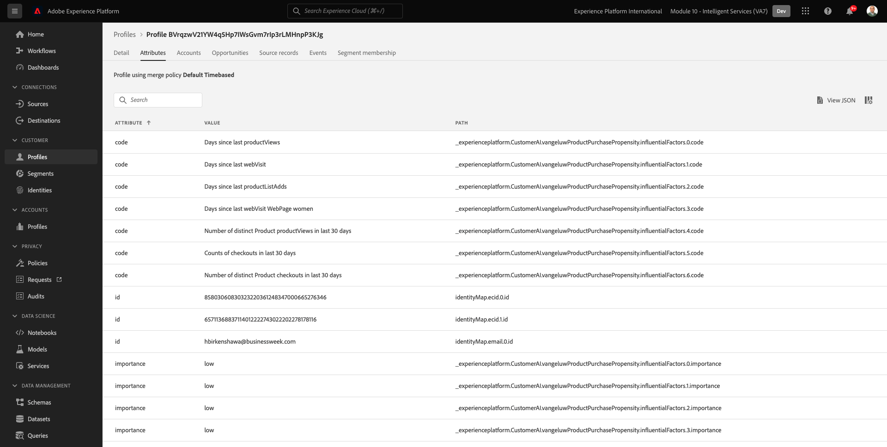
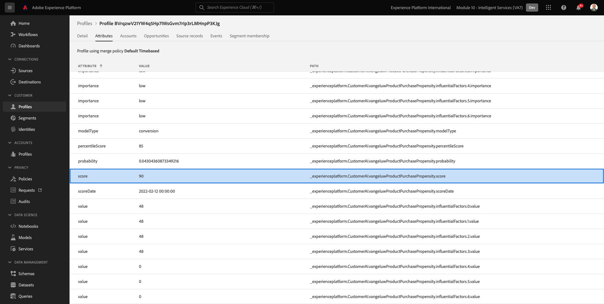

# 2.2.3 Inteligencia artificial aplicada al cliente: panel de puntuación y segmentación (predecir y actuar)

Una vez que la instancia de inteligencia artificial aplicada al cliente complete la ejecución de un modelo, le permitirá visualizar la puntuación de tendencia que se evalúa para predecir que un cliente realizará una compra en los próximos 30 días.

>[!NOTE]
>
>Solo una instancia de inteligencia artificial aplicada al cliente con un estado de **Éxito** le permitirá obtener una vista previa de las perspectivas del servicio.

## 2.2.3.1 Predicción de la tendencia

Ahora vamos a revisar la tendencia predicha generada por el modelo de instancia de inteligencia artificial aplicada al cliente. Haga clic en el nombre de la instancia para ver el panel.

El panel de inteligencia artificial aplicada al cliente muestra el resumen sobre la puntuación, la distribución de la población y los factores influyentes para que el modelo se evalúe.

Pase el ratón sobre los factores influyentes para ver el desglose adicional de la distribución de datos.

## 2.2.3.2 Acciones comerciales

### 2.2.3.2.1 Segmentación de clientes

El panel de inteligencia artificial aplicada al cliente permite definir segmentos con un solo clic. Haga clic en el botón **Crear segmento** de las tarjetas de tendencia.

Verá que se crea una definición de segmento automáticamente.

Asigne un nombre al segmento, siguiendo esta convención de nombres: `--aepUserLdap-- - Customer AI High Propensity`. Haga clic en **Guardar**.

Ahora puede utilizar este segmento para la segmentación mediante, por ejemplo, Real-time CDP, Journey Orchestration y Adobe Target.

### 2.2.3.2.2 Información general del perfil

Dado que la puntuación de tendencia de inteligencia artificial aplicada al cliente forma parte del Perfil del cliente en tiempo real, puede ver la puntuación de cada cliente.

En Adobe Experience Platform, ve a **Perfiles** en el menú de la izquierda y selecciona **Examinar**.

Busque un perfil con cualquiera de los identificadores, como por ejemplo **CORREO ELECTRÓNICO hbirkenshawa@businessweek.com**, que están disponibles en el archivo JSON que ha ingerido. Haga clic en **ID de perfil** para abrir el perfil.

A continuación, verá esto:

Vaya a **Atributos**, que contiene la salida del modelo de inteligencia artificial aplicada al cliente.

Desplácese hacia abajo para ver la puntuación de tendencia calculada por el modelo de inteligencia artificial aplicada al cliente.

Paso siguiente: [Resumen y beneficios](./summary.md)

[Volver al módulo 2.2](./intelligent-services.md)

[Volver a todos los módulos](./../../../overview.md)
