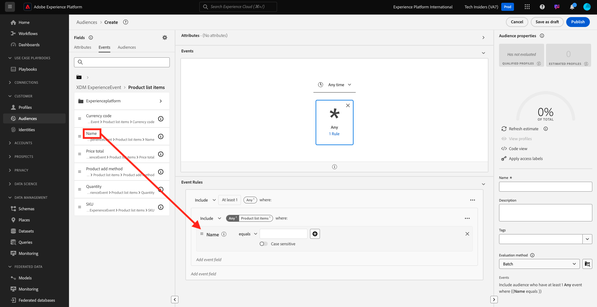

# 2.3.1 Crear un segmento

En este ejercicio, creará un segmento utilizando el generador de segmentos de Adobe Experience Platform.

## 2.3.1.1 Contexto

En el mundo actual, responder al comportamiento de un cliente debe ser en tiempo real. Una de las formas de responder al comportamiento del cliente en tiempo real es mediante el uso de un segmento, con la condición de que el segmento se califique en tiempo real. En este ejercicio, debe crear un segmento que tenga en cuenta la actividad real en el sitio web que hemos estado utilizando.

## 2.3.1.2 Identificar el comportamiento al que desea reaccionar

Vaya a [https://builder.adobedemo.com/projects](https://builder.adobedemo.com/projects). Después de iniciar sesión con su Adobe ID, verá esto. Haga clic en el proyecto del sitio web para abrirlo.

Ahora puede seguir el siguiente flujo para acceder al sitio web. Haga clic en **Integraciones**.

En la página **Integraciones**, debe seleccionar la propiedad de recopilación de datos que se creó en el ejercicio 0.1.

A continuación, verá cómo se abre el sitio web de demostración. Seleccione la URL y cópiela en el portapapeles.

Abra una nueva ventana del explorador de incógnito.

Pegue la dirección URL del sitio web de demostración, que copió en el paso anterior. Luego se le pedirá que inicie sesión con su Adobe ID.

Seleccione el tipo de cuenta y complete el proceso de inicio de sesión.

Luego verá el sitio web cargado en una ventana de incógnito del explorador. Para cada demostración, deberá utilizar una ventana nueva del explorador de incógnito para cargar la URL del sitio web de demostración.

En este ejemplo, desea responder a un cliente específico que ve un producto específico.
En la página de inicio de **Luma**, ve a **Hombres** y haz clic en el producto **PROTEUS FITNESS JACKSHIRT**.

Así que cuando alguien visita la página de productos de **PROTEUS FITNESS JACKSHIRT**, querrás poder actuar. Lo primero que debe hacer para realizar una acción es definir un segmento.

## 2.3.1.3 Creación del segmento

Ir a [Adobe Experience Platform](https://experience.adobe.com/platform). Después de iniciar sesión, llegará a la página principal de Adobe Experience Platform.

Antes de continuar, debe seleccionar una **zona protegida**. La zona protegida que se va a seleccionar se denomina ``--aepSandboxName--``. Para ello, haga clic en el texto **[!UICONTROL Producción]** en la línea azul de la parte superior de la pantalla. Después de seleccionar la [!UICONTROL zona protegida] adecuada, verá el cambio en la pantalla y ahora se encuentra en la [!UICONTROL zona protegida] dedicada.

En el menú de la izquierda, ve a **Segmentos** y luego a **Examinar**, donde podrás ver una descripción general de todos los segmentos existentes. Haga clic en el botón **Crear segmento** para comenzar a crear un nuevo segmento.

Como se mencionó anteriormente, debe generar un segmento con todos los clientes que hayan visto el producto **PROTEUS FITNESS JACKSHIRT**.

Para crear este segmento, debe añadir un evento. Puede encontrar todos los eventos haciendo clic en el icono **Eventos** en la barra de menús **Segmentos**.

A continuación, verá el nodo **XDM ExperienceEvent** de nivel superior.

Para encontrar clientes que han visitado el producto **PROTEUS FITNESS JACKSHIRT**, haz clic en **XDM ExperienceEvent**.

Desplácese hacia abajo hasta **Elementos de lista de productos** y haga clic en él.

Seleccione **Name** y arrastre y suelte el objeto **Name** del menú izquierdo de **Elementos de lista de productos** en el lienzo del generador de segmentos en la sección **Eventos**.

El parámetro de comparación debe ser **igual a** y en el campo de entrada, escriba `PROTEUS FITNESS JACKSHIRT`.

Las **reglas de eventos** deben tener un aspecto similar al siguiente. Cada vez que agregue un elemento al generador de segmentos, puede hacer clic en el botón **Actualizar estimación** para obtener una nueva estimación de la población del segmento.

Por último, asigne un nombre al segmento y guárdelo.

Como convención de nombres, utilice:

- `--aepUserLdap-- - Interest in PROTEUS FITNESS JACKSHIRT`

El nombre del segmento debería tener un aspecto similar al siguiente:
`vangeluw - Interest in PROTEUS FITNESS JACKSHIRT`

A continuación, haga clic en el botón **Guardar y cerrar** para guardar el segmento.

A continuación, se le redirigirá a la página de resumen del segmento.

Siguiente paso: [2.3.2 Revise cómo configurar el destino DV360 mediante Destinos](./ex2.md)

[Volver al módulo 2.3](./real-time-cdp-build-a-segment-take-action.md)

[Volver a todos los módulos](../../../overview.md)
